# 자료구조-선형자료구조

# 선형자료구조(Linear Data Structure)

> 선형 자료 구조(Linear Data Structure)는 **데이터 요소가 순차적으로 1:1로 연결되어 일직선상으로 나열된 형태**

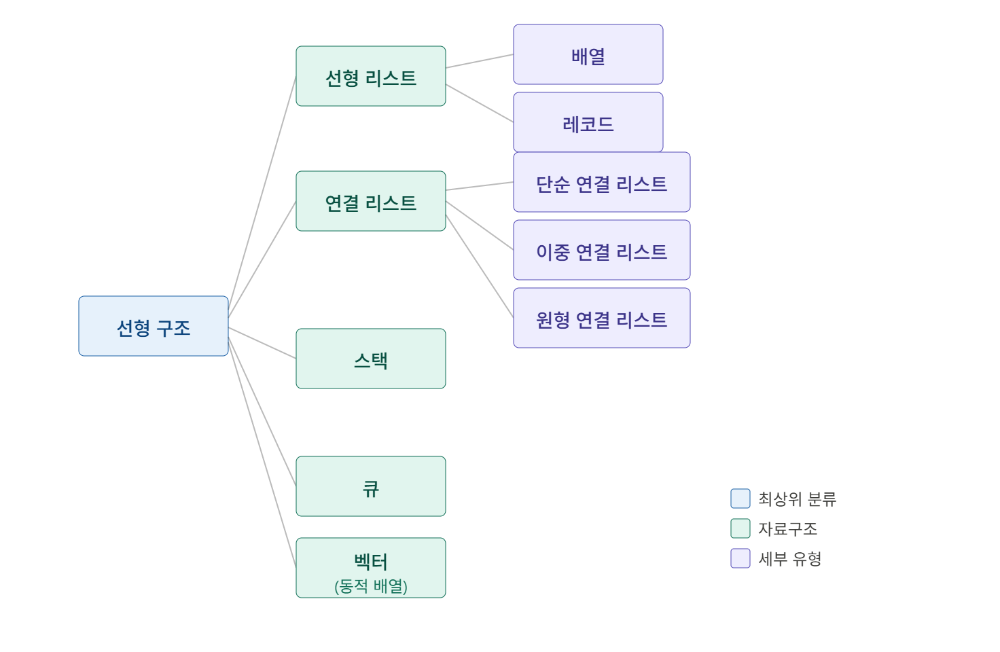


# 대표적인 선형 자료구조

---

## 선형 리스트(Linear List)

- 데이터를 일정한 순서로 나열한 가장 기본적인 자료구조.
- 구현 방식에 따라 배열과 레코드로 나뉜다.

### 배열(Array)
- 같은 타입의 데이터를 **연속된 메모리 공간**에 순서대로 저장하는 자료구조
- 같은 타입의 변수들로 구성
- 인덱스(index)를 통해 임의의 요소에 랜덤접근으로 접근 가능
- 크기가 고정되어 있어 선언 시 크기를 지정해야 함 (정적 배열 기준)

#### 시간 복잡도
- **삽입 / 삭제:** $O(n)$
- **탐색:** $O(1)$

#### 랜덤 접근(Random Access)과 순차적 접근(Sequential Access)
- **랜덤 접근 (직접 접근):** 동일한 시간에 배열과 같은 순차적인 데이터 구조 내에서 임의의 인덱스에 해당하는 데이터에 즉시 접근할 수 있는 기능(배열이 이를 지원하므로 탐색이 빠름)
- **순차적 접근:** 저장된 순서대로 앞에서부터 차례대로 하나씩 검색해야 하는 접근법

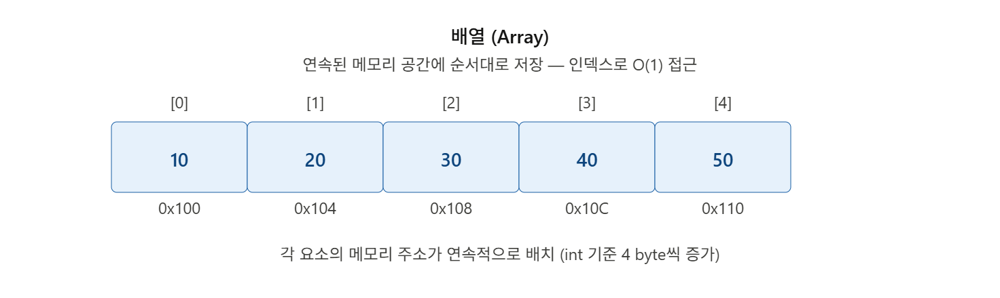

### 장단점 요약
| 장점 | 단점 |
| :--- | :--- |
| **빠른 원소 접근 속도 $O(1)$**<br>인덱스를 활용하기에 원하는 위치의 값에 쉽게 접근할 수 있음. 인덱스를 통한 직접 접근이 필요할 때 매우 유용함. | **중간 삽입/삭제가 어려움 $O(n)$**<br>초기에 선언할 때 크기가 고정되므로 중간에 삽입/삭제를 하려면 메모리 크기를 새로 할당하거나, 기존 값들의 위치를 하나하나 뒤로 밀거나 당겨야 하므로 시간이 오래 걸림 |

---

### 레코드(Record)

- **서로 다른 타입**의 데이터를 하나의 단위로 묶어서 저장하는 자료구조
- 각각의 데이터 항목을 **필드(Field)** 라고 부름
- 연관된 데이터를 하나의 묶음으로 표현할 때 사용

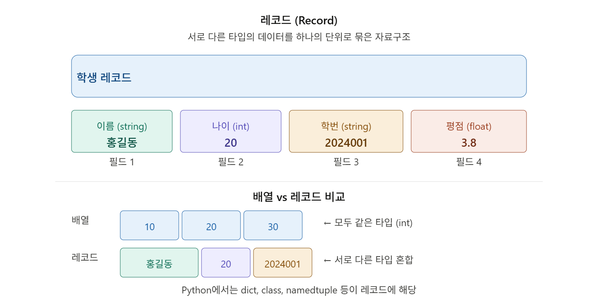

---

## 연결리스트(Linked List)

- 자료들을 반드시 연속적으로 배열시키지는 않고 임의의 기억 공간에 기억시키되, 자료항목의 순서에 따라 노드의 **포인터 부분**을 이용하여 서로 연결시킨 자료구조
- 각 노드는 **데이터(data)** 와 **다음 노드를 가리키는 포인터(next)** 로 구성됨
- 삽입/삭제가 $O(1)$ 로 효율적이지만, 특정 요소 접근은 $O(n)$ 으로 느림\
- 연결리스트의 최대 장점은 중간 삽입/삭제가 효율적

> 💡 포인터 :  메모리의 주솟값(위치)을 저장하는 변수

#### 시간 복잡도

* **삽입 / 삭제:** $O(1)$
* **탐색:** $O(n)$


### 단순 연결 리스트 (Singly Linked List)

- 각 노드가 **다음 노드만** 가리키는 포인터를 가지는 연결 리스트
- 한 방향으로만 이동 가능하고 가장 기본적인 형태

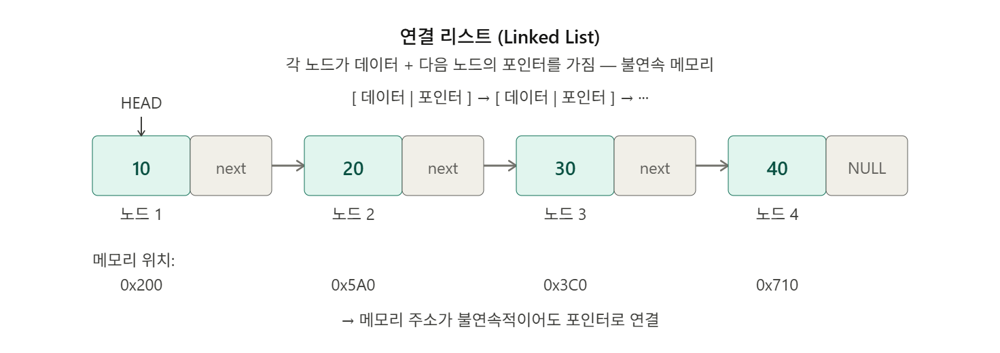

### 이중 연결 리스트 (Doubly Linked List)

- 각 노드가 **이전 노드(prev)** 와 **다음 노드(next)** 포인터를 가지는 연결 리스트
- 양방향 이동이 가능하지만 포인터를 2개 저장하므로 메모리를 더 사용함

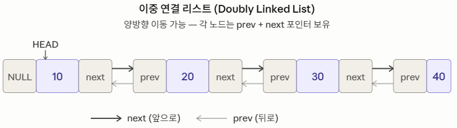

### 원형 연결 리스트 (Circular Linked List)

- 마지막 노드의 포인터가 NULL이 아니라 **첫 번째 노드(HEAD)를 다시 가리는** 연결 리스트
- 끝이 없는 순환 구조로, 단순/이중 연결 리스트 모두 원형으로 만들 수 있다

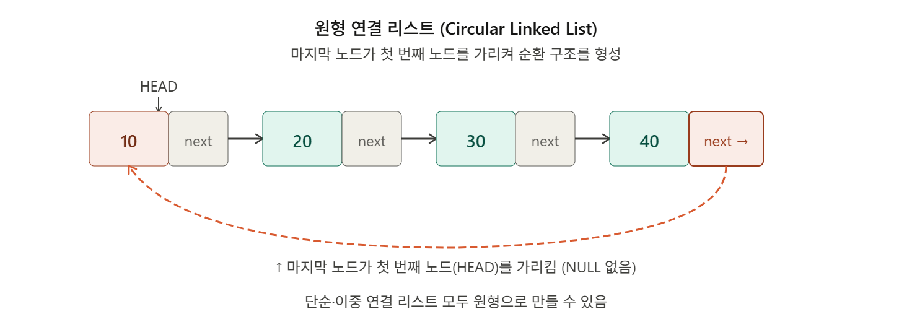

|  | 단순 | 이중 | 원형 |
| --- | --- | --- | --- |
| 포인터 수 | next 1개 | prev + next 2개 | next 1개 (또는 2개) |
| 이동 방향 | 단방향 | 양방향 | 단방향 순환 |
| 마지막 노드 | NULL | NULL | HEAD를 가리킴 |
| 메모리 | 적음 | 많음 | 적음 |
| 활용 | 기본 탐색 | 브라우저 앞/뒤로가기 | 순환 큐, 라운드로빈 |

###  장단점 요약
| 장점 | 단점 |
| :--- | :--- |
| **삽입/삭제가 빠르고 용이함 $O(1)$**<br>리스트의 길이가 가변적이며 따로 메모리 공간 할당 크기를 고정할 필요가 없어 삽입/삭제가 많은 연산에 유리함 | **자료 수정 및 탐색이 느림 $O(n)$**<br>특정 노드를 탐색하거나 데이터를 변경할 때 한 번에 접근할 수 없고, 무조건 연결 리스트를 처음부터 전부 순회(탐색)해야함 |


---

### 동적배열(Vector)

- **동적 배열(Dynamic Array)** 이라고도 하며, 크기가 자동으로 늘어나는 배열
- 배열과 마찬가지로 연속된 메모리 공간에 저장되며 인덱스로 $O(1)$ 접근 가능
- 저장 공간이 부족해지면 더 큰 메모리를 새로 할당하고 **기존 데이터를 복사함**
- 파이썬의 `list`가 내부적으로 벡터(동적 배열)로 구현되어 있음

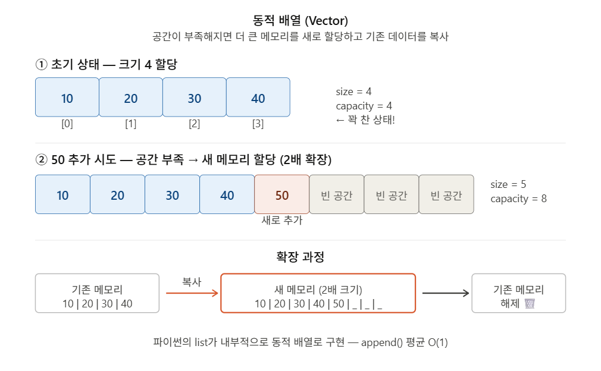

#### 시간 복잡도
* **삽입 / 삭제:** * 맨 앞과 마지막 요소: $O(1)$
  * 그 외 중간에 위치한 값: $O(n)$
* **탐색:** $O(1)$


#### 언어별 확장배율

| 언어 | 확장 배율 | 비고 |
| --- | --- | --- |
| **Java** (ArrayList) | **2배** | 정확히 2배 |
| **C++** (vector) | **2배** | 구현체마다 다름 (1.5배도 있음) |
| **Python** (list) | **약 1.125배** | `n + n//8 + 3` 공식 |
| **Go** (slice) | **2배** (작을 때) → **1.25배** (클 때) | 1024개 기준으로 전략 변경 |
| **Rust** (Vec) | **2배** | 정확히 2배 |

<details>
<summary>동적배열은 왜 2배씩 늘리는가? + append가 왜 평균 O(1)인가?</summary>
- 동적배열은 왜 2배씩 늘리는가? + append가 왜 평균 O(1)인가?
    
    🤔 만약 공간이 부족할 때마다 **딱 1칸씩만** 늘린다면?
    
    ```json
    [10]          → 꽉 참 → 크기 2로 복사
    [10, 20]      → 꽉 참 → 크기 3으로 복사
    [10, 20, 30]  → 꽉 참 → 크기 4로 복사
    ...
    n번째 요소 추가할 때마다 복사 발생!
    ```
    
    $1 + 2 + 3 + \cdots + n = \dfrac{n(n+1)}{2} = O(n^2)$
    **n개 추가하는 데 $O(n^2)$로** 매우 비효율적!
    
    🤔 2배씩 늘리면?
    
    ```json
    크기 1  → 꽉 참 → 크기 2로 복사  (1번 복사)
    크기 2  → 꽉 참 → 크기 4로 복사  (2번 복사)
    크기 4  → 꽉 참 → 크기 8로 복사  (4번 복사)
    크기 8  → 꽉 참 → 크기 16으로 복사 (8번 복사)
    ...
    ```
    
    $1 + 2 + 4 + 8 + \cdots + n = 2n - 1 = O(n)$
    
    **n개 추가하는 데 O(n)로** 1칸씩보다 훨씬 효율적!
    
    이걸 **분할 상환 분석 (Amortized Analysis)**이라고 하는데
    **분할 상환 분석** 이란 **전체 비용을 각 연산에 균등하게 나눠서** 평균 비용을 구하는 방법이다.
    
    ```json
    n = 8개 추가할 때 전체 복사 비용 = 1+2+4+8 = 15번
    append 1번당 평균 비용 = 15 / 8 ≈ 2번
    ```
    
    **append 1번 평균 비용 $= \frac{O(n)}{n}=O(1)$**
    
    → 가끔 비싼 연산(복사)이 발생하지만, 그 비용을 앞의 여러 연산들에 나눠서 계산하면 평균적으로 O(1)이다.
</details>

<details>
<summary>💡 파이썬 list에서 여러 타입을 넣을 수 있는 이유</summary>
    
    C/Java의 배열은 **같은 타입만** 저장 가능하지만, 파이썬의 `list`는 서로 다른 타입을 혼합해서 저장할 수 있다.  그 이유는 파이썬 `list`는 값 자체를 저장하는 것이 아니라
    
    **각 객체를 가리키는 포인터(주소)를 연속으로 저장**하기 때문이다.
    모든 포인터의 크기는 동일(8 byte)하므로 타입에 상관없이 저장할 수 있다.
    
    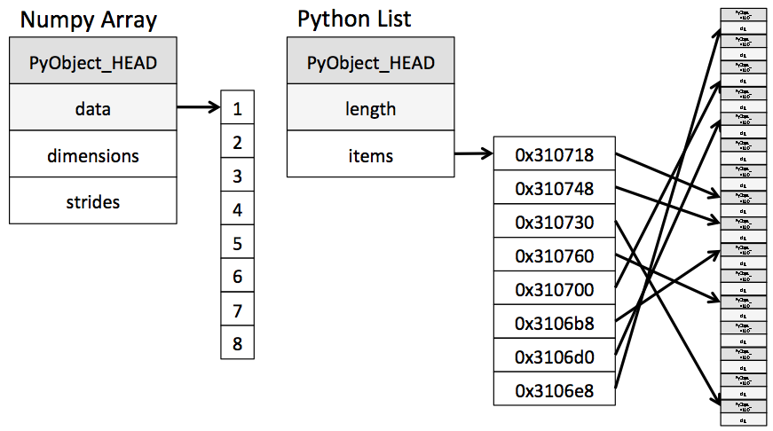
</details>

---

### 스택(Stack)

- 가장 나중에 삽입된 자료가 가장 먼저 삭제되는 **후입선출(LIFO : Last In First Out)**구조로 저장하는 형식
- 데이터의 삽입(**push**)과 삭제(**pop**)가 항상 **TOP(맨 위)** 에서만 발생
- 함수 호출 스택, 브라우저 뒤로가기, 괄호 검사 등에 활용
- 주요 사용 사례
    1. **재귀 알고리즘:** * 재귀적으로 함수를 호출해야 하는 경우 임시 데이터를 스택에 저장.
       * 재귀 함수를 빠져나와 백트래킹(Backtracking)을 할 때는 스택에 넣어두었던 임시 데이터를 꺼내야 함. 
       * 스택을 사용하면 재귀 알고리즘을 반복적 형태(Iterative)로 변환하여 구현할 수 있음.
    2. **웹 브라우저 방문 기록:** 뒤로가기 기능 구현
    3. **작업 취소 기능:** 실행 취소 (Undo) 기능

#### 시간 복잡도
* **삽입 / 삭제:** $O(1)$
* **탐색:** $O(n)$

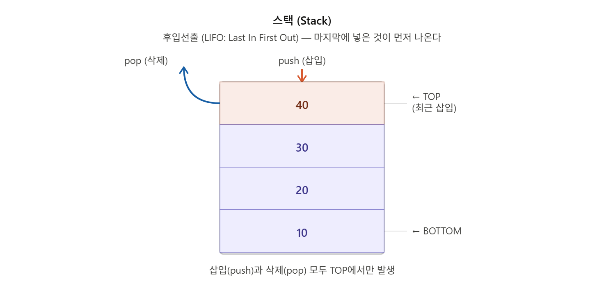

---

### 큐(Queue)

- 먼저 집어 넣은 데이터가 먼저 나오는 **선입선출(FIFO : First In First Out)** 구조로 저장하는 형식
- 데이터 삽입(**enqueue**)은 **REAR(뒤)**, 삭제(**dequeue**)는 **FRONT(앞)** 에서 발생
- 프린터 출력 대기열, 프로세스 스케줄링, BFS 탐색 등에 활용

#### 시간 복잡도
* **삽입 / 삭제:** $O(1)$
* **탐색:** $O(n)$

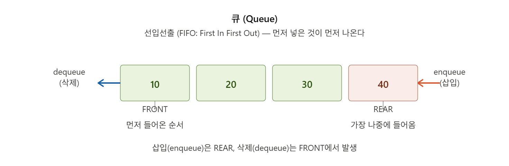

---

#### 선형 자료구조 시간복잡도

| 자료구조 | 접근 | 삽입/삭제 | 특징 |
| --- | --- | --- | --- |
| 배열 | $O(1)$ | $O(n)$ | 인덱스 접근, 고정 크기 |
| 레코드 | $O(1)$ | $O(1)$ | 다양한 타입 혼합 |
| 연결 리스트 | $O(n)$ | $O(1)$ | 포인터로 연결, 동적 크기 |
| 벡터(동적배열) | $O(1)$ | $O(1)$  평균 | 자동 크기 확장 |
| 스택 | $O(n)$ | $O(1)$ | LIFO, TOP에서만 연산 |
| 큐 | $O(n)$ | $O(1)$ | FIFO, 양 끝에서 연산 |

---

## 메모리와 포인터

### 메모리란?

- ***컴퓨터에서 정보를 처리하기 위해 일시적으로 정보를 보관하는 기억장치***
- 일단 쉽게 말하면 엄청나게 많은 칸의 집합
- 아파트로 비유하자면
    
    ```json
    아파트 = 메모리 (128GB)
    방     = 메모리 셀 (1 byte)
    호수   = 메모리 주소 (0x0000, 0x0001 ...)
    ```
    

> 💡 **메모리 주소 : *메모리에 저장된 정보의 위치를 가져오기 위해 사용하는 고유한 식별자***
> 

#### 만약 int 변수를 선언했다고 치면?

- OS가 128GB 중에서 **연속된 4칸(4 byte)**
- **예약된 칸들 중 첫 번째 주소**`int i`의 주소는 `0x0000` (첫 번째 칸)
- 실제로는 OS가 프로그램을 실행할 때마다 **빈 공간을 찾아서** 주소를 배정하기 때문에 주소는 매번 다름.

```json
주소     | 내용
---------|-------
0x0000   | 📦 ← int i 시작 (변수의 주소 = 여기!)
0x0001   | 📦
0x0002   | 📦
0x0003   | 📦 ← int i 끝
0x0004   |    ← 다른 변수 영역
```

### 포인터란?

- 자료가 저장되는 기억장치의 기억주소를 가리키는 지시자이다.
- 쉽게 말해면 **변수의 메모리 주소를 담는 변수**

```c
// 선언 방법
// 자료형 *포인터이름;
// 포인터 = &변수;

int  i = 10;   // 일반 변수: 값(10)을 저장
int* a = &i;   // 포인터:    주소(0x0000)를 저장
//  ↑    ↑
// 포인터  i의 주소
// 선언
```

```json
일반 변수          포인터 변수
┌─────────┐        ┌─────────┐
│  값: 10  │ ←─── │ 0x0000  │
└─────────┘        └─────────┘
0x0000              0x1234
  ↑                   ↑
 int i              int* a
```

#### 포인터를 사용하는 이유?

- 데이터를 복사하지 않고 전달할 수 있다
- 큰 데이터를 복사 없이 빠르게 접근
    - 포인터가 없으면 데이터를 넘길때 주소를 모르기 때문에 통째로 복사해서 전달
- 연결 리스트처럼 동적으로 구조를 만들 수 있다

→ 이렇게 변수의 주소를 저장하거나 사용하기 위해 포인터를 사용

#### 역참조(Dereference)연산자

- **"이 주소로 가서 값을 꺼내와"** 라는 뜻
- 포인터 변수에는 값(value)가 아닌 메모리 주소가 저장되어 있다. 이때 메모리 주소가 있는 곳으로 이동해서 값을 가져오고 싶을 때 역참조 연산자 `*`를 사용

**주소 연산자 (Address Operator)**

- `&` 는 주소 연산자로 는 **"이 변수의 메모리 주소를 알려줘"** 라는 뜻이다.

예시)

```c
{// 역참조 연산자를 이용하여 값(value) 접근
#include <stdio.h>

int main()
{
    int *numPtr;
    int num1 = 10;
    
    numPtr = &num1;
    
    printf("%p\n", numPtr)          // 0x0000 
    printf("%d\n", *numPtr);	// num1의 값인 10이 출력
    // 역참조 연산자로 num1의 메모리 주소에 접근하여 값(value)을 가져옴
    
    return 0;
}
```

```c
포인터 numPtr        실제 메모리
┌──────────┐      ┌──────────┐
│  0x0000  │ ───→ │    10    │
└──────────┘      └──────────┘
    numPtr               *numPtr
  (주소 출력)        (값 출력)
```

> 💡 포인터를 선언할 때 `*`는 **"이 변수가 포인터이다!"**라는 의미이고, 포인터에 사용할 때 `*`는 "포인터의 메모리 주소를 역참조하겠다!"라는 의미이다.
> 
> 
> ```c
> int *numPtr;                // 포인터. 포인터를 선언할 때 *
> printf("%d\n", *numPtr);    // 역참조. 포인터에 사용할 때 *
> ```
> 

---

💡 **핵심 정리**

| 기호 | 명칭 | 의미 |
| --- | --- | --- |
| `&i` | 주소 연산자 | i의 메모리 주소를 가져와 |
| `int* ptr` |  포인터  | 포인터 변수 선언 |
| `*ptr` | 역참조 연산자 | ptr이 가리키는 주소의 값을 꺼내와 (역참조) |

### 이중 포인터

- 포인터의 포인터
- 포인터를 선언할 떄 `*` 를 2번 사용하여 선언
- 참고로 포인터를 선언할 때 `*`의 개수에 따라 삼중 포인터, 사중 포인터, 그 이상도 만들수 있음

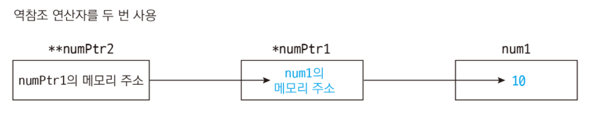


#### 참고

**array to pointer decay**

- 배열이 포인터로  부식(decay)되는 현상
    - **decay** → 배열이 포인터로 변환될 때 크기 정보가 사라지는 것
- a[3] 라는 배열이 *c라는 포인터에 할당하면서 배열의 크기 정보 3이 사라지고 첫번째 요소의 주소가 바인딩 되는 현상
- 이를 통해 배열의 이름은 배열의 첫번째 주소로써 쓸 수 있음
- 참고로 vector는 안됩니다. array만 가능
    - vector =  진짜 객체(객체 안에 여러 정보 있음)
    - array = 메모리로 만들어진 덩어리

```c
int a[3] = {1, 2, 3};
int* c = a;        // ① decay: int[3] → int* (크기 소멸)
cout << c;         // ② c = a[0] 주소 출력
cout << c + 1;     // ③ 포인터 산술: a[1] 주소 출력
```

### 출처
- [uuukpyo/[선형 구조의 종류와 설명]](https://uuukpyo.tistory.com/3)
- [C언어 포인터](https://velog.io/@kimdukbae/C%EC%96%B8%EC%96%B4-%ED%8F%AC%EC%9D%B8%ED%84%B0-Pointer)
- [박상원 깃헙블로그/[Python]리스트에서 메모리 할당에 대한 생각](https://eprj453.github.io/python/2020/12/05/Python-%EB%A6%AC%EC%8A%A4%ED%8A%B8%EC%97%90%EC%84%9C-%EB%A9%94%EB%AA%A8%EB%A6%AC-%ED%95%A0%EB%8B%B9%EC%97%90-%EB%8C%80%ED%95%9C-%EC%83%9D%EA%B0%81/)
