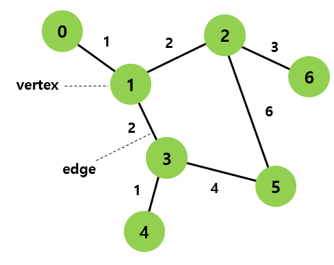

# 자료구조-비선형자료구조

# 비선형자료구조(Non-Linear Data Structure)

> 비선형 자료구조(Non-Linear Data Structure)는 **하나의 데이터 뒤에 여러 개의 데이터가 존재할 수 있는(1:N) 또는 데이터들이 서로 복잡하게 연결된(N:N) 구조**
> 

---

## 그래프 기초 개념

그래프를 이해하기 위한 핵심 용어

- **정점(Vertex):** 그래프에서 데이터를 저장하는 기본 단위. 노드(Node)라고도 함
- **간선(Edge):** 두 정점 사이의 연결 관계를 나타내는 선. 관계 자체를 표현
- **가중치(Weight):** 간선에 부여된 값. 거리, 비용, 시간 등 연결의 강도나 비용을 표현



| 용어 | 설명 | 예시 |
| --- | --- | --- |
| 정점(Vertex) | 데이터를 담는 노드 | 도시, 사람, 웹페이지 |
| 간선(Edge) | 정점 간 연결 | 도로, 친구 관계, 링크 |
| 가중치(Weight) | 간선에 부여된 값 | 거리(km), 요금, 시간 |
| 차수(Degree) | 한 정점에 연결된 간선 수 | 인맥이 많은 사람 = 차수 높음 |
| 경로(Path) | 정점들을 순서대로 이은 길 | 1 → 2 → 6 |
| 사이클(Cycle) | 시작 정점으로 돌아오는 경로 | 1 → 2 → 5 → 3 |

---

## 그래프(Graph)

정점(Vertex)과 간선(Edge)으로 이루어진 자료구조로, 객체 간의 관계를 표현할 때 사용

- **(단)방향 그래프(Directed Graph):** 간선에 방향이 있어 단방향으로만 이동 가능 (A → B)
- **무(양)방향 그래프(Undirected Graph):** 간선에 방향이 없어 양방향 이동 가능 (A — B)
- **가중치 그래프(Weighted Graph):** 간선에 가중치(비용)가 있는 그래프
- **연결 그래프(Connected Graph):** 모든 정점이 경로로 연결된 그래프

### 시간복잡도

| 연산 | 인접 행렬 | 인접 리스트 |
| --- | --- | --- |
| 간선 존재 확인 | $O(1)$ | $O(V)$ |
| 전체 간선 순회 | $O(V^2)$ | $O(V + E)$ |
| 정점 삽입 | $O(V^2)$ | $O(1)$ |
| 간선 추가 | $O(1)$ | $O(1)$ |
| 공간 복잡도 | $O(V^2)$ | $O(V + E)$ |

> $V$: 정점 수, $E$: 간선 수
> 

### 그래프 탐색방식

- **DFS(깊이 우선 탐색, Depth-First Search):** 한 방향으로 끝까지 탐색 후 되돌아오는 방식. **스택** 또는 **재귀**로 구현
- **BFS(너비 우선 탐색, Breadth-First Search):** 가까운 정점부터 단계적으로 탐색하는 방식. **큐**로 구현

|  | DFS | BFS |
| --- | --- | --- |
| 구현 | 스택 / 재귀 | 큐 |
| 시간복잡도 | $O(V + E)$ | $O(V + E)$ |
| 활용 | 미로 탐색, 사이클 감지 | 최단 경로, 레벨 탐색 |

### 그래프를 코드로 표현하는 두 가지 방법

**인접 행렬 (Adjacency Matrix)**

- $V \times V$ 크기의 2차원 배열로 표현
- `matrix[i][j] = 1` 이면 정점 i와 j 사이에 간선이 존재
- 간선 존재 여부를 $O(1)$에 확인 가능하지만 공간을 $O(V^2)$ 사용
- 정점 수가 적고 간선이 많은 **밀집 그래프(Dense Graph)** 에 유리

**인접 리스트 (Adjacency List)**

- 각 정점마다 연결된 정점들의 리스트를 저장

```python
# 인접 행렬 (Adjacency Matrix)
# 정점: A=0, B=1, C=2, D=3

V = 4
matrix = [[0] * V for _ in range(V)]

# 간선 추가 (무방향): A-B, A-D, B-C, C-D
edges = [(0,1), (0,3), (1,2), (2,3)]
for u, v in edges:
    matrix[u][v] = 1
    matrix[v][u] = 1  # 무방향이므로 양쪽 설정
    
        
#     A B C D
# A [ 0 1 0 1 ]
# B [ 1 0 1 0 ]
# C [ 0 1 0 1 ]
# D [ 1 0 1 0 ]
```

- 가중치 그래프는 연결 여부 대신 가중치 값을 넣는다.

```python
graph = [
    [0, 5, 3],
    [5, 0, 2],
    [3, 2, 0],
]
```

- 연결 없음을 0과 구분해야 할 때는 INF(무한대)를 사용한다.

```python
INF = 65535
graph = [
    [INF, 5, 3],
    [5, INF, 2],
    [3, 2, INF],
]
```

- 공간을 $O(V + E)$만 사용하여 메모리 효율적
- 간선이 적은 **희소 그래프(Sparse Graph)** 에 유리

```python
# 인접 리스트 (Adjacency List)
from collections import defaultdict

graph = defaultdict(list)

# 간선 추가 (무방향): A-B, A-D, B-C, C-D
edges = [('A','B'), ('A','D'), ('B','C'), ('C','D')]
for u, v in edges:
    graph[u].append(v)
    graph[v].append(u)  # 무방향이므로 양쪽 추가

# A → [B, D]
# B → [A, C]
# C → [B, D]
# D → [A, C]
```

#### 두 방식의 장단점

- **인접 행렬 표현**은 메모리를 좀더 많이 쓰는 대신, 두 정점이 연결되었는지 확인하는 속도가 빠르다.
- 반면, **인접 리스트 표현**은 메모리를 덜 쓰는 대신에 두 정점의 연결 여부를 확인하는데에 좀 더 시간이 걸림

**메모리 사용의 차이 이미지**

- 왼쪽의 밀집 그래프와 오른쪽의 희소 그래프는 정점의 개수는 같고, 간선의 개수만 다름.
- 정점의 개수가 *V*이고, 간선의 개수가 *E*일때, 인접 행렬 방식이 소모하는 메모리는 간선과는 상관없이 *O*(*V*2)이고, 인접 리스트 방식은 *O*(*V*+*E*).


|  | 인접 행렬 | 인접 리스트 |
| --- | --- | --- |
| 공간 | $O(V^2)$ | $O(V+E)$ |
| 간선 확인 | $O(1)$ | $O(V)$ |
| 적합한 경우 | 밀집 그래프 | 희소 그래프 |

---

## 트리(Tree)

자식노드와 부모노드로 이루어진 **계층적인 구조**를 가지며, **무방향 그래프의 일종**이자 **사이클이 없는** 자료구조

- **루트(Root)노드:** 트리의 최상단 노드 (부모가 없는 유일한 노드)
- **부모(Parent) / 자식(Child)노드:** 간선으로 연결된 상하 관계의 노드
- **리프(Leaf)노드:** 자식이 없는 말단 노드
- **깊이(Depth):** 루트에서 해당 노드까지의 간선 수
- **높이(Height):** 트리에서 가장 깊은 리프 노드까지의 깊이


### 시간복잡도 (이진 탐색 트리 기준)

- **이진탐색트리**(BST)는 트리 중에서도 각 노드가 최대 2개의 자식노드를 가지는 트리

| 연산 | 평균 | 최악 (편향 트리) |
| --- | --- | --- |
| 탐색 | $O(\log n)$ | $O(n)$ |
| 삽입 | $O(\log n)$ | $O(n)$ |
| 삭제 | $O(\log n)$ | $O(n)$ |

---

### 트리의 종류

### 정이진트리 (Full Binary Tree)

- 모든 노드가 **자식이 0개 또는 2개**인 트리
- 자식이 1개인 노드가 존재하지 않음

### 완전이진트리 (Complete Binary Tree)

- 마지막 레벨을 제외한 모든 레벨이 꽉 차 있고, 마지막 레벨은 **왼쪽부터** 채워진 트리
- **힙(Heap)** 이 완전이진트리 기반으로 구현됨

### 변질이진트리 (Degenerate Binary Tree)

- 모든 노드가 **자식이 1개**뿐인 트리
- 연결 리스트와 동일한 구조가 되어 탐색 시 $O(n)$로 성능이 저하됨 (편향 트리)

### 포화이진트리 (Perfect Binary Tree)

- 모든 내부 노드가 **자식이 2개**이고, 모든 리프 노드가 **같은 레벨**에 있는 트리
- 정이진트리 + 완전이진트리를 동시에 만족

### 균형이진트리 (Balanced Binary Tree)

- 모든 노드에서 **왼쪽과 오른쪽 서브트리의 높이 차이가 1 이하**인 트리
- 탐색 성능 $O(\log n)$ 을 보장하기 위해 균형을 유지
- 대표적인 구현: **AVL 트리**, **Red-Black 트리**


---

### 이진탐색트리 (BST, Binary Search Tree)

이진트리에 **탐색 조건**을 추가한 자료구조

- **왼쪽 서브트리:** 현재 노드보다 **작은** 값
- **오른쪽 서브트리:** 현재 노드보다 **큰** 값


> ⚠️ 정렬된 데이터를 순서대로 삽입하면 편향 트리가 되어 성능이 $O(n)$으로 저하됨 → 이를 해결하기 위해 **균형이진탐색트리(AVL, Red-Black Tree)** 를 사용
> 
<details>
<summary>💡 Red Black Tree란?</summary>    
Red Black Tree는 이진탐색트리의 문제점을 보완한 트리이다.

- 데이터가 들어올 때 한쪽으로만 편향되게 들어오면 기존의 O(logN)의 탐색속도가 최악의 경우 O(N)으로 되버림
- 레드 블랙 트리는 스스로 균형을 잡는 트리다.


</details>
        

#### 트리 순회(Traversal)

- 트리는 가지가 여러 개로 나뉘니까 **"어떤 순서로 모든 노드를 방문할 건지"** 규칙
- 비선형 구조를 선형으로 펼치는 일종의 방법이고, 목적이 따라 다른 순서로 방문함

#### 종류

1. **전위 순회 (Pre-order): 루트 → 왼쪽 → 오른쪽** 순서로, 부모를 먼저 방문하고 자식으로 내려간다.
    - 트리 구조 자체를 저장하거나 복사할 때. 부모를 먼저 저장해야 나중에 트리를 똑같이 복원할 수 있음
    <details>
        <summary>
            위에 이진탐색트리를 전위순회방법으로 순회하면 순회결과는?
        </summary>
        
    
    </details>
        
        
2. **중위 순회 (In-order): 왼쪽 → 루트 → 오른쪽** 순서로, BST에서 중위 순회를 하면 항상 오름차순 정렬 결과가 나온다.
    - BST에서 정렬된 데이터를 꺼내고 싶을 때. 중위 순회를 하면 자동으로 오름차순
    <details>
        <summary>
            위에 이진탐색트리를 중위순회방법으로 순회하면 순회결과는?
        </summary>
        
    
    </details>
        
        
3. **후위 순회 (Post-order): 왼쪽 → 오른쪽 → 루트** 순서로, 자식을 모두 방문한 뒤에 부모를 방문한다. 
    - 트리를 삭제하거나 파일 시스템 용량 계산할 때 주로 쓰인다.
    <details>
        <summary>
            위에 이진탐색트리를 후위순회방법으로 순회하면 순회결과는?
        </summary>
        
    
    </details>
---

### 트리 표현법

- 이진 트리는 left/right 두 포인터로 자식을 표현하면 되지만, 자식 수가 제한 없는 **일반 트리**는 별도의 표현법이 필요하다.

### N링크 표현법

- 각 노드가 자식 수만큼 포인터를 가지는 방식이다.
- 자식 수가 노드마다 다르면 포인터 배열 크기도 달라져 메모리 낭비가 발생할 수 있다.

```
노드 A의 자식이 3개라면:
[ data | child1 | child2 | child3 ]
```

```python
class Node:
    def __init__(self, data, num_children):
        self.data     = data
        self.children = [None] * num_children  # 자식 수만큼 배열
```

### LCRS 표현법 (Left Child Right Sibling)

- 각 노드가 **첫 번째 자식(left)** 과 **다음 형제(right)** 만 가리키는 방식이다. 자식이 몇 명이든 포인터 2개로 고정된다.
- N링크에 비해 메모리 효율이 좋고, 이진 트리와 동일한 구조를 사용하므로 구현이 간단하다.

```
        A
      / | \
     B  C  D     →    A
                      |
                      B → C → D
```

```python
class Node:
    def __init__(self, data):
        self.data    = data
        self.left    = None   # 첫 번째 자식
        self.right   = None   # 다음 형제
```

## 힙(Heap)

**완전이진트리** 기반의 자료구조로, 부모 노드와 자식 노드 간의 대소 관계가 일정하게 유지되는 구조

- **최대 힙(Max Heap):** 부모 노드 ≥ 자식 노드. 루트가 항상 최댓값
- **최소 힙(Min Heap):** 부모 노드 ≤ 자식 노드. 루트가 항상 최솟값
- BST와 달리 **형제 노드 간의 대소 관계는 정의되지 않음**


> 💡 **형제노드까지 정렬하지 않는 이유?**
  형제까지 정렬하면 삽입/삭제할 때마다 전체를 재정렬해야 해서 $O(n \log n)$이 걸린다. 하지만 부모-자식 관계만 유지하면 $O(\log n)$ 으로 충분하고, 루트에서 최솟값/최댓값만 빠르게 꺼내면 되기 때문에 형제 정렬은 굳이 하지 않는다.
> 

### 시간복잡도

| 연산 | 시간복잡도 |
| --- | --- |
| 삽입 | $O(\log n)$ |
| 삭제 (루트 제거) | $O(\log n)$ |
| 최대/최솟값 조회 | $O(1)$ |
| 힙 구성 (heapify) | $O(n)$ |

#### 힙 생성 알고리즘(Heapify Algorithm)

특정한 노드의 두 자식 중에서 더 큰 자식과 자신의 위치를 바꾸는 알고리즘

- 힙생성 알고리즘은 **특정한 ‘하나의 노드’에 대해서만 수행**하는 것.
- 또한 **하나의 노드를 제외하고는 최대 힙이 구성되어 있는 상태라고 가정한 상태**
- 트리 높이만큼만 수행 → O(log n)
- 전체 트리에 적용(Build Heap)하면 → O(n)

> 💡 Build Heap이 O(n)인 이유?
> 
> 
> 기존 배열로 힙을 생성할 때 Sift Down을 사용하면
> 하위 노드일수록 heapify 깊이가 얕아서 전체 비용이 줄어든다.
> 
> | 레벨 | 노드 수 | sift down 깊이 | 비용 |
> | --- | --- | --- | --- |
> | 리프 | N/2 | 0 | 0 × (N/2) |
> | 리프-1 | N/4 | 1 | 1 × (N/4) |
> | 리프-2 | N/8 | 2 | 2 × (N/8) |
> | 루트 | 1 | H | H × 1 |
> 
> 전체 비용을 합산하면:
> 
> $\sum_{i=0}^{H} i \cdot \frac{N}{2^{i+1}} = N \sum_{i=0}^{H} \frac{i}{2^{i+1}}$
> 
> 분모가 지수적으로 커져서 이 급수는 1에 수렴하므로
> 전체 비용 = N × 1 = **O(N)**
> 

### **힙 정렬 (Heap Sort)**

트리에서 완전히 정렬된 힙을 생성할려면 모든 노드에 대해서 힙 생성 알고리즘을 수행하여야한다.

1. Build Heap으로 힙 생성 → O(n)
2. 루트 추출 후 맨 뒤로 이동 + heapify → O(log n)
3. 2번을 N-1번 반복 → O(n log n)

> 전체 시간복잡도: O(n) + O(n log n) = **O(n log n)**
> 

> 💡 Build Heap VS **Heap Sort**
> 
>  Build Heap은 **여러 위치에서** 시작하니까 깊이가 다 달라서 O(N)이고, 힙 정렬은 **항상 루트에서만**  시작하니까 매번 O(log⁡N)
> 

### **삽입**

Sift Up 연산

- 아래에서 위로 올라가는 연산
- 새 노드를 맨 마지막에 추가한 뒤, 부모와 비교하면서 조건 만족할 때까지 위로 교환

**과정**

1. 새 값을 마지막 노드에 추가
2. 부모와 비교하면서 조건 만족할 때까지 위로 교환 (sift-up)
<details>
    <summary>예시</summary>


    

    

</details>
    
    

### **삭제**

 Sift Down연산

- 위에서 아래로 내려가는 연산
- 루트를 제거하고 마지막 노드를 루트로 올린 뒤, 자식과 비교하면서 조건 만족할 때까지 아래로 교환

**과정**

1. 루트 노드 제거
2. 마지막 노드를 루트로 이동
3. 자식과 비교하면서 조건 만족할 때까지 아래로 교환 (sift-down)
<details>
    <summary>
        예시
    </summary>


    

    

    

    

    

    
</details>

---

### 우선순위 큐(Priority Queue)

일반 큐(FIFO)와 달리 **우선순위가 높은 요소가 먼저 dequeue** 되는 자료구조

- 내부적으로 **힙(Heap)** 으로 구현하는 것이 일반적
- 최대 힙 → 값이 큰 것이 높은 우선순위 / 최소 힙 → 값이 작은 것이 높은 우선순위
- 활용: 다익스트라 알고리즘, 작업 스케줄링, 응급실 환자 처리

| 연산 | 시간복잡도 |
| --- | --- |
| enqueue (삽입) | $O(\log n)$ |
| dequeue (최우선 요소 제거) | $O(\log n)$ |
| peek (최우선 요소 조회) | $O(1)$ |

### 언어별 우선순위 큐 구현체

| 언어 | 구현체 | 기본 동작 |
| --- | --- | --- |
| Python | `heapq` | 최소 힙 (최솟값 우선) |
| Java | `PriorityQueue` | 최소 힙 (최솟값 우선) |
| C++ | `priority_queue` | 최대 힙 (최댓값 우선) |

---

## 해시 테이블(Hash Table)

**키(Key)를 해시 함수(Hash Function)에 통과시켜 나온 해시값(인덱스)** 에 데이터를 저장하는 자료구조

- **맵(Map)과 셋(Set)** 이 내부적으로 해시 테이블을 기반으로 구현됨


> 💡 **해시(Hash), 해싱(Hashing), 해시함수(Hash Function)** </br>
> **해시(Hash)** : 다양한 길이를 가진 데이터를 고정된 길이를 가진 데이터로 매핑(mapping)한 값 </br>
> **해싱(Hashing)** : 임의의 데이터를 해시로 바꿔주는 과정이며 해시 함수가 이를 담당 </br>
> **해시함수(Hash Function)** : 임의의 데이터를 입력으로 받아 고정된 길이의 해시로 바꿔주는 함수
> 

#### 해시 충돌(Hash Collision)

서로 다른 키가 **같은 해시값(인덱스)** 으로 매핑되는 상황

#### 해결 방법

**1. 체이닝(Chaining)**

- 같은 인덱스에 여러 값을 **연결 리스트**로 연결
- 충돌이 많아질수록 탐색 성능이 $O(n)$으로 저하될 수 있음

**2. 개방 주소법(Open Addressing)**

- 충돌 발생 시 **다른 빈 버킷**을 찾아 저장
- 선형 탐사(Linear Probing), 이차 탐사(Quadratic Probing), 이중 해싱(Double Hashing) 방식이 있음
    - **선형 탐사(Linear Probing)** : 해시충돌 시 다음 버켓, 혹은 몇 개를 "선형적으로” 건너뛰어 데이터를 삽입합니다
    - **이차 탐사(Quadratic Probing)** : 해시충돌 시 1부터 연속적인 수를 만들며 해당 수의 제곱만큼 건너뛴 버켓에 데이터를
    삽입하는 것을 말합니다
    - **이중 해싱(Double Hashing)** :해시충돌 시 다른 해시함수를 한 번 더 적용한 결과를 이용해서 데이터를 삽입합니다.

|  | 체이닝 | 개방 주소법 |
| --- | --- | --- |
| 충돌 처리 | 연결 리스트로 연결 | 빈 버킷 탐색 |
| 메모리 | 추가 포인터 필요 | 테이블 내부 사용 |
| 성능 저하 | 연결 리스트 길어질수록 | 버킷 포화도 높아질수록 |

### 시간복잡도

| 연산 | 평균 | 최악 (충돌 多) |
| --- | --- | --- |
| 탐색 | $O(1)$ | $O(n)$ |
| 삽입 | $O(1)$ | $O(n)$ |
| 삭제 | $O(1)$ | $O(n)$ |

---

## 맵(Map)

**키(Key)-값(Value) 쌍**으로 데이터를 저장하는 자료구조. 키는 중복 불가, 값은 중복 가능

- 키를 통해 값에 $O(1)$ (해시 기반) 또는 $O(\log n)$ (트리 기반)으로 접근
- **정렬 여부**에 따라 Hash Map과 Tree Map으로 나뉨

### 시간복잡도

| 구현 방식 | 탐색 | 삽입 | 삭제 | 정렬 여부 |
| --- | --- | --- | --- | --- |
| Hash Map | $O(1)$ 평균 | $O(1)$ 평균 | $O(1)$ 평균 | ❌ |
| Tree Map | $O(\log n)$ | $O(\log n)$ | $O(\log n)$ | ✅ (키 기준 정렬) |

### Hash Map

내부적으로 데이터를 '해시 테이블(Hash Table)'에 저장하는 Map자료구조 

#### 특징

- 자바의 `HashMap`을 기준으로 설명하면 **해시 함수**를 통해 '키'와 '값'이 저장되는 위치를 결정하므로, 사용자는 그 위치를 알 수 없고, 삽입되는 순서와 들어 있는 위치 또한 관계가 없다.
    - Java에 경우는 삽입한 순서에 보장 X
    - Python은 3.7버전 부터 삽입 순서 보장 O
    <details>
         <summary>💡 파이썬의 `dict` 나 자바의 `LinkedHashMap` 순서를 보장할수 있는 이유는?</summary>   
         파이썬과 자바 모두 **순서를 기억하는 별도 구조를 추가로 붙여서** 두 가지를 동시에 해결한다.
        
  
        파이썬의 dict
        
        인덱스 배열 (해시용)     엔트리 배열 (삽입 순서대로)
        ┌───────────┐           ┌─────────────────────────┐
        │  0 │  2   │           │ 0 │ "love"   → "사랑"   │
        │  1 │  0   │           │ 1 │ "apple"  → "사과"   │
        │  2 │  1   │           │ 2 │ "baby"   → "아기"   │
        └───────────┘           └─────────────────────────┘
           (해시값→엔트리 위치)      (넣은 순서대로 쌓임)
        
        자바의 LinkedHashMap
        
        해시 테이블 (빠른 조회용)        연결 리스트 (순서 기억용)
        ┌─────────────────┐             
        │  0 │ "apple" ──────────→ [apple] → [banana] → [cherry]
        │  3 │ "cherry"           (삽입 순서대로 연결)
        │  7 │ "banana"
        └─────────────────┘
    </details>
        
- **해싱(Hashing)** 을 사용하기 때문에 많은 양의 데이터를 검색하는 데 있어서 뛰어난 성능을 보인다
    - Hashing : 해시 함수에 문자열 입력값을 넣어서 특정한 값으로 추출하는 것
- get() 메서드는 Hash 값으로 해당 Array에 바로 접근이 가능하기 때문에 성능은 O(1)으로 빠르다. 그래서 HashMap 은 입력과 삭제에 대해 시간복잡도가 O(1)인 자료구조를 가지고 있다.

> 💡 해시 함수란?
> 임의의 길이를 갖는 임의의 데이터를 입력받아 고정된 길이의 데이터로 매핑하는 **단방향 함수**
> 
> - 입력값의 길이가 달라도 출력값은 언제나 고정된 길이의 비트열로 반환한다.
> - 동일한 값이 입력되면 언제나 동일한 출력값을 보장한다.
> - 단방향이기 때문에 역으로 해시함수를 통해 입력값으로 바꿀 수 없다


---

### Tree Map

- 이진트리를 기반으로 한 Map 컬렉션

#### 특징

- TreeMap에 객체를 저장하면 자동으로 정렬되는데, 키는 저장과 동시에 자동 오름차순으로 정렬된다.
- 숫자(Integer, Double) 타입일 경우에는 값으로 정렬
- 문자열(String) 타입일 경우에는 유니코드로 정렬
    - 정렬기준: 숫자 > 알파벳 대문자 > 알파벳 소문자 > 한글

> *유니코드:  전 세계의 모든 문자를 컴퓨터에서 일관되게 표현하고 다룰 수 있도록 설계된 산업 표준*
> 

### 정렬순서

TreeMap는 내부에 레드-블랙 트리(Red-Black Tree)의 자료구조를 이용하여 정렬을 구현한다.

- 부모 키값과 비교해서 키 값이 낮은 것은 왼쪽 자식 노드에
- 키값이 높은 것은 오른쪽 자식 노드에 Entry 객체를 저장한다.


## Tree Map vs Hash Map

- Hash Map은 해시 테이블 기반으로 탐색/삽입/삭제가 평균 $O(1)$이지만 정렬이 안 됨
    - 💡 파이썬의 dict도 결국 정렬을 시킬뿐이지 정렬된 상태인 것은 아님
- Tree Map은 Red-Black Tree 기반으로 탐색/삽입/삭제가 $O(\log n)$이지만 키 기준 자동 정렬과 범위 검색이 가능
- 단순 조회가 목적이면 Hash Map, 정렬/범위 검색이 필요하면 Tree Map 사용

### 언어별 구현체

- 구현체: 개념을 실제로 코드로 만든 것

| 언어 | Hash Map | Tree Map |
| --- | --- | --- |
| Python | `dict` | `SortedDict` (sortedcontainers) |
| Java | `HashMap` | `TreeMap` |
| C++ | `unordered_map` | `map` |

---

## 셋(Set)

**중복을 허용하지 않는** 데이터의 집합을 저장하는 자료구조. 키만 존재하고 값은 없음

- 원소의 존재 여부를 빠르게 확인할 때 유용
- 합집합, 교집합, 차집합 등 **집합 연산** 지원
- 맵과 마찬가지로 Hash 기반과 Tree 기반으로 나뉨

#### 종류

- **Hash Set** : 해시 테이블 기반. 순서 없고 그냥 키만 있는 Hash Map이라고 보면됨
- **Tree Set** : Red-Black Tree 기반. 키 기준 자동 정렬. 키만 있는 Tree Map이라고 보면됨

### 시간복잡도

| 구현 방식 | 탐색 | 삽입 | 삭제 | 정렬 여부 |
| --- | --- | --- | --- | --- |
| Hash Set | $O(1)$ 평균 | $O(1)$ 평균 | $O(1)$ 평균 | ❌ |
| Tree Set | $O(\log n)$ | $O(\log n)$ | $O(\log n)$ | ✅ |

### 언어별 구현체

| 언어 | Hash Set | Tree Set |
| --- | --- | --- |
| Python | `set` | `SortedSet` (sortedcontainers) |
| Java | `HashSet` | `TreeSet` |
| C++ | `unordered_set` | `set` |
| JavaScript | `Set` | - |

---

## 비선형 자료구조 시간복잡도 요약

| 자료구조 | 탐색 | 삽입 | 삭제 | 특징 |
| --- | --- | --- | --- | --- |
| 그래프 (인접 리스트) | $O(V+E)$ | $O(1)$ | $O(E)$ | 정점·간선 관계 표현 |
| 트리 (이진) | $O(\log n)$ | $O(\log n)$ | $O(\log n)$ | 계층 구조, 사이클 없음 |
| BST | $O(\log n)$ 평균 | $O(\log n)$ 평균 | $O(\log n)$ 평균 | 정렬 조건 포함, 편향 시 $O(n)$ |
| 힙 | $O(1)$ (최대/최솟값) | $O(\log n)$ | $O(\log n)$ | 완전이진트리, 최대·최솟값 빠름 |
| 우선순위 큐 | $O(1)$ (peek) | $O(\log n)$ | $O(\log n)$ | 힙 기반, 우선순위 처리 |
| 해시 테이블 | $O(1)$ 평균 | $O(1)$ 평균 | $O(1)$ 평균 | 해시 충돌 시 $O(n)$ |
| 맵 (Hash) | $O(1)$ 평균 | $O(1)$ 평균 | $O(1)$ 평균 | Key-Value, 해시 기반 |
| 셋 (Hash) | $O(1)$ 평균 | $O(1)$ 평균 | $O(1)$ 평균 | 중복 불가, 집합 연산 |

### 출처

---

https://velog.io/@kasterra/%ED%95%B5%EC%8B%AC-%EC%9E%90%EB%A3%8C%EA%B5%AC%EC%A1%B0-%EA%B7%B8%EB%9E%98%ED%94%84

https://yoongrammer.tistory.com/72

https://velog.io/@kimunche/HashMap-TreeMap-%EC%B0%A8%EC%9D%B4%EB%A5%BC-%EC%95%8C%EC%95%84boza

https://sechoi.tistory.com/36
