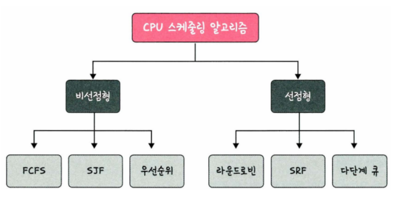

# CPU 스케줄링 알고리즘

CPU 스케줄러는 CPU 스케줄링 알고리즘에 따라 프로세스에서 해야 하는 일을 스레드 단위로 CPU에서 할당한다.

- 프로그램이 실행될 때는 CPU 스케줄링 알고리즘이 어떤 프로그램에 CPU 소유권을 줄 것인지 결정한다.
- 이 알고리즘은 CPU 이용률은 높게, 주어진 시간에 많은 일을 하게, 준비 큐(ready queue)에 있는 프로세스는 적게, 응답 시간은 짧게 설정하는 것을 목표로 한다.

## **비선점형 방식**

비선점형 방식(non-preemptive)은 프로세스가 스스로 CPU 소유권을 포기하는 방식이며, 강제로 프로세스를 중지하지 않아 컨텍스트 스위칭으로 인한 부하가 적다.

### **FCFS(First Come, First Saved)**

- 가장 먼저 온 것을 가장 먼저 처리하는 알고리즘이다.길게 수행되는 프로세스 때문에 '준비 큐에서 오래 기다리는 현상(convoy effect)'이 발생한다는 단점이 있다.

#### 예제

프로세스 P1, P2, P3의 Burst Time(CPU 실행 시간)이 다음과 같이 주어지고, 프로세스가 Ready Queue에 도착하는 시간(Arrival Time)은 모두 0이라고 하자.

- 프로세스 별 대기 시간(Waiting Time): P1=0, P2=24, P3=27
    - 평균 대기 시간: 17
    - 평균 전체 처리시간: (24+27+30)/3 = 27
- 문제점
    - 프로세스들의 대기 시간이 매우 길어질 수 있다.

 

### **SJF(Shortest Job First)**

- 실행 시간이 가장 짧은 프로세스를 가장 먼저 실행하는 알고리즘이다.긴 시간을 가진 프로세스가 실행되지 않는 현상(starvation)이 일어나며 평균 대기 시간이 가장 짧지만, 실제로는 실행 시간을 알 수 없기 때문에 과거의 실행했던 시간을 토대로 추측해서 사용한다.

#### 예제

- 평균 대기 시간 = (3+16+9+0)/4 = 7
- FCFS 방식일 때의 평균 대기 시간 = (0+6+14+21)/4 = 10.25 => 확실히 FCFS 방식에 비해 평균 대기시간이 줄어든 것을 확인할 수 있다.

프로세스 별 Arrival Time이 다른 경우

SFJ는 비선점형 방식이기 때문에 Arrival Time에 따라 스케줄링 결과가 영향을 받는다.

- 평균 대기 시간 = (0+14+2+6)/4 = 5.5
- FCFS 방식일 때의 평균 대기 시간 = (0+4+10+14)/4 = 7

 

### **우선순위**

기존 SJF 스케줄링의 경우 긴 시간을 가진 프로세스가 실행되지 않는 현상이 있어, 오래된 작업일수록 '우선순위를 높이는 방법(aging)'을 통해 단점을 보완한 알고리즘을 말한다.

 

---

 

## **선점형 방식**

선점형 방식(preemptive)은 현대 운영체제가 쓰는 방식으로 지금 사용하고 있는 프로세스를 알고리즘에 의해 중단시켜 버리고 강제로 다른 프로세스에 CPU 소유권을 할당하는 방식을 말한다.

### **라운드 로빈(RR, Round Robin)**

현대 컴퓨터가 쓰는 스케줄링인 우선순위 스케줄링(priority scheduling)의 일종으로 각 프로세스는 동일한 할당 시간을 주고 그 시간 안에 끝나지 않으면 다시 준비 큐(ready queue)의 뒤로 가는 알고리즘이다.

- Ready Queue에 삽입된 프로세스들은 들어온 순서대로 CPU를 이용하되, 정해진 시간만큼만 이용한다.
- 정해진 시간을 모두 사용하였음에도 아직 프로세스가 완료되지 않았다면 다시 큐의 맨 뒤에 삽입한다.(컨텍스트 스위칭이 일어남)

#### 예제

타임 슬라이스의 크기(Time Quantum)가 4라고 가정하자.

- 타임 슬라이스의 크기가 너무 크면 사실상 FCFS와 같아지고, 너무 작으면 컨텍스트 스위칭으로 인한 오버헤드로 인해 CPU 성능이 떨어진다.

 

### **SRF(Shortest Remaining Time First)**

SJF는 중간에 실행 시간이 더 짧은 시간이 들어와도 기존 짧은 작업을 모두 수행하고 그다음 짧은 작업을 이어나가는데, SRF는 중간에 더 짧은 작업이 들어오면 수행하던 프로세스를 중지하고 해당 프로세스를 수행하는 알고리즘이다.

#### 예제

- 평균 대기 시간 = (10-1)+(1-1)+(17-2)+(5-3)/4 = 26/4 = 6.5

 

### **다단계 큐**

다단계 큐는 우선순위에 따른 준비 큐를 여러 개 사용하고 큐마다 라운드 로빈이나 FCFS 등 다른 스케줄링 알고리즘을 적용한 것을 말한다. 큐 간의 프로세스 이동이 안 되므로 스케줄링 부담이 적지만 유연성이 떨어지는 특징이 있다.

<img2 src="img2/sched_image%207.png" width="400">

### 출처

---

https://pyoungt.tistory.com/246

https://amaran-th.github.io/CS/%5BOS%5D%20CPU%20%EC%8A%A4%EC%BC%80%EC%A4%84%EB%A7%81%20%EC%95%8C%EA%B3%A0%EB%A6%AC%EC%A6%98/
