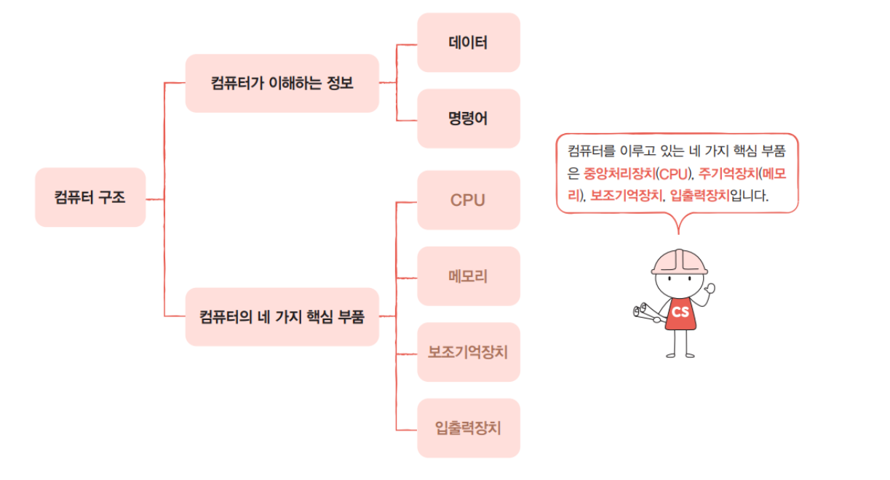

# Overview

우리가 알아야 할 컴퓨터 구조 지식은 크게 두가지이다.

## 1. 컴퓨터가 이해하는 정보

가장 먼저 우리는 컴퓨터가 무엇을 이해할 수 있는지 부터 알아야 한다.

컴퓨터는 0과 1로 표현된 정보만을 이해한다. 그리고 이렇게 0과 1로 표현되는 정보에는 크게 두가지 종류가 있는데, 그게 바로 **데이터**와 **명령어**이다. 

따라서 컴퓨터는 명령어의 처리하는 기계라고 할 수 있다. 

> [!NOTE]
> **데이터(data)** : 컴퓨터가 이해하는 숫자, 문자, 이미지, 동영상 같은 정적인 정보, 명령어를 위해 존재하는 일종의 재료  
> **명령어(instruction)**: 데이터를 움직이고 컴퓨터를 작동시키는 정보

## 2. 컴퓨터의 4가지 핵심 부품

세상에는 다양한 종류의 컴퓨터가 있다. 아두이노, 라즈베리 파이와 같은 작은 컴퓨터부터 스마트폰, 노트북, 데스크톱, 서버 컴퓨터에 이르기까지 그 크기와 용도도 제각각이지만 핵심 부품은 크게 다르지 않다.

컴퓨터의 핵심 부품은 

1. **중앙처리장치(**CPU; Central Processing Unit)
2. **주기억장치**main memory (이하 메모리)
3. **보조기억장치**secondary storage
4. **입출력장치**input/output(I/O) device

로, 이 네 가지 부품의 역할만 이해하고 있어도 컴퓨터의 작동 원리를 대부분 파악할 수 있다.

- ① 가장 큰 사각형은 **메인보드**.
- ② 메인보드 안에 **시스템 버스**(양방향 수직 화살표)가 있다.
- ③ **CPU** 내부에는 **ALU**(산술논리연산장치), 제어장치와 여러 레지스터가 있다. CPU는 메인보드 내 시스템 버스와 연결되어 있다.
- ④ **메모리**는 메인보드 내 시스템 버스와 연결되어 있다.
- ⑤**보조기억장치**는 메인보드 내 시스템 버스와 연결되어 있다.
- ⑥ 모니터, 키보드, 마우스 등은 메인보드 내 시스템 버스와 연결되어 있고, 이들을 **입출력장치**라고 부름.

> [!NOTE]
> **시스템 버스(System Bus)** : CPU, 메모리, 입출력 장치 등 컴퓨터의 주요 구성 요소들이 서로 데이터를 주고받을 수 있도록 연결해 주는 하드웨어 데이터 통로

### **메모리**

현재 실행되는 프로그램의 명령어와 데이터를 저장하는 부품이다. 즉, 프로그램이 실행되려면 반드시 메모리에 저장되어 있어야 한다.

이때 컴퓨터가 빠르게 작동하기 위해서는 메모리 속 명령어와 데이터가 중구난방으로 저장되어 있으면 안된다.  저장된 명령어와 데이터의 위치는 **정돈**되어 있어야 한다. 그래서 메모리에는 저장된 값에 빠르고 효율적으로 접근하기 위해 **주소(address)**라는 개념을 사용한다. 

현실에서 우리가 주소로 원하는 위치를 찾아갈 수 있듯이 컴퓨터에서도 주소로 메모리 내 원하는 위치에 접근할 수 있다.

> 💡실제로 이렇게 저장 X, 데이터와 명령어 모두 0과 1로 표현됨

### CPU

**CPU**는 컴퓨터의 두뇌이다. CPU는 메모리에 저장된 명령어를 읽어 들이고, 읽어 들인 명령어를 해석하고, 실행하는 부품 
CPU 내부 구성 요소 중 가장 중요한 세 가지

1. **산술논리연산장치**ALU; Arithmetic Logic Unit(이하 **ALU**)
    1. 쉽게 말해 계산기. 컴퓨터 내부에서 수행되는 대부분의 계산은 ALU가 도맡아 수행함.
    2. CPU 안에는 여러 개의 레지스터가 존재하고 각기 다른 이름과 역할을 가지고 있다.
2. **레지스터**register
    1. CPU 내부의 작은 임시 저장 장치입니다. 프로그램을 실행하는 데 필요한 값들을 임시로 저장
3. **제어장치**CU; Control Unit
    1. **제어 신호(**control signal)라는 전기 신호를 전기 신호를 내보내고 명령어를 해석하는 장치
    2. **제어 신호**란 컴퓨터 부품들을 관리하고 작동시키기 위한 일종의 전기 신호
        1. CPU가 메모리에 저장된 값을 읽고 싶으면  → 메모리를 향해 **메모리 읽기**
        2. CPU가 메모리에 어떤 값을 저장하고 싶으면 → 메모리를 향해 **메모리 쓰기**

### 예시로 알아보기

1번지부터 2번지 까지 명령어가 저장되어 있다. CPU가 이 두 개의 명령어를 어떻게 실행하는지 살펴보자

#### 01. 제어장치는 1번지에 저장된 명령어를 읽어 들이기 위해 메모리에 ‘메모리 읽기’ 제어 신호를 보냄

#### 02. **①**  메모리는 1번지에 저장된 명령어를 CPU에 건내줌 → 이 명령어를 레지스터에 저장 → **②**  제어장치는 읽어 들인 명령어를 해석한 뒤 3번지와 4번지에 저장된 데이터가 필요하다고 판단 → **③** 제어장치는 3번지와 4번지에 저장된 데이터를 읽어들이기 위해 메모리에 ‘메모리 읽기’ 제어 신호를 보냄

#### **03. ①** 메모리는 3번지와 4번지에 저장된 데이터를 CPU에 건네줌 → 이 데이터들은 서로 다른 레지스터에 저장 → **②** ALU는 읽어 들인 데이터로 연산을 수행 → **③** 계산의 결괏값은 레지스터에 저장됩니다. 계산이 끝났다면 첫 번째 명령어의 실행은 끝남.

#### **04.** **①** 제어장치는 2번지에 저장된 다음 명령어를 읽어 들이기 위해 메모리에 ‘메모리 읽기’ 제어 신호를 보냄

#### **05. ②** 메모리는 2번지에 저장된 명령어를 CPU에 건네주고, 이 명령어는 레지스터에 저장. → **③** 제어장치는 이 명령어를 해석한 뒤 메모리에 계산 결과를 저장해야 한다고 판단.

#### **06. ④** 제어장치는 계산 결과를 저장하기 위해 메모리에 ‘메모리 쓰기’ 제어 신호와 함께 계산 결과인 220을 보내고, 메모리가 계산 결과를 저장하면 두 번째 명령어의 실행도 끝남

### **보조기억장치**

앞서 메모리는 실행되는 프로그램의 명령어와 데이터를 저장한다고 했지만, 이 메모리는 두 가지 치명적인 약점이 있다. 첫 째는 가격이 비싸 저장 용량이 적다는 점이고, 둘 째는 전원이 꺼지면 저장된 내용을 잃는다는 점입니다.

컴퓨터로 작업하는 도중에 전원이 꺼져서 작업한 내역을 잃어본 적은 누구든 있을 것이다. 전원이 꺼지면 작업한 내역을 잃게 되는 이유는 실행 중인 프로그램들은 메모리에 저장되는데, 메모리는 전원이 꺼지면 저장된 내용이 날아가기 때문!!

이에 메모리보다 크기가 크고 전원이 꺼져도 저장된 내용을 잃지 않는 메모리를 보조할 저장 장치가 필요하게 되었는데, 이 저장 장치가 **보조기억장치이다**.

하드 디스크, SSD, USB 메모리, DVD, CD-ROM과 같은 저장 장치가 보조기억장치의 일종. 

**컴퓨터 전원이 꺼져도 컴퓨터에 파일이 남아 있었던 이유는 우리가 파일을 보조기억장치에 저장했기 때문**입니다. 

현재 단계에서는 메모리가 현재 ‘실행되는’ 프로그램을 저장한다면, 보조기억장치는 ‘보관할’ 프로그램을 저장한다고 생각해도 좋다. 

### 입출력 장치

입출력장치는 **마이크, 스피커, 프린터, 마우스, 키보드**처럼 컴퓨터 외부에 연결되어 컴퓨터 내부와 정보를 교환하는 장치

### **메인보드와 시스템 버스**

지금까지 설명한 컴퓨터의 핵심 부품들은 모두 **메인보드(**main board)라는 판에 연결된다. **마더보드**mother (board)라고도 부르기도 한다. 메인보드에는 앞서 소개한 부품을 비롯한 여러 컴퓨터 부품을 부착할 수 있는 슬롯과 연결 단자가 있다.

메인보드에 연결된 부품들은 서로 정보를 주고받을 수 있는데, 이는 메인보드 내부에 **버스(**bus)라는 통로가 있기 때문!!

컴퓨터 내부에는 다양한 종류의 통로, 즉 버스가 있는데, 여러 버스 가운데 컴퓨터의 네 가지 핵심 부품을 연결하는 가장 중요한 버스는 **시스템 버스(system bus)**이다.

#### 시스템 버스 종류

- **주소 버스(**address bus) : 주소를 주고받는 통로
- **데이터 버스(**data bus) : 명령어와 데이터를 주고받는 통로
- **제어 버스(**control bus) : 제어 신호를 주고받는 통로

#### 예시) CPU가 메모리 속 명령어 읽기 위해 제어 장치에서 ‘메모리 읽기’라는 신호를 보낼 때

**①** 제어 버스로 ‘메모리 읽기’ 제어 신호를 내보내고

**②** 주소 버스로 읽고자 하는 주소를 내보냄

 **③** 그러면 메모리는 데이터 버스로 CPU가 요청한 주소에 있는 내용을 보낸다

#### 예시2) 메모리에 어떤 값을 저장할 때

**①** CPU는  데이터 버스를 통해 메모리에 저장할 값을

**②** 주소 버스를 통해 저장할 주소를, 

**③** 제어 버스를 통해 ‘메모리 쓰기’ 제어 신호를 내보냄

### 출처

https://hongong.hanbit.co.kr/%EC%BB%B4%ED%93%A8%ED%84%B0%EC%9D%98-4%EA%B0%80%EC%A7%80-%ED%95%B5%EC%8B%AC-%EB%B6%80%ED%92%88cpu-%EB%A9%94%EB%AA%A8%EB%A6%AC-%EB%B3%B4%EC%A1%B0%EA%B8%B0%EC%96%B5%EC%9E%A5/
