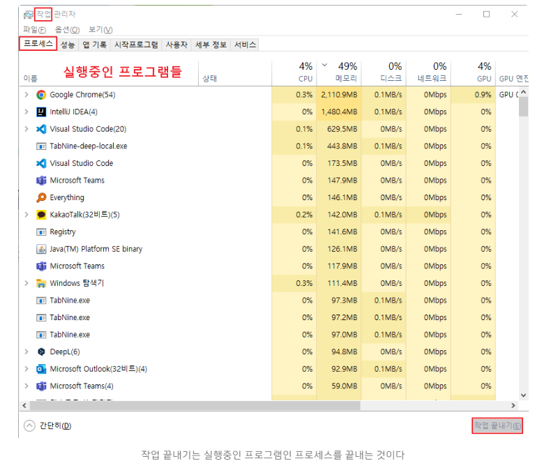
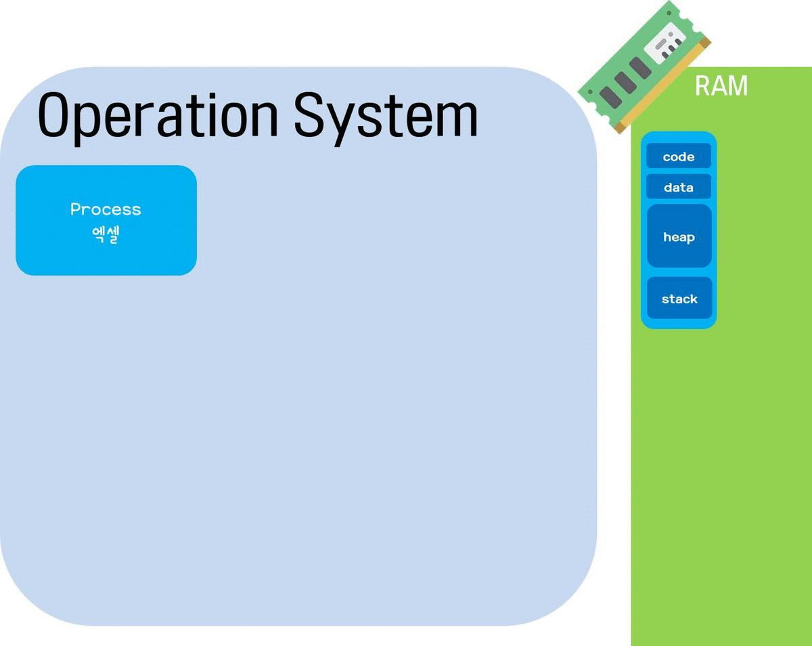
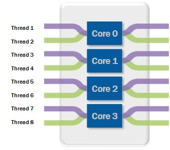

# 프로세스(Process)와 스레드(Thread)

## 프로세스(Process)

> 운영체제로부터 자원을 할당 받은 **작업의 단위**
> 

<strong><code>프로세스(Process)</code></strong>라는 명칭이 낯설다면??

아직 프로세스라는 명칭이 낯설어도 '프로그램'이라는 단어는 친숙할것이다.

**프로그램(Program)** : 윈도우의 `*.exe` 파일이나 Mac의 `*.dmg` 파일과 같은 컴퓨터에서 실행 할 수 있는 파일

단, 아직 **파일을 실행하지 않은 상태**이기 때문에 **정적 프로그램(Static Program)** 을 줄여서 프로그램이라고 부른다.

어떤 프로그램을 개발하기 위해서는 자바나 C언어와 같은 언어를 이용해 코드를 작성해야 한다. 즉, 프로그램은 쉽게 말해서 그냥 **코드 덩어리**다.

프로그램이 코드덩어리면, **프로세스(Process)**는 프로그램을 실행 시켜 정적인 프로그램을 동적으로 변하여 **프로그램이 돌아가고 있는 상태**를 말한다. 즉, 컴퓨터가 **작업** 중인 프로그램을 의미하는 것

#### 작업관리자 화면

모든 프로그램은 운영체제가 실행되기 위한 메모리 공간을 할당 해줘야 실행될 수 있다. 그래서 프로그램을 실행하는 순간 파일은 컴퓨터 메모리에 올라가게 되고, 운영체제로부터 시스켐 자원(CPU)을 할당받아 프로그램 코드를 실행시켜 우리가 서비스를 이용할 수 있게 되는 것!!

| 프로그램 | 프로세스 |
| --- | --- |
| 어떤 작업을 하기 위해 실행할 수 있는 파일 | 실행되어 작업중인 컴퓨터 프로그램 |
| 파일이 저장 장치에 있지만 메모리에 올라가 있지 않은 정적인 상태 | 메모리에 적제되고 CPU 자원을 할당받아 프로그램이 실행되고 있는 상태 |
| 쉽게 말해 코드 덩어리 | 그 코드 덩어리를 실행한 것 |

### 프로세스의 상태

프로세스가 실행되는 동안 변경되는 고유 상태를 의미한다. 프로세스가 생성되어 실행하기 까지 프로세스는 여러가지의 상태를 갖게 되고, 상태의 변화에 따라 프로세스가 동작되는 것

| 상태 | 설명 | 핵심 포인트 |
| :--- | :--- | :--- |
| **new** | 프로세스가 막 생성되는 중. OS가 PCB를 만들고 pid를 부여하고 메모리를 준비 | long-term scheduler가 admit할 때까지 대기. "실행 준비 완료"가 아니라 "입장 심사 중" |
| **ready** | CPU를 **제외한** 모든 자원 확보 완료. CPU만 주면 즉시 실행 가능 | ready queue에서 대기. 동시에 여러 개 존재 가능 |
| **running** | CPU를 할당받아 명령어가 실행되고 있는 상태 | **CPU core 하나당 running은 최대 1개** (single-core 기준 시스템 전체에 하나뿐) |
| **waiting** | I/O 작업이나 event가 끝나기를 기다리는 상태 (blocked라고도 부름) | CPU를 줘봤자 할 일이 없어서 ready queue에서 빠져 device queue에서 대기 |
| **terminated** | 실행 종료 | OS가 자원 회수(deallocate)하고 PCB 정리 |

> 💡 **ready와 waiting의 차이**: 둘 다 "대기"지만, **ready는 CPU를 기다리고** **waiting은 event(I/O 완료 등)를 기다립니다.** ready는 당장 실행할 수 있는 상태, waiting은 CPU를 줘도 할 수 있는 게 없는 상태입니다.

### 2.2 상태 전이도

### 프로세스의 상태 전이

- 프로세스가 실행되는 동안 상태가 OS에 의해 변경되는 것
- 운영체제는 프로세스의 상태를 감시하고, 프로세스 상태를 기반으로 프로세스 스케쥴링을 통해프로세스를 관리하고 제어한다.

| 전이 | 방향 | 트리거 | 무슨 일이 벌어지는가 |
| :--- | :--- | :--- | :--- |
| **① admitted** | new → ready | long-term scheduler가 승인 | PCB가 ready queue에 연결. CPU 할당 후보가 됨 |
| **② dispatch** | ready → running | short-term scheduler가 선택 | context switch 발생: PCB에서 PC·registers를 CPU로 복원(reload). 멈췄던 지점부터 이어서 실행 |
| **③ interrupt** | running → ready | time slice 만료, 높은 우선순위 프로세스 등장 | context switch 발생: 현재 PC·registers를 PCB에 저장(save). **CPU를 강제로 뺏기는** 것 |
| **④ I/O wait** | running → waiting | I/O 요청, event 대기 | 프로세스가 **스스로** CPU를 내려놓음. device queue로 이동 |
| **⑤ I/O done** | waiting → ready | I/O 완료, event 발생 | device queue에서 나와 ready queue로 이동. 다시 CPU 할당 후보가 됨 |
| **⑥ exit** | running → terminated | 마지막 statement 실행, 또는 abort | output data를 parent에게 전달. OS가 자원 회수 |

> ⚠️ **waiting → running 직행은 불가!** I/O가 끝났다고 바로 CPU를 받는 게 아니라, 반드시 ready를 거쳐 줄을 다시 서야 합니다. CPU를 주는 결정은 오직 scheduler(전이 ②)만 할 수 있기 때문입니다.

> 💡 핵심 정리
> - running에서 **나가는 길 3개**: 뺏기거나(→ready), 스스로 내려오거나(→waiting), 끝나거나(→terminated)
> - running으로 **들어오는 길 1개**: ready에서 scheduler dispatch로만
> - ready ↔ waiting **직접 이동 없음**

### **프로세스 Context Switching**

컨텍스트 스위칭(Context Switching)은 CPU가 한 프로세스에서 다른 프로세스로 전환할 때 발생하는 일련의 과정 

- CPU는 한 번에 하나의 프로세스만 실행할 수 있으므로, 여러 개의 프로세스를 번갈아가며 실행하여 CPU 활용률을 높이기 위해 컨텍스트 스위칭이 필요하다
- 동작 중인 프로세스가 대기를 하면서 해당 프로세스의 상태(Context)를 보관하고, 대기하고 있던 다음 순서의 프로세스가 동작하면서 이전에 보관했던 프로세스의 상태를 복구하는 작업
- 다음 프로세스는 스케줄러가 결정함

#### **PCB (Process Control Block)**

PCB(프로세스 제어 블록)는 운영체제에서 프로세스를 관리하기 위해 해당 프로세스의 상태 정보를 담고 있는 자료구조

- 프로세스를 컨텍스트 스위칭 할때 기존 프로세스의 상태를 어딘가에 저장해 둬야 다음에 똑같은 작업을 이어서 할 수 있을 것이고, 새로 해야 할 작업의 상태 또한 알아야 어디서부터 다시 작업을 시작할지 결정할 수 있을 것이다.
- **프로세스 스케줄링을 위해 프로세스에 관한 모든 정보 저장하는 임시 저장소**

- 운영체제는 PCB에 담긴 프로세스 고유 정보를 통해 프로세스를 관리하며, 프로세스의 실행 상태를 파악하고, 우선순위를 조정하며, 스케줄링을 수행하고, 다른 프로세스와의 동기화를 제어한다.
- 운영체제 마다 PCB에 호함되는 항목이 다를 수 있음

- 포인터 (Pointer) : 프로세스의 현재 위치를 저장하는 포인터 정보
- 프로세스 상태 (Process state) : 프로세스의 각 상태 - 생성(New), 준비(Ready), 실행(Running), 대기(Waiting), 종료(Terminated) 를 저장
- 프로세스 아이디 (Process ID, PID) : 프로세스 식별자를 지정하는 고유한 ID
- 프로그램 카운터 (Program counter) : 프로세스를 위해 실행될 다음 명령어의 주소를 포함하는 카운터를 저장
- 레지스터 (Register) : 누산기, 베이스, 레지스터 및 범용 레지스터를 포함하는 CPU 레지스터에 있는 정보
- 메모리 제한 (Memory Limits) : 운영 체제에서 사용하는 메모리 관리 시스템에 대한 정보
- 열린 파일 목록 (List of open file) : 프로세스를 위해 열린 파일 목록

### **Context Switching 과정**

1. CPU는 Process P1을 실행한다 (Executing(실행))
2. 일정 시간이 지나 Interrupt 또는 system call이 발생한다. (CPU는 idle(대기) 상태)
3. 현재 실행 중인 Process P1의 상태를 PCB1에 저장한다. (Save state into PCB1)
4. 다음으로 실행할 Process P2를 선택한다. (CPU 스케줄링)
5. Process P2의 상태를 PCB2에서 불러온다. (Reload state from PCB2)
6. CPU는 Process P2를 실행한다. (Executing)
7. 일정 시간이 지나 Interrupt 또는 system call이 발생한다. (CPU는 idle 상태)
8. 현재 실행 중인 Process P2의 상태를 PCB2에 저장한다. (Save state into PCB2)
9. 다시 Process P1을 실행할 차례가 된다. (CPU 스케줄링)
10. Process P1의 상태를 PCB1에서 불러온다. (Reload state from PCB1)
11. CPU는 Process P1을 중간 시점 부터 실행한다. (Executing)

### Process Scheduling

#### Scheduling Queues

| Queue | 설명 |
| :--- | :--- |
| **Job queue** | 시스템에 존재하는 **모든** 프로세스의 집합 |
| **Ready queue** | 메모리에 올라와서 CPU 할당만 기다리는 프로세스들 |
| **Device queues** | 특정 I/O 장치를 기다리는 프로세스들 (장치마다 별도의 큐 존재) |

프로세스는 실행되는 동안 이 큐들 사이를 **migrate**(이동)합니다. 각 queue는 실제로 **PCB들의 linked list**로 구현됩니다. queue header가 head/tail 포인터를 갖고 있고, 그 뒤로 PCB들이 연결되어 있습니다.

#### running에서 CPU를 내려놓게 되는 대표 사건 4가지

| 사건 | 이후 |
| :--- | :--- |
| **I/O request** | 해당 장치의 I/O queue로 이동해 대기 |
| **time slice expired** | 할당 시간을 다 써서 ready queue로 복귀 |
| **fork a child** | child의 실행/종료를 기다림 |
| **wait for an interrupt** | interrupt가 발생할 때까지 대기 |

네 경우 모두 일이 해결되면 다시 ready queue로 돌아와 줄을 섭니다.

#### Schedulers

| Scheduler | 하는 일 | 실행 빈도 |
| :--- | :--- | :--- |
| **Long-term** (job scheduler) | 어떤 프로세스를 ready queue에 넣을지 선발 | 드물게 (seconds~minutes) → 느려도 됨 |
| **Short-term** (CPU scheduler) | ready queue에서 다음 실행할 프로세스를 선발해 CPU 할당 | 매우 자주 (milliseconds) → **빨라야 함** |
| **Medium-term** | 메모리 부족 시 일부 프로세스를 disk로 내림 (**swap out**), 필요하면 다시 올림 (**swap in**) | 필요할 때 |

위 다이어그램에서 확인할 수 있듯, Job queue에서 long-term scheduler를 거쳐 ready queue(메모리, Mem)로 들어오고, short-term scheduler가 ready queue에서 골라 CPU에 올립니다. 메모리가 부족하면 medium-term scheduler가 ready queue의 프로세스를 disk로 swap out했다가, 여유가 생기면 다시 swap in으로 ready queue에 복귀시킵니다. CPU에서 I/O를 요청하면 I/O waiting queue로 갔다가, 완료되면 다시 ready queue로 돌아옵니다.

> 💡 **Long-term scheduler가 degree of multiprogramming을 조절**합니다 (= 동시에 메모리에 올라와 있는 프로세스 개수). I/O-bound와 CPU-bound를 적절히 섞어서 선발해야 CPU와 I/O 장치가 골고루 일합니다.

#### I/O-bound vs CPU-bound

| 유형 | 특징 |
| :--- | :--- |
| **I/O-bound process** | 계산보다 I/O에 시간을 더 씀. **짧은 CPU burst가 많음** |
| **CPU-bound process** | 계산에 시간을 더 씀. **길고 적은 CPU burst** |

> [!NOTE]
> **Context Switching Overhead**
>
> 위의 컨텍스트 스위칭 과정 그림을 보면 P1이 Execute에서 idle이 될 때 P2가 바로 Execute가 되지 않고 idle을 상태에 조금 있다가 Execute가 되는걸 볼 수 있다.
>
> 이 간극이 바로 컨텍스트 스위칭 오버헤드(overhead) 이다.
>
> 텍스트 스위칭 오버헤드는 대표적으로 다음과 같은 행위에 의해서 발생된다.
>
> - PCB 저장 및 복원 비용
> - CPU 캐시 메모리 무효화에 따른 비용
> - 프로세스 스케줄링 비용

 

---

 

## **스레드(Thread)**

> 하나의 프로세스 내에서 동시에 진행되는 작업 갈래, **흐름의 단위**
> 

하나의 프로세스 안에 여러가지 작업들 흐름이 동시에 진행되기 때문에, 이러한 일련의 작업 흐름들을 스레드라고 하며 여러개가 있다면 멀티(다중)스레드 라고 부른다.

스레드가 왜 만들어졌냐?

#### 프로세스(Process) 의 한계

과거에는 프로그램을 실행할 때 프로세스 하나만 이용했었다. 하지만 기술이 발전함에 따라 프로그램이 다채롭고 복잡해지면서 프로세스 작업 하나만으로 프로그램을 실행하는게 어려워졌다.

요즘에는 컴퓨터를 할 때 파일을 다운로드 받으면서 다른 일을 하는 멀티 작업이 당연한 기능이지만, 과거에는 파일을 다운 받으면 실행시작부터 끝까지 프로세스 하나만 사용하기 때문에 다운이 완료 될 때까지 하루종일 기다려야 했다.

그렇다고 동일한 프로그램을 여려 개의 프로세스로 만들면, 그만큼 메모리를 차지하고 CPU에서 할당받는 자원이 중복되게 된다. 스레드(Thread)는 이러한 특성의 한계를 해결하기 위해 탄생 했다고 볼 수 있다.

### 스레드의 상태

| **스레드 상태** | **설명** |
| --- | --- |
| NEW | 스레드가 생성되고 아직 호출되지 않은 상태 |
| RUNNABLE | 스레드가 실행되기 위해 기다리는 상태CPU를 할당받을 수 있는 상태이며, 언제든지 실행될 준비가 되어있다. |
| BLOCKED | 스레드가 특정 이벤트(입출력 요청 등)가 발생하여 대기하는 상태CPU를 할당받지 못하며, 이벤트가 발생하여 다시 RUNNABLE 상태로 전환될 때까지 대기한다. |
| TERMINATED | 스레드가 실행을 완료하고 종료된 상태더 이상 실행될 수 없으며, 메모리에서 제거된다. |

#### **TCB (Thread Control Block)**

PCB 처럼, TCB(스레드 제어 블록)는 각 스레드마다 운영 체제에서 유지하는 스레드에 대한 정보를 담고 있는 자료구조

- 스레드의 상태 정보, 스레드 ID, 스레드 우선순위, 스케줄링 정보 등 다양한 정보를 저장
- TCB도 스레드가 생성될 때 운영 체제에 의해 생성되며, 스레드가 실행을 마치고 소멸될 때 함께 소멸된다.

 
 

## 프로세스와 스레드의 메모리

### 프로세스의 메모리 구조

프로세스가 만들어지면 아래의 4가지 메모리 영역으로 구성되어 할당 받게 된다.

> [!NOTE]
> 위 그림에서 stack과 heap에 위아래로 화살표가 있는 이유는 크기가 동적으로 변하는 영역이기 때문임!!

#### 코드 영역(Code/ Text)

프로그래머가 작성한 프로그램 함수들의 코드가 CPU가 해석 가능한 기계어 형태로 저장되어 있다.

#### 데이터 영역(Data)

코드가 실행되면서 사용하는 전역 변수나 각종 데이터들이 모여있는 공간. 

.data ,.rodata, .bss 영역 구성됨

- data : 전역 변수 또는 static 변수 등 프로그램이 사용하는 데이터를 저장
- .BSS : 초기값 없는 전역 변수, static 변수가 저장
- .rodata : const같은 상수 키워드 선언 된 변수나 문자열 상수가 저장

#### 스택 영역 (Stack)

지역 변수와 같은 호출한 함수가 종료되면 되돌아올 임시적인 자료를 저장하는 독립적인 공간. 

- Stack은 함수의 호출과 함께 할당되며, 함수의 호출이 완료되면 소멸한다. 만일 stack 영역을 초과하면 stack overflow 에러가 발생한다.

#### **힙 영역(Heap)**

생성자, 인스턴스와 같은 동적으로 할당되는 데이터들을 위해 존재하는 공간이다. 사용자에 의해 메모리 공간이 동적으로 할당되고 해제된다.

> [!NOTE]
> 프로그램이 여러개 실행되면 메모리에 프로세스들이 담길 주소 공간이 생성되고 그안에 **Code, Data, Stack, Heap** 공간이 만들어지게 된다.

 

---

 

# 멀티프로세싱 vs 멀티스레딩

## 멀티프로세싱

> 여러 개의 ‘프로세스’를 통해 동시에 두 가지 이상의 일을 수행하는 것
> 

기본적으로 각 프로세스는 메모리에 별도의 주소 공간에서 실행되기 때문에, 한 프로세스는 다른 프로세스의 변수나 자료구조에 접근할 수는 없다. 하지만 현재 우리가 사용하는 대부분의 컴퓨터 프로그램은 다른 프로그램에서 정보를 가져어는 경우를 어렵지 않게 볼 수 있다. 

이처럼 특별한 방법을 통해 프로세스가 다른 프로세스의 정보에 접근하는 것이 가능하다. 프로세스 간 정보를 공유하는 방법에는 다음과 같은 방법들이 있다.

1. IPC(Inter-Process Communication) 사용
    - 공유 메모리, 파일, 소켓, 익명 파이프, 명명 파이프, 메시지
2. LPC(Local inter-Process Communication) 사용
3. 별도로 공유 메모리를 만들어서 정보를 주고받도록 설정

#### 멀티 프로세스의 장점

1. 프로그램 안정성
    - 멀티 프로세스는 각 프로세스가 독립적인 메모리 공간을 가지므로, 한 프로세스가 비정상적으로 종료되어도 다른 프로세스에 영향을 주지 않는다.
2. 프로그램 병렬성
    - 멀티 프로세스와 여러개의 CPU 코어를 활용하여 둘의 시너지를 합쳐, 다중 CPU 시스템에서 각 프로세스를 병렬적으로 실행하여 성능을 향상 시킬 수 있다
3. 시스템 확장성
    - 각 프로세스가 독립적이므로, 새로운 기능이나 모듈을 추가하거나 수정할때 다른 프로세스에 영향을 주지 않아 시스템 규모를 쉽게 확장할 수 있다.

#### 멀티 프로세스의 단점

1. Context Switching Overhead
    - 프로세스를 컨텍스트 스위칭 하면, CPU는 다음 프로세스의 정보를 불러오기 위해 메모리를 검색하고, CPU 캐시 메모리를 초기화하며, 프로세스 상태를 저장하고, 불러올 데이터를 준비해야 하기 때문에, 이로 인한 빈번한 Context Switching 작업으로 인해 비용 오버헤드가 발생할 수 있게 된다.
    - 반면 스레드를 컨텍스트 스위칭하면 프로세스 스위칭 보다 가벼워 훨씬 빠르고 좋다.
2. 자원 공유 비효율성
    - 멀티 프로세스는 각 프로세스가 독립적인 메모리 공간을 가지므로, 결과적으로 메모리 사용량이 증가하게 된다.

 

## 멀티 스레딩

> 하나의 프로세스 내의 작업을 서로 자원을 공유하는 여러 개의 스레드로 처리하는 기법
> 

컴퓨터가 여러 가지 일을 동시에 할 수 있는 이유는 **스레드**끼리 **프로세스의 자원을 공유하**면서 프로세스 실행 흐름의 일부가 되기 때문이다.

프로세스의 4가지 메모리 영역(Code, Data, Heap, Stack) 중 스레드는 **Stack만 할당받아 복사**하고 Code, Data, Heap은 프로세스내의 다른 스레드들과 **공유됨** 

- **Stack**은 함수 호출 시 전달되는 인자, 되돌아갈 주소값, 함수 내에서 선언하는 변수 등을 저장하는 메모리 공간이기 때문에, 독립적인 스택을 가졌다는 것은 독립적인 함수 호출이 가능하다 라는 의미이다.
- Stack을 가짐으로써 스레드는 독립적인 실행 흐름을 가질 수 있게 되는 것

> [!NOTE]
> **반면에 프로세스는 기본적으로 프로세스끼리 다른 프로세스의 메모리에 직접 접근할 수는 없다.**

> 이런 구조를 사용하는 이유는 **하나의 프로세스**를 다수의 실행 단위인 **스레드**로 구분하여 자원을 공유하고, 자원의 생성과 관리의 중복성을 최소화하여 **수행 능력을 올리기 위해서다**.
> 

#### 멀티 스레드의 장점

1. 스레드는 프로세스보다 가벼움
    - 애초에 스레드는 프로세스 내에서 생성
    - 자원을 공유하는 구조
2. 자원의 효율성
    - 스레드 간에 자원을 공유가 가능해, 프로세스 간 통신 (IPC)을 사용하지 않고도 데이터를 공유할 수 있기 때문에
3. Context Switching 비용 감소
    - 상대적으로 프로세스 컨텍스트 스위칭 오버헤드보다 훨씬 낮아 비용이 낮다는 장점이 있다.
    - 스레드 간에 공유하는 자원을 제외한 스레드 정보(stack, register)만을 교체하면 되므로
4. 응답 시간 단축

#### 멀티 스레드의 단점

1. 안정성 문제
    - 기본적으로 하나의 스레드에서 문제가 발생하면 다른 스레드들도 영향을 받아 전체 프로그램이 종료될 수 있다.
2. 동기화로 인한 성능 저하
    - 공유 자원에 동시에 접근할 수 있기 때문에, 동기화 문제가 발생할 수 있다.
    - 때문에 자원에 대한 접근을 순차적으로 통제해야 하는데,결국 여러 스레드 접근을 제한하는 것이기 때문에 **병목 현상**이 일어나 성능이 저하될 가능성이 높다
    - 이를 해결하기 위해 임계 영역(Critical Section)에 대하여 뮤텍스(mutex), 또는 세마포어(Semaphore) 방식을 활용
3. 데드락 (교착 상태)
    - Deadlock 이란, 다수의 프로세스나 스레드가 서로 자원을 점유하고, 다른 프로세스나 스레드가 점유한 자원을 기다리는 상황에서 발생하는 교착 상태
    - 이를 방지하기 위한 상호배제(Mutual Exclusion), 점유와 대기(Hold and Wait), 비선점(No Preemption), 순환 대기(Circular Wait) 등의 알고리즘을 통해 극복
4. Context Switching Overhead(멀티 프로세스 보단 작지만)
5. 디버깅 힘듬

> [!NOTE]
> **상호 배제** : 한 프로세스가 자원을 독접하고 있어 다른 프로세스들이 접근 불가
>
> **점유 대기** : 특정 프로세스가 점유한 자원을 다른 프로세스가 요청하는 상태
>
> **비선점** :  다른 프로세스의 자원을 강제적으로 가져올 수 없음
>
> **환형대기 :** 서로가 서로의 자원을 요구하는 상황

> [!NOTE]
> **임계 영역(Critical Section)**
>
> - 멀티 스레드 프로그래밍에서 임계 영역은 공유 자원을 접근하는 코드 영역을 말한다. 대표적으로 전역 변수나 heap 메모리 영역을 들 수 있겠다.
>
> **뮤텍스(Mutex)**
>
> - 공유 자원에 대한 접근을 제어하기 위한 상호 배제 기법 중 하나로, 임계 영역에 진입하기 전에 락(lock)을 획득하고, 임계 영역을 빠져나올 때 락을 해제하여 다른 스레드들이 접근할 수 있도록 한다. 한마디로 오직 1개의 스레드만이 공유 자원에 접근할 수 있도록 제어하는 기법이다.
>
> **세마포어(Semaphore)**
>
> - 세마포어는 동시에 접근 가능한 스레드의 개수를 지정할 수 있다. 세마포어 값이 1이면 뮤텍스와 동일한 역할을 하며, 값이 2 이상이면 동시에 접근 가능한 스레드의 수를 제어할 수 있다. 스레드가 임계 영역에 진입하기 전에 세마포어 값을 확인하고, 값이 허용된 범위 내에 있을 때만 락을 획득할 수 있는 형식이다. 한마디로 뮤텍스 상위 호환 이라고 보면 된다.

> [!NOTE]
> 데드락은 사실 멀티 프로세스와 스레드 모델의 공통된 문제점
>
> - 프로세스 끼리는 기본적으로 독립적인 메모리 공간이지만 IPC를 통해 공유 자원을 사용할 수 있기 때문에 멀티 스레드와 똑같이 교착 상태에 빠질 수 있기 때문

 
 

## 참고

### 프로세스 & 스레드의 동시 실행 원리

음악을 들으면서 웹 서핑도 하고 메신저 메시지도 확인할 수 있는 이유는, 컴퓨터가 내부적으로 프로세스와 스레드를 동시에 처리하는 **멀티태스킹(Multi Tasking)** 기술을 쓰기 때문이다.

### 멀티 코어와 스레드

컴퓨터 견적을 맞춰본 적이 있다면 "4코어 8스레드 CPU" 같은 표현을 본 적이 있을 것이다.

- **코어(Core)** : 명령어를 메모리에서 가져와 해석하고 실행하는 반도체 유닛. "4코어"는 이 물리적 코어가 4개라는 뜻이다.
- **스레드(하드웨어 관점)** : 하나의 물리적 코어가 동시에 처리할 수 있는 논리적 작업 단위. "8스레드"는 4개의 물리 코어가 각각 2개씩의 작업을 동시에 처리할 수 있어, 운영체제 입장에서는 논리적으로 8개의 작업을 동시에 처리할 수 있다는 뜻이다.
- 이렇게 하나의 물리 코어로 여러 스레드를 동시에 처리하는 기술을 **하이퍼스레딩(Hyper-Threading)** 이라 부른다.

하지만 실제로는 수십~수백 개의 프로그램을 동시에 켜놓고 사용한다. 겨우 8개의 논리 코어로 어떻게 이 많은 작업을 처리할까? 이를 이해하려면 **병렬성(Parallelism)** 과 **동시성(Concurrency)** 개념을 알아야 한다.

### 병렬성 vs 동시성

| 구분 | 병렬성 (Parallelism) | 동시성 (Concurrency) |
| --- | --- | --- |
| 의미 | 여러 작업을 실제로 동시에 처리 | 여러 작업을 빠르게 번갈아 처리해 동시에 처리되는 것처럼 보이게 함 |
| 필요 조건 | 코어(프로세서)가 여러 개 필요 | 코어가 하나여도 가능 |
| 처리 방식 | 각 코어가 서로 다른 작업을 물리적으로 동시에 실행 | 하나의 코어가 작업을 잘게 쪼개 빠르게 전환하며 실행 |

#### 병렬성 (Parallelism)

코어가 여러 개 있을 때, 프로세스·스레드를 각 코어에 나눠 물리적으로 동시에 실행하는 방식이다. 듀얼코어, 쿼드코어, 옥타코어처럼 멀티코어 프로세서를 탑재한 컴퓨터에서 가능하다.

#### 동시성 (Concurrency)

둘 이상의 작업이 "동시에 실행되는 것처럼 보이게" 처리하는 방식이다. 예를 들어 코어가 1개, 작업이 4개 있다면 각 작업을 조금씩 번갈아 처리해서 마치 동시에 실행되는 것처럼 보이게 만든다. 작업을 매우 잘게 나눠 빠르게 전환하기 때문에, 사람 눈에는 동시에 돌아가는 것처럼 보인다.

진행 중인 작업을 A → B → C → D 순서로 계속 바꿔가며 실행하는 것이 바로 **컨텍스트 스위칭(Context Switching)** 이다.

#### 동시성이 필요한 이유

동시성은 실제로 동시에 처리하는 게 아니라 "동시처럼 보이게" 하는 것뿐이라, 전체 작업 시간만 보면 순차 처리와 큰 차이가 없어 보일 수 있다. 그런데도 동시성이 필요한 이유는 크게 두 가지다.

1. **하드웨어적 한계** : CPU는 발열 문제로 클럭 속도만 계속 올리는 데 한계가 있어, 코어 개수를 늘리는 방향(쿼드코어, 옥타코어 등)으로 발전해왔다. 하지만 코어를 무한정 늘릴 수는 없으므로, 수십~수백 개의 프로세스를 소수의 코어로 처리하려면 결국 동시성이 필요하다.
2. **논리적 효율성** : 예를 들어 4코어 8스레드 환경에서 오래 걸리는 작업 8개와 짧은 작업 8개, 총 16개의 작업이 있다고 가정하자. 오래 걸리는 작업 8개가 먼저 8개의 논리 코어를 모두 차지해버리면, 금방 끝날 수 있는 나머지 8개의 짧은 작업은 앞선 작업이 끝날 때까지 무작정 기다려야 한다. 이런 비효율을 막기 위해 작업을 잘게 쪼개 번갈아 처리하는 동시성 방식을 함께 사용한다.

결과적으로 최대 8개의 작업은 8개의 논리 스레드가 병렬적으로 빠르게 처리하고, 그보다 많은 소프트웨어 스레드가 있다면 병렬성과 동시성을 적절히 섞어서 동시에 처리하게 된다.

### 출처

- [프로세스 vs 쓰레드 차이 (inpa.tistory.com)](https://inpa.tistory.com/entry/%F0%9F%91%A9%E2%80%8D%F0%9F%92%BB-%ED%94%84%EB%A1%9C%EC%84%B8%EC%8A%A4-%E2%9A%94%EF%B8%8F-%EC%93%B0%EB%A0%88%EB%93%9C-%EC%B0%A8%EC%9D%B4)
- [멀티 프로세스 vs 멀티 스레드 (inpa.tistory.com)](https://inpa.tistory.com/entry/%F0%9F%91%A9%E2%80%8D%F0%9F%92%BB-multi-process-multi-thread)
