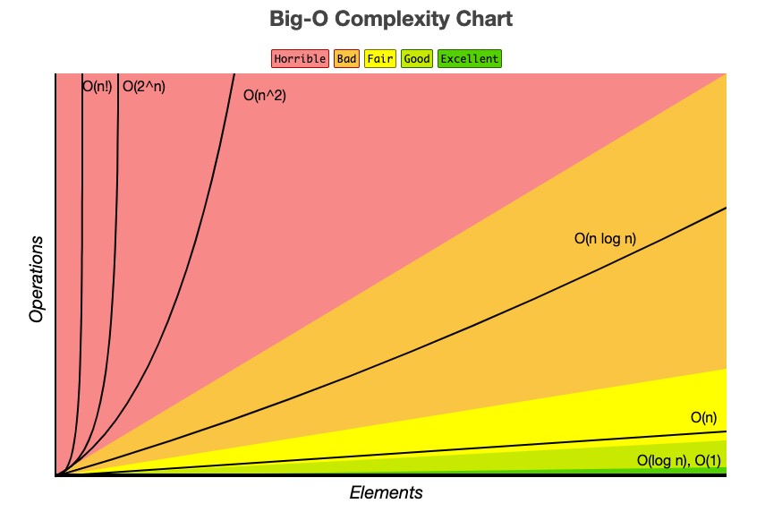

# 시간복잡도와 공간복잡도


## 시간복잡도 **(Time Complexity)** 란?

**시간복잡도(Time Complexity)** : 알고리즘을 수행하는데 걸리는 시간

---

### 시간복잡도가 필요한 이유?

같은 문제를 푸는 알고리즘이 여러 개일 때, 어떤 알고리즘이 더 효율적인지 객관적으로 비교하기 위해 필요합니다. 

입력 크기(n)가 커질수록 알고리즘 간 성능 차이가 극명하게 드러나기 때문에, 시간복잡도를 통해 최적의 알고리즘을 선택할 수 있습니다.

---

### 시간복잡도 표기

시간복잡도는 일반적으로 **빅오 표기법**으로 표기

최고 차항을 제외한 모든 항의 계수를 제외시켜 나타낸다.

예시) 

- $T(n) = n^2 + 2n + 1 = O(n^2)$

> 💡 **최고 차항을 제외하고 모두 제외시키는 이유는?**
입력 크기 n이 충분히 커질수록, 최고차항이 전체 실행 시간을 지배하고 나머지 항들의 영향은 무시할 수 있을 만큼 작아지기 때문입니다.
> 

---

#### $O(1)$ - 상수 시간 (Constant time)

입력 크기 n에 관계없이 항상 일정한 시간이 걸리는 알고리즘입니다. 

연산 횟수가 고정되어 있어 가장 이상적인 시간복잡도입니다.

**파이썬 예시 코드**

```python
def get_first_element(arr):
    return arr[0]  # 배열 크기와 무관하게 항상 한 번의 연산
```

---

#### $O(\log N)$ - 로그 시간 (Logarithmic time)

입력 크기 n이 커져도 연산 횟수가 로그 비율로 증가하는 알고리즘입니다. 

매 단계마다 탐색 범위를 절반씩 줄여나가는 방식이 대표적입니다. (예: 이진 탐색)

**파이썬 예시 코드**

```python
def binary_search(arr, target):
    left, right = 0, len(arr) - 1
    while left <= right:
        mid = (left + right) // 2
        if arr[mid] == target:
            return mid
        elif arr[mid] < target:
            left = mid + 1
        else:
            right = mid - 1
    return -1
```

- 왜 $logN$인가?
    
    먼저 로그란 로그는 **"몇 번 곱해야 해?"** 에 대한 답을 말합니다.
    
    - $2^? = 8$ ⇒  $log_28 = 3$
    - "2를 몇 번 곱해야 8이 돼?" → **3번!**
    
    ### 📐 로그 표기법 정리
    
    $log_{\color{red}{밑}} {\color{blue}{진수}} = {\color{green}{지수}}$
    
    - $\color{red}{밑(2)}$ : 몇 배씩 커지는지
    - $\color{blue}{진수(8)}$ : 목표 숫자
    - $\color{green}{지수(3)}$  : 몇 번 곱했는지
    
    이제 로그N이란? 
    
    - N개를 2로 몇 번 나눠야 1이 되는가?" 에 대한 답을 말한다.
    - $N÷2k=1⇒k=log2N$
    
    이제 1~100 사이의 특정 숫자를 찾는 경우
    
    😅 최악의 경우 - 1부터 하나씩 물어보기
    
    ```python
    "1이야?" → 아니 
    "2이야?" → 아니
    "3이야?" → 아니
    ... 최악의 경우 100번 질문 → O(n)
    ```
    
    😎 이진탐색을 활용할 경우
    
    ```python
    "50이야?" → 아니, 더 커!
        → 1~49 는 한번에 버림 🗑️ (50개 제거)
    
    "75이야?" → 아니, 더 작아!
        → 76~100 는 한번에 버림 🗑️ (25개 제거)
    
    "62이야?" → 아니, 더 커!
        → 51~61 는 한번에 버림 🗑️ (12개 제거)
    
    "68이야?" → 정답! 🎉
    
    -> 4번만에 원하는 수를 찾음
    ```
    

---

#### $O(n)$  - 선형 시간 (Linear time)

입력 크기 n에 비례하여 연산 횟수가 증가하는 알고리즘입니다. 

입력 데이터를 처음부터 끝까지 한 번씩 순회하는 경우가 대표적입니다.

**파이썬 예시 코드**

```python
def find_max(arr):
    max_val = arr[0]
    for num in arr:  # n번 순회
        if num > max_val:
            max_val = num
    return max_val
```

---

#### $O(n^2)$ - 2차 시간 (Quadratic time)

입력 크기 n의 제곱에 비례하여 연산 횟수가 증가하는 알고리즘입니다. 

이중 반복문을 사용하는 경우가 대표적이며, n이 커질수록 성능이 급격히 저하됩니다.

**파이썬 예시 코드**

```python
def bubble_sort(arr):
    n = len(arr)
    for i in range(n):               # 외부 반복문: n번
        for j in range(n - i - 1):   # 내부 반복문: n번
            if arr[j] > arr[j + 1]:
                arr[j], arr[j + 1] = arr[j + 1], arr[j]
    return arr
```

---

#### $O(2^n)$ - 지수 시간 (Exponential time)

입력 크기 n이 1 증가할 때마다 연산 횟수가 2배씩 증가하는 알고리즘입니다. 

재귀적으로 모든 경우의 수를 탐색하는 경우가 대표적이며, n이 조금만 커져도 실행 시간이 폭발적으로 늘어납니다.

**파이썬 예시 코드**

```python
def fibonacci(n):
    if n <= 1:
        return n
    return fibonacci(n - 1) + fibonacci(n - 2)  # 두 번의 재귀 호출
```

- 설명
    
    fibonacci(4)를 호출했을 때의 실행 플로우
    
    - 총 9번이 호출됨
    
    ```python
    1층  :        f(4)         → 1개
    2층  :    f(3)   f(2)      → 2개
    3층  :  f(2) f(1) f(1) f(0) → 4개
    4층  : f(1)f(0)            → 8개 (최대)
    ```
    

🔢 호출 횟수가 어떻게 늘어나는지 보면

- 호출 횟수가 $2^n$를 넘진 않지만 **거의 비슷하게 증가**

| n | 호출 횟수 | $2^n$
 |
| --- | --- | --- |
| 1 | 1 | 2 |
| 2 | 3 | 4 |
| 3 | 5 | 8 |
| 4 | 9 | 16 |
| 5 | 15 | 32 |

---

## 공간복잡도 **(Space Complexity)** 란?

**공간복잡도(Space Complexity)** : 알고리즘을 실행하는 데 필요한 메모리 양

---

### 특징

- 공간복잡도는 **보조공간(Auxiliary Space)** 와 **입력 공간(Input size)** 를 합친 포괄적인 개념

> 💡 **보조공간(Auxiliary Space)와 입력 공간(Input size)이란?**
> 
> - **입력 공간(Input size)** : 알고리즘에 전달되는 입력 데이터 자체가 차지하는 메모리 공간 (예: 크기 n인 배열)
> - **보조공간(Auxiliary Space)** : 알고리즘이 실행되는 동안 입력 외에 추가적으로 사용하는 임시 메모리 공간 (예: 정렬 중 생성되는 임시 배열, 재귀 호출 스택 등)

---

### 공간복잡도가 필요한 이유?

메모리 자원은 한정되어 있기 때문에, 알고리즘이 얼마나 많은 메모리를 사용하는지 파악하는 것이 중요합니다. 

특히 임베디드 시스템이나 대용량 데이터를 다루는 환경에서는 메모리 효율이 성능만큼 중요한 요소가 됩니다. 공간복잡도를 분석하면 시간과 메모리 간의 **트레이드오프(trade-off)** 를 고려한 최적의 알고리즘을 선택할 수 있습니다.

> 💡 트레이드오프(trade-off)란?
두 가지 목표가 서로 상충하여, 하나를 개선하면 다른 하나가 나빠지는 관계
예시) ⏱️ 시간 vs 💾 공간
> 

---

### 공간복잡도 계산

- 공간복잡도도 시간 복잡도와 유사하게 **빅오 표기법**을 사용
    - 1차원 배열 크기 $n → O(n)$
    - 2차원 배열 크기 $n×n → O(n2)$
    - 3차원 배열 크기 $n×n×n → O(n3)$

```python
def sum_array(a: list, n: int) -> int:
    x = 0
    for i in range(n):
        x = x + a[i]
    return x
```

- `a` (list) : 요소당 28 byte + 요소 크기 × n **(입력 공간)**
- `n` (int) : 28 byte **(입력 공간)**
- `x` (int) : 28 byte **(보조 공간)**
- `i` (int) : 28 byte **(보조 공간)**

위에 코드의 경우 36n + 140의 메모리를 요구한다.

→ 선형적으로 증가하기 떄문에 공간복잡도는 O(n)이 된다.

`$\underbrace{(56 + 36n)}_{a} + \underbrace{28}_{n} + \underbrace{28}_{x} + \underbrace{28}_{i}$`

`$= 36n + (56 + 28 + 28 + 28)$`

`$= 36n + 140 \text{ (byte)}$`

---

### 빅오 표기법 (Big-O Notation)

**빅오 표기법(Big-O Notation)** 이란 복잡도에 가장 영향을 많이 끼치는 항의 상수인자를 빼고 나머지 항을 없애서 복잡도를 나타내는 표기법

---

#### 빅오 표기법으로 표현한 알고리즘의 성능 간 그래프

- 오른쪽으로 갈수록 시간복잡도가 큰 알고리즘임

$O(1) < O(\log n) < O(n) < O(n \log n) < O(n^2) < O(2^n) < O(n!)$



### 참고자료

- https://yoongrammer.tistory.com/79
- https://www.inflearn.com/course/%EA%B0%9C%EB%B0%9C%EC%9E%90-%EB%A9%B4%EC%A0%91-cs-%ED%8A%B9%EA%B0%95?cid=328823&srsltid=AfmBOoqrsAevySDakwzC64_KnEwwouNkpygWaA0TRNPCrQql0I6HE4MK