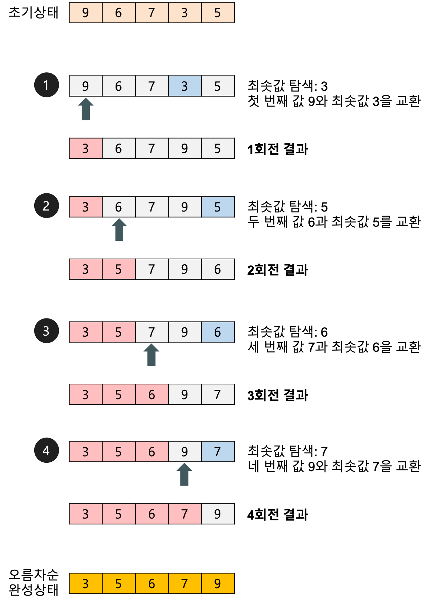

# 알고리즘-정렬

날짜: 2026/06/19
과목: 알고리즘
Status: In progress

# 정렬 알고리즘

n개의 숫자가 입력으로 주어졌을 때, 이를 사용자가 지정한 기준에 맞게 정렬하는 알고리즘

---

## 선택 정렬 (Selection Sort)

전체 배열에서 최솟값을 찾아 맨 앞 원소와 교환하고, 그 다음 위치부터 반복하는 방식

**기본 로직**

1. 정렬되지 않은 인덱스의 맨 앞부터, 이를 포함한 이후 배열값 중 가장 작은 값을 찾는다.
2. 가장 작은 값을 찾으면, 그 값을 현재 인덱스의 값과 교환한다.
3. 다음 인덱스에서 위 과정을 반복한다.

| 케이스 | 시간복잡도 |
| --- | --- |
| 최선 | O(n²) |
| 평균 | O(n²) |
| 최악 | O(n²) |
| 공간복잡도 | O(1) |

#### 예시



#### 코드

```python
arr = [9,6,7,3,5]

def selection_sort(arr):
    n = len(arr)
    for i in range(n):
        min_idx = i
        for j in range(i + 1, n):
            if arr[j] < arr[min_idx]:
                min_idx = j
        arr[i], arr[min_idx] = arr[min_idx], arr[i]
    return arr

print(selection_sort(arr))
```

---

## 삽입 정렬 (Insertion Sort)

현재 원소를 이미 정렬된 앞부분의 적절한 위치에 삽입해 나가는 방식

**기본 로직**

1. 두 번째 원소부터 시작해 현재 원소(key)를 꺼낸다.
2. key보다 큰 앞쪽 원소들을 한 칸씩 오른쪽으로 밀어낸다.
3. 빈 자리에 key를 삽입하고, 다음 원소에서 위 과정을 반복한다.

| 케이스 | 시간복잡도 |
| --- | --- |
| 최선 | O(n) |
| 평균 | O(n²) |
| 최악 | O(n²) |
| 공간복잡도 | O(1) |

> 💡 이미 정렬된 배열에 가까울수록 빠르다 (최선 O(n))
> 

#### 예시


#### 코드

```python
def insertion_sort(arr):
    for i in range(1, len(arr)):
        key = arr[i]
        j = i - 1
        while j >= 0 and arr[j] > key:
            arr[j + 1] = arr[j]
            j -= 1
        arr[j + 1] = key
    return arr

print(insertion_sort([5,1,2,3,-2,6]))
```

---

## 버블 정렬 (Bubble Sort)

인접한 두 원소를 비교해 순서가 잘못되어 있으면 교환하는 과정을 반복하는 방식

**기본 로직**

1. 배열의 첫 번째 원소부터 인접한 두 원소를 비교해, 앞이 더 크면 교환한다.
2. 한 번의 순회가 끝나면 가장 큰 값이 배열 맨 뒤에 확정된다.
3. 확정된 뒤쪽을 제외하고 위 과정을 반복한다. 한 번도 교환이 없으면 조기 종료한다.

| 케이스 | 시간복잡도 |
| --- | --- |
| 최선 | O(n) |
| 평균 | O(n²) |
| 최악 | O(n²) |
| 공간복잡도 | O(1) |


```python
arr = [7,4,5,1,3]

def bubble_sort(arr):
    n = len(arr)
    for i in range(n):
        swapped = False
        for j in range(0, n - i - 1):
            if arr[j] > arr[j + 1]:
                arr[j], arr[j + 1] = arr[j + 1], arr[j]
                swapped = True
        if not swapped:  # 교환이 없으면 이미 정렬된 상태
            break
    return arr

print(bubble_sort(arr)) # [1, 3, 4, 5, 7]
```

---

## 합병 정렬 (Merge Sort)

배열을 절반씩 나눠 재귀적으로 정렬한 뒤, 두 정렬된 배열을 하나로 합병하는 분할 정복 방식

**기본 로직**

1. 배열을 절반으로 나눈다. 원소가 1개가 될 때까지 재귀적으로 반복한다.
2. 두 정렬된 부분 배열을 앞에서부터 비교하며 더 작은 값을 새 배열에 순서대로 담는다.
3. 남은 원소를 그대로 이어 붙여 합병된 배열을 반환한다.

| 케이스 | 시간복잡도 |
| --- | --- |
| 최선 | O(n log n) |
| 평균 | O(n log n) |
| 최악 | O(n log n) |
| 공간복잡도 | O(n) |

> 💡 항상 O(n log n)을 보장하지만, 추가 메모리(O(n))가 필요하다
> 

#### 예시


#### 코드

```python
from collections import deque

arr = [21,10,12,20,25,13,15,22]

def divide(arr):
    if len(arr) <= 1:
        return arr
    
    mid = len(arr) // 2
    left = divide(arr[:mid])
    right = divide(arr[mid:])

    return combine(left, right)

def combine(left, right):
    left_dq = deque(left)
    right_dq = deque(right)
    res = []
    
    while left_dq and right_dq:
        if left_dq[0] <= right_dq[0]:
            res.append(left_dq.popleft())
        else:
            res.append(right_dq.popleft())

    res.extend(left_dq)
    res.extend(right_dq)

    return res

print(divide(arr)) # [10, 12, 13, 15, 20, 21, 22, 25]
```

---

## 퀵 정렬 (Quick Sort)

피벗을 기준으로 작은 값은 왼쪽, 큰 값은 오른쪽으로 분할한 뒤 재귀적으로 정렬하는 분할 정복 방식

| 케이스 | 시간복잡도 |
| --- | --- |
| 최선 | O(n log n) |
| 평균 | O(n log n) |
| 최악 | O(n²) |
| 공간복잡도 | O(log n) |

> ⚠️ 이미 정렬된 배열에서 첫 번째 원소를 피벗으로 선택하면 최악 O(n²) 발생
예시): 이미 정렬된 배열 `[1,2,3,4,5]`, 첫 원소를 피벗
> 
> 
> ```jsx
> [1,2,3,4,5]  피벗=1
> → left:[]  right:[2,3,4,5]   ← 1개 vs 4개로 분할
> 
> [2,3,4,5]  피벗=2
> → left:[]  right:[3,4,5]     ← 1개 vs 3개
> 
> [3,4,5]  피벗=3
> → left:[]  right:[4,5]       ← 1개 vs 2개
> 
> ...
> ```
> 

#### 예시


#### 코드

```python
arr = [5, 3, 8, 4, 9, 1, 6, 2, 7]

def quick_sort(arr):

    if len(arr) <= 1:
        return arr
    
    pivot = arr[0]
    low = 1
    high = len(arr) -1
    
    left = []
    mid = [pivot]
    right = []

    while low <= high: # 역전되면 while문 종료
        if arr[low] < pivot:
            left.append(arr[low])
        elif arr[low] == pivot:
            mid.append(arr[low])
        else:
            right.append(arr[low])   
        if low != high: # low = high면 같은 원소 두번 처리 x
            if arr[high] < pivot:
                left.append(arr[high])
            elif arr[low] == pivot:
                mid.append(arr[high])
            else:
                right.append(arr[high])   
    
        low += 1
        high -= 1

    return quick_sort(left) + mid + quick_sort(right)

print(quick_sort(arr))
```

---

## 힙 정렬 (Heap Sort)

- 최대 힙 트리나 최소 힙 트리를 구성해 정렬하는 방법
- 내림 차순 정렬을 위해서는 최대힙, 오름차순 정렬을 위해서는 최소힙을 구성하면 된다.

#### 기본로직

| 케이스 | 시간복잡도 |
| --- | --- |
| 최선 | O(n log n) |
| 평균 | O(n log n) |
| 최악 | O(n log n) |
| 공간복잡도 | O(1) |

> 💡 추가 메모리 없이 항상 O(n log n)을 보장한다
> 

#### 삭제 연산

- 코드에선 실제로 삭제는 하진않지만 범위를 줄이면서 영역을 점점 확정해 나가는 것으로 삭제를 대체


#### 코드

```python
arr = [3, 5, 2, 7, 4, 6, 1, 2, 9, 3]

def heap_sort(arr):

    n = len(arr)

    # 최대힙
    for i in range(n // 2 -1, -1, -1):
        arr[0], arr[i] = arr[i], arr[0]
        heapify(arr, n , i)
    
    print(f'최대힙 만들기: {arr} ')

    # 루트를 꺼내 정렬
    for i in range(n - 1, 0, -1):
        arr[0], arr[i] = arr[i], arr[0]
        heapify(arr, i, 0)
    return arr

def heapify(arr, n, i):

    largest = i
    left = 2 * i + 1
    right = 2 * i + 2

    if left < n and arr[left] > arr[largest]:
        largest = left
    if right < n and arr[right] > arr[largest]:
        largest = right
    
    if largest != i:
        arr[i], arr[largest] = arr[largest], arr[i]
        heapify(arr, n, largest)

print(heap_sort(arr)) 
```

---

## 알고리즘 시간복잡도 비교

| 알고리즘 | 최선 | 평균 | 최악 | 공간복잡도 | 안정 정렬 |
| --- | --- | --- | --- | --- | --- |
| 선택 정렬 | O(n²) | O(n²) | O(n²) | O(1) | ❌ |
| 삽입 정렬 | O(n) | O(n²) | O(n²) | O(1) | ✅ |
| 버블 정렬 | O(n) | O(n²) | O(n²) | O(1) | ✅ |
| 합병 정렬 | O(n log n) | O(n log n) | O(n log n) | O(n) | ✅ |
| 퀵 정렬 | O(n log n) | O(n log n) | O(n²) | O(log n) | ❌ |
| 힙 정렬 | O(n log n) | O(n log n) | O(n log n) | O(1) | ❌ |

---

## 💡 파이썬 `sorted`의 정렬 알고리즘: Timsort

#### 새로운 정렬의 등장 배경

정렬 알고리즘들의 평균 시간 복잡도가 비교적 빠른 알고리즘은  Merge sort, Heap sort, Quick sort로

평균적으로 *O*(*n*log*n) 이다.*

이 중에서 제일 좋은 알고리즘은 추가 메모리도 들지 않는 Heap sort 가 가장 성능이 좋은 알고리즘이 아닐까 라는 생각이 들 수 있잠난 평균 시간 복잡도가 *O*(*n*log*n)* 이라는 의미를 좀 더 자세히 볼 필요학 있다.

시간 복잡도가  *O*(*n*log*n)*이라는 말은 실제 동작 시간이  C * nlogn + a 라는 의미이다.

- α - 상수항 :  n에 **무관하게** 고정으로 드는 시간.
- C - 상수 계수:  nlogn 연산 **1번당 실제로 드는 시간**. 캐시 히트율, 메모리 접근 방식, 언어/하드웨어 성능, 알고리즘 구현 방식 등

상대적으로 무시할 수 있는 $a$ 부분을 제외하면 실제로 알고리즘의 시간 복잡도는 C라는 값에 의해 큰 차이가 생기는 것을 알 수 있다. 이 C라는 값에 큰 영향을 끼치는 요소로  '알고리즘이 **참조 지역성(Locality of reference)** 원리를 얼마나 잘 만족하는가'가 있다.

> **참조 지역성 원리란,** CPU가 미래에 원하는 데이터를 예측하여 속도가 빠른 장치인 캐시 메모리에 담아 놓는데 이때의 예측률을 높이기 위하여 사용하는 원리
최근에 참조한 메모리나 그 메모리와 인접한 메모리를 다시 참조할 확률이 높다는 이론을 기반으로 캐시 메모리에 담아놓는 것
> 

메모리를 연속으로 읽는 작업은 캐시 메모리에서 읽어오기에 빠른 반면, 무작위로 읽는 작업은 메인 메모리에서 읽어오기에 속도의 차이가 있다.

Heap sort : 한 위치에 있는 요소를 해당 요소의 인덱스 두 배 또는 절반인 요소와 반복적으로 비교하기에 캐시 메모리에서는 예측하기가 매우 어렵다. → 상대적으로 C 값 큼

Merge sort : 인접한 덩어리를 병합하기에 참조 지역성의 원리를 어느 정도 잘 만족하나, 입력 배열 크기만큼의 메모리를 추가로 사용한다는 단점이 있다.

Quick sort : pivot 주변에서 데이터의 위치 이동이 빈번하게 발생하여 참조 지역성이 좋으며 메모리를 추가로 사용하지 않는다.  → C의 값이 상대적으로 제일 작음 그러나 pivot을 선정하는 방법에 따라 최악의 O(n2) 이 될 수 있음

이처럼 모든 정렬 알고리즘은 장단점이 있어 어떤 한 정렬이 탁월하게 좋다고 선택할 수 없다.

#### Timsort

- 2002년 소프트웨어 엔지니어 Tim Peters에 의하여 Tim sort의 의해 등장
- **합병 정렬 + 삽입 정렬**
- 파이썬 내장 `sorted()`와 `list.sort()`는 내부적으로 **Timsort** 알고리즘을 사용한다.
- 추가 메모리는 사용하지만 기존의 Merge sort에 비해 적은 추가 메모리를 사용하여 다정렬 알고리즘의 단점을 최대한 극복

#### 시간복잡도

|  | 시간복잡도 | 공간복잡도 | 안정 정렬 |
| --- | --- | --- | --- |
| Timsort | O(n) ~ O(n log n) | O(n) | ✅ |

### 기본원리

#### 아이디어

- Insertion sort의 상수 : $C_i$
- Quick sort의 상수 : $C_q$

```jsx

작은 n일 때: Ci × n² < Cq × n log n
            (Insertion sort가 더 빠름)
```

#### Tim sort의 발상

```jsx
전체 배열 → 2^x개씩 작은 덩어리로 자름
         → 각 덩어리를 Insertion sort로 정렬 (작아서 빠름)
         → 정렬된 덩어리들을 Merge sort처럼 병합
```

왜 절약되는가

```jsx
Merge sort 병합 단계:  n개 → 2개씩 → 4개씩 → 8개씩 → ... → n개  (총 log n 단계)

Tim sort:  2^x개씩 미리 Insertion sort로 정렬해둠
           → 병합 단계가 x단계만큼 이미 끝난 상태에서 시작
           → 남은 병합 단계 = (log n - x)
```

결과

```jsx
Merge sort:  Cm × n log n
Tim sort:    Cm × n(log n - x) + α
                        ↑
                  여기서 x만큼 절약
```

#### Tim sort의 최적화 기법

- 실제 데이터는 완전히 무작위가 아니라 부분적으로 정렬된 구간(run)이 많다는 점을 활용

자세한 내용이 궁금하다면 출처의 NAVER D2 블로그 참고

#### 출처

(Naver D2)[https://d2.naver.com/helloworld/0315536]

(HwaToo/기본정렬알고리즘요약)[https://hsp1116.tistory.com/33]

(MacKer/C++삽입 정렬 알고리즘)[https://medium.com/@mackertech/c-%EC%82%BD%EC%9E%85-%EC%A0%95%EB%A0%AC-%EC%95%8C%EA%B3%A0%EB%A6%AC%EC%A6%98-5c73d3043cc0]

(Heejeong Kwon/힙정렬이란?)[https://gmlwjd9405.github.io/2018/05/10/algorithm-heap-sort.html]