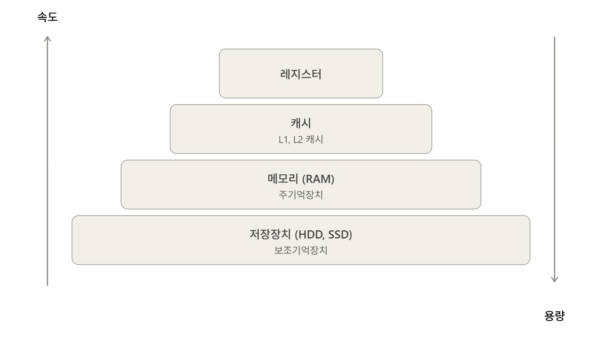

# 메모리 (Memory)

> 컴퓨터에서 정보를 처리하기 위해 정보를 보관하는 기억장치
> 

---

# 1. 메모리 계층

메모리 계층은 **레지스터, 캐시, 주기억장치(RAM), 보조기억장치(디스크)** 로 구성된다.

계층 구조에서 위쪽으로 올라갈수록 CPU가 더 빨리 접근할 수 있지만, 그만큼 비용이 많이 들고 저장 용량이 작다.

> 💡 **계층이 존재하는 이유는?**
> 
> 
> **1. 속도 향상**
> 
> - **지역성(locality) 원리**: 한 번 접근한 데이터는 곧 다시 접근할 가능성이 높다.
> - 자주 쓰는 데이터를 작고 빠른 캐시에 올려두면, 매번 느린 메모리까지 가지 않고 빠르게 접근할 수 있다.
> 
> **2. 비용 효율성**
> 
> - 빠른 메모리(캐시)일수록 비싸고, 느린 메모리(RAM, 디스크)일수록 저렴하다.
> - 모든 데이터를 비싼 캐시에 저장하면 비용을 감당할 수 없다.
> - 자주 쓰는 데이터만 소량의 비싼 캐시에, 나머지는 저렴한 대용량 저장소에 배치 → **성능과 비용의 균형**

> 💡 **왜 빠를수록 용량이 작고 비싼가?**
빠른 만큼 회로가 복잡해서(SRAM은 1비트당 트랜지스터 6개), 같은 면적에 적은 용량밖에 넣지 못한다 → 비트당 생산 단가가 올라간다.
> 

## 1.1 레지스터 (Register)

> CPU가 요청을 처리하는 데 필요한 데이터를 일시적으로 저장하는 기억장치
> 
- CPU 내부에 위치한 초고속 메모리로, CPU가 바로 사용할 데이터(소량의 데이터, 처리 중인 중간 결과)를 담는다.
- CPU의 4대 기능(기억, 해석, 연산, 제어) 중 **"기억(임시 저장)"을 담당**하는 요소다. (해석은 제어장치, 연산은 ALU의 몫)
- **ALU는 자체 저장 기능이 없는 순수 연산 회로**다. 따라서 연산 대상 데이터는 반드시 메모리에서 **레지스터로 먼저 적재**되어야 하며, 연산 결과도 레지스터에 저장된 후 메모리로 기록된다.
- 레지스터는 데이터 값 자체를 담거나, 메모리 주소를 가리키는 용도로 사용된다.

## 1.2 캐시 (Cache)

> 데이터를 미리 복사해 놓는 임시 저장소. **빠른 장치와 느린 장치의 속도 차이로 인한 병목 현상을 줄이기 위한 메모리**
> 

### 특징

- CPU와 메모리(RAM)의 속도 차이가 너무 크기 때문에, 그 중간에 **캐시 계층**을 둬서 속도 차이를 완화한다.
- 이렇게 속도 차이를 해결하기 위해 계층과 계층 사이에 두는 계층을 **캐싱 계층**이라고 한다.
- 캐싱 계층은 상대적인 개념이다:
    - **캐시 메모리** = 주기억장치(RAM)의 캐시 (자주 쓰는 RAM 데이터를 미리 복사)
    - **주기억장치(RAM)** = 보조기억장치(디스크)의 캐시 (자주 쓰는 디스크 데이터를 미리 복사)

### 캐시 히트와 캐시 미스

- **캐시 히트(cache hit)**: 캐시에서 원하는 데이터를 찾은 경우 → 빠르게 접근
- **캐시 미스(cache miss)**: 캐시에 데이터가 없어 주 메모리까지 가서 데이터를 가져오는 경우

### 캐시 매핑 (Cache Mapping)

> 메모리의 데이터를 캐시의 어느 위치에 둘지 결정하는 방법
> 

| 방식 | 개념 | 장점 | 단점 |
| --- | --- | --- | --- |
| **직접 매핑** (Direct Mapping) | 메모리 블록마다 들어갈 수 있는 캐시 라인이 **하나로 고정** (예: `블록 번호 % 캐시 라인 수`) | 찾을 위치가 정해져 있어 검색이 빠르고 회로가 단순 | 같은 라인에 매핑되는 블록끼리 **충돌이 잦음** |
| **연관 매핑** (Associative Mapping) | 메모리 블록이 캐시의 **아무 라인에나** 들어갈 수 있음 | 충돌이 적음 | 데이터를 찾으려면 **모든 라인을 탐색**해야 해서 느리고 회로가 비쌈 |
| **집합 연관 매핑** (Set-Associative Mapping) | 둘의 절충. 캐시를 여러 **집합(set)** 으로 나누고, 블록은 정해진 집합에 매핑되되 **집합 안에서는 아무 자리나** 사용 | 검색 범위가 집합 내부로 제한되어 효율적이면서 충돌도 완화 | — |

→ 실제 CPU 캐시는 대부분 **집합 연관 매핑**을 사용한다.

> 💡 **캐시에 무엇을 남길지 결정하는 판단 기준 = 지역성(Locality)**
> 
> 
> 
> | 지역성 | 판단 기준 | 실제 설계에 적용된 형태 |
> | --- | --- | --- |
> | **시간 지역성** | 최근 쓴 데이터는 또 쓴다 | 캐시에서 안 지우고 유지, LRU 교체 정책 |
> | **공간 지역성** | 근처 데이터도 곧 쓴다 | 블록 단위(캐시 라인)로 미리 가져오기 (prefetch) |

## 1.3 주기억장치 (메인 메모리)

> 컴퓨터에서 수치, 명령, 자료 등을 기억하는 하드웨어 장치
> 

### RAM (Random Access Memory)

- 빠른 접근을 위해 데이터를 단기간 저장하는 구성 요소
- 사용자가 요청하는 프로그램이나 문서를 디스크에서 메모리로 **로드**하여 접근한다.
- **휘발성** 기억장치 (전원 종료 시 기억된 내용 삭제)
- "Random Access" = **어느 위치든 똑같은 속도로** 접근하여 읽고 쓸 수 있다는 의미
- 전원이 유지되는 동안 CPU의 연산 및 동작에 필요한 내용을 저장

### ROM (Read Only Memory)

- 컴퓨터에 지시사항을 영구히 저장하는 **비휘발성** 메모리 (고정 기억장치)
- 변경 가능성이 희박한 기능 및 부품에 사용 (예: 부팅 펌웨어)

## 4. 보조기억장치

> 전원이 꺼져도 데이터가 지워지지 않는 **영구 저장장치**. HDD, SSD가 있다.
> 
- **비휘발성**
- 속도는 느림
- 기억 용량은 큼

---

# 2. 메모리 관리

## 2.1 가상 메모리 (Virtual Memory)

> 실제로 이용 가능한 메모리 자원을 **추상화**하여, 사용자에게 매우 큰 메모리로 보이게 만드는 메모리 관리 기법
> 

### 핵심 개념

- 가상적으로 주어진 주소를 **가상 주소(virtual address, 논리 주소 logical address)**, 실제 메모리상의 주소를 **물리 주소(physical address)** 라고 한다.
- 가상 주소는 **MMU(Memory Management Unit, 메모리관리장치)** 에 의해 물리 주소로 변환된다. 덕분에 프로그램은 실제 주소를 의식할 필요 없이 작성될 수 있다.
- 가상 주소와 물리 주소의 매핑 정보, 프로세스의 주소 정보는 **페이지 테이블(page table)** 로 관리된다. 이때 속도 향상을 위해 **TLB**를 사용한다.

<aside>
💡 **TLB (Translation Lookaside Buffer)**

가상 주소 → 물리 주소 변환 속도를 높여주는 **캐시 메모리**. CPU가 최근 접근한 (page, frame) 쌍을 저장한다.

**왜 필요한가?** 페이지 테이블은 메모리에 저장되므로, TLB가 없으면 CPU는 메모리에 **두 번** 접근해야 한다. 메모리 접근은 CPU 입장에서 이미 느린 작업인데, 그걸 매번 2배로 하면 성능이 반토막 남

예시) CPU: "가상 주소 0x1234의 데이터를 읽자"

1.  RAM에 접근 → 페이지 테이블에서 물리 주소 조회   ← 메모리 접근 1회
2.  RAM에 접근 → 그 물리 주소에서 실제 데이터 읽기   ← 메모리 접근 2회

변환 시 **TLB부터 확인**하고, 없을 때만 페이지 테이블로 간다. → 메모리 접근 횟수 절감
(앞에서 배운 캐싱 개념이 주소 변환에 그대로 적용된 것!)

### 위치로 정리하면

| 구성 요소 | 위치 |
| --- | --- |
| 페이지 테이블 본체 | **RAM** (커널이 관리하는 영역) |
| 페이지 테이블의 시작 주소 | **CPU 레지스터** (CR3/PTBR) |
| 자주 쓰는 변환 결과 (page → frame) | **TLB** (CPU 내부의 캐시) |
</aside>

### 프로세스 관점에서 본 가상 주소

- 각 프로세스는 **자신만의 독립적인 가상 주소 공간**을 가진다.
- 가상 주소는 물리 메모리 주소와 직접적인 관계가 없으며, 각 프로세스의 **별도 페이지 테이블**에 의해 서로 다른 물리 메모리 영역에 매핑된다.
- 가상 주소는 해당 프로세스 안에서만 유효하므로, **두 프로세스가 같은 가상 주소를 써도 충돌하지 않는다.**

**예시: 프로세스 A, B의 실행과 재실행**

| 시점 | 프로세스 A | 프로세스 B |
| --- | --- | --- |
| 처음 실행 | 가상 0x0000 → 물리 0x2000 | 가상 0x1000 → 물리 0x3000 |
| 종료 | 가상 주소 공간·페이지 테이블 해제 | 〃 |
| 재실행 | 가상 0x0000 → 물리 **0x4000** (달라질 수 있음) | 가상 0x1000 → 물리 **0x5000** |

→ 가상 주소가 같아도 물리 주소는 실행할 때마다 달라질 수 있다. OS는 가상 주소를 자유롭게 재사용한다.

## 2.2 페이지 폴트 (Page Fault)

> 프로세스가 참조하려는 페이지가 **현재 물리 메모리(RAM)에 없을 때** 발생하는 현상
> 

가상 메모리는 작은 물리 메모리를 크게 보이게 하는 기법이므로, 참조하려는 영역이 실제 메모리에 없을 수 있다. 또한 OS는 프로세스 전체를 한 번에 RAM에 올리지 않고 **처음에 필요한 부분만** 올리기 때문에(→ Demand Paging), 페이지 폴트는 자연스럽게 발생한다.

### 페이지 폴트 처리 과정

1. 페이지 폴트 발생 → **OS에게 trap 전송**. OS는 먼저 유효한 접근인지 점검한다. 비정상적인 접근이라면 프로세스를 강제 종료할 수 있다.
2. OS는 물리 메모리에 **빈 프레임**이 있는지 확인한다.
3. **빈 프레임이 있는 경우**: 디스크에서 필요한 페이지를 바로 메모리에 적재한다(**Swap-in**). 기존 페이지를 내보내는 작업은 없다.
4. **빈 프레임이 없는 경우**:
    - **페이지 교체 알고리즘**을 수행하여 내보낼 페이지를 선택한다.
    - 선택된 페이지를 디스크로 내보낸다 (**Swap-out**)
    - 확보된 빈 프레임에 필요한 페이지를 디스크에서 가져온다 (**Swap-in**)

> 📌 **디스크 I/O는 매우 느리다**
> 
> - 메모리 접근: 수백 나노초(ns)
> - 디스크 접근: 수 밀리초(ms) = 수백만 나노초
> 
> 페이지 폴트가 자주 발생할수록 CPU는 일을 못 하고 대기하게 되어 CPU 이용률이 저하된다. → 스레싱의 원인
> 

> 📌 **스와핑(Swapping)과 스왑 영역**
> 
> - **Swap-in**: 디스크 → 메모리 / **Swap-out**: 메모리 → 디스크
> - 두 과정을 합쳐(또는 각각) 스와핑이라 부른다.
> - 물리 메모리가 부족할 때 사용하지 않는 페이지를 옮겨 저장하는 디스크의 특정 영역을 **스왑 영역**이라고 한다.

## 2.3 페이지 히트 / 페이지 미스

- **페이지 히트(Page Hit)**: 요청한 페이지가 이미 메모리에 적재되어 있어 바로 접근 가능한 상황
- **페이지 미스(Page Miss)**: 요청한 페이지가 메모리에 없는 상황

## 2.4 스레싱 (Thrashing)

> 실제 프로세스 실행보다 **스와핑 작업에 대부분의 시간이 소요되는 현상**
> 

### 발생 메커니즘 (악순환)

1. 메모리가 부족해 페이지 폴트가 빈번하게 발생
2. 디스크 ↔ 메모리 스와핑이 과도하게 일어남
3. CPU는 연산 대신 스와핑 대기 상태에 머무름 → **CPU 이용률 저하**
4. OS는 낮은 CPU 이용률을 보고 "일이 없나?" 판단하여 **추가 프로세스를 메모리에 적재**
5. 가뜩이나 부족한 메모리가 더 압박됨 → 1번으로 돌아가 악순환

### 해결 방법

**하드웨어적 해결**: 메모리 증설, HDD → SSD 교체

**운영체제 차원의 해결**:

#### 1. 작업 세트 (Working Set)

프로세스의 **과거 사용 이력을 기반**으로 자주 사용하는 페이지 집합을 만들어, 한꺼번에 미리 메모리에 로드하는 것. 자주 접근하는 페이지들이 이미 메모리에 있으므로 페이지 폴트 발생 가능성이 줄어든다.

#### 2. PFF (Page Fault Frequency)

각 프로세스의 **페이지 폴트 발생 빈도를 모니터링**하여 메모리 프레임 할당량을 동적으로 조절하는 방법.

- **상한선 초과**: 페이지 폴트가 너무 잦다 → 프레임을 **더 할당**하여 작업 세트 확장
- **하한선 미달**: 페이지 폴트가 거의 없다 → 일부 프레임을 **회수**하여 다른 프로세스에 재할당

## 2.5 가상 메모리의 장점

**1. 메모리의 효율적 사용 - Demand Paging (요구 페이징)**
프로그램 실행 시 모든 데이터를 한꺼번에 적재하지 않고, 실제로 필요한 시점에 해당 페이지만 동적으로 불러온다. 제한된 RAM에서도 대용량 프로그램을 실행할 수 있다.

**2. 메모리 과잉 할당 가능**
각 프로세스에 실제 RAM보다 훨씬 큰 가상 주소 공간을 할당할 수 있다. (예: 8GB RAM에서 5.49GB짜리 게임과 다른 프로그램들을 전부 통째로 올려야 한다면 끔찍하다!)

**3. 프로세스 간 메모리 보호**
각 프로세스는 독립적인 가상 주소 공간을 가지며, 같은 가상 주소라도 다른 물리 영역에 매핑된다. → 오류나 악의적 접근이 한 프로세스에 국한되어 다른 프로세스에 영향을 주지 않는다.

**4. 메모리 접근 제어**
메모리를 일정 크기의 **페이지** 단위로 나누어 관리하며, 페이지별로 읽기/쓰기/실행 권한을 설정할 수 있다. → 권한 없는 접근이 즉시 감지·차단되어 버퍼 오버플로우, 코드 인젝션 같은 보안 위협을 예방한다.

## 2.6 페이지 교체 알고리즘 (Page Replacement Algorithm)

> 스와핑이 일어날 때 어떤 페이지를 내보낼지 결정하는 알고리즘. 목표는 **스와핑(페이지 폴트)을 최소화**하는 것.
> 

### 1. 오프라인 알고리즘 (LFD, Longest Forward Distance)

> **가장 늦게 다시 참조될(또는 더 이상 참조되지 않을) 페이지**를 교체하는, 이론상 최적의 알고리즘
(OPT, MIN, LFD(Longest Forward Distance) 등으로 불림)
> 

- **미래의 참조 순서를 전부 알아야** 하므로 실제 시스템에서는 구현 불가능하다.
- 대신 **다른 알고리즘의 성능을 비교하는 상한선(벤치마크)** 역할을 한다.
- 실현 가능한 대안: LRU, LFU 등

### 2. FIFO (First In First Out)

- **가장 먼저 들어온 페이지부터** 교체하는 방법
- 구현이 단순하지만, 오래됐어도 자주 쓰이는 페이지를 내보낼 수 있어 비효율적일 수 있다.

### 3. LRU (Least Recently Used)

- **가장 오래전에 참조된 페이지**를 교체하는 방법 (시간 지역성 활용)
- 각 페이지의 참조 시점을 추적하는 자료구조가 필요할 수 있다.

### 4. NUR / NRU (Not Used Recently)

- NUR 페이지 교체 알고리즘은 페이지 교체 시점에 최근에 사용되지 않은 페이지를 교체하는 방식
- NUR 알고리즘은 LRU(Least Recently Used) 알고리즘의 근사치로서, 구현이 간단하고 성능이 비교적 우수하다
- 이 알고리즘은 각 페이지에 대해 두 가지 정보를 사용
    - **참조 비트(Reference Bit)** : 페이지가 최근에 참조되었는지 여부를 나타내는 비트.
    - **수정 비트(Modified Bit) :** 페이지가 최근에 수정되었는지 여부를 나타내는 비트
- 이 두 비트의 조합을 통해 페이지 교체 우선순위를 정한다.

#### 우선순위

- 일반적으로 참조 비트가 0인 페이지를 먼저 고려하며, 그 중에서도 수정 비트가 0인 페이지를 최우선으로 교체힌디.
- (0,0) → (0, 1) → (1,0) → (1, 1)

| 참조 비트 | 수 비트 |  |
| --- | --- | --- |
| 0 | 0 | 최근에 참조 X, 수정되지 않은 페이지 |
| 0 | 1 | 최근에 참조 X, 수정된 페이지 |
| 1 | 0 | 최근에 참조 O, 수정되지 않은 페이지 |
| 1 | 1 | 최근에 참조 O, 수정된 페이지 |

### 5. LFU (Least Frequently Used)

- **참조 횟수가 가장 적은 페이지**를 교체하는 방법

> 📌 동률 처리 기준(tie-break)은 구현마다 다를 수 있다. 시험 문제에서는 문제가 제시하는 기준을 따를 것!
> 

### 출처

---

https://brightstarit.tistory.com/14

https://server-technology.tistory.com/450

https://velog.io/@chappi/OS%EB%8A%94-%ED%95%A0%EA%BB%80%EB%8D%B0-%ED%95%B5%EC%8B%AC%EB%A7%8C-%ED%95%A9%EB%8B%88%EB%8B%A4.-17%ED%8E%B8-%ED%8E%98%EC%9D%B4%EC%A7%80-%EA%B5%90%EC%B2%B4-%EC%95%8C%EA%B3%A0%EB%A6%AC%EC%A6%98FIFO-LRU-LFU-NUR-2%EC%B0%A8-%EA%B8%B0%ED%9A%8C-%EC%95%8C%EA%B3%A0%EB%A6%AC%EC%A6%98-%EC%8B%9C%EA%B3%84-%EC%95%8C%EA%B3%A0%EB%A6%AC%EC%A6%98