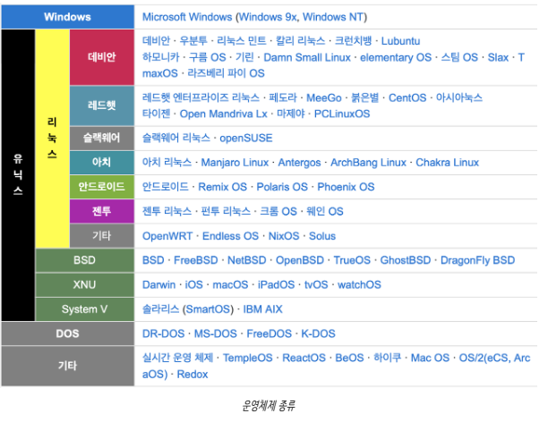

# 운영체제와 컴퓨터

날짜: 2026/07/06
과목: 운영체제
Status: In progress

# 운영체제란?

- 운영체제(Operating System, OS)는 사용자가 컴퓨터를 쉽게 다루고 해주는 인터페이스
- 또한 컴퓨터 시스템의 자원을 효율적으로 관리하는 일종의 소프트웨어



## 운영체제의 역할

1. CPU 스케줄링과 프로세스 관리
    1. CPU 소유권을 어떤 프로세스에 할당할지, 프로세스의 생성과 삭제, 자원 할당 및 반환을 담당
2. 메모리 관리
    1. 한정된 메모리를 어떤 프로세스에 얼만큼 할당해야 하는지 관리
3. 디스크 파일 관리
    1. 디스크 파일을 어떤 방법으로 보관활지 관리
4. I/O 디바이스 관리
    1. I/O 디바이스들인 키보드, 컴퓨터 간에 데이터를 주고받는 것을 관리

<aside>
💡

**프로세스(Process) :**  보조기억장치에 저장된 정적인 '프로그램'이 메모리에 적재되어 CPU에서 실행되는 활성화된 동적 상태. 

작업의 기본 단위로, 운영체제는 이들을 독립적으로 관리

**“프로세스는 데이터와 명령어의 모임”**

</aside>

## 운영체제의 구조

- 응용 프로그램이나 유틸리티 같은 유저 프로그램이 맨 위에 있음
- GUI, CUI → 시스템콜 → 커널 → 드라이버순으로 있는데 이부분을 바로 운영체제라 한다.


### 1. GUI

- 사용자가 전자 장치와 상호작용 할 수 있도록 하는 인터페이스
- CUI : 그래픽이 아닌 명령어로 처리하는 인터페이스

---

### 2. 커널(Kernel)과 시스템 콜(System Call)

### 2.1 Kernel

> 메모리 관리, 하드웨어 제어 등 컴퓨터의 모든 내부 자원을 관리하는 **OS의 핵심(알맹이)**
> 
- System Call 인터페이스를 제공하며 보안, 메모리, 프로세스, 파일시스템 , I/O 디바이스, I/O 요청 관리 등 **운영체제에서 중추적인 역할**을 한다.
- 따라서 **커널의 안정성과 보안성이 곧 운영체제 전체의 안정성과 보안성을 결정**한다.

#### 유저 모드 vs 커널 모드

> 시스템 콜을 이해하려면 먼저 **"왜 일반 프로그램은 하드웨어를 직접 못 건드리는가"**부터 알아야 한다.
> 

파일 읽기, 화면 출력 같은 작업은 하드웨어를 직접 다뤄야 하는 작업이다. 이런 위험한 명령을 아무 프로그램이나 실행할 수 있다면, 해커가 악의적으로 하드웨어를 조작하거나 초보 사용자의 실수 하나로 시스템 전체가 망가질 수 있다.

그래서 CPU는 **모드 비트(mode bit)** 로 실행 권한을 두 단계로 구분한다.

| 구분 | 모드 비트 | 실행 주체 | 가능한 작업 |
| --- | --- | --- | --- |
| **유저 모드** | 1 | 일반 응용 프로그램 | 메모리 읽기, 연산 등 일반 명령만 가능 |
| **커널 모드** | 0 | 운영체제(커널) 코드 | I/O 장치 접근 등 **특권 명령** 가능 |
- **특권 명령(privileged instruction)**:  I/O 접근, 타이머 설정, 인터럽트 제어, 모드 전환처럼 시스템 전체나 다른 프로세스에 영향을 줄 수 있는 명령. 커널 모드에서만 실행 가능하다.
- 유저 모드에서 특권 명령을 무단으로 시도하면, CPU가 이를 감지하여 **예외(exception)를 발생**시키고 운영체제가 해당 프로그램을 제재한다.


---

## 3. System Call

> **응용 프로그램(유저 프로세스)이 커널의 기능을 빌려 쓰기 위한 공식 창구(인터페이스)**
> 

응용 프로그램은 특권 명령을 직접 수행할 수 없다. 그래서 파일 접근, 화면 출력 같은 작업이 필요하면 커널에게 **"이 작업 좀 대신 해주세요"** 라고 요청하는데, 이 요청이 바로 시스템 콜이다.

### 💡 비유: 구청 민원 처리

| 현실 세계 | 운영체제 |
| --- | --- |
| 시민 | 응용 프로그램 (유저 프로세스) |
| 구청 내부 서류·시설 (직접 접근 불가) | 하드웨어 자원 |
| 민원 신청 | 시스템 콜 |
| 안내 데스크 직원 | 시스템 콜 핸들러 |
| 업무 목록표 (민원 번호 → 담당 부서) | 시스템 콜 테이블 |

시민(응용 프로그램)은 구청 서류를 직접 못 만진다. 안내 데스크 직원(핸들러)이 민원 내용을 확인하고, 업무 목록표(테이블)에서 담당 부서를 찾아 처리를 연결해준다.

### 동작 원리

1. 각 시스템 콜에는 **고유 번호**가 할당된다.
2. 커널은 `{시스템 콜 번호 → 핸들러 함수 주소}` 로 구성된 **시스템 콜 테이블**을 유지한다.
3. 응용 프로그램이 시스템 콜을 호출하면 **trap(소프트웨어 인터럽트)** 이 발생하여 유저 모드 → 커널 모드로 전환된다.
4. 커널은 시스템 콜 번호를 인덱스 삼아 테이블에서 해당 루틴의 주소를 찾아 실행한다.
5. 처리가 끝나면 결과를 들고 **유저 모드로 복귀(return)** 한다.

> ⚠️ **헷갈리기 쉬운 포인트**
디스크 읽기처럼 I/O 장치가 관여하는 경우, 장치가 작업을 마치면 **하드웨어 인터럽트**로 커널에 완료를 알리는 과정이 중간에 낀다. 이는 시스템 콜의 return(모드 전환)과는 **별개의 개념**이다.
> 
> - **trap**: 프로그램이 *의도적으로* 발생시키는 소프트웨어 인터럽트 (시스템 콜)
> - **하드웨어 인터럽트**: I/O 장치 등 *하드웨어가* 발생시키는 비동기 신호 (작업 완료 알림 등)
> - **예외(exception)**: 특권 명령 무단 실행, 0으로 나누기 등 *비정상 상황*에서 발생


### 예시: `fs.readFile()`이 호출되면?

```
fs.readFile()                  ← 유저 모드 (JS/Node 라이브러리)
     ↓
open(), read() 시스템 콜 번호 + 매개변수 준비
     ↓  trap 발생 (모드 전환: 유저 → 커널)
시스템 콜 테이블에서 번호 i로 핸들러 주소 조회
     ↓
커널이 디스크 접근해서 파일 읽기 (특권 명령)
     ↓  디스크가 작업 완료 → 하드웨어 인터럽트로 커널에 알림
     ↓  return (모드 전환: 커널 → 유저)
callback(err, data) 실행
```

- `open()`: "파일을 사용할 준비를 해주세요"라고 커널에 요청하는 시스템 콜
- `read()`: 준비된 파일에서 데이터를 읽어달라고 요청하는 시스템 콜

### 시스템 콜이 필요한 이유 (정리)

- 유저 레벨 함수만으로는 파일 접근, 네트워크 통신, 장치 제어 같은 기능을 구현할 수 없다 → 반드시 커널의 도움이 필요하다.
- 커널 모드로 전환한 후에야 특권 명령을 수행할 권한이 생기며, 이 **유일하고 안전한 통로**가 시스템 콜이다.
- 이 구분 덕분에 운영체제는 위험한 작업을 통제된 방식으로만 허용할 수 있다.

---

## 4. Driver

> **커널이 하드웨어를 제어할 수 있도록 돕는 소프트웨어**
> 

커널이 세상의 모든 하드웨어(수천 종의 키보드, GPU, 프린터 등)의 제어 방법을 전부 알 수는 없다. 그래서 하드웨어 제조사가 "이 장치는 이렇게 다루세요"라는 매뉴얼 격의 소프트웨어를 제공하는데, 이것이 **드라이버**다.

```
응용 프로그램 → (시스템 콜) → 커널 → (드라이버) → 하드웨어
```

---

# 컴퓨터의 요소

> 컴퓨터는 **CPU, DMA 컨트롤러, 메모리, 타이머, 디바이스 컨트롤러** 등으로 이루어져 있다.
> 

---

## 1. CPU (Central Processing Unit)

명령어의 **해석**과 자료의 **연산**, **비교** 등의 처리를 제어하는 컴퓨터 시스템의 핵심 장치.

- CPU는 크게 **제어 장치(CU), 산술논리연산장치(ALU), 레지스터**와 각 구성 요소를 연결하는 **내부 버스**로 구성된다.
- CPU는 메모리에 적재된 명령어를 순차적으로 해석·실행하는 존재일 뿐, 스스로 판단하지 않는다.

> 💡 **CPU = 일꾼, 커널 = 관리자**
CPU는 시키는 일(메모리의 명령어)을 묵묵히 수행하는 일꾼이고, 무엇을 언제 시킬지 결정하는 관리자가 커널이다.
> 


### 1.1 제어장치 (CU, Control Unit)

- 컴퓨터 시스템의 작동을 통제하고 지시하는 장치
- 기억장치로부터 프로그램 명령을 순차적으로 꺼내 **해독**하고, 해석 결과에 따라 명령어 실행에 필요한 **제어 신호**를 기억장치, 연산장치, 입출력장치 등으로 보낸다.
- 프로그램 카운터(PC), 명령 해독기, 부호기, 명령 레지스터 등으로 구성된다.

### 1.2 레지스터 (Register)

- CPU 내부에 있는 **소규모의 초고속 기억장치**
- 명령어 주소, 연산에 필요한 데이터, 연산 결과 등을 임시로 저장한다.
- **메모리 계층의 최상위**에 위치하며 가장 빠른 속도로 접근 가능하다.
- 용도에 따라 범용 레지스터와 특수 목적 레지스터로 구분된다.

**CPU 내부 레지스터 종류**

| 레지스터 | 약어 | 역할 |
| --- | --- | --- |
| 프로그램 계수기 | PC (Program Counter) | 다음에 실행할 명령어의 주소를 저장 |
| 누산기 | AC (ACcumulator) | 연산 결과 데이터를 일시적으로 저장 |
| 명령어 레지스터 | IR (Instruction Register) | 현재 수행 중인 명령어를 저장 |
| 상태 레지스터 | SR (Status Register) | 현재 CPU의 상태를 저장 |
| 메모리 주소 레지스터 | MAR (Memory Address Register) | 메모리에서 읽거나 쓸 대상의 **주소**를 저장 |
| 메모리 버퍼 레지스터 | MBR (Memory Buffer Register) | 메모리에서 읽어온 또는 메모리에 쓸 **데이터**를 저장 |
| 입출력 주소 레지스터 | I/O AR (I/O Address Register) | 입출력 모듈의 주소를 저장 |
| 입출력 버퍼 레지스터 | I/O BR (I/O Buffer Register) | 입출력 모듈과 프로세서 간의 데이터 교환에 사용 |

### 1.3 산술논리연산장치 (ALU, Arithmetic Logic Unit)

- 명령어를 실행하기 위한 **마이크로 연산**을 수행하는 장치
- 연산에 필요한 자료를 입력받아 산술, 논리, 관계, 이동(shift) 등 다양한 연산을 수행한다.
- 가산기, 보수기, 누산기, 데이터 레지스터 등으로 구성된다.

### 1.4 CPU의 연산 과정 (명령어 사이클)

**Fetch → Decode → Execute → Writeback**

1. **Fetch (인출)**: 프로그램 카운터(PC)가 가리키는 명령어를 메모리에서 CPU로 인출하여 적재
2. **Decode (해석)**: 명령어를 해석. 명령어의 종류와 대상(타겟)을 판단
3. **Execute (실행)**: 해석된 명령어에 따라 데이터에 대한 연산을 수행
4. **Writeback (쓰기)**: 처리 완료된 데이터를 메모리에 기록

> 📌 CPU는 **각 명령어 사이클이 끝날 때마다** 인터럽트 라인이 세팅되어 있는지 검사한다. 세팅되어 있다면 다음 명령어 대신 인터럽트 처리로 넘어간다. (아래 인터럽트 참고)
> 

### 1.5 CPU의 동작 과정 (시스템 전체 관점)


1. 보조기억장치(디스크)에 저장된 프로그램이나 입력장치의 데이터를 **주기억장치(메모리)** 로 읽어온다.
2. CPU가 주기억장치의 데이터를 읽어 처리한 후, 결과를 다시 주기억장치에 저장한다.
3. 주기억장치는 연산된 데이터를 출력장치로 보내거나 보조기억장치에 저장한다.
4. 제어장치는 (1)~(3) 과정에서 명령어가 순서대로 잘 실행되도록 제어한다.

### 1.6 CPU의 명령어

#### 명령어 세트 (Instruction Set)

CPU가 실행할 명령어의 집합. 실행할 연산을 나타내는 **연산 코드(Operation Code)** 와 연산에 필요한 데이터 또는 데이터의 저장 위치를 나타내는 **피연산자(Operand)** 로 구성된다.

**연산 코드 (Operation Code)** — 기능에 따라 네 가지로 분류

- **연산 기능**: 사칙연산, 이동(shift), 보수 등의 산술연산과 논리곱, 논리합, 부정 등의 논리연산
- **제어 기능**: 조건 분기, 무조건 분기 등으로 명령어의 실행 순서를 제어
- **데이터 전달 기능**: 레지스터 ↔ 레지스터, 레지스터 ↔ 주기억장치 간 데이터 전달
- **입출력 기능**: 프로그램과 데이터를 주기억장치에 전달하고, 연산 결과를 출력장치에 전달

**피연산자 (Operand)** — 주소, 숫자/문자, 논리 데이터 등을 저장

- **주소**: 기억장치 혹은 레지스터의 주소
- **숫자/문자**: 정수, 고정/부동 소수점 수, 아스키코드 문자 등
- **논리 데이터**: 참/거짓. 비트나 플래그로 저장

---

## 2. 인터럽트 (Interrupt)

> 어떤 사건(이벤트)이 발생했을 때, CPU가 **현재 하던 일을 잠시 멈추고 그 사건을 먼저 처리하도록 알리는 신호**
> 

### 인터럽트는 왜 필요한가?

인터럽트가 없다면 CPU는 **폴링(polling)** 방식으로 동작해야 한다. 즉, "디스크야 다 읽었니?"를 CPU가 주기적으로 계속 확인해야 한다. 이러면 확인하는 동안 CPU는 다른 일을 못 하고, 확인 주기 사이에 이벤트가 발생하면 처리도 늦어진다.

인터럽트 방식에서는 반대로 **장치가 CPU에게 먼저 알려준다.** CPU는 오래 걸리는 I/O 작업을 장치에 맡겨두고 다른 일을 하다가, 장치가 "다 됐어요!"라고 인터럽트를 보내면 그때 처리하러 간다. → **CPU가 놀지 않고 효율적으로 일할 수 있다.**

<aside>
💡

**폴링(polling) :** CPU가 **주기적으로 장치의 상태를 직접 확인하러 가는 방식**

</aside>

### 인터럽트는 언제 발생하는가?

- 입출력 장치가 작업 완료를 알릴 때 **(하드웨어 인터럽트)**
- 프로그램이 시스템 콜을 호출할 때 **(소프트웨어 인터럽트, trap)**
- 0으로 나누기, 잘못된 메모리 접근 등 예외 상황이 발생할 때 **(예외, exception)**

### 인터럽트 처리 흐름


```
명령어 M 실행 중 ($1020)
  → Port H 인터럽트 발생
  → 벡터 테이블($3E4C~$3E4D) 조회 → 핸들러 주소 $107B 획득
  → $107B로 점프, ISR 실행
  → rti (복귀 명령어)
  → 명령어 N ($1022)부터 이어서 실행
```

CPU는 명령어 수행 중 인터럽트가 발생하면, **인터럽트 벡터에서 해당 인터럽트 핸들러의 주소를 조회**한 뒤 그 주소로 점프하여 **인터럽트 서비스 루틴(ISR)** 을 실행한다. 처리가 끝나면 원래 수행하던 위치로 복귀하여 다음 명령을 이어서 처리한다.

> **인터럽트 벡터**: 인터럽트 종류별로 처리해야 할 인터럽트 핸들러의 **주소를 보관하는 테이블** (시스템 콜 테이블과 같은 구조: 번호 → 핸들러 주소)
> 
> 
> **인터럽트 핸들러(ISR)**: 인터럽트를 실제로 처리하는 루틴
> 
> **IRET = Interrupt RETurn** : **"인터럽트에서 복귀하라"** 는 CPU 명령어. 모든 인터럽트 서비스 루틴(ISR)의 **마지막에 실행되는 명령어 (rti외 역할 동일)**
> 

### 인터럽트 종류

#### 소프트웨어 인터럽트 (트랩, trap)

- **소프트웨어(사용자 프로그램)가 의도적으로 발생시키는** 인터럽트
- 프로그램이 스스로 인터럽트 라인을 세팅한다.
- 대표 사례: **시스템 콜** (I/O 장치 접근 등 특권 명령이 필요한 경우)
- CPU는 각 명령어 사이클이 끝날 때마다 인터럽트 라인이 세팅되어 있는지 검사한다.

#### 하드웨어 인터럽트

- **I/O 디바이스 등 하드웨어가 발생시키는** 인터럽트
- 하드웨어 장치가 CPU에게 어떤 사실을 알려야 할 때 발생한다.
- 예: 디스크가 파일 읽기/쓰기 작업을 완료했을 때

### 인터럽트 처리 과정 (예: 프로세스 A가 디스크에서 데이터 읽기)

1. 프로세스 A가 디스크 접근을 위해 **시스템 콜을 호출** → 소프트웨어 인터럽트(trap) 발생 (시스템 콜도 인터럽트의 하나로 취급된다)
2. CPU는 현재까지 수행 중이던 상태(복귀할 PC 값, 레지스터 값, 하드웨어 상태 등)를 **PCB(Process Control Block)에 대피**시킨다.
3. **인터럽트 벡터에서 ISR 주소를 조회**하여 PC에 로드하고, ISR로 점프하여 읽기 루틴을 실행한다.
4. 처리가 끝나면 PCB에 대피시켜 둔 상태를 복원한다.
5. ISR 끝의 **IRET 명령어**로 인터럽트를 해제한다.
6. 대피시켰던 PC 값이 복원되어, 중단됐던 위치부터 프로세스를 다시 수행한다.

> 📌 2~6번 과정에서 "상태를 저장했다가 복원하는" 이 매커니즘이 곧 **컨텍스트 스위칭(context switching)** 의 기반이다. (프로세스 단원에서 자세히 다룸)
> 

---

## 3. DMA 컨트롤러 (Direct Memory Access)

> **CPU 대신** 메모리와 입출력 장치 사이의 데이터 전송을 대행하는 장치
> 

### 필요한 이유

- DMA가 없으면 CPU가 데이터를 한 바이트씩 "디스크에서 읽고 → 메모리에 쓰기"를 수만 번 반복해야 한다.
- 그동안 CPU는 다른 작업을 전혀 수행하지 못한다. → **일꾼(CPU)이 단순 운반 작업에 발이 묶이는 셈**

### 동작 방식

1. CPU가 DMA 컨트롤러에게 "디스크의 이 데이터를 메모리 여기로 옮겨라"라고 **지시만** 한다.
2. CPU는 즉시 다른 작업으로 전환한다.
3. DMA 컨트롤러가 데이터 전송을 전담 수행한다.
4. 전송 완료 시 **인터럽트를 한 번만 발생**시켜 CPU에게 완료를 보고한다.

### 핵심 포인트

- 바이트마다 CPU가 개입하는 대신, **블록 단위** 전송 완료 시 한 번만 인터럽트 발생
- 인터럽트 횟수 감소 → CPU 효율 대폭 향상
- 파일 읽기 시스템 콜(`read`) 처리 시 실제 데이터 운반은 DMA가 담당한다.

---

## 4. 메모리 (Memory)

> CPU가 직접 접근해 명령어와 데이터를 읽고 쓰는 **작업 공간**. 주기억장치(RAM)를 의미한다.
> 

### 특징

- CPU는 **메모리에 적재된 것만** 실행할 수 있다.
- 디스크의 프로그램은 반드시 메모리에 **로드(load)** 된 후 실행된다.
    - 시스템 콜 유형 중 프로세스 컨트롤에 "메모리에 로드, 실행"이 있는 이유
- 전원이 꺼지면 내용이 사라지는 **휘발성(volatile)** 저장장치
    - 보조기억장치(디스크)는 **비휘발성**

### 메모리 계층 구조

속도와 용량은 반비례한다. **빠를수록 작고 비싸다.**

```
레지스터 > 캐시 > 메인 메모리(RAM) > 디스크
(빠름/작음/비쌈)  ←——————————→  (느림/큼/저렴)
```

- 레지스터가 메모리 계층의 최상위에 위치한다.

### OS 관점에서 중요한 점

- 메모리는 **커널 영역**과 **유저 프로그램 영역**으로 구분된다.
- 유저 프로그램이 커널 영역이나 다른 프로그램의 영역을 침범하지 못하도록 **보호**가 필요하다.
- 잘못된 접근 시 **예외(trap)** 가 발생한다. → 개발할 때 만나는 **Segmentation Fault**가 바로 이것!

---

## 5. 타이머 (Timer)

> 일정 시간이 지나면 인터럽트를 발생시키는 장치. **OS가 CPU 제어권을 되찾기 위한 핵심 장치**
> 

### 필요한 이유

```c
while(1) { }  // 무한 루프
```

- 타이머가 없으면 위 프로그램이 CPU를 **영원히 독점**한다.
- 운영체제조차 CPU를 되찾을 방법이 없다. → **커널도 CPU가 있어야 실행되는 코드**이기 때문!

### 동작 방식

1. OS가 유저 프로그램에게 CPU를 넘기기 전, 타이머에 시간을 설정한다 (예: 수십 ms)
2. 시간이 만료되면 타이머가 **인터럽트를 발생**시킨다.
3. CPU 제어권이 강제로 OS에게 복귀한다.
4. OS가 판단 후 다른 프로그램에게 CPU를 양도한다.

→ 여러 프로그램이 동시에 실행되는 것처럼 보이는 **시분할(time sharing)** 의 기반

### 특권 명령과의 연결

- 타이머 설정은 **특권 명령**(커널 모드 전용)이다.
- 유저 프로그램이 타이머 값을 마음대로 변경할 수 있다면, 타이머를 무력화하고 CPU를 독점할 수 있기 때문이다.

---

## 6. 디바이스 컨트롤러 (Device Controller)

> 각 입출력 장치(키보드, 디스크, 마우스 등)에 붙어 해당 장치를 전담 관리하는 **작은 CPU**
> 

### 필요한 이유

- CPU가 디스크 회전 제어, 키보드 신호 감지 같은 장치별 세부 사항까지 직접 처리하면 비효율적이다.
- 장치마다 전담 관리자를 배치한 구조
- CPU가 "메인 일꾼"이라면 디바이스 컨트롤러는 "각 장치의 담당 직원"

### 구성과 동작

- 각 컨트롤러는 **로컬 버퍼(local buffer)** 라는 자신만의 작은 작업 공간을 보유한다.
- **입력**: 장치에서 들어온 데이터를 로컬 버퍼에 수집 → 완료 시 **인터럽트로 CPU에 보고** → 데이터가 메모리로 이동 (대량이면 DMA가 운반)
- **출력**: CPU/DMA가 버퍼에 데이터를 적재 → 컨트롤러가 장치에 맞게 출력을 수행

---

## 🔗 전체 흐름 연결

```
유저 프로그램: fs.readFile() 호출
  → trap 발생 (소프트웨어 인터럽트) → 커널의 read 핸들러 실행
  → 커널이 디스크의 "디바이스 컨트롤러"에게 읽기 지시
  → 컨트롤러가 디스크에서 데이터를 로컬 버퍼로 읽음
  → "DMA"가 로컬 버퍼 → 메모리로 데이터 운반
  → 완료 시 "하드웨어 인터럽트" 발생 → CPU에게 보고
  → 커널이 "타이머" 기반으로 공정하게 스케줄링하며 결과를 유저 프로그램에 전달
```

시스템 콜, trap, 인터럽트, 특권 명령이 전부 이 하드웨어 요소들 위에서 동작한다.

---

### 출처

https://rlaehddnd0422.tistory.com/152

https://velog.io/@nnnyeong/OS-%EC%8B%9C%EC%8A%A4%ED%85%9C-%EC%BD%9C-System-Call

https://rlaehddnd0422.tistory.com/225