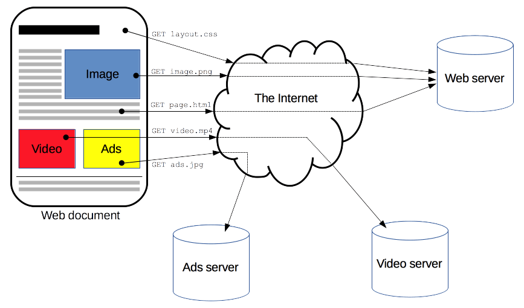

# HTTP 란?

HTTP(**Hyper Text Transfer Protocol**)는 서버와 클라이언트가 서로 데이터를 주고받기 위해 사용되는 **통신 규약**

- 거의 모든 형태의 데이터가 전송 가능

## HTTP의 역사

## HTTP/0.9 (1991년)

- TCP/IP 링크 위에서 동작하는 ASCII 프로토콜
- Get 메서드만 지원
- HTTP 헤더 X, 상태 코드 X
- 응답도 HTML 파일 자체만 보내줌
- 서버와 클라이언트 간의 연결은 모든 요청 후에 닫힘(closed)

## HTTP/1.0 (1996년)

- 기본적인 HTTP 메서드와 요청/응답 헤더 추가
- HTTP 버전 정보가 각 요청 사이내로 전송되기 시작 (HTTP/1.0 이 GET 라인에 붙은 형태로)
- 상태 코드(status code)가 응답의 시작 부분에 붙어 전송되어, 브라우저가 요청에 대한 성공과 실패를 알 수 있고 그 결과에 대한 동작을 할 수 있게 되었다. (특정 방법으로 로컬 캐시를 갱신하거나 ..등)
- 응답 헤더의 Content-Type 덕분에 HTML 파일 형식 외에 다른 문서들을 전송하는 기능이 추가되었다.

### HTTP/1.0의 문제점

#### 단기커넥션(Short-lived Connection)

connection 하나당 요청하나의 응답 처리가 가능하기 때문에 서버에 자원을 요청할 때마다 매번 새로운 연결을 해야한다.

- 매번 새로운 연결로 성능 저하
- 매번 새로운 연결로 서버 부하 비용 증가

## HTTP/1.1 (1997년)

- **지속연결(Persistent connection)** : 지정한 timeout 동안 연속적인 요청 사이에 커넥션을 닫지 않음.  기존 연결에 대해서 handshake 생략 가능
    - **요청 헤더 Connection 속성에 keep-alive 세**
- **파이프 라이닝(pipelining)** :  이전 요청에 대한 응답이 완전히 전송되기 전에 다음 전송을 가능하게 하여,  여러 요청을 연속적으로 보내 그 순서에 맞춰 응답을 받는 방식으로 지연 시간을 줄이는 방식 (불안정하여 사장됨)
- Domain Sharding : 한 도메인당 6~13개의 TCP연결들을 동시 생성해 여러 리소스를 한번에 다운로드 하는 것

### HTTP/1.0의 문제점

**HOLB (Head Of Line Blocking)**

- 첫번째 요청에 대한 응답이 오래걸릴 경우 그 뒤의 응답도 같이 늦게 되서 후 순위에 있는 요청의 응답 시간도 길어지는 현상

**RTT (Round Trip Time)**

- RTT(Round Trip Time)란, 요청(SYN)을 보낼 때부터 요청에 대한 응답(SYN+ACK)을 받을 때까지의 왕복 시간을 의미하는데 아무리 keep-alive 라고 하지만 결국 TCP상에서 동작하는 HTTP의 특성상 Handshake 가 반복적으로 일어나게 되어 불필요한 RTT증가로 인해 네트워크 지연을 초래하여 성능이 저하된다.

#### 무거운 헤더 구조와 중복

- http/1.1의 헤더에는 많은 메타정보들이 저장되어져 있다. 또한 해당 도메인에 설정된 cookie정보도 매 요청시 마다 헤더에 포함되어 전송되기 때문에 오히려 **전송하려는 값보다 헤더 값이 더 큰 경우**가 많았다.

그리고 지속 커넥션 속에서 주고 받는 연속된 요청 데이터가 **중복된 헤더값**를 가지고 있는 경우가 많아 쓸데없는 메모리 자원도 낭비하게 되는 꼴이 되었다.

## HTTP / 2.0 (2015)

기존 HTTP 1.1 버전의 성능 향상에 초점을 맞춘 프로토콜

- HOLB(Head Of Line Blocking)문제를 극복하기 하기 위해 **여러 파일을 한번에 병렬로 전송**

### HTTP / 2.0의 개선점

1. **Binay Framing Layer**
2. **Multiplexing**
3. **Server Push** 
4. **Stream Prioritization**
5. **HTTP Header Data Compression**

#### 1. Binay Framing Layer

HTTP 1.1과 HTTP 2.0의 주요한 차이점은 HTTP 메세지가 1.1에서는 text로 전송되었던 것과 달리, 2.0에서는 binary frame로 인코딩되어 전송된다는 점이다.

> [!NOTE]
>
>기존 text 방식으로 HTTP 메세지를 보내는 방식은, 본문은 압축이 되지만 헤더는 압축이 되지 않으며 헤더 중복값이 있다는 문제 때문에 HTTP 2.0에서는 바이너리로 변경 되었다.
>

또한 HTTP 헤더에 대해서 배웠을때 헤더와 바디를 \r 이나 \n 과 같은 개행 문자로 구분한다고 하였는데, HTTP/2.0에서 부터는 헤더와 바디가 **layer**로 구분된다.

이로인해 데이터 파싱 및 전송 속도가 증가하였고 오류 발생 가능성이 줄어들었다.

> [!NOTE]
> **Stream 과 Frame 단위**
>
> HTTP/1.1에서는 HTTP 요청와 응답은 통짜 텍스트 Message 단위로 구성되어 있었다.
>
> HTTP/2 로 오면서 Message라는 단위 외에 Frame, Stream이라는 단위가 추가되었다.
>
> - **Frame** : HTTP/2에서 통신의 최소 단위이며, Header 혹은 Data 가 들어있다.
> - **Message** : HTTP/1.1과 마찬가지로 요청 혹은 응답의 단위이며 다수의 Frame으로 이루어진 배열 라인
> - **Stream** : 연결된 Connection 내에서 양방향으로 Message를 주고 받는 하나의 흐름
> 
> 즉, HTTP/2 는 HTTP 요청을 여러개의 Frame들로 나누고, 이 frame들이 모여 요청/응답 Message가 되고, 그리고 Message는 특정 Stream에 속하게 되고, 여러개의 Stream은 하나의 Connection에 속하게 되는 구조이다.
> 
> 
>

 

#### 2. Multiplexing

- 하나의 커넥션으로 동시에 여러개의 메세지 스트림을 응답 순서에 상관없이 주고 받는 것

#### 3. Server Push

HTTP 2.0에서는 클라이언트의 요청에 대해 미래에 필요할것 같은 **리소스를 똑똑하게 미리 보낼 수 있다.**

예를 들어 클라이언트로부터 HTML 문서를 요청하는 하나의 HTTP 메세지를 받은 서버는 그 HTML 문서가 링크하여 사용하고 있는 이미지, CSS 파일, JS 파일 등의 리소스를 스스로 파악하여 클라이언트에게 미리 push해서 미리 브라우저의 캐시에 가져다 놓는다.

#### 4. Stream Prioritization

HTTP 1.1에서 발생한 HOLB(Head Of Line Blocking)가 발생하는 것을 HTTP 2에서는 **리소스간 의존관계(우선순위)를 설정하여 문제를 해결했다.**

위에서 봤던 것 처럼 HTTP 메세지가 개별 바이너리 프레임으로 분할되고, 여러 프레임을 멀티플렉싱 할 수 있게 되면서 요청과 응답이 동시에 이루어져 비약적인 속도 향상이 되었다.

하지만 하나의 연결에 여러 요청과 응답이 뒤섞여 버려 패킷 순서가 엉망 징창이 되었다. 따라서 스트림들의 우선순위를 지정할 필요가 생겼는데, 클라이언트는 **우선순위 지정 트리**를 사용하여 스트림에 식별자를 설정함으로써 해결 하였다.

- 각각의 스트림은 1-256 까지의 가중치를 갖음
- 하나의 스트림은 다른 스트림에게 명확한 의존성을 갖음

**스트림 우선순위 통신 과정**

1. 클라이언트는 서버에게 스트림을 보낼때, 각 요청 자원에 가중치 우선순위를 지정하고 보낸다.
2. 그렇게 요청 받은 서버는 우선순위가 높은 응답이 클라이언트에 우선적으로 전달될 수 있도록 대역폭을 설정한다.
3. 응답 받은 각 프레임에는 이것이 어떤 스트림인지에 대한 고유한 식별자가 있어, 클라이언트는 여러개의 스트림을 interleaving을 통해 서로 끼워놓는 식으로 조립한다.

#### 5. HTTP Header Data Compression

HTTP 1.1 에서 헤더는 아무런 압축 없이 그대로 전송되었다. 이를 개선하기 위해 HTTP 2.0에서는 **HTTP 메시지의 헤더를 압축하여 전송**한다.

또한 HTTP 1.1 에서는 연속적으로 요청되는 HTTP 메세지들에게서 헤더값이 중복되는 부분이 많아 역시 메모리가 낭비되었는데, HTTP 2.0 에서는 이전 Message의 **헤더의 내용 중 중복되는 필드를 재전송하지 않도록**하여 데이터를 절약할 수 있게 되었다.

### HTTP 2.0 문제점

1. **여전한 RTT (Round Trip Time)**
2. **TCP 자체의 HOLB (Head Of Line Blocking)**
3. **중개자 캡슐화 공격**
4. **길다란 커넥션 유지로 인한 개인정보 누출 우려**

#### 1. 여전한 RTT (Round Trip Time)

아무리 혁신적으로 개선되었다 하더라도, HTTP 1.1 이나 HTTP 2는 여전히 TCP를 이용하기 때문에 Handshake의 RTT(Round Trip Time)로인한 지연 시간(Latency)이 발생한다. 

#### 2. TCP 자체의 HOLB (Head Of Line Blocking)

기본적으로 TCP는 패킷이 유실되거나 오류가 있을때 재전송하는데, 이 재전송 과정에서 패킷의 지연이 발생하면 결국 HOLB 문제가 발생된다.

- 애플리케이션 계층(L4)에서 HTTP HOLB를 해결하였다 하더라도, 전송 계층(L3)에서의 TCP HOLB 를 해결한건 아니기 때문이다.

#### 3. 중개자 캡슐화 공격

위에서 배웠듯이 HTTP 2.0은 헤더 필드의 이름과 값을 바이너리로 인코딩한다. 이를 다르게 말하면 HTTP 2.0 이 헤더 필드로 어떤 문자열이든 사용할 수 있게 해준다는 뜻이다.

그래서 이를 악용하면 HTTP 2.0 메시지를 중간의 Proxy 서버가 HTTP 1.1 메시지로 변환할 때 메시지를 불법 위조할수 있다는 위험성이 있다. 다행히 거꾸로 HTTP/1.1 메시지를 HTTP/2.0 메시지로 번역하는 과정에서는 이런 문제가 발생하지 않는다.

#### 4. 길다란 커넥션 유지로 인한 개인정보 누출 우려

HTTP 2.0은 기본적으로 성능을 위해 클라이언트와 서버 사이의 커넥션을 오래 유지하는 것을 염두에 두고 있다.

하지만 이것은 개인 정보의 유출에 악용될 가능성이 있다. 이는 HTTP/1.1에서의 Keep-Alive도 가지고 있는 문제이기도 하다.

 

### HTTPS

---

 **HTTP에 S(Secure Socket)가 추가된 프로토콜로** 

- **기본적으로 HTTP/2 위에서 동작**
- 애플리케이션 계층과 전송계층 사이에 신뢰계층인 SSL/TLS 계층을 넣은 신뢰할 수 있는 HTTP 요청
- SSL/TLS는 보안 세션을 기반으로 데이터를 암호화하한다.
    - 공개키와 대칭키 암호화 알고리즘을 혼합해서 사용

> [!NOTE]
>
> SSL/TLS : 통신하는 데이터를 **암호화**하는 프로토콜
>
> 보안세션 : 보안이 시작되고 끝나는 기간동안 유지되는 세션
>

 

## HTTP 3.0

HTTP 2.0의 문제점을 해결하기 위해 UDP를 활용한 통신 프로토콜

- 기존 TCP는 클라이언트와 서버 간에 세션을 설정하기 위해 핸드쉐이크가 필요하며, 인증서인 TLS도 세션이 보호되도록 자체 핸드셰이크도 필요하다. 하지만 QUIC는 보안 세션을 설정하기 위해 한 번의 핸드셰이크만 필요하다.
    - QUIC는 UDP를 개조한 프로토콜
    - [🔍 좀더 자세히 알고 싶다면 Click!!](https://inpa.tistory.com/entry/WEB-%F0%9F%8C%90-HTTP-30-%ED%86%B5%EC%8B%A0-%EA%B8%B0%EC%88%A0-%EC%9D%B4%EC%A0%9C%EB%8A%94-%ED%99%95%EC%8B%A4%ED%9E%88-%EC%9D%B4%ED%95%B4%ED%95%98%EC%9E%90)

### 출처

---

https://inpa.tistory.com/entry/HTTP-%F0%9F%8C%90-%EB%B0%B1%EC%97%94%EB%93%9C-%EB%A1%9C%EB%93%9C%EB%A7%B5-HTTP%EB%8A%94-%EB%AC%B4%EC%97%87%EC%9D%BC%EA%B9%8C%EC%9A%94

https://inpa.tistory.com/entry/WEB-%F0%9F%8C%90-HTTP-09-HTTP-30-%EA%B9%8C%EC%A7%80-%EC%95%8C%EC%95%84%EB%B3%B4%EB%8A%94-%ED%86%B5%EC%8B%A0-%EA%B8%B0%EC%88%A0

https://inpa.tistory.com/entry/WEB-%F0%9F%8C%90-HTTP-30-%ED%86%B5%EC%8B%A0-%EA%B8%B0%EC%88%A0-%EC%9D%B4%EC%A0%9C%EB%8A%94-%ED%99%95%EC%8B%A4%ED%9E%88-%EC%9D%B4%ED%95%B4%ED%95%98%EC%9E%90
