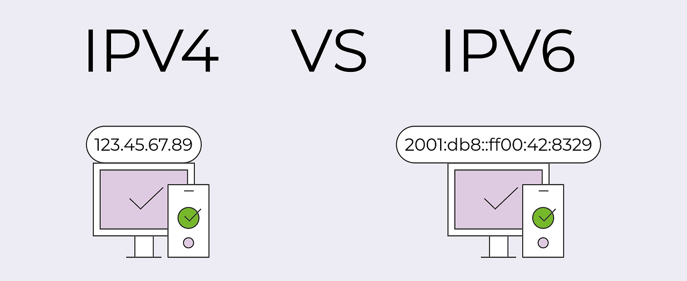

# IP란?

IP(Internet Protocol) 란 인터넷에 연결되어 있는 모든 장치들(컴퓨터, 서버 장비, 스마트폰 등)을 식별할 수 있도록 각각의 장비에게 부여되는 **고유 주소**

- IP주소는 IPv4, IPv6 2가지 종류가 있다.

 

## IPv4

IPv4는 IP version 4의 약자로 전 세계적으로 사용된 첫 번째 인터넷 프로토콜

- 아이피(ip)는 일반적으로 `172.16.254.1`와 같이 마침표로 구분된 4개의 숫자가 있는, 점으로 분리된 10진수 형식으로 표시된다.
- 이를 **2진법**으로 표현한다면, 32비트 숫자 `10101100.00010000.1111110.0000001`가 된다.

- **IP**는 **32bit로 이루어진 주소**이며 이를 합산해보면 약 **43억개**의 주소를 가지게 된다.

> [!NOTE]
>
>이처럼 IPv4는 0 ~ 2^32 (약 42억 9천)개의 주소를 가질수 있지만, 전 세계적으로 인터넷 사용자 수가 급증하면서 IPv4 주소가 **고갈되고 있다**. 이러한 문제를 해결하기 위해 등장한 >것이 **IPv6**!!
>

 

## IPv6

IPv6는 IP version 6의 약자로, IPv4의 주소체계를 128비트 크기로 확장한 차세대 인터넷 프로토콜 주소

- 16비트씩 8자리로 각 자리는 콜론으로 구분한다.
- **IPv6**의 128비트 주소공간은 128 비트로 표현할 수 있는 2^128개인 약 3.4x1038개(340,282,366,920,938,463,463,374,607,431,768,211,456개) 의 주소를 갖고 있어 거의 무한대로 쓸 수 있다.
- 이처럼 IPv6는 네트워크 속도, 보안적인 부분뿐만 아니라 여러 면에서 뛰어나지만, 기존의 주소체계를 변경하는 **비용이 비싸** 아직 완전히 상용화가 되지 않았다.

## IP 주소 구성

아이피는 **네트워크 ID + 호스트 ID** 로 구성되어 진다.

**Network ID :**  모든 호스트를 관리하기 힘들기 때문에 한 네트워크의 범위를 지정한 ID. 우편물의 ‘시/도’나 아파트 단지명과 같습니다.

**Host ID :** 해당 네트워크 안에서 '어떤 기기'인지 구별하는 ID. 우편물의 ‘상세 주소’나 동/호수와 같습니다.

**서브넷 마스크 (Subnet Mask):** IP 주소에서 어디까지가 네트워크 ID이고 어디서부터가 호스트 ID인지 구분하는 기준값

#### 예시)

**`192.168.10.10` → `11000000.10101000.00001010.00001010`**

**네트워크 주소 :** **`11000000.10101000.00000010`**

**호스트 주소 : `00001010`**

그리고 **`192.168.10.`** 으로 시작하는 PC는 **`192.168.10.10`, `192.168.10.25`, `192.168.10.126`** ...과 같은 네트워크에 속하고 있다고 말 할 수 있다.

 

## IP 주소 클래스

IP클래스는 예전에 IPv4를 사용했을 때 IP를 할당하는 방법

> [!NOTE]
>
>현재는 더 이상 사용되지 않고, 클래스 방식이 아닌 다른 방식(CIDR 방식)으로 할당하도록 1993년도에 바뀌었지만, 서브네팅을 하기위해선 기본 개념은 알고 가야 하기 때문에 학습이 필요한 부분이다.
>

- IP 주소를 8비트로 4등분을 하면, 각각을 **옥텟(Octet)**이라 부른다.
- 각 옥탯별로 0~255개의 범위가 되므로 각각 256개가 들어갈 수 있게 된다.

- 옥탯 별로 IP 클래스를 A, B, C로 나눌 수 있디.
- 이런식으로 나눔으로서 각 클래스마다 할당 되는 총 호스트 갯수가 나뉘어져 보다 체계적으로 관리할 수 있게 된다.

| **A 클래스** | 주소 | 1.0.0.0 ~ 127.255.255.255 |
| --- | --- | --- |
|  | 서브넷 마스크 | 255.0.0.0 |
|  | 그룹별 호스트 **개수** | 2^24-2 = 16,777,214 개 |
| **B 클래스** | 주소 | 128.0.0.0 ~ 191.255.255.255 |
|  | 서브넷 마스크 | 255.255.0.0 |
|  | 그룹별 호스트 **개수** | 2^16-2 = 65,534개 |
| **C 클래스**
 | 주소 | 192.0.0.0 ~ 223.255.255.255 |
|  | 서브넷 마스크 | 255.255.255.0 |
|  | 그룹별 호스트 **개수** | 2^8-2 = 256개 |
| **D 클래스** | 주소 | 224.0.0.0 ~ 239.255.255.255 |
|  | 특징 | 멀티캐스트용 |
| **E 클래스** | 주소 | 240.0.0.0 ~ 254.255.255.255 |
|  | 특징 | 미래에 사용할 IP로 예약되어 있음 |

 

### A 클래스
---

8bit(1byte)가 Network ID이며, 나머지 24bit(3byte)가 Host ID로 사용하는 클래

- A클래스의 첫번째 옥텟의 비트는 **0**으로 고정된다.
- 따라서 A Class의 범위는 첫 옥텟이 1 ~ 126 사이의 숫자로 시작한다.
- A클래스는 호스트ID 대역이 24bit이므로, 네트워크 당 나올 수 있는 호스트 주소 갯수는 1670만개 이므로, 대규모 네트워크에 적합하다

 

### B클래스

B Class의 경우 처음 16bit(2byte)가 Network ID이며, 나머지 16bit(2byte)가 Host ID로 사용하는 클래스

- B클래스는 첫번째 옥텟의 두번째 비트가 **10**으로 고정이 된다.
- 네트워크 주소는 처음 16비트이며 호스트 주소는 나머지 16비트
- 따라서 B Class의 범위는 첫 옥텟이 128 ~ 191 사이의 숫자로 시작한다.
- host 대역이 16bit 이므로 네트워크 당 나올 수 있는 호스트 수는 약 65000개 이므로 중규모 네트워크에 적합하다.

 

### C 클래스

---

처음 24bit(3byte)가 Network ID이며, 나머지 8bit(1byte)가 Host ID로 사용하는 클래스

- C클래스는 첫번째 옥텟의 세번째 비트가 **110**으로 고정.
- 네트워크 주소는 처음 24비트이며 나머지 8비트는 호스트 비트
- 따라서 C Class의 범위는 첫 옥텟이 192 ~ 223 사이의 숫자로 시작한다.
- host 대역이 256개이므로 소규모 네트워크 환경에 적합하다.

 

### D클래스

---

개별 호스트 할당이 아닌 특정 그룹에 동시에 데이터를 보내는 멀티캐스트용 주소 클래스

- D클래스는 첫번째 옥텟의 네번째 비트가 **1110**으로 고정
    - `1110 xxxx. xxxx xxxx. xxxx xxxx. xxxx xxxx`
- 그래서 표현할 수 있는 범위는 `224.0.0.0` ~ `239.255.255.255`
- 멀티캐스트용 대역으로 IP주소에 할당되지 않는다.
    - 멀티캐스트(Multicast) **:**네트워크에서 하나의 송신자가 지정된 특정 그룹의 수신자들에게만 데이터를 동시에 전송하는 통신 방식

 

### **E 클래스**

---

일반용이 아닌 향후 연구 및 테스트 목적으로 예약된 주소 클래스

- E클래스는 첫번째 옥텟의 네번째 비트가 **1111**으로 고정
    - 1111 xxxx. xxxx xxxx. xxxx xxxx. xxxx xxxx
- 그래서 표현할 수 있는 범위는 240.0.0.0 ~ 255.255.255.255
- 연구용 예약된 주소 대역으로 IP주소에 할당되지 않는다

 

### 네트워크 주소 & 브로드 캐스트 주소

IP 주소에는 **사용할 수 없는 주소 두가지가 존재**하는데, 네트워크 주소와 브로드 캐스트 주소이다.

- **네트워크 주소**
    - 호스트 ID가 모두 0인 주소
    - 네트워크 자체를 나타내는 주소
- **브로드캐스트 주소**
    - 호스트 ID가 모두 1인 주소
    - 네트워크의 모든 호스트로 데이터를 전달하기 위한 통로로서의 주소

- 위 그림을 예시로 했을 떄 `192.168.10.1` ~ `192.168.10.254` 주소들을 우리가 실제로 사용하는 것이고 처음과 끝은 사용할 수 없다.

 

### 서브넷(Subnet)

---

하나의 네트워크가 분할되어 나눠진 작은 네트워크

#### 서브넷(Subnet) 등장 배경: 클래스 기반 주소 지정(Classful)의 한계

앞에서 IP 주소를 클래스로 나누어서 할당을 한다고 했는데, 이 경우 매우 비효율적인 상황이 발생할 수 있다.

- **문제 상황 예시**: 중중형 규모의 B 클래스 IP(약 65,000개 분량)를 어느 기업에 할당했다고 가정해하면, 만약 그 기업이 실제로 10,000개의 IP만 사용한다면, **나머지 55,000여 개의 IP는 쓰이지 않은 채 낭비(점유)된다.**
- **클래스 변경의 한계**: 그렇다고 이 기업에 C 클래스 IP(254개 분량)를 할당하자니, 이번에는 **IP 자원이 턱없이 부족해진다**.

즉, 호스트 수에 맞게 IP를 클래스별로 미리 나눠 놓았더니만, **현실적인 기업 규모와 맞지 않아 안 하니만도 못한 상황**이 발생한다

이러한 낭비와 비효율 문제를 해결하기 위해, IP를 사용하는 네트워크 장치 수에 따라 **하나의 큰 네트워크를 유연하고 효율적으로 쪼개어 쓸 수 있는 서브넷(Subnet) 개념**이 등장했다.

- **서브네팅(Subnetting)**: 거대한 하나의 네트워크를 관리 및 효율성을 위해 여러 개의 작은 네트워크(서브넷)로 분할하는 과정
- **서브넷 마스크(Subnet Mask)**: 이 서브네팅을 컴퓨터가 계산하고 수행할 수 있도록, IP 주소에서 어디까지가 네트워크 영역이고 어디부터가 호스트 영역인지를 0과 1로 나타내 주는 기준

> [!NOTE]
>
> 그럼 C 클래스를 여러 개 할당하거나, B 클래스를 여러 기업이 나눠 쓰면 되는거 아닌가?
>
> **C 클래스를 여러 개 줄 경우** : 전 세계 라우터가 관리해야 하는 경로(Routing Table)가 너무 많아져 인터넷 전체 속도가 느려진다.
>
> **B 클래스를 나눠 쓸 경우** : 하나의 네트워크 ID 안에서 서로 다른 기업들이 섞여 버려, 보안 및 브로드캐스트 트래픽 간섭 문제가 발생한다.
>

 

### 서브넷 마스크(Subnet Mask)

---

IP 주소에서 어디까지가 네트워크 ID이고 어디서부터가 호스트 ID인지 구분하는 기준값

- **`255.255.255.0`**

#### **서브넷 마스크 표현**

- 서브넷 마스크는 IP주소와 똑같은 32비트 2진수로 표현된다.
- 아이피와 표현이 다른 점은 **서브넷 마스크는 연속된 1과 연속된 0으로 구성**되어있다는 것

즉, `10011111.11011111.11110011.00000000` 와 같이 1 중간에 0 이 들어오는 값은 가질 수 없고,

`11111111.11111111.11111100.00000000`의 1이 연속되거나 아닌 형태만 가질 수 있다는 말이다.

앞서, 서브넷 마스크는 네트워크 아이디와 호스트 아이디를 보다 편하게 구분하기 위해 사용된다라고 했었는데 이래 사진을 보서브넷 마스크 옥텟(1바이트)가 255면 즉 네트워크 아이디를 가리키게 되는 것이다. 

그래서 아주 간단하게 IP주소와 서브넷 마스크를 이용해서 이 IP가 어느 클래스인지 알 수 있다.

#### **Prefix 표현**

서브넷 마스크를 위보다 더욱 간소화해서 표현할 수도 있다. 바로 비트를 이용한 방법인데, IP 주소가 `192.168.0.1/24` 라면 뒤에 `/24`가 서브넷 마스크를 표현한 것이다.

`/24` 라는 뜻은 32비트 중 앞에서부터 차례대로 **1의 개수가 24개** 라는 의미이다. 나머지 32-24=8은 0으로 채워주면 서브넷 마스크 숫자가 되는 것이다.

**`/24` →  `11111111.11111111.11111111.00000000`**

이렇게 하면 IP 주소를 입력할 때 **`192.168.1.17 255.255.255.0`**를 **`192.168.1.17/24`** 로 간략히 줄일 수 있게 된다.

서브넷 정보를 알려주기 위해 기존에는 4B가 필요했지만 6bit만 있으면 해당 정보를 전달할 수 있어서 네트워크 리소스를 절약할 수 있다.

 

### 서브네팅 (Subnetting)

---

IP주소를 효울적으로 나누어 사용하기 위한 방법

- 네트워크 성능 보장, 자원을 효율적으로 분배하기 위해 네트워크 영역과 호스트 영역을 **쪼개는 작업**
- 서브넷팅을 하면 IP 할당 범위를 더 작은 단위로 나눌 수 있게 된다

만일 **호스트를 50개**만 사용하는 기업이 192.168.10.0/24 아이피 주소를 사용한다면 가정하면, C클래스이니까 총 256개의 주소를 할당하게 되는데,

256개 전체를 주기에는 낭비가 되니까, 이 256개를 절반으로 나누고(128개) 또 절반으로 나눈(64개) 주소를 기업에게 할당하고 남는 네트워크 주소는 다른 사용처로 할당하는 효율적인 작업이 바로 서브네팅 원리이다.

---

 
 

### 공인 IP

---

인터넷 서비스 공급자(ISP)가 제공하는 전 세계에서 유일한 식별 번호

- **ISP(Internet Service Provider의 약자로 KT, LG, SKT와 같이 인터넷을 제공하는 통신업체)**가 부여받고, 우리는 위 회사에 가입을 통해 IP를 제공받아 인터넷을 사용하고 있다.
- 전 세계적으로 ICANN이라는 기관이 국가별로 사용할 IP 대역을 관리
- 우리나라는 한국인터넷진흥원(KISA)에서 국내 IP 주소들을 관리

| **구분** | **공인 IP (Public IP)** | **사설 IP (Private IP)** |
| --- | --- | --- |
| **특징** | 전 세계에서 유일한 식별자 | 특정 네트워크(예: 가정, 회사) 안에서만 유일 |
| **접근성** | 외부 인터넷에서 직접 접근 가능 | 외부에서 직접 접근 불가 (내부망 전용) |
| **할당 주체** | 인터넷 서비스 제공자(ISP) | 라우터 또는 공유기 |
| **사용 범위** | 웹 서버, 클라우드 서버 등 | 개인 PC, 스마트폰, 프린터 등 |
| **주소 대역** | ISP로부터 할당받은 실제 IP | `192.168.x.x`, `10.x.x.x`, `172.16.x.x ~ 172.31.x.x` |

### 사설 IP

---

가정이나 사무실의 공유기 내부 네트워크에서만 사용되는 고유하지 않은 주소

- 공유기를 사용한 인터넷 접속 환경일 경우 공유기까지는 공인 IP 할당을 하지만, 공유기에 연결되어 있는 가정이나 회사의 각 네트워크 기기에는 사설 IP를 할당한다.
- 즉, 사설 IP는 어떤 네트워크 안에서만 **내부적으로 사용되는 고유한 주소**

> [!NOTE]
>
> **사설망 (Private Network)는 지정된 대역의 아이피만 사용하다.** 
>
> 리눅스하면서 한번쯤은 봤던 `10.0.0.0`번대의 아이피와, 톰캣이나 아파치 서버를 설치하면서 한번쯤은 봤던 `192.168.0.0` 번대의 아이피가 바로 사설IP를 일컫는다.
>
> 
>

 

### 사설 IP & 사설망 원리

---

**사설망**이란 공유기를 사용한 인터넷 접속 환경일 경우 공유기까지는 공인 IP 할당을 하지만, 공유기에 연결되어 있는 가정이나 회사의 각 네트워크 기기에는 사설 IP를 할당하여 그룹으로 묶는 방법이다.

예시) 학교에 비유하면

- 반 : 사설망
- 반장 : Gateway (`192.168.0.1` ↔ `181.227.3.33`)
- 반 학생들 : 각 컴퓨터들 (`192.168.0.2`, `192.168.0.3`, `192.168.0.4` ...)
- 학교 : 외부 인터넷 (`61.123.44.1`)

**사설 IP(로컬 IP)**는 어떤 **네트워크 안에서 내부적으로 사용되는 고유한 주소**이다. 따라서 A대학교 안에서 사용하는 `192.168.10.2` IP와 B대학교 안에서 사용하는 `192.168.10.2` IP는 **번호는 같을지언정 전혀 다른 목적지 주소**를 나타내게 된다. 

이처럼 사설망이라는 개념을 쓰면 같은 아이피 번호를 중복해서 마구 사용할수 있고, 이는 곧 **IP의 절약**과 연관된다.

#### NAT (사설망 ↔ 외부 통신 방법)

---

NAT (Network Address Translation)이란 사설 IP 주소를 외부 인터넷에서 사용하는 공인 IP 주소로 변환(Translation)해 주는 기술. 쉽게 말해  **인터넷 주소 변역** 기능이다.

- 사설 네트워크(Private Network)에 속한 여러 개의 호스트가 하나의 공인 IP 주소를 사용하여 인터넷에 접속하기 위함

### 라우팅

---

**라우팅(Routing)은 네트워크에서 데이(패킷)를 보낼 때 최적의 경로를 선택하는 과정**이며 라우터가 이를 수행한다.

- 데이터는 보통 출발지에서 목적지로 가는 동안 여러 개의 라우터를 거치며 여러 번의 라우팅을 수행(라우팅은 보통 초당 수백만번 일어남)

### **라우팅 테이블**

---

**라우팅 테이블**은 **IP 주소를 기반으로 라우터의 위치를 저장한 테이블** 또는 **데이터베이스**

- 다양한 네트워크에 대한 정보와 해당 네트워크에 연결하는 방법이 포함되어 있다

- 네트워크 대상(Network Destination) **:** 목적지 네트워크의 IP 주소
- 서브넷 마스크(Netmask) : 대상 주소를 설명할 때 쓰이는 값
- 게이트웨이(Gateway) : 이 장치와 연결되어있는 홉, 패킷이 전달되는 다음 IP 주소(외부 네트워크와 연결된 장치) 만약 목적지가 로컬 네트워크라면 “연결됨(connected)”라고 표기 되며 다른 네트워크라면 해당 네트워크의 게이트웨이를 가리킴
- 인터페이스(interface) : 게이트웨이로 가기위해 거치는 장치 / 10.0.0.2는 eth3을 통해 접근이 가능
- 메트릭(Metric) :우선순위라고도 불리며 패킷 전송을 위해 최적의 경로가 선택되도록 참고되는 값

> [!NOTE]
> 
> **라우팅**을 **홉 바이 홉 통신**이라고도 함
>
> **홉(hop)** : 네트워크에서 출발지와 목적지 사이에 위치한 장치를 의미하며 홉 카운트(hop count)는 데이터가 출발지와 목적지 사이에서 통과해야 하는 홉의 개수
> 

### 출처

---

https://inpa.tistory.com/entry/WEB-%F0%9F%8C%90-IP-%EA%B8%B0%EC%B4%88-%EC%82%AC%EC%84%A4IP-%EA%B3%B5%EC%9D%B8IP-NAT-%EA%B0%9C%EB%85%90-%EC%A0%95%EB%A7%90-%EC%89%BD%EA%B2%8C-%EC%A0%95%EB%A6%AC

https://inpa.tistory.com/entry/WEB-IP-%ED%81%B4%EB%9E%98%EC%8A%A4-%EC%84%9C%EB%B8%8C%EB%84%B7-%EB%A7%88%EC%8A%A4%ED%81%AC-%EC%84%9C%EB%B8%8C%EB%84%B7%ED%8C%85-%EC%B4%9D%EC%A0%95%EB%A6%AC

https://jhlee-developer.tistory.com/entry/CS-%EB%9D%BC%EC%9A%B0%ED%8C%85-%EA%B0%9C%EB%85%90%EA%B3%BC-%EB%9D%BC%EC%9A%B0%ED%84%B0-%EB%9D%BC%EC%9A%B0%ED%8C%85-%ED%85%8C%EC%9D%B4%EB%B8%94
