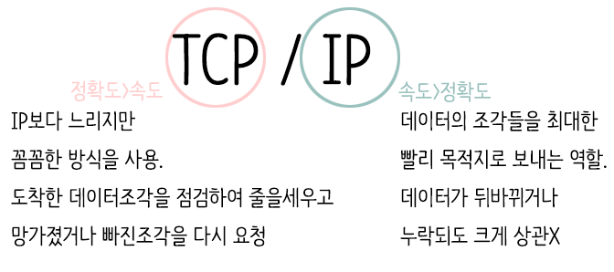

# TCP / IP 4계층 모델

## IP (인터넷 프로토콜)

**패킷들을 가장 효율적인 방법으로 최종 목적지로 전송하기 위해 필요한 프로토콜**

- 조각들의 순서가 뒤바뀌거나 일부가 누락되더라도 크게 상관하지 않고 보내는 데 집중을 한다.
- 그래서 IP 프로토콜은 패킷의 순서 보장도 할 수 없고 패킷이 중간에 유실되도 이에대한 방안이 없다.

> [!NOTE]
> 여기서 IP는 IP주소와는 다른 개념이다.
>- **IP 프로토콜 :** 기기들이 서로 데이터를 주고받는 '통신 규칙'
> - **IP 주소 :**  데이터를 주고받을 때 특정 기기를 찾기 위해 부여하는 '식별 번호(집 주소)'

</br>

## TCP (전송 제어 프로토콜)

**신뢰성 있고 무결성을 보장하는 연결을 통해 데이터를 안전하게 전달해주는 전송 프로토콜**

- 패킷 데이터의 전달을 보증하고 보낸 순서대로 받게 해준다
- 도착한 조각을 점검하여 줄을 세우고 망가졌거나 빠진 조각을 다시 요청하는 식으로 순서를 보증.
- TCP는 데이터를 상대방에게 확실하게 보내기 위해서  **3-way handshake**이라는 방법을 사용하고 있다.이 방법은 패킷을 보내고 잘 보내졌는지 여부를 상대에게 확인하러 간다.
- 통신을 마칠 떄는  **4-way handshake**라는 방법을 사용한다.
- 여기에서 고유의 'SYN'와 'ACK'라는 TCP 플래그를 사용한다. (일종의 확인 마크 정도로 이해하면 된다)
- **한마디로 TCP는 IP의 문제를 보완해주는 녀석**이라고 보면 된다.



### TCP의 데이터 통신 과정

TCP는 신뢰성 프로토콜 답게, 배달 하기전에 목적지가 무사한지 미리 확인하고 배달 끝나고도 또 확인도 해주는 굉장히 친절한 프로토콜이다. 

통신을 시작할 때와 종료할 때 서로 준비가 되어있는지를 반드시 미리 먼저 물어보고 패킷을 전송할 순서를 정하고 나서야 본격적인 통신을 시작하기 때문이다.

이 과정을 **3 Way Handshake** 와 **4 Way Handshake** 과정이라고 하며 3 Way는 통신을 시작할때, 4 Way는 통신을 마칠때 거치는 과정이다.


#### Flag 종류

| 플래그 | 설명 |
| --- | --- |
| SYN | **접속요청을 할 때 보내는 패킷**을 말한다. TCP접속시에 가장먼저 보내는 패킷이다. |
| ACK | 상대방으로부터 패킷을 받은 뒤에, **잘 받았다고 알려주는 패킷**을 말한다. 다른 플래그와 같이 출력되는 경우도 있다. |
| PSH | 데이터를 즉시 목적지로 보내라는 의미이다. |
| FIN | **접속종료를 위한 플래그** 이 패킷을 보내는 곳이 현재 접속하고 있는 곳과 접속을 끊고자 할 때 사용한다. |


#### 3-way handshake 과정

TCP 3 way handshake는 본격적으로 상대 클라이언트와 연결되기 전에 **가상 연결**을 해서 패킷으로 보내서 확인하는 동작


1. 클라이언트는 접속을 요청하는 **SYN 패킷**을 보낸다.이때 클라이언트는 응답을 기다리기위해 **SYN_SENT 상태**로 변한다.
2. **LISTEN 상태**였던 서버는 **SYN 요청**을 받으면, 클라이언트에게 요청을 수락하는 **ACK 패킷과 SYN 패킷**을 보낸다. (서버도 클라이언트에 접속해야 양방향 통신이 되기 때문에)그리고 **SYN_RCVD(SYN_RECEIVED)상태**로 변하여 클라이언트가 ACK 패킷을 보낼 때 까지 기다리게 된다.
3. 클라이언트는 다시 서버에 **ACK 패킷**을 보내고, 이 후 **ESTABLISHED 상태**가 되어 데이터 통신이 가능하게 된다.

#### 데이터 통신 과정


1. **Established 된 상태**에서 서버에게 데이터를 보낸다.
2. 서버는 잘 전송받았다고 **ACK 플래그**를 넣어 응답한다.
3. 만약 클라이언트가 서버로부터 ACK를 못받았으면 제대로 송신하지 못한걸로 판단하고 데이터를 재전송을 한다.

#### 4-way handshake 과정


1. 서버와 클라이언트가 TCP 연결이 되어있는 상태에서 클라이언트가 접속을 끊기 위해 **CLOSE() 함수**를 호출한다.그러면 **FIN 플래그**를 보내게 되고 클라이언트는 **FIN_WAIT1** 상태로 변한다.
2. 서버는 클라이언트가 CLOSE() 한다는 것을 알게되고 **CLOSE_WAIT** 상태로 바꾼 후 **ACK 플래그**를 전송한다.만일 서버에서 클라이언트로 보낼 남은 데이터가 있을 경우 이때 나머지를 모두 전송시킨다.
3. ACK를 받은 클라이언트는 **FIN_WAIT2**로 변환되고, 이때 서버는 **CLOSE() 함수**를 호출하고 **FIN 플래그**를 클라이언트에게 보낸다.
4. 서버도 연결을 닫았다는 신호를 클라이언트가 수신하면 **ACK 플래그**를 보낸 후 **TIME_WAIT** 상태로 전환된다.이 후 모든것이 끝나면 **CLOSED 상태**로 변환된다.

#### TCP 순서 보장 방법

1. 클라이언트에서 패킷1, 패킷2, 패킷3 순서로 전송
2. 서버에서 패킷1, 패킷3, 패킷2 순서로 받음
3. 서버에서 패킷2번부터 다시 보내라고 클라이언트에게 요청(TCP 기본 동작)


> **TCP는 신뢰할 수 있는 프로토콜이라고 하는 이유는 이렇게 패킷을 순서대로 제어를 할 수 있는 이유는 TCP 데이터 안에 전송 제어, 순서, 정보들이 있기 때문이다.**
> 

</br>

## UDP (사용자 데이터그램 프로토콜)

**데이터를 주고받을 때 연결 과정을 생략하여 속도가 빠르지만, 데이터의 도착을 보장하지 않는 전송 계층 통신 프로토콜**

- 비 연결지향적 프로토콜
- 데이터 전달 보증 X
- 순서 보장 X
- TCP에 비교해서 기능이 거의 없어 단순하지만 오로지 빠르게 패킷을 보내는 목적
- **IP와 거의 같다고 보면 된다. PORT 와 체크섬(메시지 검증해주는 데이터) 정도만 추가된 형태이다.**
- IP에 기능이 거의 추가되지 않은 하얀 도화지 같은 상태이기 때문에 최적화 및 커스터마이징이 용이하다.


> [!NOTE]
> **UDP는 데이터 그램 방식을 사용하는 프로토콜이기 때문에 패킷의 목적지만 >정해져 있다면 중간 경로는 신경쓰지 않기 때문에 핸드 쉐이크 과정이 필요 없다.**
>- **가상회선 패킷 교환 방식:**데이터를 보내기 전에 논리적인 길(가상회선)을 미리 정하고 모든 패킷이 이 길을 따라 **순서대로** 도착하는 방식. 데이터를 모두 보내면 이 회선을 해제한다.
>- **데이터그램 패킷 교환 방식:**길을 미리 정하지 않고 패킷마다 독립적으로 최적의 길을 찾아가는 방식. 패킷들이 서로 다른 길로 가기 때문에 **순서가 다르게** 도착할 수 있고. 목적지에서 순서를 다시 맞춘다.
>
> 
>

</br>

#### TCP vs UDP

| **TCP** | **UDP** |
| --- | --- |
| 연결지향형 프로토콜 | 비 연결지향형 프로토콜 |
| 바이트 스트림을 통한 연결 | 메세지 스트림을 통한 연결 |
| 혼잡제어, 흐름제어 | 혼잡제어와 흐름제어 지원 X |
| 순서 보장, 상대적으로 느림 | 순서 보장되지 않음, 상대적으로 빠름 |
| 신뢰성 있는 데이터 전송 - 안정적 | 데이터 전송 보장 X |
| 세그먼트 TCP 패킷 | 데이터그램 UDP 패킷 |
| HTTP, Email, File transfer 에서 사용 | 도메인, 실시간 동영상 서비스에서 사용 |


[🔍 좀더 자세히 알고 싶다면 Click!!](https://inpa.tistory.com/entry/NW-%F0%9F%8C%90-%EC%95%84%EC%A7%81%EB%8F%84-%EB%AA%A8%ED%98%B8%ED%95%9C-TCP-UDP-%EA%B0%9C%EB%85%90-%E2%9D%93-%EC%89%BD%EA%B2%8C-%EC%9D%B4%ED%95%B4%ED%95%98%EC%9E%90)

</br>

---

</br>

## TCP/IP 4계층


**컴퓨터들이 인터넷에서 데이터를 주고받는 통신 과정을 4단계로 나눈 표준 모델**


### **1. Network Access Layer (OSI 7계층에서 물리+데이터링크 계층)**

> 물리적인 네트워크 매체(케이블, 랜카드)를 통해 데이터 프레임을 물리적으로 전송하고, 하드웨어 주소인 **MAC 주소**를 관리하는 계층
> 
- Node-To-Node간의 신뢰성 있는 데이터 전송을 담당
- 알맞은 하드웨어로 데이터가 전달되도록 MAC주소를 핸들링 하는것 뿐 아니라, 데이터 패킷을 전기신호로 변환하여 선로를 통하여 전달할 수 있게 준비 해준다.
- **데이터 단위(PDU)**: 프레임 (Frame) / 비트 (Bit)
- **주요 기술:** 이더넷(Ethernet), MAC 주소

> [!NOTE]
>
>**이더넷 프레임** :  네트워크의 데이터 링크 계층(OSI 2계층)에서 데이터를 안전하게 주고받기 위해 사용하는 표준화된 데이터 전송 단위
>
> 
>
> - Preamble: 수신 호스트가 송신 호스트의 클록 동기를 맞추는 용도 (송신자와 수신자의 동기화)
> - Start Frame Delimiter:  MAC 주소 필드의 시작을 알림
> - Source Address: 송신 호스트의 MAC 주소
> - Destination Address: 수신 호스트의 MAC 주소
> - Length or Type: Data 필드에 포함된 가변 길이의 전송 데이터 크기, 패킷의 종류
> - Checksum(FCS): 에러 확인 비트

</br>

### 2. **Internet Layer (OSI 7계층에서 네트워크 계층)**

> 논리적 주소인 **IP 주소**를 정의하고, 데이터 패킷이 목적지까지 갈 수 있도록 최적의 경로를 지정하는 **라우팅(Routing)**을 수행하는 계층
> 
- IP를 사용하여 데이터의 원천지(origin)과 목적지(destination)에 관한 정보를 첨부
- **데이터 단위(PDU)**: 패킷 (Packet)
- IP는 패킷 전달 여부를 보증 X

#### 핵심 프로토콜

| **Protocol** | **Content** |
| --- | --- |
| **IP** | 비연결의 서비스를 제공하며, 발신지와 목적지까지의 라우팅 경로를 결정 |
| **ICMP** | IP제어와 메시지 기능을 담당 |
| **ARP** | IP주소를 이용해 상대방의 MAC주소를 알아오는 프로토콜 (브로드캐스트 요청, 유니캐스트 응답) |
| **RARP** | MAC주소에 해당하는 IP주소를 알아오는 프로토콜 (브로드캐스트 요청, 유니캐스트 응답) |

</br>

### **3. Transport Layer (OSI 7계층에서 전송 계층)**

> 송신자와 수신자 간의 애플리케이션 프로세스를 연결하고, **포트(Port) 번호**를 기반으로 신뢰성 있는 데이터 전송을 보장하는 계층
> 
- **데이터 단위(PDU)**: 세그먼트 (Segment - TCP) / 데이터그램 (Datagram - UDP)
- **핵심 프로토콜**: **TCP**(연결형/신뢰성), **UDP**(비연결형/속도)

| **Protocol** | **Content** |
| --- | --- |
| **TCP (Transmission Control Protocol)** | **연결 지향적 (Connection Oriented)**
신뢰적, 흐름제어, 에러지어 (순서번호, ACK번호 사용)
ACK 받지 못한 모든 데이터는 재전송
장점은 보장된 세그먼트로 전달하기에 신뢰성이 있다
단점은 연결을 위한 초기 설정 시간이 걸린다 |
| **UDP (User Datagram Protocol)** | **비연결 지향적 (Connectionless Oriented)**
비신뢰적, 데이터를 보낸 후에 잘 도착햇는지 검사하는 기능이 없다
장점은 빠르며, 연결을 맺지 않으므로 제어 프레임 전송을 할 필요가 없기에 네트워크 부하를 줄일 수 있다
신뢰성보다는 고속성을 요구하는 멀티미디어 응용등에 일부 사용되고 있다 |

</br>

### **4. Application Layer (OSI 7 계층에서 5, 6, 7 계층)**

> 사용자가 웹 서핑, 파일 전송, 이메일 등 실제 서비스를 이용할 수 있도록 데이터 형식을 정의하고 통신 인터페이스를 제공하는 계층
> 
- **데이터 단위(PDU)**: 데이터 (Data) / 메시지 (Message)

#### 핵심 프로토콜

| **Protocol** | **Content** |
| --- | --- |
| DNS (Domain Name System) | 인터넷에서 사용하는 이름을 해당 IP 주소로 변화해주는 서비스 |
| SNMP (Simple Network Management Protocol) | 네트워크 장비를 모니터링하고 제어하는 프로토콜 |
| FTP (File Transfer Protocol) | TCP환경에서 파일 전송 프로토콜 |
| TFTP (Trival File Transfer Protocol) | UDP환경에서 파일 전송 프로토콜 |
| HTTP (Hypertext Transfer Protocol) | 웹상에서 정보를 주고받을 수 있는 프로토콜 |

### **TCP / IP 4계층 동작 순서**


1. 송신측 클라이언트의 **애플리케이션 계층**에서 어느 웹 페이지를 보고 싶다라는 HTTP 요청을 지시한다.
2. 그 다음에 있는 **트랜스포트 계층**에서는 **애플리케이션 계층**에서 받은 데이터(HTTP 메시지)를 통신하기 쉽게 조각내어 안내 번호와 포트 번호(TCP 패킷)를 붙여 **네트워크 계층**에 전달한다.
3. **네트워크 계층**에서 데이터에 IP 패킷을 추가해서 **링크 계층**에 전달한다.
4. **링크 계층**에서는 수신지 MAC 주소와 이더넷 프레임을 추가한다.
5. 이로써 네트워크를 통해 송신할 준비가 되었다.
6. 수신측 서버는 **링크 계층**에서 데이터를 받아들여 순서대로 위의 계층에 전달하여 애플리케이션 계층까지 도달한다.
7. 수신측 애플리케이션 계층에 도달하게 되면 클라이언트가 발신했던 HTTP 리퀘스트를 수신할 수 있다.

#### 예시) 네이버 접속 시나리오

```
1. 웹 브라우저에 www.naver.com 입력.
2. DNS로 네이버 서버 IP주소 할당.
3. 응용 계층(L4)에서 메세지 데이터 패킹(HTTP 메시지).
4. 전송 계층(L3)에서 PORT정보(출발지, 목적지), 전송제어 정보, 순서 정보, 검증 정보 패킹 (TCP).
5. 인터넷 계층(L2)에서 IP정보(출발지, 목적지) 패킹
6. 네트워크 엑세스(L1) 계층에서 MAC주소 패킹
7. 게이트웨이를 통해 인터넷망 접속.
8. 라우터를 통해 목적지(네이버 서버)를 찾아 연결.
9. 네이버 서버에 도착하면 패킷을 하나 하나 까면서 목적 포트에 메세지 데이터 전달하여 다시 응답.
```

### 츨처

---

https://inpa.tistory.com/entry/WEB-%F0%9F%8C%90-TCP-IP-%EC%A0%95%EB%A6%AC-%F0%9F%91%AB%F0%9F%8F%BD-TCP-IP-4%EA%B3%84%EC%B8%B5

https://nayoungs.tistory.com/entry/%EB%84%A4%ED%8A%B8%EC%9B%8C%ED%81%AC-%EC%9D%B4%EB%8D%94%EB%84%B7Ethernet%EC%99%80-%EC%9D%B4%EB%8D%94%EB%84%B7-%ED%94%84%EB%A0%88%EC%9E%84Frame

https://inpa.tistory.com/entry/WEB-%F0%9F%8C%90-OSI-7%EA%B3%84%EC%B8%B5-%EC%A0%95%EB%A6%AC
