# 자료구조-비선형 자료구조

# 비선형 자료구조(Non-Linear Data Structures)

## 개요

비선형 자료 구조란 일렬로 나열하지 않고, 자료 순서나 관계가 복잡한 구조를 말한다.

---

## 1) 그래프 (Graph)

### 정의

그래프는 정점(Vertex)과 간선(Edge)으로 이루어진 자료 구조를 말한다.

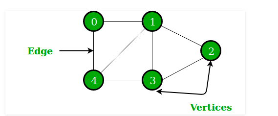

"어떠한 곳에서 어떠한 곳으로 무언가를 통해 간다"는 개념에서:
- **어떠한 곳** = 정점(Vertex)
- **무언가** = 간선(Edge)

### 핵심 개념

| 개념 | 설명 | 쉬운 예시 |
|------|------|----------|
| **정점(Node/Vertex)** | 데이터를 담는 점 | 사람 |
| **간선(Edge)** | 정점을 연결하는 선 | 친구 관계 |
| **방향 그래프** | 화살표가 있는 그래프 | A→B 팔로우 (한쪽 방향만) |
| **무방향 그래프** | 화살표가 없는 그래프 | A-B 친구 (양쪽 모두) |
| **가중치** | 간선에 붙은 숫자 | 거리, 비용, 시간 |

### 주요 개념

- **Outdegree**: 정점에서 나가는 간선의 개수
- **Indegree**: 정점으로 들어오는 간선의 개수  
- **가중치(Weight)**: 간선과 정점 사이에 드는 비용

---

## 2) 트리 (Tree)

### 정의

트리는 그래프 중 하나로 정점과 간선으로 이루어져 있고, 트리 구조로 배열된 계층적 데이터의 집합이다.

### 트리의 특징

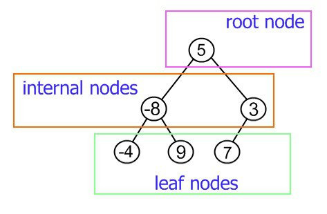

1. 부모(Parent), 자식(Child) 계층 구조를 가짐
   - 같은 경로 상에서 어떤 노드보다 위에 있으면 부모 노드
   - 어떤 노드보다 아래에 있으면 자식 노드

2. **간선의 수 = 노드의 수 - 1**

3. 임의의 두 노드 사이의 경로는 항상 **유일하게 존재**

### 트리의 구성

- **루트 노드(Root Node)**: 가장 위에 있는 노드
- **내부 노드(Internal Node)**: 루트 노드와 리프 노드 사이에 있는 노드
- **리프 노드(Leaf Node)**: 자식 노드가 없는 노드

### 트리의 높이와 레벨

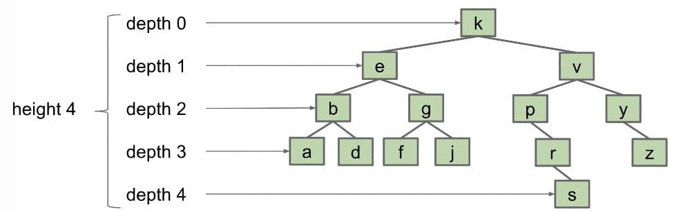

- **깊이(Depth)**: 루트 노드부터 특정 노드까지의 최단거리
- **높이(Height)**: 루트 노드부터 리프 노드까지 거리 중 최장거리
- **레벨(Level)**: 보통 깊이와 같은 의미 (문제마다 조금씩 다름)
- **서브트리(Subtree)**: 트리 내의 하위 집합

### 이진 트리 (Binary Tree)

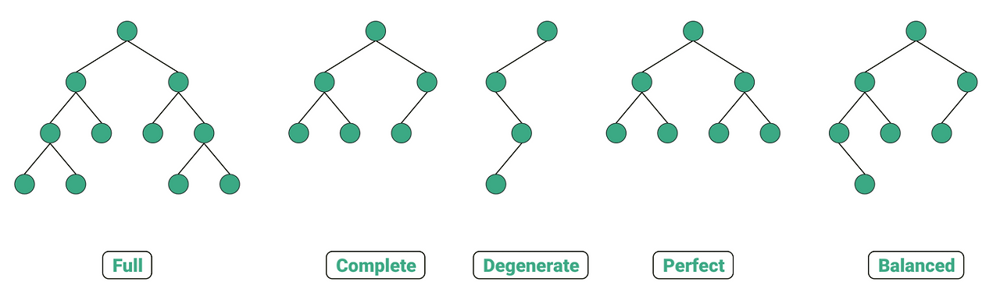

#### 이진 트리의 종류

| 종류 | 설명 |
|------|------|
| **정이진 트리** (Full Binary Tree) | 자식 노드가 0개 또는 2개인 이진 트리 |
| **완전 이진 트리** (Complete Binary Tree) | 왼쪽에서부터 완전히 채워져 있는 이진 트리 |
| **변질 이진 트리** (Degenerate Binary Tree) | 자식 노드가 1개뿐인 이진 트리 |
| **포화 이진 트리** (Perfect Binary Tree) | 모든 노드가 꽉 차 있는 이진 트리 |
| **균형 이진 트리** (Balanced Binary Tree) | 왼쪽과 오른쪽 노드의 높이 차이가 1 이하인 트리 |

### 이진 탐색 트리 (Binary Search Tree, BST)

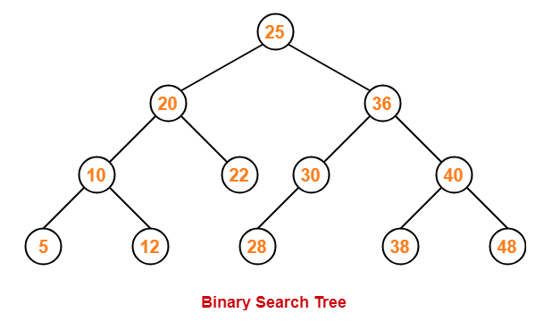

#### 특징

- 왼쪽 하위 트리: 노드 값보다 **작은 값**만 포함
- 오른쪽 하위 트리: 노드 값보다 **큰 값**만 포함

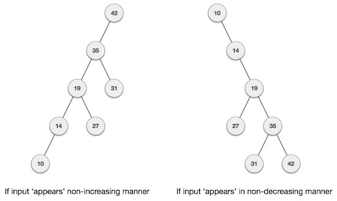

#### 장점

값 검색이 용이하며 보통 **O(log n)** 시간 복잡도

#### 단점

최악의 경우 **O(n)** 시간 복잡도
- 이진 탐색 트리는 요소의 삽입 순서에 따라 선형적(일렬)이 될 수 있음

### AVL 트리

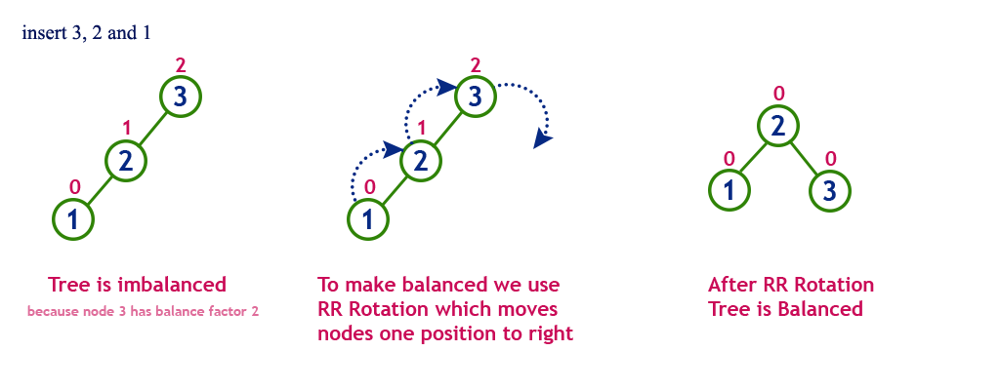

#### 특징

- 이진 탐색 트리의 최악의 경우를 방지하기 위해 고안
- 두 자식 서브트리의 높이는 항상 **최대 1만큼만 차이**

#### 시간 복잡도

- 삽입: **O(log n)**
- 삭제: **O(log n)**
- 탐색: **O(log n)**

#### 균형 유지

삽입과 삭제 시 트리 일부를 **왼쪽 또는 오른쪽으로 회전**시켜 균형 유지

### 레드 블랙 트리 (Red-Black Tree)

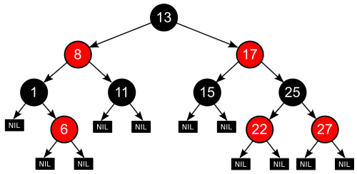

#### 특징

균형 이진 탐색 트리로, 각 노드는 빨간색 또는 검은색의 추가 비트를 저장

#### 시간 복잡도

- 삽입: **O(log n)**
- 삭제: **O(log n)**
- 탐색: **O(log n)**

#### 규칙

1. 모든 리프 노드와 루트 노드는 **블랙**
2. 어떤 노드가 레드이면, 그 노드의 자식은 반드시 **블랙**

---

## 3) 힙 (Heap)

### 정의

힙은 완전 이진 트리 기반의 자료구조이며, 최소힙(Min Heap) 또는 최대힙(Max Heap) 두 가지가 있다.

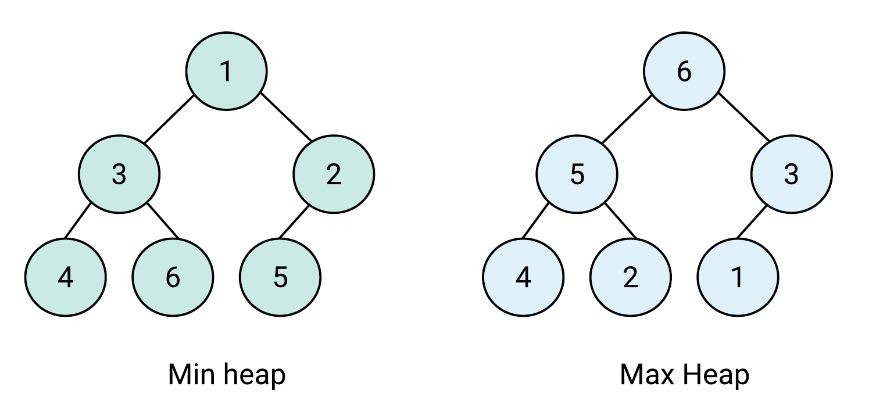

### 힙의 종류

#### 최소힙 (Min Heap)

- 특정 노드의 키가 모든 자식의 키보다 **작음**
- 루트 노드는 전체 키의 **최솟값**

#### 최대힙 (Max Heap)

- 특정 노드의 키가 모든 자식의 키보다 **큼**
- 루트 노드는 전체 키의 **최댓값**

### 힙의 삽입 (Insertion)

1. 새로운 노드를 힙의 **마지막 위치**에 삽입
2. 새로운 노드를 부모 노드와 비교
3. 힙의 성질을 만족할 때까지 **교환**

### 힙의 삭제 (Deletion)

1. 루트 노드 **삭제** (최솟값 또는 최댓값 반환)
2. 마지막 노드와 루트 노드를 **스왑**
3. 트리 재정렬

---

## 4) 우선순위 큐 (Priority Queue)

### 정의

우선순위 큐는 대기열에서 우선순위가 높은 요소가 먼저 제공되는 자료구조이다.

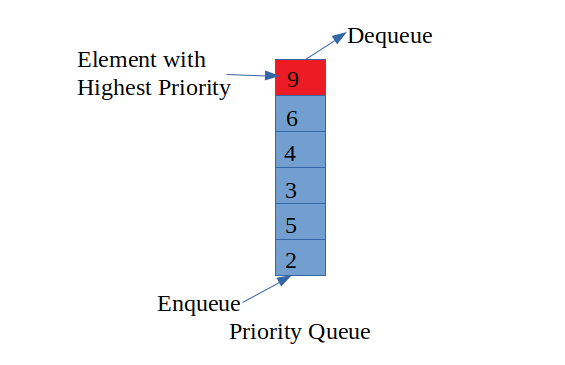

### 특징

- **힙을 기반**으로 구현
- 다양한 자료구조 삽입 가능
- 오름차순 또는 내림차순 지원
- 우선순위를 직접 정의하여 사용 가능
---

## 5) 맵 (Map)

### 정의

맵은 특정 순서에 따라 키와 매핑된 값의 조합으로 형성된 자료구조이다.

### 특징

- **레드 블랙 트리** 기반으로 구성
- 삽입하면 자동으로 **정렬됨**
- 형식: `Map<String, int>`

### 주요 메서드

- `clear()`: 모든 요소 제거
- `size()`: 크기 반환
- `erase()`: 요소 삭제

### 종류

| 종류 | 설명 |
|------|------|
| **map** | 정렬을 **보장**하는 맵 |
| **unordered_map** | 정렬을 **보장하지 않는** 맵 |

---

## 6) 셋 (Set)

### 정의

셋은 특정 순서에 따라 고유한 요소를 저장하는 컨테이너이다.

### 특징

- 중복되는 요소 없음
- 오직 **유니크한 값만 저장**
- 정렬된 순서 유지
---

## 7) 해시 테이블 (Hash Table)

### 정의

해시 테이블은 무한에 가까운 데이터들을 유한한 개수의 해시 값으로 매핑한 테이블이다.

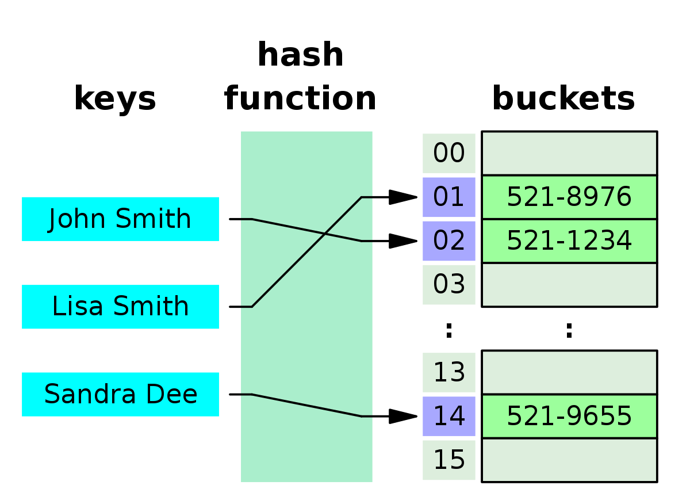

### 특징

- **시간 복잡도**: 삽입, 삭제, 탐색 모두 **O(1)**
- 구현: **unordered_map**으로 구현

### 작동 원리

1. 입력된 데이터에 해시 함수 적용
2. 해시 값을 통해 테이블의 인덱스 결정
3. 해당 인덱스 위치에 데이터 저장
---

## 요약 비교표

| 자료구조 | 삽입 | 삭제 | 탐색 | 특징 |
|---------|------|------|------|------|
| **그래프** | - | - | - | 정점과 간선으로 구성 |
| **이진 탐색 트리** | O(log n) | O(log n) | O(log n) | 정렬 유지, 최악 O(n) |
| **AVL 트리** | O(log n) | O(log n) | O(log n) | 균형 유지 |
| **레드 블랙 트리** | O(log n) | O(log n) | O(log n) | 색상으로 균형 유지 |
| **힙** | O(log n) | O(log n) | O(1) | 완전 이진 트리 기반 |
| **해시 테이블** | O(1) | O(1) | O(1) | 빠른 접근 |
| **맵** | O(log n) | O(log n) | O(log n) | 정렬된 키-값 |
| **셋** | O(log n) | O(log n) | O(log n) | 유니크한 값만 저장 |

---

## 참고 자료

본 정리는 "[면접을 위한 CS 전공지식 노트](https://hiflo.tistory.com/15)"를 참고하여 작성했습니다.