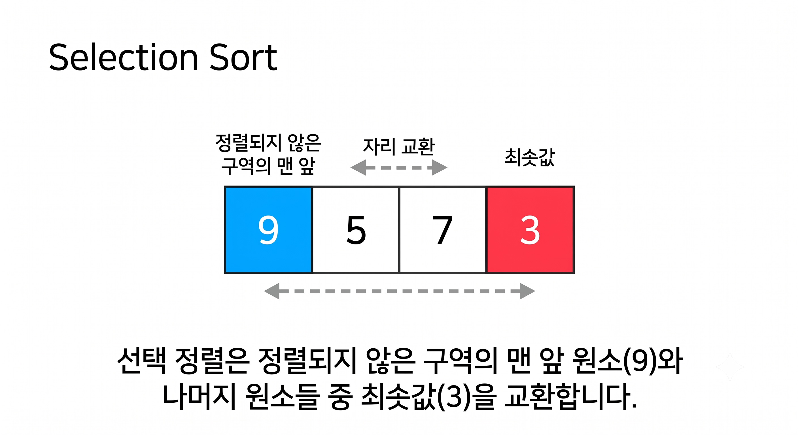
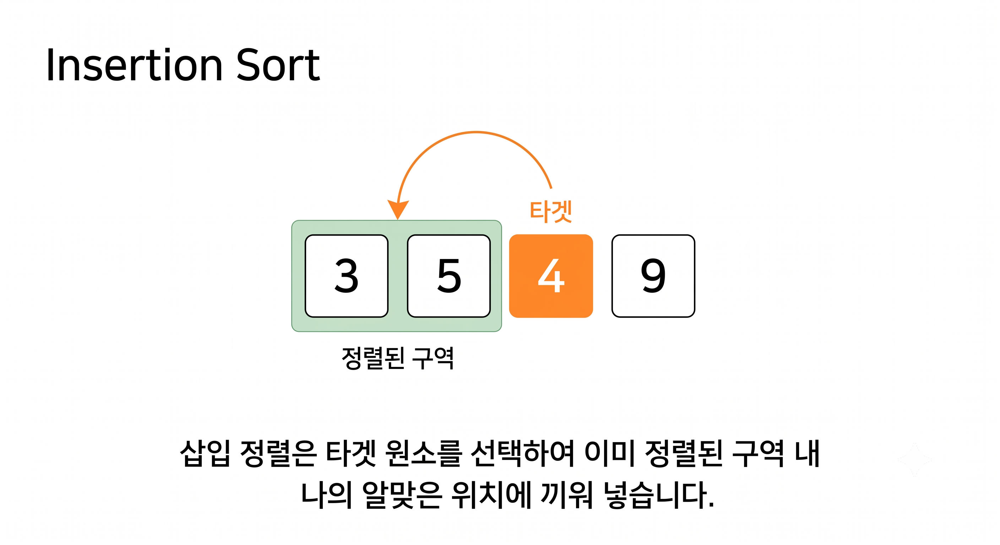
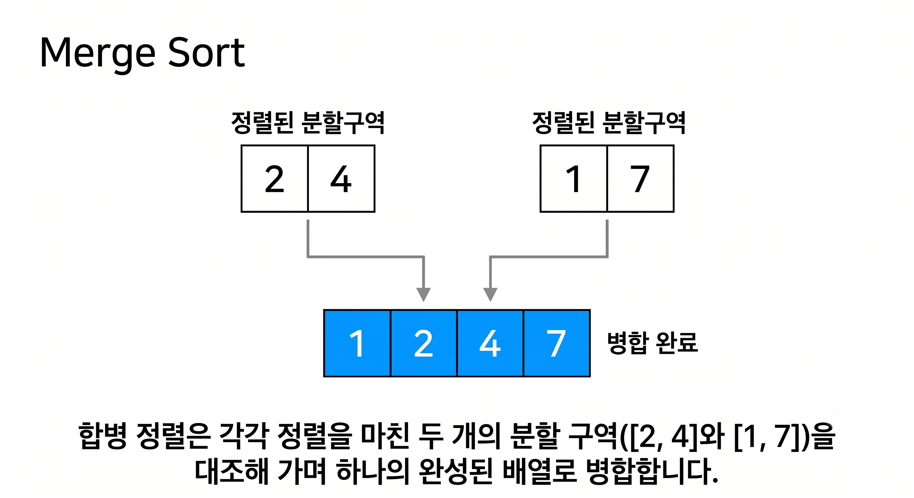
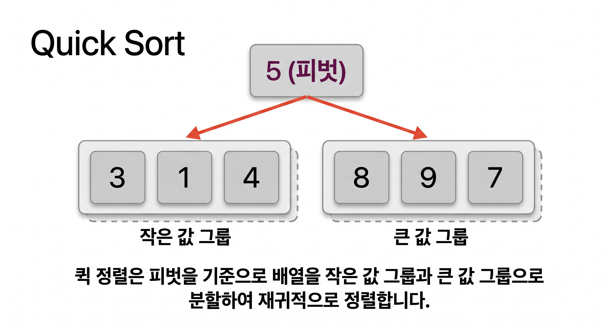
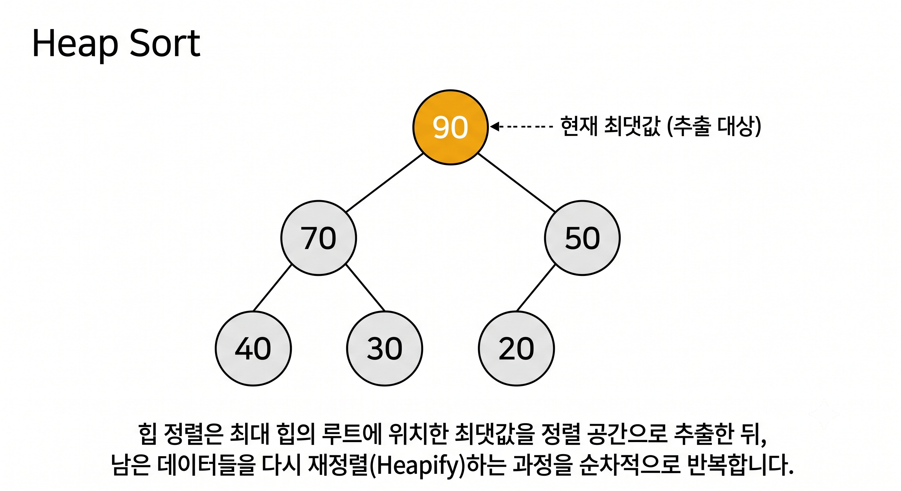

# 기본 정렬 알고리즘 (Sorting Algorithms)

정렬 알고리즘은 $N$개의 숫자가 입력으로 주어졌을 때, 이를 사용자가 지정한 조건(오름차순 또는 내림차순)에 맞게 정렬하여 출력하는 알고리즘입니다. 데이터의 양, 메모리 상황, 데이터의 초기 정렬 상태에 따라 최적의 알고리즘을 선택해야 합니다.

---

## 1. 선택 정렬 (Selection Sort)

### 📌 개념 및 로직
현재 위치에 들어갈 값을 전체 배열에서 찾아 순차적으로 배치하는 정렬 방식입니다.
1. 정렬되지 않은 인덱스의 맨 앞에서부터 맨 마지막까지 값 중 가장 작은 값(최솟값)을 탐색합니다.
2. 최솟값을 찾으면 정렬되지 않은 인덱스의 맨 앞자리 원소와 맞바꿉니다(Swap).
3. 다음 인덱스로 이동하여 위 과정을 반복합니다.



### 📊 복잡도
* **시간 복잡도:** 배열의 정렬 상태와 무관하게 이중 루프를 돌며 전체 비교를 수행하므로 항상 **$O(N^2)$**입니다.
* **공간 복잡도:** 원래 배열 내부에서 스왑이 진행되므로 **$O(1)$** (제자리 정렬)입니다.

### 💻 C++ 구현 코드 및 분석
```cpp
void selectionSort(vector<int> v){
    for(int i = 0; i < v.size() - 1; i++){
        int tmp = i;
        for(int j = i + 1; j < v.size(); j++){
            if(v[tmp] >= v[j]) 
                tmp = j;
        }
        swap(v[i], v[tmp]);
    }
}
```
* **🔍 코드 메커니즘 설명:** * 외곽 루프의 인덱스 `i`는 최솟값이 채워질 '현재 타겟 위치'를 의미합니다.
  * 내부 루프 `j`가 `i + 1`부터 배열의 끝까지 훑으며 가장 작은 원소의 인덱스를 변수 `tmp`에 갱신하며 기록합니다.
  * 탐색이 완료되면 `std::swap`을 통해 딱 한 번만 메모리 교환을 수행하므로, 버블 정렬에 비해 대입 연산 오버헤드가 적은 구조입니다.

---

## 2. 삽입 정렬 (Insertion Sort)

### 📌 개념 및 로직
현재 위치의 데이터를 이미 정렬된 앞부분의 하위 배열들을 비교하여 자신이 들어갈 적절한 위치를 찾아 삽입하는 알고리즘입니다.
1. 두 번째 인덱스(Index 1)부터 시작하며 현재 데이터를 별도 변수(`key`)에 저장합니다.
2. `key`값과 그 왼쪽 방향의 정렬된 원소들을 역순으로 비교해 나갑니다.
3. `key`보다 큰 값들은 한 칸씩 오른쪽으로 밀어내고, `key`보다 작거나 같은 원소를 만나면 그 오른쪽에 데이터를 삽입합니다.



### 📊 복잡도
* **시간 복잡도:** 최악의 경우(역순 정렬) **$O(N^2)$**이지만, 배열이 이미 정렬되어 있다면 루프당 한 번씩만 비교하므로 최적 **$O(N)$**이 됩니다.
* **공간 복잡도:** 추가 메모리를 사용하지 않으므로 **$O(1)$**입니다.

### 💻 C++ 구현 코드 및 분석
```cpp
void insertionSort(vector<int> v){
    for(int i = 1; i < v.size(); i++){
        int key = v[i], j = i - 1;
        while(j >= 0 && key < v[j]){
            swap(v[j], v[j + 1]);
            j--;
        }
        v[j + 1] = key;
    }
}
```
* **🔍 코드 메커니즘 설명:**
  * 배열의 두 번째 원소(`i = 1`)부터 타겟이 되며, `key` 변수에 임시 보관됩니다.
  * `while` 루프 내에서 자신보다 앞서 정렬된 왼쪽 원소들(`v[j]`)과 역순으로 대조합니다.
  * 조건 성립 시 `swap`을 연쇄적으로 호출하여 타겟 원소를 왼쪽으로 한 칸씩 밀어 올리며 알맞은 삽입 위치를 포인터 변수 `j`의 변화로 찾아냅니다. (성능 최적화를 위해 실무에서는 `swap` 대신 대입 연산 `v[j+1] = v[j]`를 활용하기도 합니다.)

---

## 3. 버블 정렬 (Bubble Sort)

### 📌 개념 및 로직
매번 인접한 두 연속된 인덱스를 비교하여 기준에 따라 큰 값을 뒤로 넘겨 정렬하는 방법입니다.
1. 첫 번째 원소부터 바로 인접한 다음 원소와 값을 비교합니다.
2. 앞의 원소가 뒤의 원소보다 크면 자리를 맞바꿉니다.
3. 한 바퀴 순회가 끝나면 가장 큰 값이 맨 뒤에 고정되므로, 다음 순회부터는 비교 범위를 하나씩 줄여나갑니다.


### 📊 복잡도
* **시간 복잡도:** 데이터 정렬 상태와 관계없이 모든 인접 원소를 끝까지 비교하므로 **$O(N^2)$**입니다.
* **공간 복잡도:** 임시 변수 스왑 용도 외에는 자리를 유지하므로 **$O(1)$**입니다.

### 💻 C++ 구현 코드 및 분석
```cpp
void bubbleSort(vector<int> v){
    for(int i = 0; i < v.size() - 1; i++){
        for(int j = 1; j < v.size() - i; j++)
            if(v[j - 1] > v[j]) 
                swap(v[j - 1], v[j]);
    }
}
```
* **🔍 코드 메커니즘 설명:**
  * 1회 회전이 완료될 때마다 배열 맨 뒤 공간에 최댓값이 정착합니다. 따라서 내부 루프의 한계 조건은 전체 크기에서 회전 횟수를 뺀 `v.size() - i`로 설계되어 불필요한 비교를 방지합니다.
  * `v[j-1]`과 `v[j]`의 연속적인 주소 공간을 바로 대조하며 매 조건마다 `swap` 연산이 끊임없이 터지기 때문에, 쓰기(Write) 작업이 빈번하여 $O(N^2)$ 계열 중 실제 수행 속도가 가장 무겁습니다.

---

## 4. 합병 정렬 (Merge Sort)

### 📌 개념 및 로직
큰 문제를 작은 하위 문제들로 쪼개어 정렬한 뒤 결합하는 **분할 정복(Divide and Conquer)** 방식입니다.
1. **분할(Divide):** 배열의 크기가 1 이하가 될 때까지 정중앙을 기준으로 계속 반으로 쪼갭니다. ($O(\log N)$ 깊이)
2. **합병(Conquer/Merge):** 두 하위 배열의 맨 앞 원소부터 크기를 비교하여 작은 값을 임시 배열에 순서대로 담은 후, 원래 배열로 복사합니다. ($O(N)$ 시간 소요)



### 📊 복잡도
* **시간 복잡도:** 무조건 반씩 쪼개고 결합하므로 어떤 상태에서든 항상 **$O(N \log N)$**을 보장합니다.
* **공간 복잡도:** 병합 과정에서 정렬된 결과를 담을 동일 크기의 임시 배열 공간이 추가로 필요하므로 **$O(N)$**입니다.

### 💻 C++ 구현 코드 및 분석
```cpp
void merge(vector<int>& v, int s, int e, int m) {
    vector<int> ret;
    int i = s, j = m + 1;
    
    // 두 분할 구역의 원소들을 대조하여 임시 vector에 오름차순 정렬 삽입
    while (i <= m && j <= e) {
        if (v[i] < v[j]) ret.push_back(v[i++]);
        else if (v[i] > v[j]) ret.push_back(v[j++]);
    }
    // 한쪽 배열이 먼저 소진되었을 때 남은 잔여 원소들을 뒤에 복사
    while (i <= m) ret.push_back(v[i++]);
    while (j <= e) ret.push_back(v[j++]);
    
    // 정렬이 완수된 임시 공간(ret)에서 원본 메모리 공간(v)으로 깊은 복사
    int copy = 0;
    for (int k = s; k <= e; k++) {
        v[k] = ret[copy++];
    }
}

void mergeSort(vector<int>& v, int s, int e){
    if(s < e){
        int m = (s + e) / 2; /* Divide: 분할 기점 산출 */
        mergeSort(v, s, m);   // 좌측 서브 트리 분할
        mergeSort(v, m + 1, e); // 우측 서브 트리 분할
        /* Conquer: 합병 및 정렬 진행 */
        merge(v, s, e, m);
    }
}
```
* **🔍 코드 메커니즘 설명:**
  * 원본 데이터 `vector<int>& v`를 주소 참조값(Reference)으로 받아 내부 상태를 직접 변경합니다.
  * `mergeSort`는 재귀적으로 분할 기점 `m`을 도출해 원소 단위가 1이 될 때까지 쪼개고 들어갑니다.
  * 핵심인 `merge` 함수 내부에서 별도의 로컬 동적 배열 공간 `vector<int> ret`을 할당하고, 두 하위 정렬 구역의 주소 포인터 노릇을 하는 인덱스 `i`와 `j`의 원소 값을 대조하며 차례대로 채운 뒤 원본에 덮어씁니다. 이 과정으로 인해 필수 공간 복잡도 $O(N)$이 유발됩니다.

---

## 5. 퀵 정렬 (Quick Sort)

### 📌 개념 및 로직
합병 정렬과 같은 분할 정복 기법이지만, 배열을 물리적으로 반 나누지 않고 하나의 **피벗(Pivot)** 데이터를 설정해 정렬하는 방식입니다.
1. 배열의 한 원소를 피벗으로 지정합니다(보통 맨 앞, 맨 뒤 혹은 랜덤).
2. 피벗보다 작은 값은 피벗 왼쪽에, 큰 값은 오른쪽에 위치하도록 양방향에서 데이터를 교환하며 정렬(Partition)합니다.
3. 피벗을 기준으로 좌우로 나누어진 하위 배열에 대해 퀵 정렬을 재귀적으로 반복합니다.



### 📊 복잡도
* **시간 복잡도:** 평균적으로 **$O(N \log N)$**을 자랑하며 일반적인 상황에서 가장 빠릅니다. 단, 이미 데이터가 정렬되어 있거나 역순인 상태에서 극단적인 피벗을 고를 경우 트리 구조가 한쪽으로 쏠려 최악의 경우 **$O(N^2)$**이 됩니다.
* **공간 복잡도:** 재귀 호출 스택에 필요한 공간인 **$O(\log N)$**을 가집니다.

### 💻 C++ 구현 코드 및 분석
```cpp
void qsort(vector<int>& v, int s, int e) {
    int pivot = v[s];
    int bs = s, be = e;
    
    while (s < e) {
        // 피벗보다 작은 값을 찾을 때까지 오른쪽 인덱스(e)를 왼쪽으로 좁힘
        while (pivot <= v[e] && s < e) e--;
        if (s > e) break;
        // 피벗보다 큰 값을 찾을 때까지 왼쪽 인덱스(s)를 오른쪽으로 좁힘
        while (pivot >= v[s] && s < e) s++;
        if (s > e) break;
        
        // 발견된 위반 원소 쌍의 위치를 제자리 스왑
        std::swap(v[s], v[e]);
    }
    // 포인터가 만나는 지점(s)과 최초 피벗 위치(bs)를 교환하여 피벗 위치 확정
    std::swap(v[bs], v[s]);
    
    // 확정된 피벗 인덱스(s)를 기준으로 좌우 구역 재귀적 퀵 정렬 수행
    if(bs < s) qsort(v, bs, s - 1);
    if(be > e) qsort(v, s + 1, be);
}
```
* **🔍 코드 메커니즘 설명:**
  * 배열의 맨 첫 원소 `v[s]`를 기준점(`pivot`)으로 설정한 뒤 원본 참조 연산을 수행합니다.
  * `s`와 `e` 양방향 인덱스 지시자가 서로 좁혀져 오면서 피벗 조건에 위배되는 원소들(`pivot <= v[e]` 규칙 파괴값 및 `pivot >= v[s]` 규칙 파괴값)을 발견하는 즉시 제자리 대칭 교환합니다.
  * 최종적으로 두 포인터가 맞닥뜨리는 경계지점과 피벗을 교환함으로써, 피벗의 좌측엔 무조건 작은 값, 우측엔 무조건 큰 값만 남겨놓는 분할(Partition)을 메모리 점유 없이 구현합니다.

---

## 6. 힙 정렬 (Heap Sort)

### 📌 개념 및 로직
완전 이진 트리의 일종인 **힙(Heap) 자료 구조**를 사용하는 정렬 방식입니다.
1. 주어진 무작위 배열을 최대 힙(부모 노드의 값이 자식 노드의 값보다 크거나 같은 형태) 구조로 전환(Heapify)합니다.
2. 최대 힙이 빌드되면 루트 노드(인덱스 0)에는 배열의 최댓값이 위치하게 됩니다.
3. 루트 노드와 배열의 마지막 원소를 교환(Swap)한 뒤, 힙의 유효 크기를 1 줄입니다.
4. 새로 바뀐 루트 노드에 대해 다시 최대 힙 구조를 만족하도록 재정렬(Heapify)을 가합니다. 위 과정을 힙 크기가 1이 될 때까지 반복합니다.



### 📊 복잡도
* **시간 복잡도:** 데이터 삽입 및 삭제 시 힙 트리의 높이($\log N$)만큼 연산이 발생하며 원소 수가 $N$개이므로 항상 **$O(N \log N)$**을 유지합니다.
* **공간 복잡도:** 배열 내부에서 부모-자식 간 인덱스 연산으로 트리를 구현할 수 있어 추가 메모리 소모가 없는 **$O(1)$**입니다.

### 💻 C++ 구현 코드 및 분석
```cpp
void heapify(vector<int>& arr, int n, int i) {
    int largest = i;
    int left = 2 * i + 1;   // 완전 이진 트리 공식에 따른 왼쪽 자식 노드 인덱스
    int right = 2 * i + 2;  // 완전 이진 트리 공식에 따른 오른쪽 자식 노드 인덱스

    // 왼쪽 자식이 부모보다 크다면 가장 큰 인덱스 갱신
    if (left < n && arr[left] > arr[largest])
        largest = left;
    // 오른쪽 자식이 현재까지의 최댓값보다 크다면 인덱스 갱신
    if (right < n && arr[right] > arr[largest])
        largest = right;

    // 부모 노드보다 더 큰 자식이 발견되었다면 위치를 교환하고 재귀 재정렬
    if (largest != i) {
        swap(arr[i], arr[largest]);
        heapify(arr, n, largest);
    }
}

void heapSort(vector<int>& arr) {
    int n = arr.size();
    // 1. 초기 배열을 최대 힙 구조(Max Heap)로 빌드
    for (int i = n / 2 - 1; i >= 0; i--)
        heapify(arr, n, i);

    // 2. 힙 최댓값(루트)을 하나씩 배열 맨 뒤로 보낸 후 크기를 줄여가며 재정렬
    for (int i = n - 1; i > 0; i--) {
        swap(arr[0], arr[i]); // 루트(최댓값)를 정렬 구역 맨 끝으로 이송
        heapify(arr, i, 0);   // 줄어든 크기(i) 내에서 다시 최대 힙 만족 유도
    }
}
```
* **🔍 코드 메커니즘 설명:**
  * 완전 이진 트리의 배열 인덱스 법칙인 **'부모 인덱스가 $i$일 때 왼쪽 자식은 $2i+1$, 오른쪽 자식은 $2i+2$'** 규칙을 교묘하게 활용하여 포인터나 연결 리스트 구조 없이 가상 트리를 생성합니다.
  * `heapify` 연산은 무너진 부모-자식 구조의 높이를 타고 내려가며 하향 조정 스왑을 가합니다. 
  * `heapSort`는 최하단 내부 부모 노드(`n/2 - 1`)부터 역순으로 힙 구조를 만든 뒤, 루트의 최댓값을 배열 맨 끝 유효 경계선(`arr[i]`)과 맞바꾸고 트리를 재하향 정렬하는 방식을 반복하여 정렬을 누적 완성합니다.

---

## 7. 복잡도 비교표

| 알고리즘 명칭 | 최적 시간 복잡도 | 평균 시간 복잡도 | 최악 시간 복잡도 | 공간 복잡도 | 안정성 (Stable) | 제자리 정렬 (In-place) |
| :--- | :---: | :---: | :---: | :---: | :---: | :---: |
| **선택 정렬 (Selection)** | $O(N^2)$ | $O(N^2)$ | $O(N^2)$ | $O(1)$ | **X (Unstable)** | **O (In-place)** |
| **삽입 정렬 (Insertion)** | $O(N)$ | $O(N^2)$ | $O(N^2)$ | $O(1)$ | **O (Stable)** | **O (In-place)** |
| **버블 정렬 (Bubble)** | $O(N^2)$ | $O(N^2)$ | $O(N^2)$ | $O(1)$ | **O (Stable)** | **O (In-place)** |
| **합병 정렬 (Merge)** | $O(N \log N)$ | $O(N \log N)$ | $O(N \log N)$ | $O(N)$ | **O (Stable)** | **X (Out-of-place)** |
| **퀵 정렬 (Quick)** | $O(N \log N)$ | $O(N \log N)$ | $O(N^2)$ | $O(\log N)$ | **X (Unstable)** | **O (In-place)** |
| **힙 정렬 (Heap)** | $O(N \log N)$ | $O(N \log N)$ | $O(N \log N)$ | $O(1)$ | **X (Unstable)** | **O (In-place)** |

---

## 8. 사용 가이드

* **소규모 데이터셋 또는 거의 정렬된 데이터:**
    * **삽입 정렬**을 고려하는 것이 좋습니다. 최적 구현 시 $O(N)$으로 동작하며, 오버헤드가 극히 적어 효율적입니다.
* **추가 메모리가 넉넉하고 정렬의 안정성(Stable)이 필수적인 상황:**
    * **합병 정렬**을 채택해야 합니다. 데이터 상태와 상관없이 균일하게 $O(N \log N)$을 보장하며, 중복 키값의 순서가 보존됩니다.
* **일반적인 고속 정렬 시스템 및 시스템 라이브러리:**
    * **퀵 정렬**이 가장 대중적입니다. 상호 교환 시 지역성(Locality)이 좋아 캐시 효율이 높으므로 평균 연산 속도가 가장 뛰어납니다. (최악 차단을 위해 Median-of-Three 등 피벗 고도화 기법 병행 필요)
* **추가 메모리 공간을 쓸 수 없으면서($O(1)$) 최악의 시나리오에서도 높은 성능을 내야 하는 임베디드 장비:**
    * **힙 정렬**이 정답입니다. 추가 임시 공간 없이도 최악의 조건에서 $O(N \log N)$의 고정 성능을 유지합니다.

---

## 9. 정렬 알고리즘 선택 결정 트리

어떤 정렬 알고리즘을 사용해야 할지 판단하기 위한 조건별 결정 구조 트리입니다.

```
                  [ 데이터의 크기가 매우 작은가? ]
                            /         \
                       (Yes)           (No)
                        /               \
              [삽입 정렬 추천]      [ 동일한 키의 기존 순서 보존(Stable)이 필수인가? ]
                                                /                      \
                                           (Yes)                        (No)
                                            /                            \
                                  [합병 정렬(Merge)]     [ 추가적인 메모리 공간($O(N)$)이 허용되는가? ]
                                                                     /                 \
                                                                (Yes)                   (No)
                                                                 /                       \
                                                         [퀵 정렬(Quick)]          [힙 정렬(Heap)]
```