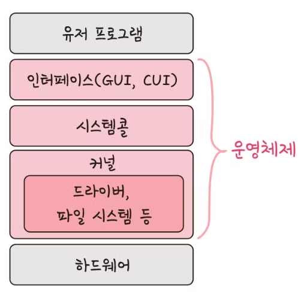
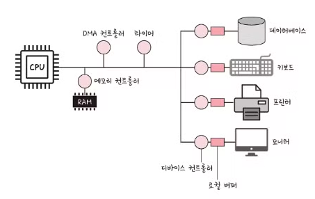
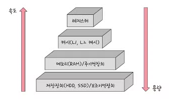

# 운영체제 및 메모리 관리

## 1. 운영체제 기초

### 1) 운영체제(OS, Operating System)란?
* 사용자가 컴퓨터를 쉽게 다루게 해주는 인터페이스입니다.
* 한정된 메모리와 자원을 효율적으로 관리하는 역할을 합니다.

---

### 2) 운영체제의 역할과 구조

#### ■ 운영체제의 역할 (크게 4가지)
1. **CPU 스케줄링과 프로세스 관리**
   * CPU 소유권을 어떤 프로세스에 할당할지 결정합니다.
   * 프로세스의 생성과 삭제, 자원 할당 및 반환을 효율적으로 제어합니다.
2. **메모리 관리**
   * 한정된 메모리를 어떤 프로세스에 얼마만큼 할당해야 하는지 분배하고 관리합니다.
3. **디스크 파일 관리**
   * 디스크 파일을 어떤 방법 및 구조로 안전하고 효율적으로 보관할지 관리합니다.
4. **I/O 디바이스 관리**
   * 마우스, 키보드, 모니터 등 입출력 장치와 컴퓨터 간에 데이터를 주고받는 과정을 제어합니다.

#### ■ 운영체제의 구조
* 전체 구조는 인터페이스, 시스템콜, 커널, 드라이버 부분으로 나뉩니다.

* **사용자 인터페이스(UI)**
  * **GUI (Graphic User Interface)**: 사용자가 전자장치와 그래픽(아이콘, 마우스 클릭 등)을 통해 상호 작용할 수 있도록 하는 형태입니다.
  * **CUI (Character User Interface)**: 그래픽이 아닌 키보드로 명령어를 직접 입력하여 처리하는 인터페이스입니다.
* **시스템콜 (System Call)**
  * 운영체제가 커널에 접근하기 위한 인터페이스입니다.
  * 유저 프로그램이 운영체제의 서비스를 받기 위해 커널 함수를 호출할 때 사용합니다.
  * 유저 프로그램이 I/O 요청(입출력 함수, 데이터베이스, 네트워크, 파일 접근 등)으로 트랩(Trap)을 발동하면 올바른 요청인지 확인 후, 유저 모드에서 커널 모드로 변환되어 실행됩니다.
  * **역할**: 이를 통해 컴퓨터 자원에 대한 직접 접근을 차단하고, 프로그램을 다른 프로그램으로부터 보호할 수 있습니다.
* **modebit**
  * 유저 모드와 커널 모드를 구분하기 위한 플래그 변수입니다.
  * **유저 모드 (`modebit = 1`)**: 유저가 접근할 수 있는 영역을 제한적으로 두며, 컴퓨터 자원에 함부로 침범하지 못하게 보호하는 모드입니다.
  * **커널 모드 (`modebit = 0`)**: 모든 컴퓨터 자원에 접근하고 명령을 수행할 수 있는 모드입니다.
* **커널 (Kernel)**
  * 운영체제의 핵심 부분(중추적인 역할)입니다.
  * 보안, 메모리, 프로세스, 파일 시스템, I/O 디바이스 및 I/O 요청 관리 등을 전담합니다.

---

### 3) 컴퓨터의 요소
컴퓨터는 CPU, DMA 컨트롤러, 메모리, 타이머, 디바이스 컨트롤러 등으로 구성되어 작동합니다.

* **CPU (Central Processing Unit)**
  * 인터럽트에 의해 단순히 메모리에 존재하는 명령어를 해석해서 실행하는 일꾼입니다.
  * **인터럽트 (Interrupt)**: 어떤 신호가 들어왔을 때 CPU를 잠깐 정지시키는 이벤트입니다.
    * *하드웨어 인터럽트*: 키보드, 마우스 연결 등 I/O 디바이스에서 발생하는 인터럽트입니다.
    * *소프트웨어 인터럽트 (Trap)*: 프로세스 오류가 발생하거나 시스템콜을 호출할 때 발동합니다.
  * **CPU의 구성 요소**:
    * *산술논리연산장치 (ALU)*: 산술 연산과 논리 연산을 계산하는 디지털 회로입니다.
    * *제어장치 (CU)*: 프로세스 조작을 지시하고 조율하는 CPU의 부품입니다.
    * *레지스터 (Register)*: CPU 내부에 있는 매우 빠르고 용량이 작은 임시 기억장치입니다.
  * **연산 과정**: 제어장치가 메모리와 레지스터에 계산할 값을 로드 -> 산술논리연산장치에 계산 명령 -> 계산된 값을 레지스터를 거쳐 메모리에 다시 저장합니다.
* **DMA 컨트롤러 (Direct Memory Access)**
  * I/O 디바이스가 CPU를 거치지 않고 메모리에 직접 접근할 수 있도록 하는 하드웨어 장치입니다.
  * CPU의 일을 분담하는 보조 일꾼 역할을 수행하며, 빈번한 I/O 요청으로 인한 CPU 부하를 막아줍니다.
* **메모리 (Memory)**
  * 전자회로에서 데이터나 상태, 명령어 등을 기록하는 장치입니다. 보통 RAM을 의미합니다.
  * CPU가 '일꾼'이라면 메모리는 '작업장'에 비유되며, 작업장이 클수록 많은 일을 동시에 처리할 수 있습니다.
* **타이머 (Timer)**
  * 특정 프로그램에 시간 제한을 다는 역할을 합니다. 시간이 너무 많이 걸리는 프로그램이 작동할 때 독점을 막기 위해 제한을 걸어둡니다.
* **디바이스 컨트롤러 (Device Controller)**
  * 컴퓨터와 연결되어 있는 각 I/O 디바이스들의 작은 CPU입니다.
  * *로컬 버퍼(Local Buffer)*: 디바이스 컨트롤러 옆에 붙어 데이터를 임시로 저장하는 작은 메모리입니다.

---
---

## 2. 메모리 관리

### 1) 메모리 계층 (Memory Hierarchy)
메모리는 레지스터, 캐시, 메모리, 저장장치로 구성된 계층적 구조를 이룹니다.

* **계층의 특징**: 위로 올라갈수록 가격은 비싸지며, 용량은 작아지고, 속도는 빨라집니다.
1. **레지스터**: CPU 내부에 위치, 휘발성, 속도 가장 빠름, 용량 가장 적음.
2. **캐시**: L1, L2, L3 캐시를 지칭, 휘발성, 속도 빠름, 용량 적음.
3. **주기억장치**: RAM, 휘발성, 속도 보통, 용량 보통.
4. **보조기억장치**: HDD, SSD, 비휘발성, 속도 낮음, 용량 많음.

---

### 2) 캐시 (Cache)
* 데이터를 미리 복사해 놓는 임시 저장소입니다.
* 빠른 장치(CPU)와 느린 장치(RAM)의 속도 차이에 따른 병목 현상을 줄이기 위해 사용됩니다.

#### ■ 지역성의 원리
캐시를 직접 설정 및 설계할 때는 '지역성의 원리'를 기반으로 반영합니다.
* **시간 지역성 (Temporal Locality)**: 최근 사용한 데이터에 대해 곧 다시 접근하려는 특성입니다.
* **공간 지역성 (Spatial Locality)**: 최근 접근한 데이터를 이루고 있는 공간이나 그 주변 공간에 연속적으로 접근하려는 특성입니다.

#### ■ 캐시히트와 캐시미스
* **캐시히트 (Cache Hit)**: CPU가 원하는 데이터를 캐시에서 성공적으로 찾아내는 것을 뜻하며, 매우 빠릅니다.
* **캐시미스 (Cache Miss)**: 원하는 데이터가 캐시에 없어 메모리(RAM)까지 내려가서 데이터를 찾아오는 것을 뜻합니다. 시스템 버스를 거치기 때문에 속도가 느립니다.

#### ■ 캐시매핑 (Cache Mapping)
CPU의 레지스터와 주 메모리(RAM) 간에 데이터를 주고받을 때, 캐시가 히트되기 위해 주소를 매핑하는 방법입니다.
1. **직접 매핑 (Direct Mapping)**
   * 메모리 블록을 정해진 하나의 캐시 블록에만 매핑하는 방식입니다.
   * 처리는 매우 빠르지만, 충돌 발생(원하는 공간이 겹침)이 잦습니다.
2. **연관 매핑 (Associative Mapping)**
   * 순서를 일치시키지 않고 관련 있는 캐시와 메모리를 자유롭게 매핑합니다.
   * 충돌은 적지만, 모든 블록을 탐색해야 하므로 속도가 느립니다.
3. **집합 연관 매핑 (Set Associative Mapping)**
   * 직접 매핑과 연관 매핑을 합친 방식입니다.
   * 순서는 일치시키되 특정 집합(Set)을 두어 저장하므로, 메모리 블록을 정해진 집합 내 어디든 매핑할 수 있어 검색이 효율적입니다.

#### ■ 웹 브라우저의 캐시
* **쿠키 (Cookie)**: 만료기한이 있는 키-값(Key-Value) 구조의 저장소입니다. (보통 4KB 내외)
* **로컬 스토리지 (Local Storage)**: 만료기한이 없는 키-값 저장소로, 웹 브라우저를 닫거나 컴퓨터를 재부팅해도 데이터가 유지됩니다.
* **세션 스토리지 (Session Storage)**: 만료기한이 없는 키-값 저장소이나, 브라우저 탭 단위로 세션을 생성하므로 탭을 닫는 순간 해당 데이터가 완전히 삭제됩니다.

#### ■ 데이터베이스의 캐싱 계층
* 데이터베이스의 부하를 줄이기 위해 상위에 별도의 캐싱 계층을 두며, 대표적으로 **레디스(Redis)** 인메모리 데이터베이스가 널리 쓰입니다.

---

### 3) 가상 메모리 (Virtual Memory)
컴퓨터 내의 한정된 메모리를 극한으로 활용하기 위한 기술로, 컴퓨터가 실제로 이용 가능한 물리 메모리 자원을 추상화하여 사용자(프로세스)에게는 매우 큰 메모리로 보이게 만드는 관리 기법입니다.

* **가상 주소 (Logical/Virtual Address)**: 프로세스가 참조하는 논리적인 가상 주소입니다.
* **실제 주소 (Physical Address)**: 실제 메모리(RAM) 하드웨어 상에 있는 물리적인 주소입니다.
* **페이지 테이블 (Page Table)**: 가상 주소와 실제 주소가 어떻게 매핑되어 있는지에 대한 프로세스별 주소 정보 구조체입니다.
* **TLB (Translation Lookaside Buffer)**: 메모리와 CPU 사이에 위치한 '주소 변환 전용 캐시'로, 페이지 테이블을 매번 RAM에서 조회하는 속도를 줄이기 위해 사용합니다.
* **MMU (Memory Management Unit)**: 가상 주소를 실제 물리 주소로 변환해주는 하드웨어 장치입니다. 이를 통해 개발자는 실제 주소를 의식하지 않고 프로그램을 구축할 수 있습니다.

#### ■ 페이지 폴트 (Page Fault)
* 가상 메모리에는 주소가 정의되어 있지만, 실제 물리 메모리(RAM)에는 현재 올라와 있지 않은 페이지에 접근할 때 발생하는 현상입니다.
* **스와핑 (Swapping) 과정**: 페이지 폴트 발생 시, 운영체제는 물리 메모리에서 당장 사용하지 않는 영역을 하드디스크(보조기억장치)의 스왑 영역으로 내리고(Swap-out), 하드디스크에서 필요한 페이지를 메모리로 불러와(Swap-in) 올립니다. 이를 통해 프로그램은 페이지 폴트가 일어나지 않은 것처럼 정상 동작을 이어갑니다.

#### ■ 스레싱 (Thrashing)
* 메모리의 페이지 폴트율이 너무 높은 상태를 의미합니다.
* 메모리에 너무 많은 프로세스가 동시에 올라가게 되면(다중 프로그래밍 정도가 너무 높으면), 프로세스당 할당받는 메모리 양이 줄어들어 스와핑이 빈번하게 일어납니다. 이로 인해 CPU가 페이지 교체에만 시간을 낭비하여 CPU 이용률이 급격히 떨어집니다.
* **해결 방법**:
  * 메모리(RAM) 용량을 늘립니다.
  * 보조기억장치를 HDD에서 속도가 더 빠른 SSD로 교체합니다.
  * **작업세트 (Working Set) 알고리즘**: 프로세스가 일정 시간 동안 자주 참조하는 페이지 집합을 만들어 이 집합(작업세트)을 통째로 메모리에 미리 로드합니다.
  * **PFF (Page Fault Frequency) 알고리즘**: 페이지 폴트 빈도의 상한선과 하한선을 조절하는 방법입니다. 상한선에 도달하면 해당 프로세스에 프레임을 추가로 할당하고, 하한선에 도달하면 프레임을 회수하여 최적화합니다.

---

### 4) 메모리 할당 (Memory Allocation)
메모리에 프로그램을 할당할 때는 시작 메모리 위치와 메모리의 할당 크기를 기반으로 나눕니다.

#### ■ 연속 할당
메모리에 연속적인 공간을 통째로 할당하는 방식입니다.
* **고정 분할 방식 (Fixed Partition Allocation)**: 물리적 메모리를 미리 고정된 크기로 나누어 관리하는 방식입니다. 프로그램 크기가 분할된 공간보다 작을 경우 남는 공간이 낭비되는 **내부 단편화(Internal Fragmentation)**가 발생합니다.
* **가변 분할 방식 (Variable Partition Allocation)**: 프로그램의 크기에 맞게 동적으로 메모리를 나누어 사용하는 방식입니다. 프로그램들이 실행되고 종료되는 과정 속에서, 빈 공간의 크기가 프로그램 크기보다 작아서 배치하지 못하는 **외부 단편화(External Fragmentation)**가 발생합니다.

#### ■ 불연속 할당
메모리에 연속적이지 않게 나누어 할당하는 방식으로, 현대 운영체제가 채택하고 있습니다.
* **페이징 (Paging)**
  * 프로세스를 동일한 크기의 페이지(Page) 단위로 나누어, 메모리의 서로 다른 불연속적인 위치(Frame)에 할당하는 방식입니다.
  * 빈 공간(Hole)의 크기가 균일해져 외부 단편화가 해결되지만, 주소 변환(Mapping) 과정이 더 복잡해집니다.
* **세그멘테이션 (Segmentation)**
  * 페이지 단위가 아니라, 의미 단위인 세그먼트(Segment)로 나누는 방식입니다. (예: 코드 영역, 데이터 영역, 스택 영역, 힙 영역 등)
  * 공유와 보안 측면에서 큰 장점을 가지지만, 세그먼트들의 크기가 균일하지 않아 외부 단편화 문제가 다시 발생할 수 있습니다.
* **페이지드 세그멘테이션 (Paged Segmentation)**
  * 프로그램을 의미 단위인 세그먼트로 먼저 나누고, 이 세그먼트를 다시 동일한 크기의 페이지 단위로 나누어 메모리에 올리는 방식입니다.
  * 페이징과 세그멘테이션의 장점을 결합한 형태입니다.

---

### 5) 페이지 교체 알고리즘
물리 메모리가 부족해 스와핑이 일어날 때, 어떤 페이지를 디스크로 내보낼지 결정하여 페이지 폴트율을 최소화하기 위한 알고리즘입니다.

* **오프라인 (Offline) / 최적 알고리즘**
  * 가장 먼 미래에 참조되는 페이지를 선택하여 교체하는 방식입니다.
  * 미래에 어떤 페이지가 쓰일지 미리 알아야 하므로 **실현 불가능**하며, 타 알고리즘의 성능 비교를 위한 상한선(기준)으로만 활용됩니다.
* **FIFO (First-In First-Out)**
  * 메모리에 가장 먼저 들어온 페이지를 가장 먼저 교체하는 직관적인 방식입니다.
* **LRU (Least Recently Used)**
  * 참조된 지 가장 오래된(과거에 가장 오랫동안 사용되지 않은) 페이지를 교체합니다.
  * 각 페이지마다 마지막 참조 시각을 나타내는 계수기나 스택이 필요하다는 단점이 있습니다.
  * 보통 프로그램 상에서는 **해시 테이블**과 **이중 연결 리스트**를 결합하여 구현합니다.

* **NUR / Clock 알고리즘 (Not Used Recently)**
  * LRU에서 발전한 알고리즘으로, Clock 알고리즘이라고도 부릅니다.
  * 참조 비트(0 또는 1)를 두고, 시계 방향으로 포인터를 돌면서 0비트를 가진 페이지를 찾습니다. 0을 찾은 순간 해당 페이지를 교체하고, 지나가는 길에 있는 1비트들은 모두 0으로 바꾸며 순회합니다. 하드웨어적인 리소스를 적게 먹어 효율적입니다.
* **LFU (Least Frequently Used)**
  * 과거에 참조된 횟수가 가장 적은 페이지를 선택하여 교체하는 방식입니다.