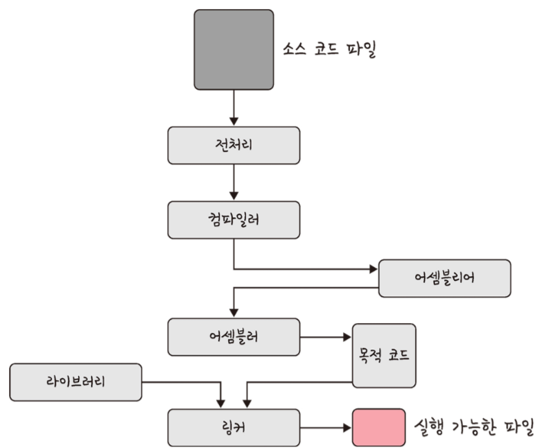
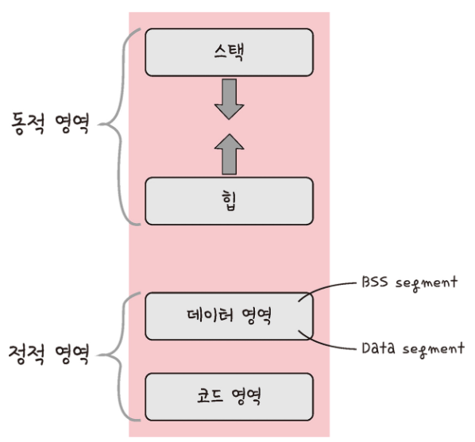
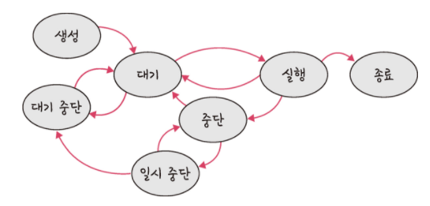
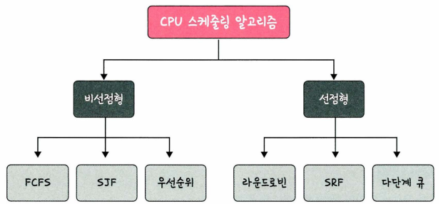

# 프로세스 & 스레드, CPU 스케줄링

---

## 1. 프로세스와 스레드 (Process & Thread)

### 📌 프로세스와 컴파일 과정

**프로세스(Process)**는 컴퓨터에서 실행되고 있는 프로그램을 말하며, CPU 스케줄링의 대상이 되는 작업(Task) 단위를 의미합니다. 프로그램이 메모리에 적재되어 실행되면 프로세스가 됩니다.

#### 프로그램이 프로세스가 되는 컴파일 과정 (C언어 기준)

![컴파일 과정]g

1. **전처리기 (Preprocessor)**: 소스 코드의 `#include`, `#define` 등 매크로를 확장하고 주석을 제거합니다. (`.c` ➡️ `.i`)
2. **컴파일러 (Compiler)**: 전처리된 파일을 어셈블리어 코드로 번역합니다. (`.i` ➡️ `.s`)
3. **어셈블러 (Assembler)**: 어셈블리어 코드를 기계어로 변환하여 오브젝트 파일을 생성합니다. (`.s` ➡️ `.o`)
4. **링커 (Linker)**: 여러 오브젝트 파일과 프로그램에 사용된 라이브러리 파일들을 연결하여 하나의 실행 파일(`.exe` 등)을 만듭니다.

---

### 📌 프로세스의 메모리 구조

프로세스는 운영체제로부터 독립된 메모리 영역을 할당받으며, 이 영역은 크게 동적 영역(Stack, Heap)과 정적 영역(Data, Code)으로 나뉩니다.

*   **스택 (Stack)**: 지역변수, 매개변수, 리턴값 등이 저장되는 영역입니다. 컴파일 타임에 크기가 결정되며, 함수 호출 시 동적으로 늘어나고 줄어듭니다. (위에서 아래로 할당)
*   **힙 (Heap)**: 사용자가 동적으로 할당하는 메모리 영역입니다. 런타임에 크기가 결정되며, `malloc()`, `new` 등을 통해 할당합니다. (아래에서 위로 할당)
*   **데이터 영역 (Data Segment)**: 전역변수와 정적변수(static)가 저장되는 영역입니다. 
    *   **BSS 영역**: 초기화되지 않은 변수가 저장됩니다.
    *   **Data 영역**: 초기화된 변수가 저장됩니다.
*   **코드 영역 (Code Segment)**: 실행할 프로그램의 기계어 코드(소스 코드)가 제어 명령어 형태로 저장되는 읽기 전용(Read-Only) 영역입니다.

---

### 📌 프로세스의 상태 전이

프로세스는 수명 주기 동안 여러 가지 상태 변화를 거치며 실행됩니다.

*   **생성 (Create / New)**: 프로세스가 생성되어 메모리를 할당받고 커널에 PCB가 등록된 상태입니다.
*   **대기 (Ready)**: CPU를 할당받기 위해 준비 중인 상태입니다. 메모리 등 다른 모든 자원은 준비 완료 상태입니다.
*   **실행 (Running)**: CPU 소유권을 얻어 명령어를 실행하고 있는 상태입니다.
*   **대기/보류 (Blocked / Waiting)**: I/O 작업 완료 등 특정 이벤트 발생을 기다리며 CPU를 반납하고 대기하는 상태입니다.
*   **종료 (Terminated / Terminated)**: 프로세스 실행이 완료되고 할당되었던 자원이 회수된 상태입니다.

---

### 📌 PCB와 컨텍스트 스위칭 (Context Switching)

#### PCB (Process Control Block)
운영체제에서 프로세스에 대한 메타데이터를 저장해 놓는 커널 내의 자료구조입니다. 프로세스 생성 시 만들어지며, 프로세스 구분에 사용됩니다.
*   **저장 정보**: 프로세스 ID(PID), 프로세스 상태, PC(Program Counter), 레지스터 정보, 메모리 제한 등

#### 컨텍스트 스위칭 (Context Switching)
CPU가 실행 중인 프로세스를 중단하고 다른 프로세스로 전환할 때, 기존 프로세스의 상태(Context)를 PCB에 저장하고 새로운 프로세스의 상태를 PCB로부터 불러와 CPU 레지스터에 적재하는 과정입니다.

> ⚠️ **Overhead**: 컨텍스트 스위칭이 빈번하게 발생하면 레지스터 저장 및 복원, 캐시 미스(Cache Miss) 등으로 인해 시스템에 과부하(Overhead)가 발생할 수 있습니다.

---

### 📌 멀티프로세스 vs 멀티스레드

| 구분 | 멀티프로세스 (Multi-process) | 멀티스레드 (Multi-thread) |
| :--- | :--- | :--- |
| **개념** | 여러 개의 독립된 프로세스로 작업을 동시 처리 | 하나의 프로세스 내에서 여러 스레드로 작업 처리 |
| **자원 공유** | 자원을 공유하지 않음 (독립적 메모리) | Stack 영역을 제외한 Heap, Data, Code 영역 공유 |
| **통신 비용** | IPC를 사용해야 하므로 통신 비용이 높음 | 메모리를 공유하므로 통신 비용이 낮고 빠름 |
| **안정성** | 한 프로세스 장애가 다른 프로세스에 영향 없음 | 하나의 스레드 예외 발생 시 전체 프로세스 종료 가능 |

#### IPC (Inter-Process Communication)
독립된 프로세스 간에 데이터를 주고받기 위한 통신 매커니즘입니다.
*   **공유 메모리 (Shared Memory)**: 동일한 물리 메모리 영역을 공유하여 가장 빠른 통신이 가능하지만, 동기화 처리가 필수적입니다.
*   **파이프 (Pipe)**: 단방향 통신 채널로 부모-자식 프로세스 간 통신에 쓰입니다.
*   **메시지 큐 (Message Queue)**: 메시지 단위로 통신하며, 선입선출(FIFO) 구조를 가집니다.
*   **소켓 (Socket)**: 네트워크 레이어를 통한 프로세스 간 통신 기법으로, 동일 기기 또는 원격 기기 간 통신에 사용됩니다.

---

### 📌 교착 상태 (Deadlock)

두 개 이상의 프로세스가 서로 상대방이 가진 자원을 기다리며 무한 대기에 빠지는 현상입니다.

#### 교착 상태 발생의 4가지 필요충분조건
1. **상호 배제 (Mutual Exclusion)**: 자원은 한 번에 한 프로세스만 사용할 수 있어야 합니다.
2. **점유와 대기 (Hold and Wait)**: 최소한 하나의 자원을 점유한 상태에서 다른 프로세스가 할당한 자원을 추가로 얻기 위해 대기해야 합니다.
3. **비선점 (No Preemption)**: 이미 다른 프로세스에 할당된 자원을 강제로 빼앗을 수 없습니다.
4. **순환 대기 (Circular Wait)**: 대기 프로세스들이 고리(원) 형태로 서로의 자원을 대기해야 합니다.

#### 교착 상태 해결 방법
*   **예방 (Prevention)**: 4가지 조건 중 하나를 부정하여 교착 상태를 원천 차단합니다. (자원 낭비 심함)
*   **회피 (Avoidance)**: 자원 할당 시 안전 상태(Safe State)를 유지할 수 있는 경우에만 자원을 할당합니다. (예: 은행원 알고리즘)
*   **감지 및 복구 (Detection and Recovery)**: 교착 상태를 허용하되, 주기적으로 감지하여 프로세스를 강제 종료하거나 자원을 선점하여 복구합니다.
*   **무시 (Ignorance)**: 교착 상태가 매우 드물게 발생하므로 시스템이 아무 조치도 취하지 않습니다. 현대 OS(Windows, Linux 등)가 주로 채택하는 방식입니다.

---

## 2. CPU 스케줄링 알고리즘 (CPU Scheduling)

CPU 스케줄러는 메모리의 Ready 상태에 있는 프로세스들 중 어떤 프로세스에 CPU를 할당할지 결정합니다.

### 📌 비선점형 스케줄링 (Non-preemptive)
프로세스가 스스로 CPU를 반납하기 전까지 CPU 소유권을 빼앗기지 않는 방식입니다. 컨텍스트 스위칭으로 인한 오버헤드가 적습니다.

1. **FCFS (First-Come, First-Served)**: CPU를 먼저 요청한 프로세스 순서대로 할당하는 방식입니다.
   > **단점**: 실행 시간이 긴 프로세스가 선점하면 뒤의 프로세스 대기 시간이 길어지는 **호위 효과(Convoy Effect)**가 발생할 수 있습니다.
2. **SJF (Shortest Job First)**: CPU 버스트 시간이 가장 짧은 프로세스에 먼저 CPU를 할당하는 방식입니다. 평균 대기 시간을 최소화합니다.
   > **단점**: 실행 시간이 긴 프로세스는 평생 CPU를 할당받지 못하는 **기아 현상(Starvation)**이 발생할 수 있습니다.
3. **우선순위 스케줄링 (Priority)**: 우선순위가 높은 프로세스에 먼저 할당합니다. SJF의 기아 현상을 해결하기 위해 오래 대기한 프로세스의 우선순위를 높여주는 **에이징(Aging)** 기법을 적용할 수 있습니다.

---

### 📌 선점형 스케줄링 (Preemptive)
현대 운영체제가 사용하는 방식으로, 실행 중인 프로세스로부터 CPU 소유권을 강제로 회수하여 더 시급한 프로세스에 할당할 수 있습니다.

1. **라운드 로빈 (Round Robin - RR)**: 각 프로세스에 동일한 크기의 할당 시간(Time Quantum)을 부여하고, 시간이 만료되면 다음 프로세스로 CPU를 넘기는 시분할 스케줄링 방식입니다.
   *   할당 시간이 너무 크면 FCFS와 동일해집니다.
   *   할당 시간이 너무 작으면 잦은 컨텍스트 스위칭으로 오버헤드가 커집니다.
2. **SRTF (Shortest Remaining Time First)**: SJF의 선점형 버전으로, 새로운 프로세스가 도달했을 때 현재 실행 중인 프로세스의 남은 시간보다 새로 온 프로세스의 실행 시간이 더 짧으면 CPU를 빼앗아 할당합니다.
3. **다단계 큐 (Multilevel Queue)**: 우선순위에 따라 준비 큐를 여러 개로 분할하고, 각 큐마다 서로 다른 스케줄링 알고리즘(예: 시스템 프로세스는 FCFS, 사용자 프로세스는 RR 등)을 사용하는 방식입니다. 큐 간의 이동이 불가능합니다.

---
