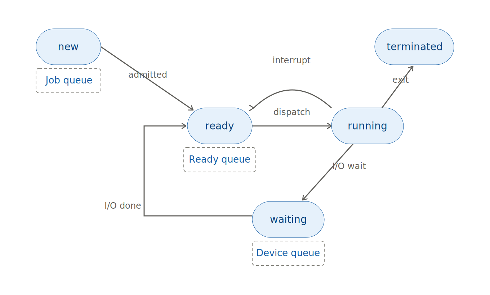
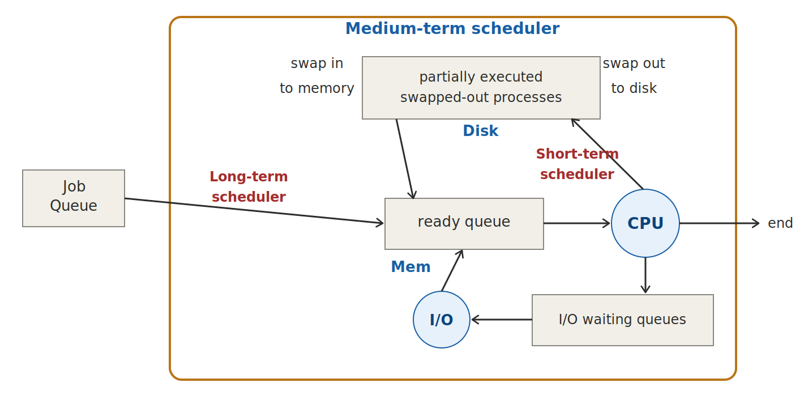

# 운영체제-프로세스

# 프로세스 (Process)

> <b>💡 한 줄 요약</b>
> 프로세스의 <b>개념과 상태</b>, OS가 프로세스를 관리하는 <b>PCB·스케줄러·큐</b>, 프로세스 간 <b>통신(IPC)</b> 방식까지 — 운영체제가 "실행 중인 프로그램"을 어떻게 다루는지 전체 흐름을 이해하는 단원입니다.

---

## 1. Process Concept

### 1.1 프로세스란?

> <b>"Process = a program in execution (실행 중인 프로그램)"</b>

| 구분 | 설명 |
| :--- | :--- |
| **Program** | 디스크에 저장된 코드 파일. 정적인 상태 |
| **Process** | 프로그램이 메모리에 올라와 실제로 실행되고 있는 상태 |

같은 프로그램을 두 번 실행하면 **프로세스는 2개**가 됩니다. 프로그램은 하나여도 프로세스는 각각 독립적으로 존재합니다.

> 💡 **job**과 **process**는 거의 같은 의미로 혼용됩니다. batch system에서는 job, time-shared system에서는 user program/task라고 부르던 역사적 차이일 뿐입니다.

### 1.2 프로세스의 메모리 구조

프로세스는 메모리에서 4개 영역을 차지합니다:

| 영역 | 담는 내용 | 크기 변화 |
| :--- | :--- | :--- |
| **text** | 프로그램 코드 자체 | 고정 |
| **data** | global variables (전역 변수) | 고정 |
| **heap** | 실행 중 동적으로 할당되는 메모리 (`malloc` 등) | 실행 중 확장 ↑ |
| **stack** | 임시 데이터 (function parameter, return address, local variables) | 실행 중 확장 ↓ |

여기에 **program counter**(다음에 실행할 명령어의 주소)와 **CPU registers**도 포함됩니다.

> 💡 heap은 아래에서 위로, stack은 위에서 아래로 자라며 서로를 향해 확장됩니다. 화살표(↑↓)는 **줄어드는 게 아니라 확장되는 방향**을 나타냅니다.

<details>
<summary>💡 "process는 program counter, stack, data section을 포함한다" — 메모리 4분할과 왜 안 맞는가?</summary>

이 둘은 층위가 다른 목록이라 1:1 매핑이 안 됩니다. **program counter는 메모리 영역이 아니라 CPU register 값**입니다. 두 층으로 나눠서 이해하면 깔끔합니다:

| 층위 | 구성 요소 | 설명 |
| :--- | :--- | :--- |
| **메모리 구조 (address space)** | text / data / heap / stack | 프로세스가 메모리에서 차지하는 공간 |
| **실행 상태 (context)** | program counter, CPU registers | CPU에 있다가 context switch 때 PCB에 저장되는 값 |

같은 프로그램으로 프로세스 2개를 띄우면 text(코드)는 동일하지만 PC, stack, data 값은 각자 다릅니다. 즉 교재의 목록은 "프로그램(text)에 무엇이 더해져야 process가 되는가"를 강조한 요약입니다 — 어디까지 실행했는지(PC), 실행 중 임시 데이터(stack), 현재 변수 값(data)이 그것입니다.
</details>

---

## 2. Process State

> <b>"프로세스는 생성부터 종료까지, 어느 시점이든 반드시 5가지 상태 중 정확히 하나에 있다"</b>

### 2.1 5가지 상태

| 상태 | 설명 | 핵심 포인트 |
| :--- | :--- | :--- |
| **new** | 프로세스가 막 생성되는 중. OS가 PCB를 만들고 pid를 부여하고 메모리를 준비 | long-term scheduler가 admit할 때까지 대기. "실행 준비 완료"가 아니라 "입장 심사 중" |
| **ready** | CPU를 **제외한** 모든 자원 확보 완료. CPU만 주면 즉시 실행 가능 | ready queue에서 대기. 동시에 여러 개 존재 가능 |
| **running** | CPU를 할당받아 명령어가 실행되고 있는 상태 | **CPU core 하나당 running은 최대 1개** (single-core 기준 시스템 전체에 하나뿐) |
| **waiting** | I/O 작업이나 event가 끝나기를 기다리는 상태 (blocked라고도 부름) | CPU를 줘봤자 할 일이 없어서 ready queue에서 빠져 device queue에서 대기 |
| **terminated** | 실행 종료 | OS가 자원 회수(deallocate)하고 PCB 정리 |

> 💡 **ready와 waiting의 차이**: 둘 다 "대기"지만, **ready는 CPU를 기다리고** **waiting은 event(I/O 완료 등)를 기다립니다.** ready는 당장 실행할 수 있는 상태, waiting은 CPU를 줘도 할 수 있는 게 없는 상태입니다.

### 2.2 상태 전이도



### 2.3 상태 전이 상세

| 전이 | 방향 | 트리거 | 무슨 일이 벌어지는가 |
| :--- | :--- | :--- | :--- |
| **① admitted** | new → ready | long-term scheduler가 승인 | PCB가 ready queue에 연결. CPU 할당 후보가 됨 |
| **② dispatch** | ready → running | short-term scheduler가 선택 | context switch 발생: PCB에서 PC·registers를 CPU로 복원(reload). 멈췄던 지점부터 이어서 실행 |
| **③ interrupt** | running → ready | time slice 만료, 높은 우선순위 프로세스 등장 | context switch 발생: 현재 PC·registers를 PCB에 저장(save). **CPU를 강제로 뺏기는** 것 |
| **④ I/O wait** | running → waiting | I/O 요청, event 대기 | 프로세스가 **스스로** CPU를 내려놓음. device queue로 이동 |
| **⑤ I/O done** | waiting → ready | I/O 완료, event 발생 | device queue에서 나와 ready queue로 이동. 다시 CPU 할당 후보가 됨 |
| **⑥ exit** | running → terminated | 마지막 statement 실행, 또는 abort | output data를 parent에게 전달. OS가 자원 회수 |

> ⚠️ **waiting → running 직행은 불가!** I/O가 끝났다고 바로 CPU를 받는 게 아니라, 반드시 ready를 거쳐 줄을 다시 서야 합니다. CPU를 주는 결정은 오직 scheduler(전이 ②)만 할 수 있기 때문입니다.

> 💡 핵심 정리
> - running에서 **나가는 길 3개**: 뺏기거나(→ready), 스스로 내려오거나(→waiting), 끝나거나(→terminated)
> - running으로 **들어오는 길 1개**: ready에서 scheduler dispatch로만
> - ready ↔ waiting **직접 이동 없음**

---

## 3. Process Control Block (PCB)

> <b>"OS가 각 프로세스를 관리하기 위해 만드는 정보 묶음. 프로세스마다 하나씩 존재"</b>

| 필드 | 내용 |
| :--- | :--- |
| **Process state** | new, ready, running, waiting, terminated |
| **Process number** | PID (고유 식별자) |
| **Program counter** | 다음에 실행할 명령어 주소 |
| **CPU registers** | 레지스터 값들 |
| **CPU scheduling info** | priority, 큐 포인터 등 |
| **Memory-management info** | base/limit register, page/segment table |
| **Accounting info** | CPU 사용 시간, job/process number 등 |
| **I/O status info** | 열어놓은 파일, 사용 중인 I/O 장치 목록 |

---

## 4. Context Switch

> <b>"CPU가 한 프로세스에서 다른 프로세스로 전환할 때, old process의 상태를 save하고 new process의 상태를 load하는 작업"</b>

| 항목 | 설명 |
| :--- | :--- |
| **과정** | save state into PCB₀ → reload state from PCB₁ |
| **overhead** | 전환하는 동안 시스템은 아무 유용한 일도 하지 않음. **순수한 비용** |
| **속도 결정 요인** | hardware support에 따라 다름 (레지스터 세트를 통째로 바꿔주는 HW가 있으면 빠름) |

> ⚠️ context switch가 너무 자주 일어나면 실제 작업보다 전환 비용이 커져서 오히려 성능이 떨어집니다.

---

## 5. Process Scheduling

### 5.1 Scheduling Queues

| Queue | 설명 |
| :--- | :--- |
| **Job queue** | 시스템에 존재하는 **모든** 프로세스의 집합 |
| **Ready queue** | 메모리에 올라와서 CPU 할당만 기다리는 프로세스들 |
| **Device queues** | 특정 I/O 장치를 기다리는 프로세스들 (장치마다 별도의 큐 존재) |

프로세스는 실행되는 동안 이 큐들 사이를 **migrate**(이동)합니다. 각 queue는 실제로 **PCB들의 linked list**로 구현됩니다. queue header가 head/tail 포인터를 갖고 있고, 그 뒤로 PCB들이 연결되어 있습니다.

#### running에서 CPU를 내려놓게 되는 대표 사건 4가지

| 사건 | 이후 |
| :--- | :--- |
| **I/O request** | 해당 장치의 I/O queue로 이동해 대기 |
| **time slice expired** | 할당 시간을 다 써서 ready queue로 복귀 |
| **fork a child** | child의 실행/종료를 기다림 |
| **wait for an interrupt** | interrupt가 발생할 때까지 대기 |

네 경우 모두 일이 해결되면 다시 ready queue로 돌아와 줄을 섭니다.

### 5.2 Schedulers



| Scheduler | 하는 일 | 실행 빈도 |
| :--- | :--- | :--- |
| **Long-term** (job scheduler) | 어떤 프로세스를 ready queue에 넣을지 선발 | 드물게 (seconds~minutes) → 느려도 됨 |
| **Short-term** (CPU scheduler) | ready queue에서 다음 실행할 프로세스를 선발해 CPU 할당 | 매우 자주 (milliseconds) → **빨라야 함** |
| **Medium-term** | 메모리 부족 시 일부 프로세스를 disk로 내림 (**swap out**), 필요하면 다시 올림 (**swap in**) | 필요할 때 |

위 다이어그램에서 확인할 수 있듯, Job queue에서 long-term scheduler를 거쳐 ready queue(메모리, Mem)로 들어오고, short-term scheduler가 ready queue에서 골라 CPU에 올립니다. 메모리가 부족하면 medium-term scheduler가 ready queue의 프로세스를 disk로 swap out했다가, 여유가 생기면 다시 swap in으로 ready queue에 복귀시킵니다. CPU에서 I/O를 요청하면 I/O waiting queue로 갔다가, 완료되면 다시 ready queue로 돌아옵니다.

> 💡 **Long-term scheduler가 degree of multiprogramming을 조절**합니다 (= 동시에 메모리에 올라와 있는 프로세스 개수). I/O-bound와 CPU-bound를 적절히 섞어서 선발해야 CPU와 I/O 장치가 골고루 일합니다.

### 5.3 I/O-bound vs CPU-bound

| 유형 | 특징 |
| :--- | :--- |
| **I/O-bound process** | 계산보다 I/O에 시간을 더 씀. **짧은 CPU burst가 많음** |
| **CPU-bound process** | 계산에 시간을 더 씀. **길고 적은 CPU burst** |

---

## 6. Process Creation

> <b>"Parent process가 children processes를 만들고, 자식이 또 자식을 만들어 tree of processes를 형성"</b>

프로세스가 생성될 때마다 **pid** (process id)를 부여받습니다. 순서대로 증가하는 고유값이라 생성 순서를 알 수 있고 같은 값은 불가합니다.

### 6.1 생성 시 결정사항

| 항목 | 선택지 |
| :--- | :--- |
| **Resource sharing** | 모든 자원 공유 / 일부만 공유 / 공유 없음 (child가 직접 확보) |
| **Execution** | parent와 child가 동시에(concurrently) 실행 / parent가 child 종료까지 wait |
| **Address space** | child가 parent의 복제본 (같은 프로그램·데이터) / child에 새 프로그램을 로드 (`fork` → `exec`) |

### 6.2 UNIX에서의 프로세스 생성

- **`fork()`** system call — 새 프로세스 생성. 자신의 복제본을 만듦
- **`exec()`** system call — fork **후에** 사용. 프로세스의 메모리 공간을 새 프로그램으로 교체

```c
pid = fork();                      // 프로세스 복제. 이 순간부터 둘이 됨
if (pid < 0) {                     // fork 실패
    fprintf(stderr, "Fork Failed");
    exit(-1);
}
else if (pid == 0) {               // child process (fork가 child에게는 0을 리턴)
    execlp("/bin/ls", "ls", NULL); // exec(): 새 프로그램(ls)으로 교체
}
else {                             // parent process (fork가 parent에게는 child의 pid를 리턴)
    wait(NULL);                    // child가 끝날 때까지 대기
    printf("Child Complete");
    exit(0);
}
```

> ⚠️ **fork()는 한 번 호출되지만 두 번 리턴합니다.**

| 리턴 대상 | 리턴값 | 의미 |
| :--- | :--- | :--- |
| parent | child의 pid (양수) | "내가 부모다" |
| child | 0 | "내가 자식이다" |
| 실패 시 | 음수 | fork 실패 |

이 리턴값으로 "내가 부모인지 자식인지"를 구분해서 각자 다른 코드를 실행합니다.

---

## 7. Process Termination

### 7.1 정상 종료 (`exit`)

- 프로세스가 마지막 statement를 실행하고 OS에게 삭제를 요청
- child의 output data가 parent에게 전달됨 (`wait`을 통해)
- 사용하던 resources는 OS가 **deallocate** (회수)

### 7.2 강제 종료 (`abort`)

parent가 child를 강제로 종료시킬 수 있는 경우:

| 사유 | 설명 |
| :--- | :--- |
| **자원 초과** | child가 할당된 자원을 초과 사용 |
| **불필요** | child에게 시킨 일이 더 이상 필요 없어짐 |
| **parent 종료** | 일부 OS는 parent가 죽으면 child도 못 살게 함 → 모든 자손이 연쇄 종료 = **cascading termination** |

---

## 8. Cooperating Processes

| 유형 | 설명 |
| :--- | :--- |
| **Independent process** | 다른 프로세스에 영향을 주지도 받지도 않음 |
| **Cooperating process** | 다른 프로세스와 서로 영향을 주고받음 |

### 협력의 장점

| 장점 | 설명 |
| :--- | :--- |
| **Information sharing** | 공유 정보에 동시 접근 가능 |
| **Computation speed-up** | divide & conquer로 여러 CPU에 나눠서 병렬 처리 |
| **Modularity** | 시스템 기능을 별도 프로세스로 분리 |
| **Convenience** | editing, printing, compiling을 동시에 진행 가능 |

---

## 9. Producer-Consumer Problem

> <b>"cooperating processes의 대표 패러다임: producer가 만든 정보를 consumer가 소비"</b>

| Producer | (buffer) | Consumer |
| :--- | :---: | :--- |
| compiler | assembly code | assembler |
| assembler | object module | loader |
| web server | HTML files, images | web browser |

중간에 **buffer**(임시 저장소)를 둡니다:

| 종류 | 설명 |
| :--- | :--- |
| **unbounded-buffer** | 크기 제한 없음 → 비현실적 |
| **bounded-buffer** | 고정 크기 → 현실적인 방식 |

### Bounded-Buffer 구현 (circular buffer)

```c
#define BUFFER_SIZE 10
item buffer[BUFFER_SIZE];
int in = 0;    // 다음에 넣을 위치
int out = 0;   // 다음에 꺼낼 위치
```

**Producer (Insert)**:
```c
while (true) {
    while (((in + 1) % BUFFER_SIZE) == out)
        ;  // buffer가 가득 참 → 대기
    buffer[in] = item;
    in = (in + 1) % BUFFER_SIZE;
}
```

**Consumer (Remove)**:
```c
while (true) {
    while (in == out)
        ;  // buffer가 비어있음 → 대기
    item = buffer[out];
    out = (out + 1) % BUFFER_SIZE;
}
```

| 조건 | 의미 |
| :--- | :--- |
| `in == out` | **비어있음** |
| `(in + 1) % BUFFER_SIZE == out` | **가득 참** |

> 💡 `% BUFFER_SIZE` 덕분에 인덱스가 끝에 도달하면 다시 0으로 돌아감 → 원형(circular) 구조

<details>
<summary>💡 왜 BUFFER_SIZE개가 아니라 BUFFER_SIZE - 1개까지만 사용 가능한가?</summary>

한 칸을 "꽉 참 / 비어있음" 구분용으로 희생하기 때문입니다. 만약 n칸을 전부 채우면 `in == out`이 되어 "비어있음"과 구분할 수 없어집니다.

```
BUFFER_SIZE = 4인 경우

비어있음:  in == out == 0     → [_, _, _, _]
가득 참:  in = 3, out = 0    → [X, X, X, _]  ← 3칸(n-1)만 사용

만약 4칸 다 채우면: in = 0, out = 0 → 비어있음과 같은 조건!
```

이 문제를 해결하려면 별도의 `count` 변수를 두거나 semaphore를 사용하면 되지만, 이 구현에서는 한 칸 희생으로 단순하게 해결합니다.
</details>

---

## 10. InterProcess Communication (IPC)

> <b>"프로세스들이 communicate(통신)하고 synchronize(동기화)하기 위한 메커니즘"</b>

IPC는 두 가지 operation을 제공:
- **send(message)** — message 크기는 fixed 또는 variable
- **receive(message)**

communication link의 구현 방식:
- **physical**: shared memory, hardware bus, switch, network 등 물리적 매체
- **logical**: direct/indirect, synchronous/asynchronous, automatic/explicit buffering

### 10.1 두 가지 Communication Model

| | Message Passing | Shared Memory |
| :--- | :--- | :--- |
| **방식** | kernel을 거쳐서 메시지 전달 | 공유 메모리 영역을 직접 읽고 씀 |
| **경로** | A → kernel → B | A → shared 영역 ← B |
| **특징** | 매번 kernel 개입 (느리지만 안전) | 초기 설정 후 kernel 개입 없음 (빠름) |

### 10.2 Direct Communication

프로세스가 **서로의 이름을 명시적으로 지정**:
- `send(P, message)` — process P에게 직접 전송
- `receive(Q, message)` — process Q로부터 직접 수신

| 특징 | 설명 |
| :--- | :--- |
| Link 성립 | 자동 |
| 프로세스 수 | **정확히 한 쌍**에만 연결 |
| Link 수 | 각 쌍 사이에 **정확히 하나** |
| 방향 | 보통 bi-directional |

### 10.3 Indirect Communication

**mailbox(= port)를 거쳐서** 통신:
- `send(A, message)` — mailbox A에 전송
- `receive(A, message)` — mailbox A에서 수신

| 특징 | 설명 |
| :--- | :--- |
| Link 성립 | mailbox를 공유하는 프로세스들끼리만 |
| 프로세스 수 | 한 link에 **여러 프로세스** 연결 가능 |
| Link 수 | 한 쌍이 **여러 link**(여러 mailbox) 공유 가능 |
| 방향 | unidirectional 또는 bi-directional |

<details>
<summary>⚠️ Indirect에서 P1이 send하고 P2, P3가 둘 다 receive하면 누가 메시지를 받아가는가?</summary>

해결책 3가지:

1. link를 최대 두 프로세스만 연결하도록 제한
2. 동시에 한 프로세스만 receive를 실행하도록 제한
3. 시스템이 임의로 receiver 선택 + **sender에게 누가 받았는지 알림**
</details>

### 10.4 Synchronization

| 유형 | 동기 방식 | send | receive |
| :--- | :--- | :--- | :--- |
| **Blocking** | synchronous | 상대가 받을 때까지 sender 멈춤 | 메시지가 올 때까지 receiver 멈춤 |
| **Non-blocking** | asynchronous | 보내고 바로 자기 할 일 계속 | 메시지가 있으면 받고, 없으면 null 받고 진행 |

### 10.5 Buffering

link에 붙는 message queue의 3가지 구현:

| 종류 | 크기 | sender 행동 | 동기 방식 |
| :--- | :--- | :--- | :--- |
| **Zero capacity** | 0 messages | receiver를 **무조건 기다림** (rendezvous) | blocking, synchronous |
| **Bounded capacity** | 유한 (n개) | link가 가득 차면 대기 | — |
| **Unbounded capacity** | 무한 | **절대 기다리지 않음** | non-blocking, asynchronous |

---

## 11. Client-Server Communication

네트워크로 연결된 시스템 간 통신 방법 3가지:

### 11.1 Sockets

> <b>"Socket = endpoint for communication (통신의 최종단). IP address + port의 조합"</b>

- `161.25.19.8:1625` → host `161.25.19.8`의 port `1625`
- 통신은 **한 쌍의 socket** 사이에서 이루어짐

| 서비스 | well-known port |
| :--- | :--- |
| telnet | 23 |
| ftp | 21 |
| web server (HTTP) | 80 |

### 11.2 Remote Procedure Calls (RPC)

> <b>"네트워크 너머의 다른 컴퓨터에 있는 procedure를 마치 내 로컬 함수처럼 호출하는 추상화"</b>

| 구성 요소 | 역할 |
| :--- | :--- |
| **client-side stub** | server를 찾고(locate), parameter를 포장(**marshall**)해서 전송 |
| **server-side stub** | 메시지를 받아 parameter를 풀고(unpack), server에서 실제 procedure 실행 |

### 11.3 Remote Method Invocation (RMI)

- RPC의 **Java 버전**
- 한 JVM의 Java program이 **다른 JVM에 있는 remote object의 method를 원격 호출**
- 흐름: client의 **stub** → (A, B, someMethod 전달) → remote object의 **skeleton** → 실행 → return value → client

---

## 💡 핵심 정리

| # | 핵심 포인트 |
| :--- | :--- |
| 1 | **Process = 실행 중인 프로그램.** 프로그램(정적) ≠ 프로세스(동적) |
| 2 | **5가지 상태**: new → ready → running → (waiting) → terminated. **waiting → running 직행 불가, 반드시 ready 경유** |
| 3 | **PCB**: OS가 프로세스마다 관리하는 정보 묶음. context switch 때 여기에 save/load |
| 4 | **Context switch는 순수 overhead** — 전환 중에는 유용한 일을 하나도 못 함 |
| 5 | **Scheduler 3종류**: long-term(선발, 느려도 됨) / short-term(CPU 할당, 빨라야 함) / medium-term(swap in/out) |
| 6 | **fork()는 한 번 호출, 두 번 리턴** — parent에겐 child pid, child에겐 0 |
| 7 | **Bounded buffer**: `in == out`이면 비어있음, 한 칸 희생해서 최대 $n-1$개만 사용 |
| 8 | **IPC 두 모델**: Message Passing (kernel 경유) vs Shared Memory (직접 공유) |
| 9 | **Blocking = synchronous, Non-blocking = asynchronous** |
| 10 | **Socket = IP + port**, RPC = 원격 함수 호출, RMI = RPC의 Java 버전 |
