# 네트워크

# 네트워크란?

> 두 대 이상의 장치(컴퓨터, 서버, 스마트폰 등)가 **자원을 공유하거나 데이터를 주고받기 위해 연결된 통신 구조**

- 장치들이 서로 연결되어 데이터를 교환할 수 있으면 그것을 네트워크라고 부른다.
- 네트워크는 **노드(node)** 와 **링크(link)** 로 이루어진다.

| 구성 요소 | 설명 | 예시 |
| --- | --- | --- |
| **노드(Node)** | 데이터를 주고받는 지점(장치) | 컴퓨터, 서버, 라우터, 스위치 |
| **링크(Link)** | 노드를 연결하는 통신 경로(매체) | 유선(케이블), 무선(Wi-Fi) |

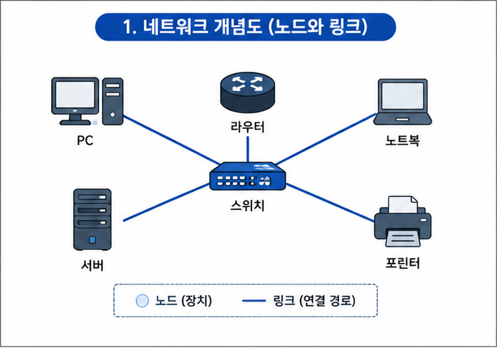

> 💡 **인터넷(Internet)** 은 이런 네트워크들이 서로 연결된 "네트워크의 네트워크(inter-network)"다. 우리가 매일 쓰는 웹, 메일, 게임 통신이 모두 이 위에서 동작한다.

</br>

---

</br>

# 네트워크 성능을 나타내는 지표

네트워크가 "얼마나 잘 동작하는가"는 아래 지표들로 측정한다. 하나씩 보기 전에 **고속도로 비유**로 감을 잡아보자.

### 💡 비유: 고속도로

| 고속도로 | 네트워크 |
| --- | --- |
| 도로의 최대 차선 수 | **대역폭(Bandwidth)** — 이론상 최대치 |
| 실제로 1분간 지나간 자동차 수 | **처리량(Throughput)** — 실제 전달량 |
| 출발지 → 도착지까지 걸린 시간 | **지연 시간(Latency)** |
| 지금 도로가 얼마나 차 있는가 (%) | **이용률(Utilization)** |
| 요금소 앞에 밀려서 대기 중인 차의 줄 | **큐 크기(Queue Size)** |
| 사고·공사로 막히는 가장 좁은 구간 | **병목(Bottleneck)** |

</br>

## 처리량 (Throughput)

> 링크를 통해 **단위 시간당 실제로 성공적으로 전달된** 데이터의 양

- 단위는 주로 **bps(bit per second)** 를 사용한다.
- 처리량에 영향을 주는 요소
    - **대역폭**의 크기
    - 네트워크 **사용자 수**
    - 전송 중 발생하는 **에러**나 **손실**
    - 중간에 거치는 **장치**의 성능

</br>

## 대역폭 (Bandwidth)

> 주어진 시간 동안 네트워크가 전송할 수 있는 **최대 비트 수** (이론상 최대 처리량)

- "차선 수"에 해당한다. 대역폭이 넓어도 실제 처리량(실제 지나간 차)은 그보다 작을 수 있다.
- **대역폭은 상한선, 처리량은 현실값**이라고 기억하면 쉽다.

</br>

## 지연 시간 (Latency)

> 요청이 처리되기까지, 또는 데이터가 **출발지에서 목적지까지 이동하는 데 걸리는 시간**

- 지연 시간에 영향을 주는 요소
    - 전송 **매체의 종류** (구리선 vs 광케이블 vs 무선)
    - 전송하는 **패킷의 크기**
    - 중간에 거치는 **라우터의 수**

> 📌 흔히 말하는 **핑(ping)** 이 바로 이 왕복 지연 시간(RTT, Round Trip Time)을 재는 것이다.

</br>

## 이용률 (Utilization)

> 네트워크 자원(대역폭)이 **실제로 얼마나 사용되고 있는지**를 나타내는 비율(%)

- 이용률이 지나치게 높으면(포화 상태에 가까우면) 지연과 큐 대기가 급격히 늘어난다.
- 반대로 너무 낮으면 자원을 낭비하고 있다는 뜻이다.

</br>

## 큐 크기 (Queue Size)

> 라우터·스위치가 한 번에 처리하지 못한 패킷을 **잠시 저장해두는 버퍼(큐)에 쌓인 양**

- 들어오는 속도 > 처리하는 속도 → 큐에 패킷이 쌓인다 → **지연 증가**.
- 큐가 가득 차면 그 뒤에 오는 패킷은 버려진다 → **패킷 손실(packet drop)**.
- 큐가 길어지는 구간이 곧 **병목**이 되기 쉽다.

</br>

### 📌 지표 한눈에 정리

| 지표 | 한 줄 정의 | 좋은 상태 |
| --- | --- | --- |
| 대역폭 | 이론상 최대 전송량 | 넓을수록 좋음 |
| 처리량 | 실제 전송량 | 높을수록 좋음 |
| 지연 시간 | 도달까지 걸린 시간 | 낮을수록 좋음 |
| 이용률 | 자원 사용 비율 | 적정 수준 유지 |
| 큐 크기 | 대기 중인 패킷 양 | 작을수록 좋음 |

</br>

---

</br>

# 네트워크 토폴로지와 병목 현상

## 토폴로지(Topology)란?

> 네트워크에서 **노드와 링크가 물리적/논리적으로 배치된 형태(구조)**

- 어떤 토폴로지를 쓰느냐에 따라 **설치 비용, 확장성, 장애 대응력**이 달라진다.

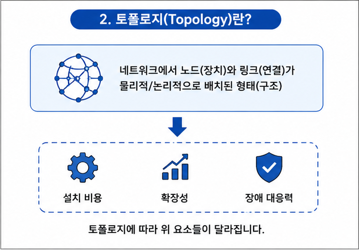

</br>

## 토폴로지의 종류

| 토폴로지 | 구조 | 장점 | 단점 |
| --- | --- | --- | --- |
| **버스형(Bus)** | 하나의 중앙 케이블(백본)에 모든 노드 연결 | 설치 쉽고 저렴, 노드 추가 용이 | 백본 장애 시 전체 마비, 트래픽 많으면 충돌 |
| **스타형(Star)** | 중앙 장치(허브/스위치)에 모든 노드 연결 | 관리 쉬움, 한 노드 장애가 전체에 영향 없음 | 중앙 장치 고장 시 전체 마비, 비용↑ |
| **링형(Ring)** | 각 노드가 양옆 두 노드와 연결되어 원형을 이룸 | 충돌이 적음(토큰 방식) | 한 노드·링크 장애가 전체에 영향(이중 링으로 보완) |
| **트리형(Tree)** | 스타형을 계층적으로 확장한 형태 | 확장이 쉽고 관리가 체계적 | 상위 노드 장애 시 하위 전체에 영향 |
| **메시형(Mesh)** | 노드들이 서로 직접 그물처럼 연결 | 장애에 강하고 트래픽 분산 | 연결 수 폭증(비용·구성 복잡) |

> 💡 메시형에서 노드가 n개일 때 완전 연결에 필요한 링크 수는 **n(n-1)/2** 개다. 노드가 늘수록 링크가 기하급수적으로 증가하는 이유다.

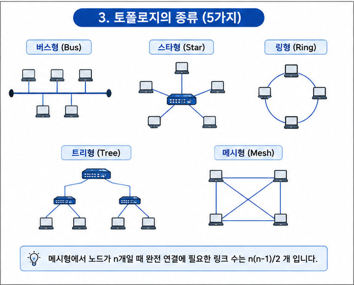

</br>

## 병목 현상 (Bottleneck)

> 전체 네트워크의 성능이 **가장 느린 구간(가장 좁은 링크 또는 가장 느린 장치)** 에 의해 제한되는 현상

- 아무리 다른 구간이 빨라도, **한 곳이 느리면 전체 속도가 그 수준으로 떨어진다.**
- 병목 지점에서는 큐에 패킷이 쌓이고, 그 결과 **지연 증가·패킷 손실**이 발생한다.

```
[집 PC] --1Gbps--> [공유기] --100Mbps--> [ISP] --1Gbps--> [서버]
                             ▲
                        여기가 병목 (전체 속도 ≈ 100Mbps)
```

> 📌 **토폴로지와 병목의 관계**: 버스형처럼 하나의 경로에 트래픽이 몰리는 구조는 그 경로가 곧 병목이 된다. 반대로 메시형은 경로가 여러 개라 트래픽을 분산해 병목이 잘 생기지 않는다.

</br>

---

</br>

# 컴퓨터 통신 프로토콜이란?

> 서로 다른 장치들이 데이터를 주고받기 위해 **미리 정해둔 규칙·약속의 집합**

</br>

### 💡 비유: 서로 다른 언어를 쓰는 사람들

한국인과 프랑스인이 대화하려면 **공통의 언어**가 필요하다. 이 "공통 언어에 대한 약속"이 프로토콜이다.
제조사도, 운영체제도, 사용하는 언어도 제각각인 전 세계 컴퓨터들이 소통할 수 있는 이유는 **같은 프로토콜을 지키기로 약속**했기 때문이다.

</br>

### 프로토콜의 3요소

| 요소 | 의미 | 예시 |
| --- | --- | --- |
| **구문(Syntax)** | 데이터의 형식·부호화 방식 | "앞 8비트는 주소, 뒤 8비트는 데이터" |
| **의미(Semantics)** | 각 부분이 무엇을 뜻하는지, 어떻게 처리할지 | "이 비트가 1이면 오류" |
| **타이밍(Timing)** | 언제, 얼마나 빠르게 보낼지 | "응답은 3초 안에 보낼 것" |

> 💡 우리가 뒤에서 배울 **TCP, IP, HTTP** 가 모두 이런 프로토콜의 대표적인 예다.

</br>

---

</br>

# OSI 7계층과 TCP/IP 4계층

네트워크 통신은 매우 복잡하기 때문에, 이를 **역할별로 층층이 나눠서(계층화)** 관리한다.
계층화를 하면 특정 계층에 문제가 생겨도 다른 계층에 영향을 주지 않고, 각 계층을 독립적으로 개선·교체할 수 있다.

</br>

## OSI 7계층 (OSI 7 Layer)

> 국제표준화기구(ISO)가 정의한 **네트워크 통신의 표준 참조 모델**. 통신 과정을 7개의 계층으로 나눈다.

| 계층 | 이름 | 역할 | 전송 단위(PDU) | 대표 예 |
| --- | --- | --- | --- | --- |
| **7** | 응용(Application) | 사용자와 직접 맞닿는 서비스 | 데이터 | HTTP, FTP, DNS |
| **6** | 표현(Presentation) | 데이터 형식 변환, 암호화, 압축 | 데이터 | JPEG, SSL/TLS |
| **5** | 세션(Session) | 통신 연결의 시작·유지·종료 관리 | 데이터 | 세션 관리 |
| **4** | 전송(Transport) | 종단 간 신뢰성 있는 데이터 전달, 포트 | 세그먼트 | TCP, UDP |
| **3** | 네트워크(Network) | 목적지까지의 경로 선택(라우팅), 주소 | 패킷 | IP, 라우터 |
| **2** | 데이터 링크(Data Link) | 인접 노드 간 전송, 오류 검출, MAC 주소 | 프레임 | 스위치, 이더넷 |
| **1** | 물리(Physical) | 비트를 전기·광 신호로 변환해 전송 | 비트 | 케이블, 허브, 리피터 |

> 📌 계층 순서 암기법(하위→상위): **물리 - 데이터링크 - 네트워크 - 전송 - 세션 - 표현 - 응용**
> "**물**리적으로 **데**이터를 **네** **전****세** **표****응**" 처럼 자신만의 문장을 만들어 외우면 좋다.

> 🎯 **핵심 포인트**
> - **계층별 PDU(전송 단위)**: 전송 → **세그먼트**, 네트워크 → **패킷**, 데이터링크 → **프레임**, 물리 → **비트**
> - **계층별 대표 프로토콜/장비**: 네트워크 → IP·라우터, 데이터링크 → 스위치·MAC, 전송 → TCP·UDP
> - 어떤 프로토콜이 몇 계층에 속하는지 함께 외워두면 좋다. (예: **IP = 3계층**, **TCP/UDP = 4계층**)

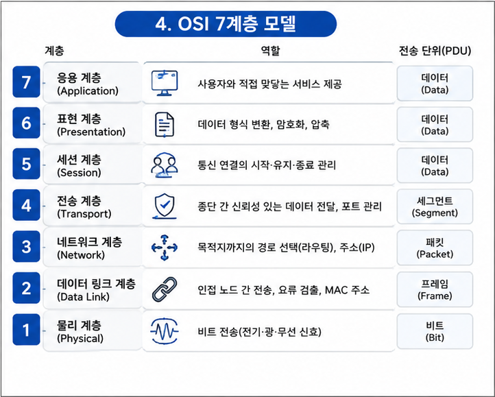

</br>

### 캡슐화와 역캡슐화 (Encapsulation / Decapsulation)

데이터는 계층을 내려갈 때마다 각 계층의 **헤더(header)** 가 덧붙는다. 이 과정을 **캡슐화**라 하고, 받는 쪽에서 하나씩 벗겨내는 과정을 **역캡슐화**라 한다.

```
보내는 쪽 (캡슐화 ↓)                받는 쪽 (역캡슐화 ↑)
[데이터]                            [데이터]
  ↓ +TCP 헤더                          ↑ TCP 헤더 제거
[세그먼트]                          [세그먼트]
  ↓ +IP 헤더                           ↑ IP 헤더 제거
[패킷]                              [패킷]
  ↓ +MAC 헤더                          ↑ MAC 헤더 제거
[프레임] → 비트로 전송 ───────────→ [프레임]
```

> 💡 편지를 봉투에 넣고(캡슐화), 그 봉투를 다시 소포 상자에 넣는 것과 같다. 받는 사람은 상자 → 봉투 → 편지 순으로 하나씩 열어본다(역캡슐화).

</br>

## TCP/IP 4계층 (TCP/IP Model)

> 실제 인터넷에서 사용하는 **현실적인 프로토콜 모델**. OSI 7계층을 4개로 단순화한 형태다.

| 계층 | 이름 | OSI 대응 | 대표 프로토콜 |
| --- | --- | --- | --- |
| **4** | 응용(Application) | 응용+표현+세션(5~7) | HTTP, DNS, FTP |
| **3** | 전송(Transport) | 전송(4) | TCP, UDP |
| **2** | 인터넷(Internet) | 네트워크(3) | IP, ICMP |
| **1** | 네트워크 액세스(Network Access) | 데이터링크+물리(1~2) | 이더넷, Wi-Fi |

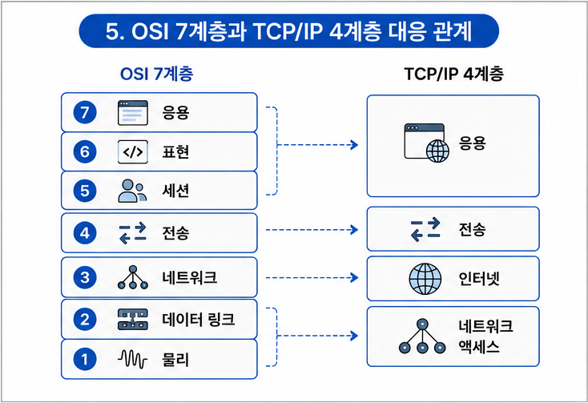

</br>

### OSI vs TCP/IP 비교

| 구분 | OSI 7계층 | TCP/IP 4계층 |
| --- | --- | --- |
| 목적 | 이론·교육용 **참조 모델** | 실제 **구현·인터넷 표준** |
| 계층 수 | 7개 (세분화) | 4개 (통합·단순화) |
| 활용 | 개념 이해·문제 진단 | 실제 통신 |

> 💡 **면접 포인트**: "OSI는 이론, TCP/IP는 실전"이라고 이해하면 된다. 둘 다 하위→상위로 갈수록 사람에게 가까운(추상적인) 역할을 맡는다.

</br>

---

</br>

# 네트워크 기기

네트워크 기기는 **어느 계층에서 동작하느냐**에 따라 처리할 수 있는 정보의 범위가 다르다.
상위 계층 기기는 하위 계층의 정보까지 다룰 수 있지만, 하위 계층 기기는 상위 계층 정보를 다룰 수 없다.

| 계층 | 대표 기기 | 하는 일 |
| --- | --- | --- |
| **응용~전송 (L4~L7)** | 로드 밸런서, L7 스위치 | 트래픽 분산, 콘텐츠 기반 라우팅 |
| **네트워크 (L3)** | 라우터, L3 스위치 | IP 기반 경로 선택(라우팅) |
| **데이터 링크 (L2)** | 스위치, 브리지 | MAC 주소 기반 전달 |
| **물리 (L1)** | 허브, 리피터, NIC, 케이블 | 신호 전달·증폭 |

</br>

## 물리 계층(L1) 기기

- **리피터(Repeater)**: 약해진 신호를 **증폭·재생성**해서 멀리 보낸다. (요즘은 거의 다른 장비에 흡수됨)
- **허브(Hub)**: 여러 노드를 연결하는 장치. 들어온 신호를 **연결된 모든 포트로 그대로 전달**(broadcast)한다. → 불필요한 트래픽·충돌 발생.
- **NIC(Network Interface Card)**: 컴퓨터를 네트워크에 연결하는 랜카드. 고유한 **MAC 주소**를 가진다.

</br>

## 데이터 링크 계층(L2) 기기

- **브리지(Bridge)**: 두 개의 네트워크(LAN)를 연결하고, MAC 주소를 보고 필요한 쪽으로만 전달한다.
- **스위치(Switch)**: 허브의 업그레이드 버전. **MAC 주소를 학습**해서, 목적지 포트로만 데이터를 보낸다. → 허브보다 훨씬 효율적.

> 💡 **허브 vs 스위치**: 허브는 "모두에게 소리치기", 스위치는 "받는 사람에게만 조용히 전달". 그래서 스위치가 충돌이 적고 빠르다.

</br>

## 네트워크 계층(L3) 기기

- **라우터(Router)**: 서로 다른 네트워크를 연결하고, **IP 주소를 기반으로 최적 경로를 찾아(라우팅)** 패킷을 전달한다. 가정용 "공유기"가 라우터의 대표 예다.
- **L3 스위치**: 스위치에 라우팅 기능을 더한 장비.

</br>

## 응용~전송 계층(L4~L7) 기기

- **로드 밸런서(Load Balancer)**: 여러 서버에 **트래픽을 골고루 분산**시켜 과부하와 병목을 방지한다.
    - **L4 로드 밸런서**: IP·포트 기반 분산
    - **L7 로드 밸런서**: URL·쿠키 등 애플리케이션 정보 기반 분산

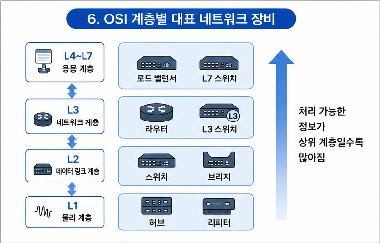

</br>

---

</br>

# IP 주소 체계

## IP 주소란?

> 네트워크 상에서 각 장치를 **식별하기 위한 고유한 주소** (인터넷 세계의 "집 주소")

- 데이터를 정확한 목적지로 보내려면 상대의 IP 주소를 알아야 한다.
- 크게 **IPv4** 와 **IPv6** 두 가지 체계가 있다.

</br>

## IPv4

> **32비트** 길이의 주소. 8비트씩 4개(옥텟)로 나눠 **점 십진 표기법**으로 쓴다.

```
      192   .   168   .    0    .    1
    [8비트]   [8비트]   [8비트]   [8비트]   = 총 32비트
   각 옥텟은 0 ~ 255 범위의 값을 가진다.
```

- 표현할 수 있는 주소 수: 2³² ≈ **약 43억 개**
- 인터넷 사용자가 폭증하면서 **IPv4 주소가 고갈** → IPv6와 NAT 기술이 등장한 배경.

</br>

### 네트워크 부분과 호스트 부분

IP 주소는 **네트워크 부분**(어느 네트워크인가)과 **호스트 부분**(그 네트워크 안 어느 장치인가)으로 나뉜다.

- **서브넷 마스크(Subnet Mask)**: 어디까지가 네트워크 부분인지 구분해주는 값. 예) `255.255.255.0`
- **CIDR 표기법**: `192.168.0.1/24` 처럼 `/뒤의 숫자`로 네트워크 부분의 비트 수를 표시한다. (`/24` = 앞 24비트가 네트워크)

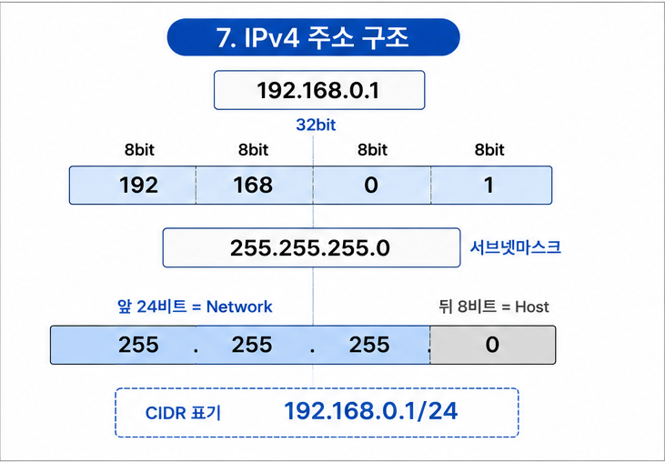

</br>

### IP 클래스 (Class)

과거에는 주소를 클래스 단위로 나눴다. (현재는 CIDR 방식이 주류)

| 클래스 | 범위(첫 옥텟) | 용도 |
| --- | --- | --- |
| **A** | 0 ~ 127 | 대규모 네트워크 |
| **B** | 128 ~ 191 | 중규모 네트워크 |
| **C** | 192 ~ 223 | 소규모 네트워크 |
| **D** | 224 ~ 239 | 멀티캐스트 |
| **E** | 240 ~ 255 | 연구·예약용 |

</br>

### 공인 IP vs 사설 IP, 그리고 NAT

| 구분 | 공인 IP(Public) | 사설 IP(Private) |
| --- | --- | --- |
| 범위 | 인터넷 전체에서 유일 | 내부 네트워크에서만 사용 |
| 할당 | ISP(통신사)가 부여 | 공유기가 부여 |
| 예시 | `1.1.1.1` | `192.168.0.x`, `10.0.0.x` |

> 💡 **NAT(Network Address Translation)**: 집 안의 여러 기기(사설 IP)가 **하나의 공인 IP를 공유**해서 인터넷에 나가게 해주는 기술. IPv4 고갈을 늦춘 핵심 기술이다.

</br>

## 서브네팅 (Subnetting)

> 하나의 큰 네트워크를 **여러 개의 작은 네트워크(서브넷)로 나누는 것**

- 목적: IP 주소 낭비를 줄이고, 네트워크를 **관리·보안 단위로 분리**하기 위함.
- 호스트 부분의 비트를 일부 빌려와 네트워크 부분으로 사용한다.

### 핵심 계산 공식

| 구하는 값 | 공식 |
| --- | --- |
| **서브넷당 호스트 수** | 2^(호스트 비트 수) − 2 |
| **서브넷 개수** | 2^(빌려온 비트 수) |

> 📌 호스트 수에서 **2를 빼는 이유**: 각 서브넷의 첫 주소는 **네트워크 주소**, 마지막 주소는 **브로드캐스트 주소**로 예약되어 실제 장치에 줄 수 없기 때문이다.

### 계산 예제

`192.168.1.0/24` 네트워크를 **/26** 으로 서브네팅 해보자.

```
/24  →  /26   : 호스트 비트에서 2비트를 네트워크 쪽으로 빌려옴

• 서브넷 마스크      : 255.255.255.192   (마지막 옥텟 11000000)
• 호스트 비트 수     : 32 − 26 = 6
• 서브넷당 호스트 수 : 2^6 − 2 = 62개
• 서브넷 개수        : 2^(26−24) = 2^2 = 4개
```

| 서브넷 | 네트워크 주소 | 사용 가능 범위 | 브로드캐스트 |
| --- | --- | --- | --- |
| 1 | 192.168.1.0 | .1 ~ .62 | 192.168.1.63 |
| 2 | 192.168.1.64 | .65 ~ .126 | 192.168.1.127 |
| 3 | 192.168.1.128 | .129 ~ .190 | 192.168.1.191 |
| 4 | 192.168.1.192 | .193 ~ .254 | 192.168.1.255 |

### FLSM vs VLSM

| 구분 | FLSM (고정 길이) | VLSM (가변 길이) |
| --- | --- | --- |
| 방식 | 모든 서브넷을 **같은 크기**로 분할 | 필요에 따라 **크기를 다르게** 분할 |
| 장점 | 계산·관리가 단순 | IP 주소 낭비가 적음 |
| 단점 | IP 낭비 발생 | 설계가 다소 복잡 |

> 🎯 **핵심 포인트**
> - `2^(호스트 비트) − 2` 로 **사용 가능한 호스트 수**를 구하는 계산이 가장 중요하다.
> - **서브넷 마스크 ↔ /프리픽스(CIDR)** 변환을 익혀두자. (예: `/26` = `255.255.255.192`)
> - **VLSM** = "가변 길이 서브넷 마스크", IP를 효율적으로 쓰기 위한 방식임을 기억할 것.

</br>

## IPv6

> IPv4 고갈 문제를 해결하기 위한 **128비트** 주소 체계.

- 16비트씩 8그룹, **콜론(:) 16진수 표기**. 예) `2001:0db8:85a3::8a2e:0370:7334`
- 표현 가능한 주소 수: 2¹²⁸ ≈ 거의 무한대.

</br>

## DNS (Domain Name System)

> 사람이 외우기 쉬운 **도메인 이름을 IP 주소로 변환**해주는 시스템 (인터넷의 "전화번호부")

- 우리는 `142.250.x.x` 대신 `google.com` 을 입력한다. 이를 실제 IP로 바꿔주는 게 DNS다.

```
사용자: "google.com 접속!"
   ↓
DNS 서버에 "google.com의 IP가 뭐야?" 질의
   ↓
DNS 서버: "142.250.x.x 입니다"
   ↓
그 IP로 실제 접속
```

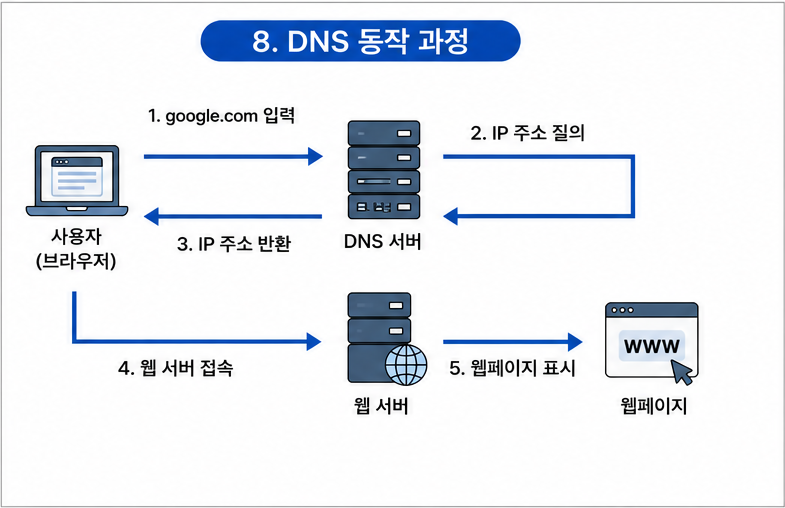

</br>

---

</br>

# 라우팅(Routing)과 경로 제어

> 출발지에서 목적지까지 패킷이 지나갈 **최적의 경로를 결정하는 과정**. 네트워크 계층(L3)의 **라우터**가 담당한다.

</br>

## 정적 라우팅 vs 동적 라우팅

| 구분 | 정적 라우팅(Static) | 동적 라우팅(Dynamic) |
| --- | --- | --- |
| 경로 설정 | 관리자가 **수동**으로 지정 | 라우터가 **자동**으로 학습·갱신 |
| 장점 | 안정적, 보안↑, 부하 적음 | 망 변화에 자동 대응, 대규모에 적합 |
| 단점 | 망 변화에 대응이 어려움 | 라우터 부하·트래픽 증가 |

</br>

## 경로 제어 프로토콜의 분류

라우팅 프로토콜은 적용 범위에 따라 **IGP** 와 **EGP** 로 나뉜다.

| 분류 | 의미 | 대표 프로토콜 |
| --- | --- | --- |
| **IGP** (Interior Gateway Protocol) | AS **내부**의 라우팅 | RIP, OSPF |
| **EGP** (Exterior Gateway Protocol) | AS **간(외부)** 라우팅 | BGP |

> [!NOTE]
> **AS(Autonomous System, 자율 시스템)**: 하나의 관리 주체(예: 한 통신사)가 관리하는 네트워크 집단. 인터넷은 이런 AS들이 서로 연결된 구조다.

</br>

## 거리 벡터 vs 링크 상태

동적 라우팅의 두 가지 대표 방식이다.

| 구분 | 거리 벡터(Distance Vector) | 링크 상태(Link State) |
| --- | --- | --- |
| 원리 | 인접 라우터와 **라우팅 테이블 전체**를 주기적 교환 | 전체 네트워크 **지도(토폴로지)** 를 각자 구성 |
| 경로 계산 | 벨만-포드(Bellman-Ford) | 다익스트라(Dijkstra) |
| 정보 전파 | 주기적으로 이웃에게만 | 변화가 있을 때 전체에 |
| 대표 | RIP | OSPF |

</br>

## 대표 라우팅 프로토콜 비교

| 프로토콜 | 방식 | 경로 결정 기준 | 특징 |
| --- | --- | --- | --- |
| **RIP** | 거리 벡터 | 홉 수(hop count) | 소규모, **최대 홉 15**, 30초 주기 갱신 |
| **OSPF** | 링크 상태 | 비용(cost) | 대규모, 다익스트라, 빠른 수렴 |
| **BGP** | 경로 벡터 | AS 경로 | AS 간 라우팅, 인터넷 백본 |

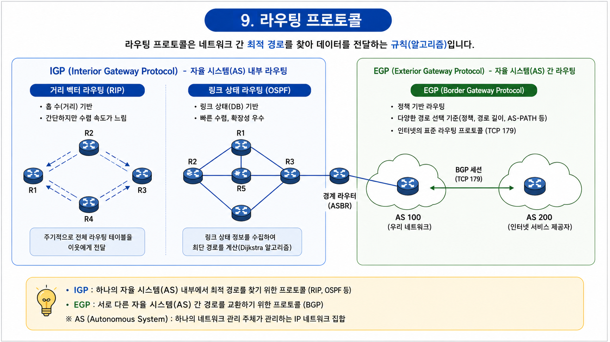

> 🎯 **핵심 포인트**
> - **RIP**: 거리 벡터 · 홉 카운트 · **최대 홉 수 15**(16 = 도달 불가) · 벨만-포드
> - **OSPF**: 링크 상태 · **다익스트라(최단 경로)** · 대규모 · IGP
> - **BGP**: **AS 간(EGP)** 경로 제어 · 인터넷의 근간
> - **IGP(RIP·OSPF) ↔ EGP(BGP)** 를 구분해서 이해하는 것이 핵심이다.

</br>

---

</br>

# TCP와 UDP

전송 계층(L4)의 대표 프로토콜 두 가지. **신뢰성이 중요하면 TCP, 속도가 중요하면 UDP**를 쓴다.

## TCP (Transmission Control Protocol)

> **연결 지향형** 프로토콜. 데이터를 **순서대로, 빠짐없이, 정확하게** 전달하는 것을 보장한다.

- 특징: 연결 설정 후 통신, 순서 보장, 손실 시 재전송, 흐름·혼잡 제어.
- 신뢰성이 높은 대신 상대적으로 **느리다**.
- 사용 예: 웹(HTTP), 이메일, 파일 전송 등 **정확성이 중요한 통신**.

</br>

### 3-way handshake (연결 수립)

TCP는 통신 전에 서로 "연결됐는지" 확인하는 **3단계 악수**를 한다.

```
클라이언트                          서버
    │  ── SYN ──────────────────▶   │   ① "연결해도 될까?"
    │                                │
    │  ◀───────── SYN + ACK ──────  │   ② "좋아, 너도 준비됐어?"
    │                                │
    │  ── ACK ──────────────────▶   │   ③ "응, 시작하자!"
    │                                │
    │        (연결 수립 완료)         │
```

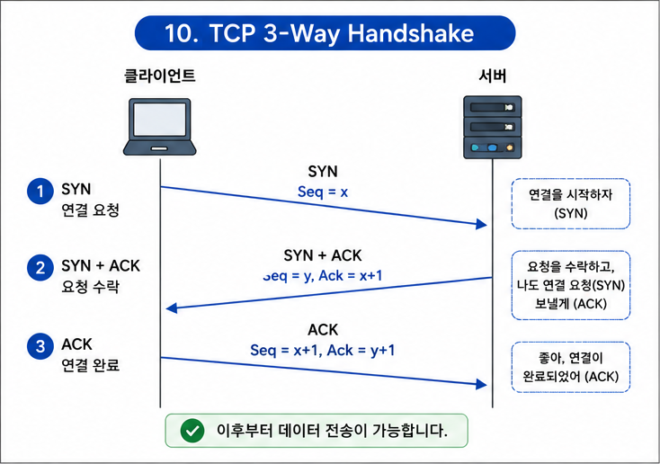

</br>

## UDP (User Datagram Protocol)

> **비연결형** 프로토콜. 연결 과정 없이 데이터를 **일단 빠르게 보낸다.**

- 특징: 연결 설정 없음, 순서·도착 보장 없음, 재전송 없음.
- 신뢰성은 낮지만 **매우 빠르고 가볍다**.
- 사용 예: 실시간 스트리밍, 온라인 게임, DNS 등 **속도가 중요한 통신**.

</br>

### TCP vs UDP 비교

| 구분 | TCP | UDP |
| --- | --- | --- |
| 연결 방식 | 연결형(handshake 필요) | 비연결형 |
| 신뢰성 | 높음(순서·재전송 보장) | 낮음 |
| 속도 | 상대적으로 느림 | 빠름 |
| 사용 예 | 웹, 메일, 파일 전송 | 스트리밍, 게임, DNS |

</br>

## 포트 번호 (Port)

> IP가 "어느 컴퓨터"인지 가리킨다면, 포트는 그 컴퓨터의 **"어느 프로그램(서비스)"** 인지 가리킨다.

- 16비트, **0 ~ 65535** 범위. 그중 0~1023은 잘 알려진 서비스가 쓰는 **well-known 포트**다.

| 포트 | 서비스 |
| --- | --- |
| 80 | HTTP |
| 443 | HTTPS |
| 53 | DNS |
| 22 | SSH |

> 💡 **IP는 아파트 주소, 포트는 몇 호(방)** 라고 생각하면 된다.

</br>

---

</br>

# HTTP (HyperText Transfer Protocol)

## HTTP란?

> 웹에서 **클라이언트(브라우저)와 서버가 데이터를 주고받기 위한** 응용 계층 프로토콜

- 우리가 웹사이트에 접속할 때 브라우저가 서버에 **요청(Request)** 을 보내고, 서버가 **응답(Response)** 을 돌려주는 방식으로 동작한다.
- **무상태(Stateless)** 프로토콜이다 — 각 요청은 서로 독립적이며, 서버는 이전 요청을 기억하지 않는다.

```
[브라우저] ── 요청(Request) ──▶ [웹 서버]
[브라우저] ◀─ 응답(Response) ── [웹 서버]
```

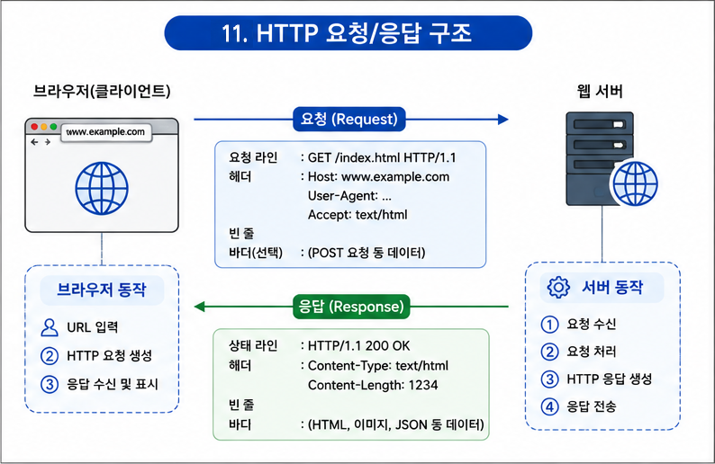

</br>

## HTTP 메서드 (Method)

> 클라이언트가 서버에게 **"무엇을 해달라"** 고 요청하는 동작의 종류

| 메서드 | 역할 |
| --- | --- |
| **GET** | 데이터 조회(읽기) |
| **POST** | 데이터 생성(등록) |
| **PUT** | 데이터 전체 수정(교체) |
| **PATCH** | 데이터 일부 수정 |
| **DELETE** | 데이터 삭제 |

</br>

## HTTP 상태 코드 (Status Code)

> 서버가 요청 처리 결과를 **세 자리 숫자**로 알려주는 응답 코드

| 범위 | 의미 | 대표 예 |
| --- | --- | --- |
| **1xx** | 정보 | 100 Continue |
| **2xx** | 성공 | 200 OK, 201 Created |
| **3xx** | 리다이렉션 | 301 Moved, 304 Not Modified |
| **4xx** | 클라이언트 오류 | 400 Bad Request, 403 Forbidden, 404 Not Found |
| **5xx** | 서버 오류 | 500 Internal Server Error, 503 Service Unavailable |

> 💡 앞자리만 봐도 대략의 상황을 알 수 있다. **4xx = 내(클라이언트) 잘못, 5xx = 서버 잘못**.

</br>

## HTTP 버전의 발전

| 버전 | 특징 |
| --- | --- |
| **HTTP/1.0** | 요청마다 매번 연결을 새로 맺음 |
| **HTTP/1.1** | 연결 재사용(keep-alive)으로 성능 개선 |
| **HTTP/2** | 하나의 연결로 여러 요청 동시 처리(멀티플렉싱) |
| **HTTP/3** | TCP 대신 UDP 기반(QUIC)으로 지연 감소 |

</br>

## HTTPS (HTTP Secure)

> **HTTP + 암호화(SSL/TLS)**. 주고받는 데이터를 암호화해 도청·위변조를 막는다.

- 기본 포트는 **443**번.
- 브라우저 주소창의 **자물쇠 아이콘**이 HTTPS로 안전하게 연결됐다는 표시다.

> ⚠️ 로그인·결제처럼 민감한 정보를 다루는 사이트는 반드시 HTTPS를 써야 한다. HTTP는 데이터가 평문으로 오가서 중간에서 그대로 볼 수 있다.

</br>

## 쿠키와 세션

HTTP는 **무상태**라서 "로그인 유지" 같은 기능을 그대로는 구현할 수 없다. 이를 보완하는 것이 쿠키와 세션이다.

| 구분 | 쿠키(Cookie) | 세션(Session) |
| --- | --- | --- |
| 저장 위치 | 클라이언트(브라우저) | 서버 |
| 보안 | 상대적으로 취약 | 상대적으로 안전 |
| 용도 | 자동 로그인, 방문 기록 | 로그인 상태 유지 |

> 💡 쿠키는 "손님이 들고 다니는 번호표", 세션은 "가게가 보관하는 손님 명단"에 비유할 수 있다.

</br>

---

## 🔗 전체 흐름으로 복습하기 (`google.com` 접속 과정)

```
① 브라우저에 google.com 입력
     ↓ (DNS) 도메인 → IP 주소로 변환
② 서버의 IP 주소를 알아냄
     ↓ (TCP) 3-way handshake로 연결 수립
③ 서버와 연결 완료
     ↓ (HTTP) GET 요청 전송
④ 서버가 200 OK와 함께 HTML 응답
     ↓ (라우터·스위치를 거쳐 캡슐화/역캡슐화)
⑤ 브라우저가 화면에 페이지를 그림
```

이 한 번의 접속 안에 **DNS, IP, TCP, HTTP, 네트워크 기기, 계층 구조**가 모두 맞물려 동작한다.

</br>

---

</br>

# 📚 핵심 프로토콜·용어 정리

네트워크를 공부하며 자주 마주치는 핵심 프로토콜과 용어를 한곳에 모았다.

</br>

## TCP/IP 주요 프로토콜

| 프로토콜 | 풀네임 | 하는 일 |
| --- | --- | --- |
| **ARP** | Address Resolution Protocol | **IP 주소 → MAC 주소** 변환 |
| **RARP** | Reverse ARP | **MAC 주소 → IP 주소** 변환 |
| **ICMP** | Internet Control Message Protocol | 오류·상태 메시지 전달 (**ping**이 사용) |
| **IGMP** | Internet Group Management Protocol | 멀티캐스트 그룹 관리 |
| **DHCP** | Dynamic Host Configuration Protocol | IP 주소 **자동 할당** |

> 🎯 **핵심 포인트**: ARP는 **IP→MAC**, RARP는 **MAC→IP**. 방향을 헷갈리지 말 것! ICMP는 오류 보고(ping)를 담당한다는 점도 함께 기억하자.

</br>

## 데이터 전송 방식 (캐스트)

| 방식 | 대상 | 설명 |
| --- | --- | --- |
| **유니캐스트(Unicast)** | 1 : 1 | 특정 한 대상에게만 전송 |
| **멀티캐스트(Multicast)** | 1 : 다(그룹) | 특정 그룹에게 전송 |
| **브로드캐스트(Broadcast)** | 1 : 전체 | 같은 네트워크 전체에 전송 |
| **애니캐스트(Anycast)** | 1 : 가장 가까운 하나 | 여럿 중 가장 가까운 하나에 전송(IPv6) |

</br>

## 데이터 교환(전송) 방식

- **회선 교환(Circuit Switching)**: 통신 전에 **전용 경로를 미리 설정**하고 독점 사용 (예: 전화망). 안정적이나 자원 낭비가 있다.
- **패킷 교환(Packet Switching)**: 데이터를 **패킷 단위로 나눠** 전송. 회선을 공유해 효율적이다.
    - **데이터그램(Datagram)**: 패킷마다 경로가 **독립적**, 순서 보장 X → UDP와 유사
    - **가상 회선(Virtual Circuit)**: 논리적 경로를 **미리 설정**, 순서 보장 O → TCP와 유사

</br>

## 바이트 순서 (Endianness)와 네트워크 바이트 순서

> 여러 바이트로 이루어진 값을 **어떤 순서로 나열해 저장·전송할 것인가**에 대한 규칙

4바이트 정수 `0x12345678` 을 예로 들면, 저장 순서가 두 가지로 갈린다.

| 방식 | 저장 순서(낮은 주소 → 높은 주소) | 특징 |
| --- | --- | --- |
| **빅 엔디안(Big-Endian)** | `12 34 56 78` | 사람이 읽는 순서와 동일(MSB 먼저) |
| **리틀 엔디안(Little-Endian)** | `78 56 34 12` | 낮은 자릿수부터 저장(LSB 먼저), 대부분의 PC(x86)가 사용 |

> [!NOTE]
> **MSB**(Most Significant Byte) = 최상위 바이트, **LSB**(Least Significant Byte) = 최하위 바이트

### 네트워크에서 왜 중요한가?

엔디안이 서로 다른 두 컴퓨터가 통신하면, **같은 바이트열을 다르게 해석**하는 문제가 생긴다. 그래서 네트워크에서는 순서를 하나로 통일하기로 약속했고, 이것이 **네트워크 바이트 순서(network byte order) = 빅 엔디안** 이다.

- IP 주소, 포트 번호, TCP/IP 헤더의 필드는 모두 **빅 엔디안**으로 전송된다.
- 따라서 리틀 엔디안 장비(대부분의 PC)는 보내기 전에 빅 엔디안으로 **변환**해야 한다.

```
[내 PC: 리틀 엔디안] ─변환→ [네트워크: 빅 엔디안] ─변환→ [상대 PC]
    host byte order        network byte order      host byte order
```

- 소켓 프로그래밍의 변환 함수: `htons()` · `htonl()` (host→network), `ntohs()` · `ntohl()` (network→host)
    - `s` = short(16비트, 포트 번호), `l` = long(32비트, IP 주소)

> 🎯 **핵심 포인트**: **네트워크 바이트 순서 = 빅 엔디안**. 리틀 엔디안 장비는 전송 전에 변환이 필요하다는 것만 기억하면 된다.

</br>

## 흐름·오류·혼잡 제어 (전송 계층)

| 제어 | 목적 | 대표 기법 |
| --- | --- | --- |
| **흐름 제어(Flow Control)** | 송신-수신 **속도 차이** 조절 | 정지-대기(Stop-and-Wait), 슬라이딩 윈도우 |
| **오류 제어(Error Control)** | 오류 검출·재전송 | ARQ (정지-대기 · Go-Back-N · 선택적 재전송) |
| **혼잡 제어(Congestion Control)** | 네트워크 **과부하** 방지 | 느린 시작(Slow Start), 혼잡 회피 |

> 💡 **흐름 제어 vs 혼잡 제어**: 흐름 제어는 **받는 쪽(수신자)** 이 감당할 수 있게 조절하고, 혼잡 제어는 **네트워크 전체**가 막히지 않게 조절한다.

</br>

## IEEE 802 표준

| 표준 | 내용 |
| --- | --- |
| **802.3** | 이더넷 (유선 LAN, CSMA/CD) |
| **802.11** | 무선 LAN (Wi-Fi) |
| **802.15** | WPAN (블루투스·지그비) |
| **802.5** | 토큰 링 |

> 🎯 **핵심 포인트**: **802.3 = 이더넷**, **802.11 = 무선랜(Wi-Fi)** 는 반드시 외워두자.

</br>

---

### 출처

- 주홍철, 『면접을 위한 CS 전공지식 노트』, 길벗 — 네트워크 챕터
- MDN Web Docs — HTTP (https://developer.mozilla.org/ko/docs/Web/HTTP)
