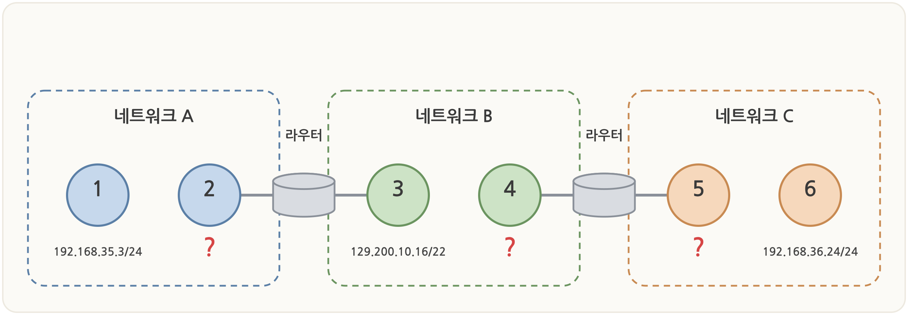

# 서브넷 연습문제 (정처기 대비)

서브네팅은 계산 유형이라 **공식과 절차만 익히면** 반복해서 맞힐 수 있다.
아래 문제를 먼저 스스로 풀어본 뒤, `정답 및 해설 보기`를 펼쳐 확인하자.

 

## 🧮 풀기 전 핵심 요약

| 구하는 값 | 공식 |
| --- | --- |
| 서브넷당 **호스트 수** | 2^(호스트 비트) − 2 |
| **서브넷 개수** | 2^(빌려온 비트) |
| **블록 크기**(옥텟 내 간격) | 256 − (해당 옥텟 마스크 값) |

**프리픽스 ↔ 서브넷 마스크 ↔ 호스트 수** (마지막 옥텟 기준)

| 프리픽스 | 서브넷 마스크 | 블록 크기 | 호스트 수 |
| --- | --- | --- | --- |
| /24 | 255.255.255.0 | 256 | 254 |
| /25 | 255.255.255.128 | 128 | 126 |
| /26 | 255.255.255.192 | 64 | 62 |
| /27 | 255.255.255.224 | 32 | 30 |
| /28 | 255.255.255.240 | 16 | 14 |
| /29 | 255.255.255.248 | 8 | 6 |
| /30 | 255.255.255.252 | 4 | 2 |

> 📌 **2를 빼는 이유**: 각 서브넷의 첫 주소는 **네트워크 주소**, 마지막 주소는 **브로드캐스트 주소**라 호스트에 배정할 수 없다.

 

---

 

## 문제 1. CIDR → 마스크와 호스트 수

> `192.168.10.0/26` 의 **서브넷 마스크**와 서브넷당 **사용 가능한 호스트 수**를 구하시오.

💡 정답 및 해설 보기

**정답**: 서브넷 마스크 `255.255.255.192`, 호스트 수 `62`개

**해설**
- /26 → 네트워크 비트 26개. 마지막 옥텟에 6비트(`11000000`) 사용 → `192`
- 호스트 비트 = 32 − 26 = **6**
- 호스트 수 = 2⁶ − 2 = **62**

 

## 문제 2. 마스크 → CIDR과 호스트 수

> 서브넷 마스크가 `255.255.255.224` 일 때 **CIDR 표기(/n)** 와 서브넷당 **호스트 수**를 구하시오.

💡 정답 및 해설 보기

**정답**: `/27`, 호스트 수 `30`개

**해설**
- 마지막 옥텟 `224` = `11100000` → 1이 3개 → 네트워크 비트 24 + 3 = **/27**
- 호스트 비트 = 32 − 27 = 5 → 호스트 수 = 2⁵ − 2 = **30**

 

## 문제 3. 네트워크 주소·브로드캐스트·호스트 범위

> IP 주소 `192.168.1.100/27` 이 속한 **네트워크 주소**, **브로드캐스트 주소**, **사용 가능한 호스트 범위**를 구하시오.

💡 정답 및 해설 보기

**정답**
- 네트워크 주소: `192.168.1.96`
- 브로드캐스트 주소: `192.168.1.127`
- 사용 가능 범위: `192.168.1.97 ~ 192.168.1.126`

**해설**
- /27 → 블록 크기 = 256 − 224 = **32**
- 마지막 옥텟이 32 간격으로 나뉜다: `0, 32, 64, 96, 128 …`
- `100`은 **96 ~ 127** 구간에 속함
    - 네트워크 주소 = 구간 첫 값 → `.96`
    - 브로드캐스트 = 구간 끝 값 → `.127`
    - 호스트 범위 = 그 사이 → `.97 ~ .126` (30개)

 

## 문제 4. FLSM — N개의 서브넷으로 분할

> `200.100.50.0/24` 네트워크를 **8개의 서브넷**으로 나누려고 한다.
> 빌려야 하는 **비트 수**, **서브넷 마스크**, 서브넷당 **호스트 수**를 구하시오.

💡 정답 및 해설 보기

**정답**: 3비트, 마스크 `255.255.255.224`(`/27`), 호스트 수 `30`개

**해설**
- 서브넷 8개 = 2³ → **3비트**를 호스트 부분에서 빌린다.
- 프리픽스 = /24 + 3 = **/27** → 마스크 `255.255.255.224`
- 남은 호스트 비트 = 5 → 호스트 수 = 2⁵ − 2 = **30**
- 서브넷: `.0 / .32 / .64 / .96 / .128 / .160 / .192 / .224` (8개)

 

## 문제 5. 요구 호스트 수 → 프리픽스와 서브넷 개수

> `172.16.0.0/16` 을 서브네팅한다. 각 서브넷에 **최소 500개의 호스트**가 필요할 때,
> 필요한 **프리픽스(/n)**, **서브넷 마스크**, 만들 수 있는 **서브넷 개수**를 구하시오.

💡 정답 및 해설 보기

**정답**: `/23`, 마스크 `255.255.254.0`, 서브넷 `128`개

**해설**
- 호스트 수 조건: 2^(호스트 비트) − 2 ≥ 500
    - 2⁸ − 2 = 254 → 부족
    - 2⁹ − 2 = 510 → 충족 → 호스트 비트 **9개**
- 네트워크 비트 = 32 − 9 = 23 → **/23** → 마스크 `255.255.254.0`
- 빌려온 비트 = 23 − 16 = 7 → 서브넷 개수 = 2⁷ = **128개**

 

## 문제 6. IP가 속한 서브넷 찾기

> `172.16.0.0/16` 을 **/20** 으로 서브네팅했다.
> IP 주소 `172.16.140.75` 가 속한 **네트워크 주소**와 **브로드캐스트 주소**를 구하시오.

💡 정답 및 해설 보기

**정답**
- 네트워크 주소: `172.16.128.0`
- 브로드캐스트 주소: `172.16.143.255`

**해설**
- /20 → 마스크 `255.255.240.0`. 경계가 **3번째 옥텟**에서 나뉜다.
- 3번째 옥텟 블록 크기 = 256 − 240 = **16**
- 3번째 옥텟이 16 간격으로 나뉨: `0, 16, …, 128, 144 …`
- `140`은 **128 ~ 143** 구간 → 네트워크 주소 3옥텟 = `128`
    - 네트워크 주소 = `172.16.128.0`
    - 브로드캐스트 = 다음 블록 직전 = `172.16.143.255`
    - 사용 가능 범위 = `172.16.128.1 ~ 172.16.143.254`

 

## 문제 7. VLSM — 요구사항별 가변 분할 (심화)

> `192.168.1.0/24` 를 아래 요구사항에 맞춰 **VLSM**으로 나누시오.
> (호스트가 많은 망부터 순서대로 할당)
>
> - A망: 100 호스트
> - B망: 50 호스트
> - C망: 25 호스트
> - D망: 10 호스트

💡 정답 및 해설 보기

**정답**

| 망 | 필요 호스트 | 프리픽스 | 네트워크 주소 | 주소 범위 |
| --- | --- | --- | --- | --- |
| A | 100 | /25 | 192.168.1.0 | .0 ~ .127 |
| B | 50 | /26 | 192.168.1.128 | .128 ~ .191 |
| C | 25 | /27 | 192.168.1.192 | .192 ~ .223 |
| D | 10 | /28 | 192.168.1.224 | .224 ~ .239 |

**해설** — 큰 망부터 필요한 호스트 비트를 정하고, 주소를 이어서 배정한다.
- A(100): 2⁷ − 2 = 126 ≥ 100 → 7비트 → **/25** → `.0 ~ .127`
- B(50): 2⁶ − 2 = 62 ≥ 50 → 6비트 → **/26** → `.128 ~ .191`
- C(25): 2⁵ − 2 = 30 ≥ 25 → 5비트 → **/27** → `.192 ~ .223`
- D(10): 2⁴ − 2 = 14 ≥ 10 → 4비트 → **/28** → `.224 ~ .239`
- 남은 `.240 ~ .255` 는 예비로 남는다.

> 💡 VLSM의 핵심: **호스트가 많은 망부터** 배정해야 주소가 겹치지 않고 낭비도 줄어든다.

 

---

 

## 🎯 실전 유형 (단답·괄호·다이어그램)

실제 시험은 위 계산을 **단답형·괄호 채우기·그림 해석** 형태로 묻는다. 아래는 같은 원리를 실전 형식으로 바꾼 문제다.

 

### 문제 8. [다이어그램] 유효한 IP 주소 배정

> 아래 그림에서 각 호스트는 자신이 속한 네트워크의 **유효한 IP 주소**를 가져야 한다.
> 다음 **&lt;보기&gt;** 에서 골라 `?` 로 표시된 ②·④·⑤ 에 알맞은 IP 주소를 각각 배정하시오.
>
> **&lt;보기&gt;** : `192.168.35.0`, `192.168.35.72`, `192.168.35.255`, `129.200.8.0`, `129.200.8.249`, `129.200.12.50`, `192.168.36.0`, `192.168.36.249`, `192.168.36.255`

💡 정답 및 해설 보기

**정답**
- ② (네트워크 A) : `192.168.35.72`
- ④ (네트워크 B) : `129.200.8.249`
- ⑤ (네트워크 C) : `192.168.36.249`

**해설** — 먼저 각 네트워크의 주소와 유효 범위를 구한다.

| 네트워크 | 기준 IP | 네트워크 주소 | 유효 호스트 범위 |
| --- | --- | --- | --- |
| A | 192.168.35.3/24 | 192.168.35.0/24 | 192.168.35.1 ~ .254 |
| B | 129.200.10.16/22 | 129.200.8.0/22 | 129.200.8.1 ~ 129.200.11.254 |
| C | 192.168.36.24/24 | 192.168.36.0/24 | 192.168.36.1 ~ .254 |

- (B의 계산) `/22` → 마스크 `255.255.252.0`, 3옥텟 블록 크기 = 256 − 252 = 4 → `10`은 `8~11` 그룹 → 네트워크 `129.200.8.0/22`

**보기 판별** (유효 3개 + 함정 6개)

| 보기 | 판정 |
| --- | --- |
| `192.168.35.72` | A(192.168.35.0/24) 범위 안 → ✅ ② |
| `129.200.8.249` | B(129.200.8.0/22) 범위 안 → ✅ ④ |
| `192.168.36.249` | C(192.168.36.0/24) 범위 안 → ✅ ⑤ |
| `192.168.35.0` | A의 **네트워크 주소** → ❌ |
| `192.168.35.255` | A의 **브로드캐스트 주소** → ❌ |
| `129.200.8.0` | B의 **네트워크 주소** → ❌ |
| `129.200.12.50` | B의 유효 범위(`~11.254`)를 **벗어남** (다음 `/22` 블록 `12~15`) → ❌ |
| `192.168.36.0` | C의 **네트워크 주소** → ❌ |
| `192.168.36.255` | C의 **브로드캐스트 주소** → ❌ |

> 📌 **함정 3종**
> - **네트워크 주소** (`.0` 계열): 각 서브넷의 첫 주소
> - **브로드캐스트 주소** (`.255` 계열): 각 서브넷의 마지막 주소
> - **범위 밖 주소**: `129.200.12.50` 은 `129.200.x` 라 B처럼 보이지만, `/22` 범위는 `8~11` 까지다. 반대로 `129.200.8.249` 는 범위 안이라 **유효**하다 — `/22` 범위를 정확히 계산해야 갈린다.

 

### 문제 9. 두 호스트가 같은 네트워크인가?

> 호스트 A의 IP 주소는 `192.168.11.20`, 호스트 B의 IP 주소는 `192.168.12.200` 이고, 서브넷 마스크는 `255.255.254.0` 이다.
> A와 B가 속한 네트워크의 주소를 각각 **CIDR 표기법**으로 작성하시오.

💡 정답 및 해설 보기

**정답**: A = `192.168.10.0/23`, B = `192.168.12.0/23` → **서로 다른 네트워크**

**해설**
- `255.255.254.0` = **/23**. 경계가 **3번째 옥텟**에서 나뉜다.
- 3옥텟 블록 크기 = 256 − 254 = **2** → 3옥텟이 `(0,1) (2,3) … (10,11) (12,13)` 처럼 2개씩 묶인다.
- A: 3옥텟 `11` 은 `(10,11)` 그룹 → 네트워크 `192.168.10.0/23`
- B: 3옥텟 `12` 는 `(12,13)` 그룹 → 네트워크 `192.168.12.0/23`

> 📌 IP만 보면 비슷해 보여도 마스크에 따라 **다른 네트워크**일 수 있다. 이게 이 유형의 함정이다.

 

### 문제 10. 주소 범위 → 프리픽스 길이

> `10.0.0.0/27` 네트워크에 대해 다음 두 서브넷 주소 범위가 주어졌다.
> - 첫 번째 서브넷: `10.0.0.0 ~ 10.0.0.15`
> - 두 번째 서브넷: `10.0.0.16 ~ 10.0.0.31`
>
> 이때 `10.0.0.1` 이 속한 서브넷의 **프리픽스 비트 길이**를 쓰시오. (숫자만)

💡 정답 및 해설 보기

**정답**: `28`

**해설**
- 각 서브넷 범위는 주소 **16개**(`0~15`, `16~31`)로 이루어져 있다.
- 16 = 2⁴ → 호스트 비트 **4개** → 네트워크 비트 = 32 − 4 = **28**
- `10.0.0.1` 은 `0 ~ 15` 구간에 속하므로 프리픽스는 **/28**
- (`/27` 네트워크를 두 개의 `/28` 서브넷으로 다시 나눈 상황이다.)

 

### 문제 11. 괄호 채우기 — 네트워크 주소와 호스트 수

> 호스트 주소가 `192.168.1.150` 이고, 서브넷 마스크는 `255.255.255.224` 일 때 괄호에 들어갈 값을 쓰시오.
> - 이 호스트의 네트워크 주소는 `192.168.1.( ① )` 이다.
> - 사용 가능한 호스트 주소의 개수는 네트워크 주소와 브로드캐스트 주소를 뺀 `( ② )` 개이다.

💡 정답 및 해설 보기

**정답**: ① `128`  ② `30`

**해설**
- `255.255.255.224` = **/27**, 블록 크기 = 256 − 224 = **32**
- 마지막 옥텟 구간: `0, 32, 64, 96, 128, 160 …` → `150` 은 `128 ~ 159` 구간
    - ① 네트워크 주소 마지막 옥텟 = **128** → `192.168.1.128`
- 호스트 비트 = 5 → ② 호스트 수 = 2⁵ − 2 = **30**

 

---

 

### 🔑 서브네팅 3단계 풀이 절차

1. **블록 크기**를 구한다 → `256 − 마스크 값`
2. 해당 옥텟을 블록 크기 간격으로 끊어, IP가 **어느 구간**에 드는지 찾는다.
3. 구간의 **첫 값 = 네트워크 주소**, **끝 값 = 브로드캐스트**, 그 사이 = **호스트 범위**
