# 5.3 비선형 자료구조 (Non-linear Data Structures)

> 선형 = 일렬로 줄 세움 / 비선형 = 연결이 자유로움

---

## 한눈에 보는 관계도



```
그래프 (Graph)
└── 트리 (Tree)          ← 그래프의 일종
    └── 힙 (Heap)        ← 특별한 트리
        └── 우선순위 큐   ← 힙으로 구현

맵 (Map)  ──┐
            ├── 해시 테이블로 구현
셋 (Set)  ──┘
```

---

## 5.3.1 그래프 (Graph)



### 한 줄 정의
> **점(노드) + 선(엣지)** = 그래프

### 핵심 용어

| 용어 | 설명 |
|---|---|
| 노드 (Node) | 점. 사람, 도시, 데이터 |
| 엣지 (Edge) | 선. 관계, 연결 |

### 두 종류

| 종류 | 설명 | 예시 |
|---|---|---|
| 무방향 그래프 | 선에 방향 없음. A-B = B-A | 친구 관계 |
| 방향 그래프 | 선에 화살표 있음. A→B ≠ B→A | 팔로우, 도로 일방통행 |

### 실생활 예시
- 지하철 노선도
- SNS 친구 관계
- 인터넷 링크 구조
- 도로 지도

---

## 5.3.2 트리 (Tree)



### 한 줄 정의
> **거꾸로 된 나무** = 위에서 아래로만 흐름

### 핵심 용어

| 용어 | 설명 |
|---|---|
| 루트 (Root) | 맨 위. 시작점. 1개만 존재 |
| 부모 (Parent) | 위에 있는 노드 |
| 자식 (Child) | 아래에 있는 노드 |
| 리프 (Leaf) | 맨 끝. 자식 없음 |

### 그래프와 차이

| | 그래프 | 트리 |
|---|---|---|
| 방향 | 아무렇게나 가능 | 위→아래만 |
| 순환 | 가능 | 불가 |
| 부모 수 | 제한 없음 | 1명만 |

### 실생활 예시
- 컴퓨터 폴더 구조
- 족보 (가계도)
- 회사 조직도

---

## 5.3.3 힙 (Heap)



### 한 줄 정의
> **순서 규칙이 있는 트리** = 부모가 항상 자식보다 크거나 작음

### 두 종류

| 종류 | 규칙 | 맨 위 노드 |
|---|---|---|
| 최대 힙 (Max Heap) | 부모 > 자식 항상 | 제일 큰 수 |
| 최소 힙 (Min Heap) | 부모 < 자식 항상 | 제일 작은 수 |

### 트리와 차이

| | 트리 | 힙 |
|---|---|---|
| 규칙 | 없음 | 부모 > 자식 (또는 반대) |
| 목적 | 구조 표현 | 최대/최솟값 빠르게 꺼내기 |

### 실생활 예시
- 응급실 우선순위 처리
- 작업 스케줄링 (CPU)

---

## 5.3.4 우선순위 큐 (Priority Queue)



### 한 줄 정의
> **중요한 놈이 먼저 나오는 줄** = 순서가 아닌 중요도 기준

### 일반 큐와 차이

| | 일반 큐 | 우선순위 큐 |
|---|---|---|
| 나오는 순서 | 먼저 온 순서 | 중요도 높은 순서 |
| 예시 | 편의점 계산대 줄 | 응급실 대기 |

### 힙과 관계

| | 역할 |
|---|---|
| 힙 | 구조 (어떻게 저장하나) |
| 우선순위 큐 | 기능 (무엇을 하나) |

> 힙이 우선순위 큐를 만드는 재료. 힙 없이도 만들 수 있지만 힙으로 만드는 게 제일 빠름.

### 실생활 예시
- 응급실 환자 치료 순서
- 비행기 탑승 (비즈니스 → 이코노미)
- CPU 작업 처리 순서

---

## 5.3.5 맵 (Map)



### 한 줄 정의
> **사전(Dictionary)** = 키(단어) 넣으면 값(뜻) 나옴

### 핵심 구조

```
키 (Key)  →  값 (Value)
"이름"    →  "김민준"
"나이"    →  26
"전공"    →  "컴공"
```

### 규칙
- 키는 **중복 불가** (같은 키 두 번 넣으면 덮어씀)
- 값은 중복 가능

### 주요 동작

| 동작 | 설명 |
|---|---|
| put | 키-값 쌍 저장 |
| get | 키 입력 → 값 반환 |
| delete | 키-값 쌍 삭제 |

### 배열과 차이

| | 배열 | 맵 |
|---|---|---|
| 찾는 방법 | 번호 (0, 1, 2...) | 이름 ("나이", "전공"...) |
| 예시 | `data[0]` | `data["이름"]` |

### 실생활 예시
- 전화번호부 (이름 → 번호)
- 로그인 정보 (ID → 비밀번호)
- 학점표 (과목명 → 학점)

---

## 5.3.6 셋 (Set)



### 한 줄 정의
> **중복 없는 주머니** = 같은 거 두 번 넣어도 한 개만 남음

### 규칙
- 중복 **자동 제거**
- 순서 **없음** (1번째, 2번째 개념 X)
- 있냐 없냐 **확인 빠름**

### 집합 연산

| 연산 | 기호 | 결과 |
|---|---|---|
| 합집합 | A \| B | 둘 다 합침 (중복 제거) |
| 교집합 | A & B | 둘 다 있는 것만 |
| 차집합 | A - B | A에만 있는 것 |

### 맵과 차이

| | 맵 | 셋 |
|---|---|---|
| 저장 | 키 + 값 쌍 | 값만 |
| 예시 | "이름" → "김민준" | "사과", "바나나" |

### 언제 씀
- 중복 제거할 때
- "이미 봤나?" 확인할 때
- 집합 계산 (합집합, 교집합) 할 때

### 실생활 예시
- 방문한 페이지 목록
- 좋아요 누른 사람 목록

---

## 5.3.7 해시 테이블 (Hash Table)



### 한 줄 정의
> **번호 붙인 서랍장** = 키를 번호로 바꿔서 그 번호 서랍에 저장

### 동작 과정

```
키 입력 → 해시 함수 → 번호 → 해당 서랍(버킷)에 저장
"이름"  →  hash()   →  2   →  2번 서랍에 저장
```

### 핵심 용어

| 용어 | 설명 |
|---|---|
| 해시 함수 | 키를 번호로 바꾸는 기계 |
| 버킷 (Bucket) | 번호 붙은 서랍 |
| 충돌 (Collision) | 두 키가 같은 번호로 바뀌는 상황 |

### 왜 빠른가

| | 방법 | 속도 |
|---|---|---|
| 일반 배열 | 처음부터 하나씩 비교 | 느림 O(n) |
| 해시 테이블 | 번호로 바로 점프 | 빠름 O(1) |

### 맵/셋과 관계

| | 역할 |
|---|---|
| 맵, 셋 | 기능 (뭘 하나) |
| 해시 테이블 | 내부 구조 (어떻게 작동하나) |

> 맵과 셋이 해시 테이블을 속에 품고 있음. 겉에서는 안 보이지만 안에서 돌아가는 엔진.

### 단점
- **충돌(Collision)**: 두 키가 같은 번호로 바뀌는 상황
- 해결책 있음 → 체이닝(Chaining), 오픈 어드레싱(Open Addressing)

---

## 전체 관계 요약

| 자료구조 | 핵심 한 줄 | 포함 관계 |
|---|---|---|
| 그래프 | 점 + 선 | 가장 큰 개념 |
| 트리 | 위→아래 방향 그래프 | 그래프의 일종 |
| 힙 | 순서 규칙 있는 트리 | 트리의 일종 |
| 우선순위 큐 | 중요도 순서 줄 | 힙으로 구현 |
| 맵 | 키→값 사전 | 해시 테이블 사용 |
| 셋 | 중복 없는 집합 | 해시 테이블 사용 |
| 해시 테이블 | 번호 서랍장 | 맵/셋의 내부 엔진 |

