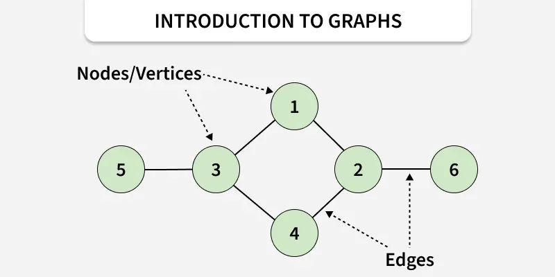
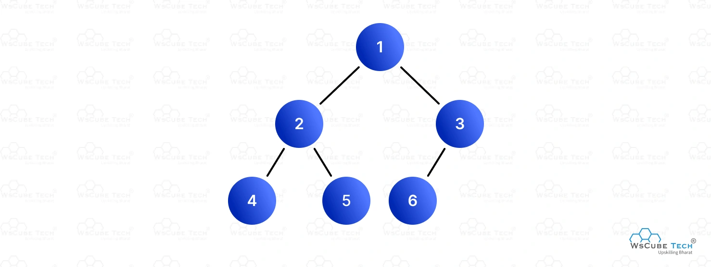
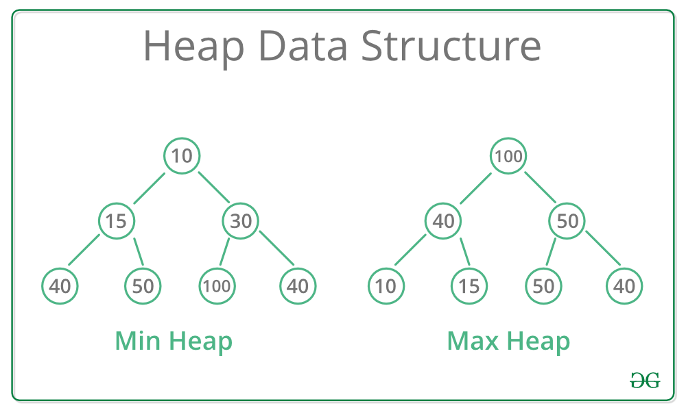
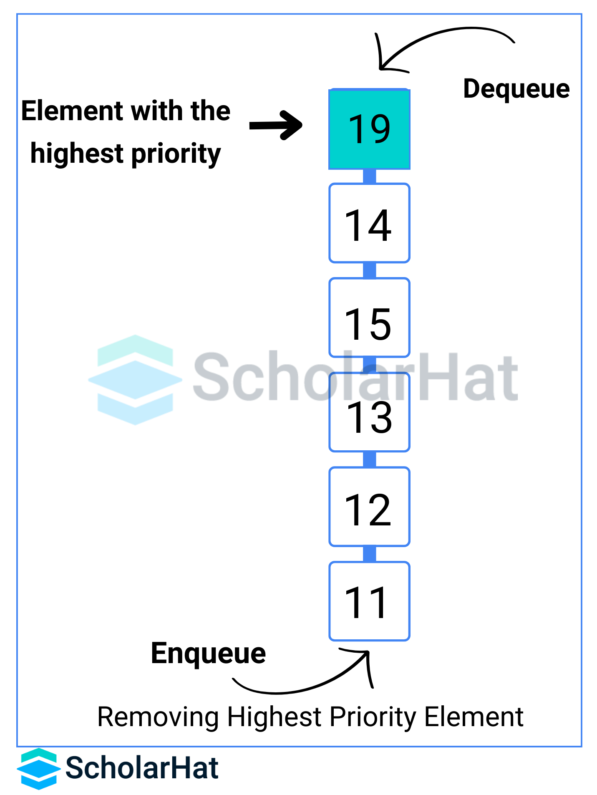
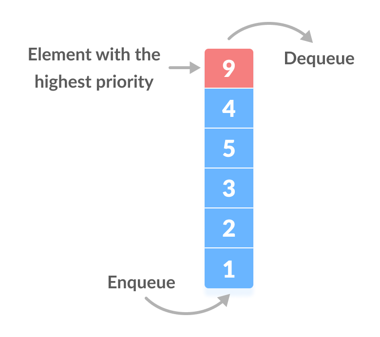
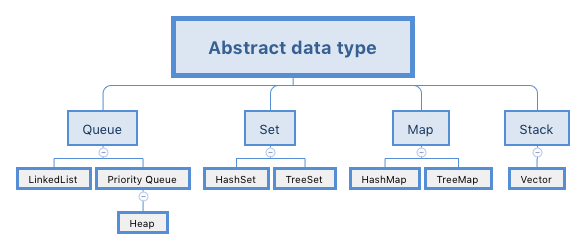
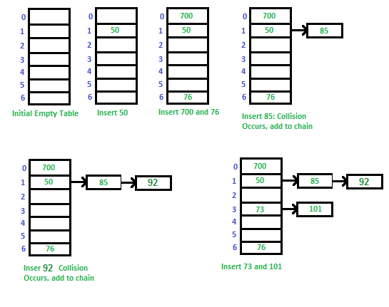
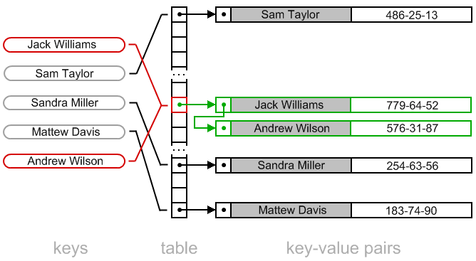

# 📊 비선형 자료구조 (Non-Linear Data Structures)

비선형 자료구조는 데이터가 **계층적** 또는 **네트워크 형태**로 연결되어 있어, 한 요소가 여러 요소와 동시에 연결될 수 있는 구조입니다. 선형 자료구조(배열, 연결 리스트, 스택, 큐)와 달리 데이터 탐색 경로가 하나로 정해져 있지 않습니다.

---

## 1. 🕸️ 그래프 (Graph)

# '노드' : 데이터를 담는 상자라고 이해하면됨.

**정의**: 정점(Vertex/Node)과 간선(Edge)으로 이루어진 자료구조입니다. 현실 세계의 네트워크(도로망, 소셜 네트워크, 인터넷)를 모델링하는 데 사용됩니다.

| 특성 | 설명 |
|------|------|
| **정점(Vertex)** | 데이터를 저장하는 노드 |
| **간선(Edge)** | 정점 간의 연결 관계 |
| **방향 그래프** | 간선에 방향이 있는 그래프 (A → B) |
| **무방향 그래프** | 간선에 방향이 없는 그래프 (A — B) |
| **가중치 그래프** | 간선에 비용/거리 등의 가중치가 있는 그래프 |

**활용 예시**: 지도 내비게이션(최단 경로), 소셜 네트워크 친구 관계, 웹 페이지 링크 구조

---

## 2. 🌳 트리 (Tree)

**정의**: 계층적 관계를 표현하는 자료구조로, 루트(Root) 노드에서 시작하여 여러 자식(Child) 노드로 분기됩니다. 사이클이 없는 연결 그래프의 한 종류입니다.

| 특성 | 설명 |
|------|------|
| **루트(Root)** | 트리의 최상위 노드 (부모가 없는 유일한 노드) |
| **리프(Leaf)** | 자식이 없는 말단 노드 |
| **높이(Height)** | 루트에서 가장 먼 리프까지의 거리 |
| **이진 트리** | 각 노드가 최대 2개의 자식을 가지는 트리 |
| **이진 탐색 트리(BST)** | 왼쪽 &lt; 부모 &lt; 오른쪽 순서로 정렬된 이진 트리 |

**활용 예시**: 파일 시스템 디렉토리 구조, 조직도, 데이터베이스 인덱스(B-Tree), DOM 트리(HTML)

---

## 3. ⛰️ 힙 (Heap)

**정의**: 완전 이진 트리 기반의 자료구조로, 부모-자식 간의 **대소 관계**가 항상 유지되는 특수한 트리입니다. 힙은 **우선순위 큐**를 구현하는 데 핵심적으로 사용됩니다.

| 종류 | 조건 | 루트 값 |
|------|------|---------|
| **최대 힙(Max Heap)** | 부모 ≥ 자식 | 가장 큰 값 |
| **최소 힙(Min Heap)** | 부모 ≤ 자식 | 가장 작은 값 |

**시간 복잡도**: 삽입/삭제 O(log n), 최대/최소값 조회 O(1)

**활용 예시**: 우선순위 큐 구현, 힙 정렬(Heap Sort), 다익스트라 최단 경로 알고리즘, Top-K 문제

---

## 4. 📋 우선순위 큐 (Priority Queue)

**정의**: 각 요소에 **우선순위(Priority)**가 부여된 큐로, 높은 우선순위를 가진 요소가 먼저 처리(Dequeue)되는 추상 자료형(ADT)입니다. 일반적인 FIFO(First-In-First-Out) 큐와 다릅니다.

| 특성 | 설명 |
|------|------|
| **Enqueue** | 요소를 큐에 삽입 (우선순위와 함께) |
| **Dequeue** | 가장 높은 우선순위의 요소를 제거 및 반환 |
| **구현 방식** | 배열/연결 리스트, 또는 **힙(Heap)** 사용 |
| **힙 기반 구현** | 삽입/삭제 O(log n) — 가장 효율적 |

**활용 예시**: 운영체제 작업 스케줄링, 네트워크 패킷 처리, A* 경로 탐색, 병원 응급실 환자 처리

---

## 5. 🗺️ 맵 (Map / Dictionary / Associative Array)

**정의**: **키(Key)-값(Value)** 쌍으로 데이터를 저장하는 자료구조입니다. 키는 고유하며, 키를 통해 해당 값을 빠르게 검색할 수 있습니다.

| 특성 | 설명 |
|------|------|
| **키(Key)** | 고유한 식별자 (중복 불가) |
| **값(Value)** | 키에 연결된 실제 데이터 |
| **검색** | 키로 값을 O(1) ~ O(log n)에 조회 |
| **구현 방식** | 해시 테이블(HashMap) — 평균 O(1), 트리(TreeMap) — O(log n) |

**활용 예시**: 단어 사전(단어→의미), 캐시 시스템, 데이터베이스 인덱싱, 설정값 저장

---

## 6. 🧮 셋 (Set)

**정의**: **중복을 허용하지 않는** 유일한 요소들의 집합(Collection)입니다. 수학의 집합 개념을 컴퓨터 과학에 구현한 것입니다.

| 특성 | 설명 |
|------|------|
| **중복 불가** | 동일한 값은 한 번만 저장 |
| **순서** | 해시 기반(Set) — 무순서, 트리 기반(TreeSet) — 정렬됨 |
| **연산** | 합집합(Union), 교집합(Intersection), 차집합(Difference) |
| **구현 방식** | 해시 테이블(HashSet) 또는 트리(TreeSet) |

**활용 예시**: 중복 제거, 방문 기록 관리, 태그 시스템, 집합 연산

---

## 7. 🔑 해시 테이블 (Hash Table)

**정의**: **해시 함수(Hash Function)**를 사용하여 키를 배열의 인덱스로 변환하여 데이터를 저장하는 자료구조입니다. 평균적으로 **O(1)**의 탐색/삽입/삭제 성능을 제공합니다.

| 특성 | 설명 |
|------|------|
| **해시 함수** | 키 → 배열 인덱스로 변환하는 함수 |
| **해시 충돌(Collision)** | 서로 다른 키가 같은 인덱스로 매핑되는 현상 |
| **충돌 해결** | **체이닝(Chaining)** — 연결 리스트로 연결, **오픈 어드레싱** — 빈 슬롯 탐색 |
| **적재율(Load Factor)** | 저장된 요소 수 / 버킷 수 (보통 0.75 이상이면 재해싱) |

**활용 예시**: 데이터베이스 인덱스, 캐시(Cache), 컴파일러 심볼 테이블, 패스워드 저장(해싱), 맵/셋의 내부 구현

---

## 📋 비선형 자료구조 비교 요약

| 자료구조 | 핵심 특징 | 주요 연산 시간 복잡도 | 대표 활용 |
|----------|-----------|----------------------|-----------|
| **그래프** | 정점-간선 네트워크 | 탐색: O(V+E) | 지도, SNS, 네트워크 |
| **트리** | 계층적 구조, 사이클 없음 | 탐색: O(log n) ~ O(n) | 파일시스템, DB 인덱스 |
| **힙** | 부모-자식 대소 관계 유지 | 삽입/삭제: O(log n) | 우선순위 큐, 정렬 |
| **우선순위 큐** | 우선순위 기반 처리 | 삽입/삭제: O(log n) | 스케줄링, 탐색 |
| **맵** | 키-값 쌍 저장 | 조회: O(1) ~ O(log n) | 사전, 캐시 |
| **셋** | 중복 없는 집합 | 조회: O(1) ~ O(log n) | 중복 제거, 집합 연산 |
| **해시 테이블** | 해시 함수 기반 직접 접근 | 평균 O(1) | DB, 캐시, 맵/셋 구현 |

---

&gt; 💡 **참고**: 맵과 셋은 **추상 자료형(ADT)**이고, 해시 테이블과 트리는 이를 **구현하는 구체적인 자료구조**입니다. 예를 들어, Java의 `HashMap`은 해시 테이블로, `TreeMap`은 레드-블랙 트리로 맵을 구현합니다.