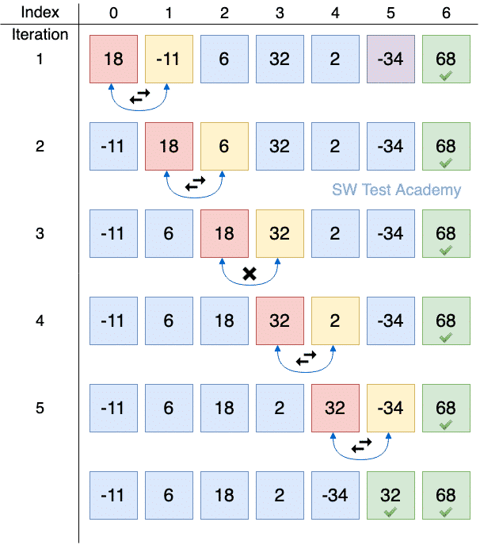
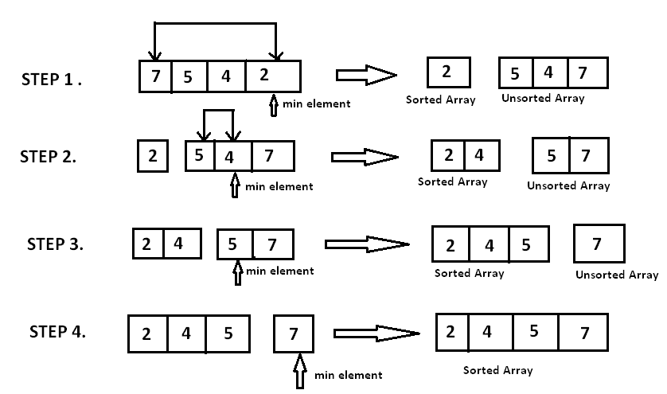
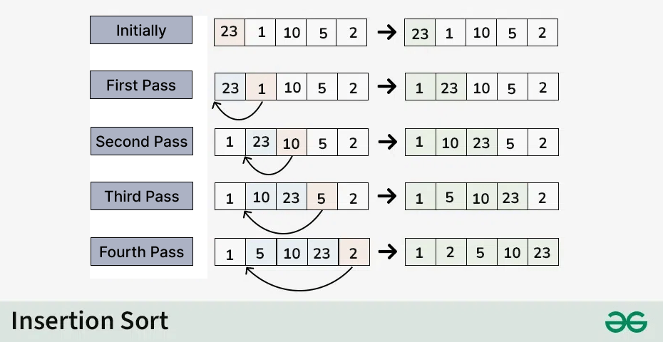
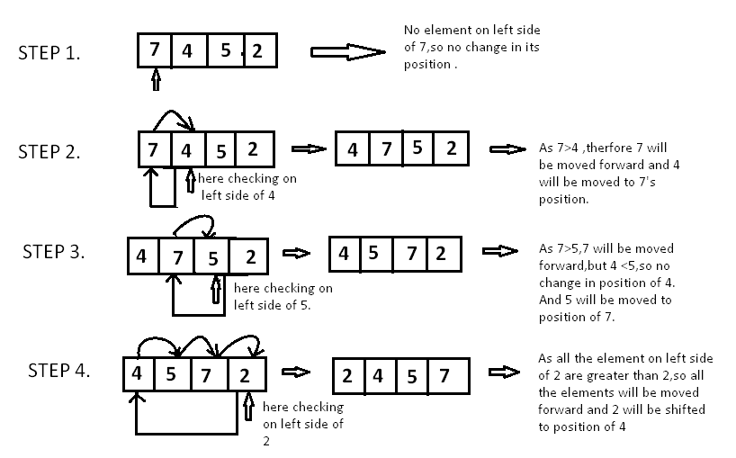
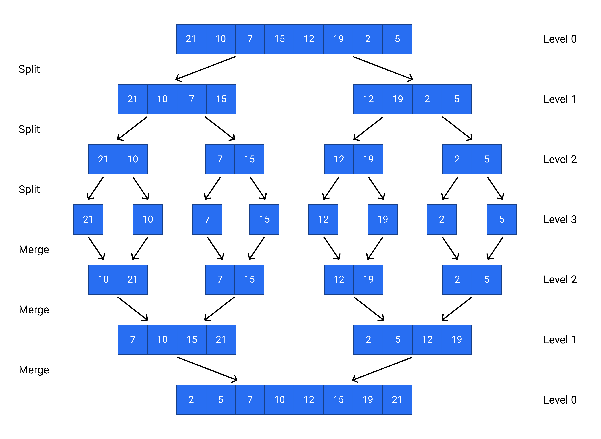
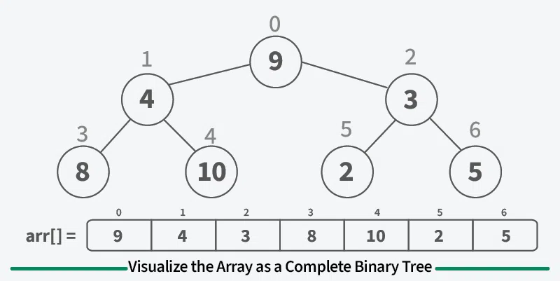
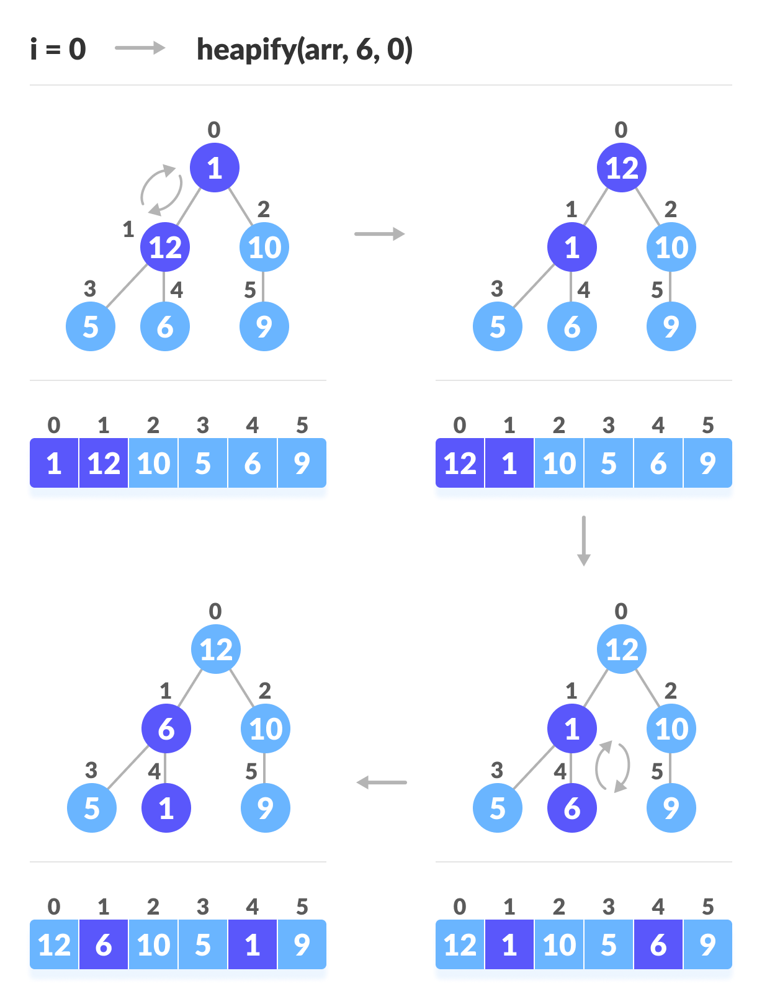

# 📊 정렬 알고리즘 총정리 (Sorting Algorithms)

&gt; CS_STUDY 3주차

---

## 📑 목차
1. [버블 정렬 (Bubble Sort)](#1-버블-정렬-bubble-sort)
2. [선택 정렬 (Selection Sort)](#2-선택-정렬-selection-sort)
3. [삽입 정렬 (Insertion Sort)](#3-삽입-정렬-insertion-sort)
4. [퀵 정렬 (Quick Sort)](#4-퀵-정렬-quick-sort)
5. [합병 정렬 (Merge Sort)](#5-합병-정렬-merge-sort)
6. [힙 정렬 (Heap Sort)](#6-힙-정렬-heap-sort)
7. [복잡도 비교표](#-복잡도-비교표)

---

## 1. 버블 정렬 (Bubble Sort)

### 핵심 아이디어
인접한 두 원소를 비교하여, 앞의 원소가 뒤의 원소보다 크면 **서로 교환(swap)**합니다. 한 번의 전체 순회가 끝나면 가장 큰 원소가 맨 뒤로 "버블"처럼 떠오릅니다.

### 동작 과정 상세 설명
1. **1회차**: 인덱스 0~1, 1~2, 2~3, ... , n-2~n-1까지 인접한 두 원소를 비교하고 교환합니다. 이 과정이 끝나면 가장 큰 값이 배열의 마지막 위치(n-1)에 고정됩니다.
2. **2회차**: 0~n-2 범위에서 동일한 과정을 반복합니다. 두 번째로 큰 값이 n-2 위치에 고정됩니다.
3. **n-1회차**: 모든 원소가 정렬될 때까지 반복합니다.

### 시각화


### Python 코드
```python
def bubble_sort(arr):
    n = len(arr)
    for i in range(n):
        # swapped 플래그로 최적화: 이미 정렬된 경우 O(n)까지 개선
        swapped = False
        for j in range(0, n - i - 1):
            if arr[j] &gt; arr[j + 1]:
                arr[j], arr[j + 1] = arr[j + 1], arr[j]
                swapped = True
        # 교환이 한 번도 일어나지 않았으면 이미 정렬 완료
        if not swapped:
            break
    return arr

# 예시
arr = [64, 34, 25, 12, 22, 11, 90]
print(bubble_sort(arr))  # [11, 12, 22, 25, 34, 64, 90]
```

복잡도
---
| 항목  | 값       | 설명                                |
| --- | ------- | --------------------------------- |
| 최선  | O(n)    | 이미 정렬된 경우, swapped 체크로 1회 순회 후 종료 |
| 평균  | O(n²)   | 무작위 데이터의 경우                       |
| 최악  | O(n²)   | 역순으로 정렬된 경우                       |
| 공간  | O(1)    | 추가 메모리 사용 없음 (제자리 정렬)             |
| 안정성 | ✅ 안정 정렬 | 같은 값의 상대적 순서가 유지됨                 |
---

장단점
| 장점              | 단점                |
| --------------- | ----------------- |
| 구현이 매우 간단함      | 데이터가 많을 때 비효율적    |
| 추가 메모리가 필요 없음   | 시간 복잡도가 O(n²)로 느림 |
| 이미 정렬된 데이터에서 빠름 |                   |
---


## 2. 선택 정렬 (Selection Sort)
### 핵심아이디어
배열에서 가장 작은 원소를 찾아 맨 앞의 원소와 교환합니다. 정렬되지 않은 부분에서 반복적으로 최소값을 선택하여 앞으로 보냅니다.

### 동작 과정 상세 설명
1회차: 인덱스 0부터 n-1까지 순회하며 최소값을 찾습니다. 찾은 최소값을 인덱스 0의 원소와 교환합니다. → 인덱스 0은 정렬 완료
2회차: 인덱스 1부터 n-1까지 순회하며 최소값을 찾습니다. 찾은 최소값을 인덱스 1의 원소와 교환합니다. → 인덱스 0~1은 정렬 완료
n-1회차: 인덱스 n-2와 n-1 중 최소값을 찾아 교환합니다. → 전체 정렬 완료

### 시각화


### PYTHON 코드
```
def selection_sort(arr):
    n = len(arr)
    for i in range(n - 1):  # 마지막 원소는 자동으로 정렬됨
        min_idx = i
        # i+1부터 끝까지 순회하며 최소값의 인덱스 찾기
        for j in range(i + 1, n):
            if arr[j] < arr[min_idx]:
                min_idx = j
        # 현재 위치(i)와 최소값 위치(min_idx) 교환
        if min_idx != i:
            arr[i], arr[min_idx] = arr[min_idx], arr[i]
    return arr

# 예시
arr = [64, 25, 12, 22, 11]
print(selection_sort(arr))  # [11, 12, 22, 25, 64]
```

---
| 항목  | 값        | 설명                                         |
| --- | -------- | ------------------------------------------ |
| 최선  | O(n²)    | 항상 (n-1) + (n-2) + ... + 1 = n(n-1)/2 번 비교 |
| 평균  | O(n²)    | 비교 횟수가 데이터 상태와 무관하게 고정                     |
| 최악  | O(n²)    | 동일하게 O(n²)                                 |
| 공간  | O(1)     | 추가 메모리 사용 없음 (제자리 정렬)                      |
| 안정성 | ❌ 불안정 정렬 | 교환 과정에서 같은 값의 상대적 순서가 바뀔 수 있음              |
---

| 장점                  | 단점        |
| ------------------- | --------- |
| 구현이 간단함             | O(n²)로 느림 |
| 비교 횟수가 고정되어 예측 가능   | 불안정 정렬    |
| 교환 횟수가 최소 (최대 n-1회) |           |
---

## 3. 삽입 정렬 (Insertion Sort)

### 핵심 아이디어
손에 든 카드를 정렬하는 것처럼, 정렬된 부분에 새로운 원소를 적절한 위치에 삽입합니다. 두 번째 원소부터 시작하여 앞의 정렬된 부분과 비교하며 자리를 찾습니다.

### 동작 과정 상세 설명
1회차: 인덱스 1의 원소를 "key"로 선택합니다. 인덱스 0의 원소와 비교하여 key가 더 작으면 앞으로 이동시킵니다.
2회차: 인덱스 2의 원소를 key로 선택합니다. 인덱스 1, 0과 비교하며 key보다 큰 원소들을 한 칸씩 뒤로 밀고, key를 적절한 위치에 삽입합니다.
n-1회차: 마지막 원소까지 동일한 과정을 반복합니다. 정렬된 부분은 점점 커지며, 전체가 정렬됩니다.

### 시각화



### PYTHON 코드
```
def insertion_sort(arr):
    for i in range(1, len(arr)):
        key = arr[i]  # 현재 삽입할 원소
        j = i - 1
        
        # key보다 큰 원소들을 한 칸씩 뒤로 밀기
        while j >= 0 and arr[j] > key:
            arr[j + 1] = arr[j]
            j -= 1
        
        # 비어진 자리에 key 삽입
        arr[j + 1] = key
    return arr

# 예시
arr = [12, 11, 13, 5, 6]
print(insertion_sort(arr))  # [5, 6, 11, 12, 13]
```
### 복잡도
---
| 항목  | 값       | 설명                                    |
| --- | ------- | ------------------------------------- |
| 최선  | O(n)    | 이미 정렬된 경우, 각 원소가 1번씩만 비교              |
| 평균  | O(n²)   | 무작위 데이터의 경우                           |
| 최악  | O(n²)   | 역순으로 정렬된 경우, 각 원소가 앞의 모든 원소와 비교       |
| 공간  | O(1)    | 추가 메모리 사용 없음 (제자리 정렬)                 |
| 안정성 | ✅ 안정 정렬 | 같은 값을 만나면 while 조건이 False가 되어 이동하지 않음 |
---

### 장단점
---
| 장점                        | 단점                |
| ------------------------- | ----------------- |
| 이미 정렬된 데이터에서 매우 빠름 (O(n)) | 데이터가 많고 무작위일 때 느림 |
| 추가 메모리가 필요 없음             | O(n²)의 시간 복잡도     |
| 안정 정렬                     |                   |
| 작은 데이터셋에 효율적              |                   |
---

## 4. 퀵 정렬 (Quick Sort)

### 핵심 아이디어
분할 정복(Divide and Conquer) 기법을 사용합니다. 배열에서 피벗(pivot)을 선택하고, 피벗보다 작은 원소는 왼쪽, 큰 원소는 오른쪽으로 분할한 뒤 재귀적으로 정렬합니다.
### 동작 과정 상세 설명
1. **피벗 선택**: 배열에서 임의의 원소를 피벗으로 선택합니다 (보통 중간값, 첫/마지막 원소, 또는 랜덤).
2. **분할(Partition)**: 피벗을 기준으로 배열을 두 부분으로 나눕니다.
- Left: 피벗보다 작은 원소들
- Right: 피벗보다 큰 원소들
- 피벗은 최종 위치에 고정됩니다.
3. **재귀**: Left와 Right 부분 배열에 대해 동일한 과정을 재귀적으로 반복합니다.
4. **기저 조건**: 부분 배열의 크기가 0 또는 1이면 이미 정렬된 것으로 간주하고 종료합니다.

### 시각화


---
```
def quick_sort(arr):
    # 기저 조건: 원소가 1개 이하면 이미 정렬됨
    if len(arr) <= 1:
        return arr
    
    # 피벗 선택 (중간 인덱스)
    pivot = arr[len(arr) // 2]
    
    # 3-way partition (피벗과 같은 값도 분리)
    left = [x for x in arr if x < pivot]
    middle = [x for x in arr if x == pivot]
    right = [x for x in arr if x > pivot]
    
    # 재귀적으로 정렬 후 합치기
    return quick_sort(left) + middle + quick_sort(right)

# 예시
arr = [3, 6, 8, 10, 1, 2, 1]
print(quick_sort(arr))  # [1, 1, 2, 3, 6, 8, 10]
```

### 복잡도
---
| 항목  | 값               | 설명                                                    |
| --- | --------------- | ----------------------------------------------------- |
| 최선  | O(n log n)      | 피벗이 항상 중간값에 가까울 때                                     |
| 평균  | O(n log n)      | 랜덤 데이터에서 피벗을 랜덤으로 선택할 때                               |
| 최악  | O(n²)           | 피벗이 항상 최소값 또는 최대값일 때 (이미 정렬된 데이터 + 첫/마지막 원소를 피벗으로 선택) |
| 공간  | O(log n) ~ O(n) | 재귀 호출 스택의 깊이                                          |
| 안정성 | ❌ 불안정 정렬        | 분할 과정에서 같은 값의 상대적 순서가 바뀔 수 있음                         |
---

### 최악의 경우 방지 방법

---
| 방법                 | 설명                                             |
| ------------------ | ---------------------------------------------- |
| **랜덤 피벗**          | 피벗을 무작위로 선택하여 최악 경우 확률 감소                      |
| **중간값 피벗**         | 첫, 중간, 마지막 원소 중 중간값을 피벗으로 선택 (Median-of-Three) |
| **Tail Recursion** | 재귀 깊이를 줄이는 최적화                                 |
---

### 장단점
---
| 장점                       | 단점           |
| ------------------------ | ------------ |
| 평균적으로 매우 빠름 (O(n log n)) | 최악의 경우 O(n²) |
| 추가 메모리가 거의 필요 없음         | 불안정 정렬       |
| 캐시 효율성이 좋음 (지역성)         | 재귀 호출의 오버헤드  |
---

## 5. 합병 정렬 (Merge Sort)
### 핵심 아이디어
분할 정복(Divide and Conquer) 기법을 사용합니다. 배열을 반으로 나누고, 각각 정렬한 뒤 두 개의 정렬된 배열을 합병(merge)합니다.
**동작 과정 상세 설명**
1. 분할(Divide): 배열을 반으로 나눕니다. 중간 인덱스를 기준으로 왼쪽 부분과 오른쪽 부분으로 분할합니다.
2. 정복(Conquer): 각 부분 배열에 대해 재귀적으로 합병 정렬을 수행합니다. 배열의 크기가 1이 되면 (이미 정렬된 상태로 간주) 반환합니다.
3. 결합(Merge): 두 개의 정렬된 부분 배열을 하나의 정렬된 배열로 합칩니다.
- 두 배열의 첫 번째 원소를 비교하여 더 작은 값을 결과 배열에 추가합니다.
- 한쪽 배열의 모든 원소가 추가되면, 남은 배열의 원소를 순서대로 결과 배열에 추가합니다.

### 시각화


### Python 코드
```
def merge_sort(arr):
    # 기저 조건: 원소가 1개 이하면 이미 정렬됨
    if len(arr) <= 1:
        return arr
    
    # 분할: 중간을 기준으로 두 부분으로 나누기
    mid = len(arr) // 2
    left = merge_sort(arr[:mid])
    right = merge_sort(arr[mid:])
    
    # 결합: 두 정렬된 배열을 합병
    return merge(left, right)

def merge(left, right):
    result = []
    i = j = 0
    
    # 두 배열의 원소를 비교하며 작은 값을 결과에 추가
    while i < len(left) and j < len(right):
        if left[i] <= right[j]:
            result.append(left[i])
            i += 1
        else:
            result.append(right[j])
            j += 1
    
    # 남은 원소들을 순서대로 추가
    result.extend(left[i:])
    result.extend(right[j:])
    return result

# 예시
arr = [38, 27, 43, 3, 9, 82, 10]
print(merge_sort(arr))  # [3, 9, 10, 27, 38, 43, 82]
```

### 복잡도
---
| 항목  | 값          | 설명                                     |
| --- | ---------- | -------------------------------------- |
| 최선  | O(n log n) | 항상 동일한 분할과 합병 과정                       |
| 평균  | O(n log n) | 데이터 상태와 무관하게 보장                        |
| 최악  | O(n log n) | 데이터 상태와 무관하게 보장                        |
| 공간  | O(n)       | 합병 과정에서 임시 배열 필요                       |
| 안정성 | ✅ 안정 정렬    | left\[i] <= right\[j] 조건으로 같은 값의 순서 유지 |
---

### 장단점
---
| 장점                     | 단점                   |
| ---------------------- | -------------------- |
| 최악의 경우에도 O(n log n) 보장 | 추가 메모리 O(n) 필요       |
| 안정 정렬                  | 데이터가 적을 때 오버헤드가 큼    |
| 연결 리스트에 효율적            | 순차 접근보다 랜덤 접근에 덜 효율적 |
---

## 6. 힙 정렬 (Heap Sort)

### 핵심 아이디어
완전 이진 트리(Complete Binary Tree) 구조인 힙(Heap)을 이용합니다. 배열을 최대 힙(Max Heap)으로 만들고, 루트(최대값)를 맨 뒤로 보낸 뒤 힙 크기를 줄여가며 반복합니다.

### 힙(Heap)이란?
- 완전 이진 트리: 마지막 레벨을 제외하고 모든 레벨이 완전히 채워져 있으며, 마지막 레벨은 왼쪽부터 채워집니다.
- 최대 힙(Max Heap): 부모 노드의 값이 자식 노드의 값보다 크거나 같은 구조. 루트 노드가 항상 최대값입니다.
- 배열로 표현: 인덱스 i의 부모는 (i-1)//2, 왼쪽 자식은 2i+1, 오른쪽 자식은 2i+2입니다.

### 동작 과정 상세 설명
1. **힙 구성(Build Max Heap):** 배열을 최대 힙으로 변환합니다. 마지막 비단말 노드(n//2 - 1)부터 루트(0)까지 역순으로 heapify를 수행합니다.
2. **정렬(Extract Max):**
- 루트(최대값)와 마지막 원소를 교환합니다. → 최대값이 배열의 끝으로 이동
- 힙의 크기를 1 줄입니다.
- 루트에 대해 heapify를 수행하여 힙 속성을 복원합니다.
3. **반복:** 힙의 크기가 1이 될 때까지 2번 과정을 반복합니다.

### 시각화




---

### python
```
def heap_sort(arr):
    n = len(arr)
    
    # 1. 최대 힙 구성 (Bottom-up)
    # 마지막 비단말 노드부터 루트까지 heapify
    for i in range(n // 2 - 1, -1, -1):
        heapify(arr, n, i)
    
    # 2. 하나씩 추출하여 정렬
    for i in range(n - 1, 0, -1):
        # 루트(최대값)를 현재 힙의 마지막과 교환
        arr[0], arr[i] = arr[i], arr[0]
        # 줄어든 힙(0~i-1)에 대해 루트에서 heapify
        heapify(arr, i, 0)
    
    return arr

def heapify(arr, n, i):
    """
    인덱스 i를 루트로 하는 서브트리를 최대 힙으로 만듭니다.
    n: 현재 힙의 크기
    """
    largest = i  # 현재 노드를 최대값으로 가정
    left = 2 * i + 1   # 왼쪽 자식
    right = 2 * i + 2  # 오른쪽 자식
    
    # 왼쪽 자식이 존재하고 현재 노드보다 크면
    if left < n and arr[left] > arr[largest]:
        largest = left
    
    # 오른쪽 자식이 존재하고 현재 최대값보다 크면
    if right < n and arr[right] > arr[largest]:
        largest = right
    
    # 최대값이 현재 노드가 아니라면 교환하고 재귀적으로 heapify
    if largest != i:
        arr[i], arr[largest] = arr[largest], arr[i]
        # 교환된 자식 노드에서 다시 heapify 수행
        heapify(arr, n, largest)

# 예시
arr = [12, 11, 13, 5, 6, 7]
print(heap_sort(arr))  # [5, 6, 7, 11, 12, 13]
```

---
### 복잡도
---
| 항목  | 값          | 설명                                     |
| --- | ---------- | -------------------------------------- |
| 최선  | O(n log n) | 힙 구성 O(n) + 추출 n-1회 × heapify O(log n) |
| 평균  | O(n log n) | 항상 동일한 과정                              |
| 최악  | O(n log n) | 데이터 상태와 무관하게 보장                        |
| 공간  | O(1)       | 제자리 정렬 (재귀 호출 스택 제외)                   |
| 안정성 | ❌ 불안정 정렬   | 힙 구조의 특성상 같은 값의 상대적 순서가 바뀔 수 있음        |
---

### heapify 시간 복잡도 분석
---
| 단계                 | 시간 복잡도         | 설명                                  |
| ------------------ | -------------- | ----------------------------------- |
| Build Max Heap     | O(n)           | 각 노드에 대해 heapify 수행. 높이 h인 노드는 O(h) |
| Extract Max (n-1회) | O(n log n)     | 각각 O(log n)                         |
| **전체**             | **O(n log n)** |                                     |
---

### 장단점
---
| 장점                      | 단점                            |
| ----------------------- | ----------------------------- |
| 최악의 경우에도 O(n log n) 보장  | 불안정 정렬                        |
| 추가 메모리가 거의 필요 없음 (O(1)) | 구현이 상대적으로 복잡함                 |
|                         | 캐시 효율성이 퀵 정렬보다 떨어짐 (트리 구조 접근) |
---

### 복잡도 비교표
---
| 알고리즘      | 최선         | 평균         | 최악         | 공간       | 안정성 |
| --------- | ---------- | ---------- | ---------- | -------- | --- |
| **버블 정렬** | O(n)       | O(n²)      | O(n²)      | O(1)     | ✅   |
| **선택 정렬** | O(n²)      | O(n²)      | O(n²)      | O(1)     | ❌   |
| **삽입 정렬** | O(n)       | O(n²)      | O(n²)      | O(1)     | ✅   |
| **퀵 정렬**  | O(n log n) | O(n log n) | O(n²)      | O(log n) | ❌   |
| **합병 정렬** | O(n log n) | O(n log n) | O(n log n) | O(n)     | ✅   |
| **힙 정렬**  | O(n log n) | O(n log n) | O(n log n) | O(1)     | ❌   |
---

### 사용 가이드
---
| 상황              | 추천 알고리즘             | 이유                     |
| --------------- | ------------------- | ---------------------- |
| 데이터가 거의 정렬되어 있음 | 삽입 정렬, 버블 정렬        | 최선 O(n)으로 매우 빠름        |
| 메모리가 매우 제한적     | 힙 정렬, 퀵 정렬          | 추가 공간 O(1) 또는 O(log n) |
| 안정 정렬이 필요함      | 합병 정렬, 삽입 정렬, 버블 정렬 | 같은 값의 순서가 유지됨          |
| 대용량 데이터, 일반적 상황 | 퀵 정렬, 합병 정렬         | 평균 O(n log n)으로 빠름     |
| 최악의 경우도 보장 필요   | 합병 정렬, 힙 정렬         | 항상 O(n log n) 보장       |
| 연결 리스트 정렬       | 합병 정렬               | 순차 접근에 최적화됨            |
| 실시간/스트리밍 데이터    | 삽입 정렬               | 데이터가 들어오는 대로 정렬 가능     |
---

## 정렬 알고리즘 선택 결정 트리
```
데이터가 거의 정렬되어 있나?
├── 예 → 삽입 정렬 (O(n))
└── 아니오 → 메모리가 제한적인가?
    ├── 예 → 힙 정렬 (O(1) 공간)
    └── 아니오 → 안정 정렬이 필요한가?
        ├── 예 → 합병 정렬
        └── 아니오 → 데이터가 많은가?
            ├── 예 → 퀵 정렬 (평균 가장 빠름)
            └── 아니오 → 삽입 정렬 또는 퀵 정렬
```

- **Tip:** Python의 기본 sorted()와 list.sort()는 Timsort (합병 정렬 + 삽입 정렬의 하이브리드)를 사용하여 O(n log n)의 성능을 보장합니다. 실제로는 거의 정렬된 데이터에서 O(n)에 가까운 성능을 보이며, 안정 정렬입니다.